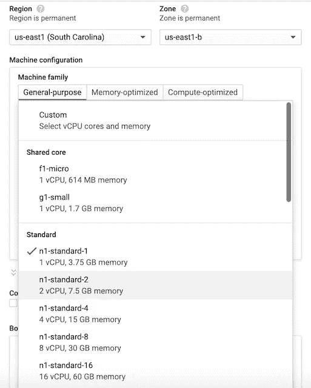
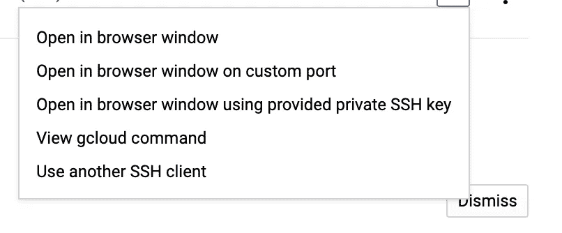

# 通过 Google 云和 Sheets 自动刷新 Tableau 数据

> 原文：<https://towardsdatascience.com/automatic-tableau-data-refreshing-through-google-cloud-and-sheets-13aeb3962fd8?source=collection_archive---------26----------------------->

## 通过 Python、Google Sheets 和 Google Cloud 的 Tableau 公共数据管道自动化教程


这篇文章介绍了通过 python、Google Sheets 和 Google Cloud 为 Tableau Public 构建自动数据刷新管道所需的步骤。在之前的帖子[自动刷新 Tableau Public](http://www.irarickman.com/blog/Auto-Refreshing-Tableau-Public/) 中，我解释了如何将 Tableau Public 工作簿连接到 Google Sheets，以利用 Tableau Public-Google Sheet 的每日刷新。我描述了如何在本地安排一个启动守护进程来更新 Google Sheet 中包含的数据，从而刷新 connected Tableau 公共工作簿中的数据。虽然这种设置适用于相对不频繁的刷新周期，但不适用于需要每天(或更频繁)更新的数据。下面详细介绍的设置解决了这个问题，以**创建一个真正自动化的数据刷新程序。**

# 为什么您应该自动化您的更新渠道？

虽然我对每周更新英超联赛表的原始数据更新方法非常满意，但我后来构建了需要更频繁更新的 Tableau 仪表盘。对于我的 [MLB 击球率预测工具](https://public.tableau.com/profile/ira.rickman#!/vizhome/MLBBattingAverageProjectionTool)，我需要每天刷新数据以使其具有相关性。在 MLB 赛季的每一天都打开我的个人电脑不是一个好的选择，所以我开始寻找一种可靠的任务调度方法。我最终选定了下面的工作流程:

1.  使用 Google Cloud Scheduler 安排一个实例运行
2.  在实例中启动一个 cron 作业，运行我的代码[来获取更新的数据并将其加载到 Google Sheets](https://github.com/irickman/projections_code/blob/master/update_batting_avg-gcp.py)
3.  使用 Google Cloud Scheduler 安排实例停止运行(为了省钱，因为它每天只需要运行 5 分钟)

我考虑过使用 Google Cloud Scheduler 直接执行脚本，而不是在实例中使用 cron，但是我喜欢通过 ssh 连接到实例，并且我已经熟悉了使用虚拟实例，所以这是阻力最小的途径。我也考虑过使用我在工作中使用的 Airflow，但是它需要一个类似的调度设置和一个额外的 web 服务器部署层。然而，我正在将这一过程转换为 Airflow，因此我可以更容易地安排未来的新工作，并在完成后更新后续帖子。

# 谷歌云入门

如果你是第一次安装谷歌云，我建议你遵循这个[指南](https://cloud.google.com/compute/docs/quickstart-linux)。首次使用 Google Cloud 的用户第一年可以获得 300 美元的积分，不过你必须启用计费并填写信用卡信息才能使用。你也可以使用谷歌云的[免费层](https://cloud.google.com/free/docs/gcp-free-tier#top_of_page)，它有使用限制。空闲层限制了您的可用内存和处理能力，但是您应该有足够的空间来执行基本操作。我对这个脚本使用了第二小的层实例大小，但是它非常便宜，因为我每天只运行 5 分钟。

# 创建实例

我每次都使用同一个实例，这样我就可以存储代码供重复使用。可能有更好的方法，但对我来说这是最直接的方法。为了在本地机器和实例之间移动代码，我使用 GitHub。显然，GitHub 使版本控制变得更容易，但这也是一种比每次我需要更新脚本时从我的本地机器向实例移动代码更简单的方法。

## 创建项目

首先，您需要创建一个新项目，因为 Google Cloud 将所有东西都组织在项目中。要创建新项目，请进入[项目页面](https://console.cloud.google.com/projectselector2)，点击“创建项目”。您可以随意命名它，但是要确保它易于输入，以防您最终从命令行引用它。设置好项目后，您可能需要启用计算引擎 API。进入你项目的控制台(你项目的主页——点击左上角的 Google Cloud Platform)并点击 API。在下一个屏幕的顶部，单击“启用 API 和服务”，然后搜索并添加计算引擎 API。

## 启动实例

启用 API 后，您可以导航回控制台并单击“转到计算引擎”链接(如果没有出现，请单击左上角的侧栏图标，向下滚动并单击计算引擎)。当您进入计算引擎时，您可以选择创建一个实例。单击“创建”创建您的实例。您可以为您的实例取一个名称(同样，最好是一个容易键入的名称)，然后选择一个区域和可用性区域。这些是谷歌云服务器的位置，你可以在那里托管你的虚拟机。典型的指导是选择一个离你近的地区，但我认为这没那么重要。你的区域选择也不是特别重要。然而，**当你去启动你的实例时，它将在那个区域启动，区域组合默认为**。如果您的默认区域关闭(偶尔会发生)，您可以跨区域移动它，但是我从来不需要这个选项。

选择您的地区和区域后，您将选择您的实例类型。我用的是 N1 系列，机型 g1-small。根据您的计算需求，有一大堆选项。g1-small 在这方面和其他方面都为我提供了很好的服务，所以我一直保留着它！



在那里，您需要点击“访问范围”下的“允许完全访问云 API”。这将确保您的实例可以计划启动和停止。最后，您将希望允许 HTTP 和 HTTPS 流量。你需要他们运行一个脚本，从某个地方获取数据，然后存储在 Google Sheets 中。您可以在以后更改这些选项，但是从一开始就设置它们会更容易。一旦您的实例设置好了，您就可以通过点击实例，然后点击 start 来启动它！

# 设置您的实例

要连接到您的实例，您可以在新窗口中打开连接，按照其他选项之一在浏览器中打开它，使用另一个 ssh 客户端，或者通过 g Cloud(Google Cloud 命令行界面)连接。



我混合使用控制台和 gcloud 来使用 Google Cloud，但是你可以轻松地使用其中任何一种。然而，当连接到实例时，我更喜欢 gcloud，这样我可以更自然地与它们交互。要安装 gcloud，请按照这里的说明[进行操作。要通过 gcloud 连接到您新创建的实例，您可以在本地终端中键入命令](https://cloud.google.com/sdk/docs/downloads-interactive)，或者从下拉列表中复制命令并粘贴到本地终端中。如果你不确定它是否有效，**如果你看到你的终端把你的位置列为<你的 google 用户名> @ <你的实例名>** (对我来说就是 irarickman@instance-1)，你就会知道你在你的实例中。恭喜你，你现在在你的虚拟机里了！

## 安装软件包和工具

对于我的特定用例，我需要设置一些东西来准备运行我的 MLB 数据刷新脚本。根据您的需求，您自己的设置可能会有所不同，但是我需要以下内容

**Python 包** —你的虚拟机应该附带 Python。如果没有，请执行第二步

1.  运行**须藤 apt 更新**
2.  *(如果你没有 python)* 运行 **sudo 来安装 python3**
3.  运行 **sudo 来安装 python3-pip** 来安装最新的 pip
4.  通过 pip3 安装您需要的任何软件包。对我来说，这主要是 pybaseball，pygsheets，和一些较小的。

**安装 Git 并克隆您的代码仓库**——如果您还没有安装 Git，请遵循以下步骤。*这里假设你想从 Github 或 Gitlab 中提取代码。如果没有，跳过这一步！*

1.  运行 **sudo 来安装 git**
2.  像往常一样克隆您的回购协议！我用的是 https auth，可能会提示你输入用户名和密码。如果您使用 SSH，您需要完成正常的 ssh keygen 设置。

**创建一个 Google Sheets API 应用程序并连接到它**——为了避免重复创建另一个教程，我推荐遵循 [Erik Rood 的优秀 Google Sheets API 设置](https://erikrood.com/Posts/py_gsheets.html)。设置好凭据后，您需要将它们安全地复制到实例中以供使用。要保护拷贝，请打开一个新的终端标签，这样您就可以回到本地目录并运行

```
gcloud compute scp <file_path>/client_secret.json <googleusername>@<instance-name>:<~/file path>.
```

第一次使用 scp 时，系统会要求您创建一个密码短语。如果你只是按两次回车键，它不会创建一个。**如果您输入了密码，您需要在每次 scp 时输入。如果您从现在起几个月后再次尝试 scp，并且不记得您的密码，跳过密码非常有用。**如果您在连接实例时遇到任何错误，您可能需要指定项目和区域(记住它也需要运行)！要获得更多指导，我建议查看 GCP 文档。

加载您的凭据后，您可以对您的应用进行身份验证。这是一次性认证。您的浏览器可能会试图警告您该应用程序不安全。您可以点击高级并继续操作。要设置身份验证，您可以尝试运行您的脚本(并确保您适当地设置了您的[授权文件位置](https://pygsheets.readthedocs.io/en/stable/authorization.html)),或者在您移动凭证的位置从命令行运行 python 并键入:

```
import pygsheets
gc = pygsheets.authorize() 
```

您将被引导通过将 url 复制到浏览器中来完成认证流程。按照随后的指示，将密钥粘贴到命令行中，您应该已经准备好了！你可以在这里看到我的代码是如何使用 Google Sheets 的。

# 计划您的实例

这是允许您定期启动和停止实例的部分。要设置完整的工作流，您需要创建以下各项

*   [**Pub/Sub topic**](https://console.cloud.google.com/cloudpubsub/) —将携带通知开始事件的消息。
*   [**云函数**](https://console.cloud.google.com/functions/) —实际执行一个事件的函数。
*   [**云调度任务**](https://console.cloud.google.com/cloudscheduler) —启动工作流的预定命令。

## 设置发布/订阅主题

首先，导航至[发布/订阅](https://console.cloud.google.com/cloudpubsub/)并点击“创建主题”。您将希望给它一个易于跟踪的名称，例如“start-instance”。

## 设置云功能

接下来，跳到你的[云函数](https://console.cloud.google.com/functions/)上，点击“创建函数”，然后按照以下步骤操作:

1.  给你的函数起一个名字，可能是“startInstance”。
2.  选择您的地区(同样，可能希望保持在同一个地区)。
3.  选择发布/订阅作为触发器。这将启动你的功能。发布/订阅主题实际上只是向您的函数传递一条消息，让它知道它需要启动。在这种情况下，它还将区域和实例交付给 start。
4.  在下拉列表中选择“启动实例”发布/订阅。您可以选择是否“失败时重试”。根据您的任务和结构的频率，您可能需要也可能不需要重试。我不为我的。
5.  点击“下一步”进入代码编辑器。
6.  在“入口点”输入字段中，输入函数的名称(例如，startInstance)。
7.  **在 index.js 编辑器**中，擦除编辑器中已有的代码，输入下面的代码。**确保将你的函数名替换为“导出”。<在第 33 行和第 77 行输入函数名，例如 start instance>。这段代码也可以在谷歌的[教程 repo](https://github.com/GoogleCloudPlatform/nodejs-docs-samples/blob/master/functions/scheduleinstance) 中找到，不过 ***我在第 38–39 行、82–83 行和 120–122***行做了一些小改动。Google 提供的脚本要求在调度任务中传递一个标签。我不标记我的谷歌云资源，所以我从搜索中删除了标签组件。**下面的版本可以粘贴到 index.js 编辑器中，启动和停止函数都可以，只需要记住更改停止函数名**。明确地说，您不需要在相应的开始和停止函数中包含开始和停止代码，但是为了方便起见，您可以在下面找到所有代码。**

```
// Copyright 2018 Google LLC
//
// Licensed under the Apache License, Version 2.0 (the “License”);
// you may not use this file except in compliance with the License.
// You may obtain a copy of the License at
//
// [http://www.apache.org/licenses/LICENSE-2.0](http://www.apache.org/licenses/LICENSE-2.0)
//
// Unless required by applicable law or agreed to in writing, software
// distributed under the License is distributed on an “AS IS” BASIS,
// WITHOUT WARRANTIES OR CONDITIONS OF ANY KIND, either express or implied.
// See the License for the specific language governing permissions and
// limitations under the License.// [START functions_start_instance_pubsub]
// [START functions_stop_instance_pubsub]
const Compute = require(‘[@google](http://twitter.com/google)-cloud/compute’);
const compute = new Compute();
// [END functions_stop_instance_pubsub]/**
 * Starts Compute Engine instances.
 *
 * Expects a PubSub message with JSON-formatted event data containing the
 * following attributes:
 * zone — the GCP zone the instances are located in.
 * label — the label of instances to start.
 *
 * [@param](http://twitter.com/param) {!object} event Cloud Function PubSub message event.
 * [@param](http://twitter.com/param) {!object} callback Cloud Function PubSub callback indicating
 * completion.
 */
exports.**<enter start function name>** = async (event, context, callback) => {
 try {
 const payload = _validatePayload(
 JSON.parse(Buffer.from(event.data, ‘base64’).toString())
 );
 //const options = {filter: `labels.${payload.label}`};
 const [vms] = await compute.getVMs();
 await Promise.all(
 vms.map(async (instance) => {
 if (payload.zone === instance.zone.id) {
 const [operation] = await compute
 .zone(payload.zone)
 .vm(instance.name)
 .start();// Operation pending
 return operation.promise();
 }
 })
 );// Operation complete. Instance successfully started.
 const message = `Successfully started instance(s)`;
 console.log(message);
 callback(null, message);
 } catch (err) {
 console.log(err);
 callback(err);
 }
};
// [END functions_start_instance_pubsub]
// [START functions_stop_instance_pubsub]/**
 * Stops Compute Engine instances.
 *
 * Expects a PubSub message with JSON-formatted event data containing the
 * following attributes:
 * zone — the GCP zone the instances are located in.
 * label — the label of instances to stop.
 *
 * [@param](http://twitter.com/param) {!object} event Cloud Function PubSub message event.
 * [@param](http://twitter.com/param) {!object} callback Cloud Function PubSub callback indicating completion.
 */
exports.**<enter stop function name>** = async (event, context, callback) => {
 try {
 const payload = _validatePayload(
 JSON.parse(Buffer.from(event.data, ‘base64’).toString())
 );
 //const options = {filter: `labels.${payload.label}`};
 const [vms] = await compute.getVMs();
 await Promise.all(
 vms.map(async (instance) => {
 if (payload.zone === instance.zone.id) {
 const [operation] = await compute
 .zone(payload.zone)
 .vm(instance.name)
 .stop();// Operation pending
 return operation.promise();
 } else {
 return Promise.resolve();
 }
 })
 );// Operation complete. Instance successfully stopped.
 const message = `Successfully stopped instance(s)`;
 console.log(message);
 callback(null, message);
 } catch (err) {
 console.log(err);
 callback(err);
 }
};
// [START functions_start_instance_pubsub]/**
 * Validates that a request payload contains the expected fields.
 *
 * [@param](http://twitter.com/param) {!object} payload the request payload to validate.
 * [@return](http://twitter.com/return) {!object} the payload object.
 */
const _validatePayload = (payload) => {
 if (!payload.zone) {
 throw new Error(`Attribute ‘zone’ missing from payload`);
 } //else if (!payload.label) {
 //throw new Error(`Attribute ‘label’ missing from payload`);
 //}
 return payload;
};
// [END functions_start_instance_pubsub]
// [END functions_stop_instance_pubsub]
```

**在 package.json 编辑器**中，删除编辑器中的现有代码并输入以下内容:

```
{
 “name”: “cloud-functions-schedule-instance”,
 “version”: “0.1.0”,
 “private”: true,
 “license”: “Apache-2.0”,
 “author”: “Google Inc.”,
 “repository”: {
 “type”: “git”,
 “url”: “[https://github.com/GoogleCloudPlatform/nodejs-docs-samples.git](https://github.com/GoogleCloudPlatform/nodejs-docs-samples.git)"
 },
 “engines”: {
 “node”: “>=10.0.0”
 },
 “scripts”: {
 “test”: “mocha test/\*.test.js — timeout=20000”
 },
 “devDependencies”: {
 “mocha”: “⁸.0.0”,
 “proxyquire”: “².0.0”,
 “sinon”: “⁹.0.0”
 },
 “dependencies”: {
 “[@google](http://twitter.com/google)-cloud/compute”: “².0.0”
 }
}
```

单击 Deploy，您的功能就应该设置好了！请注意，在下面的步骤中，我们将从调度程序传递区域和实例名称，这些名称将通过发布/订阅传递给函数，这样它就知道要开始什么了！

## 设置您的云计划任务

最后，转到云调度器，点击“创建”，然后按照以下步骤操作:

1.  为您的作业选择一个区域(可能与您的实例相同)。
2.  在下一页，给你的工作起一个名字和描述。我使用“启动实例”来启动它，使用“停止实例”来停止它！
3.  指定时间表。下面的标题提供了更多信息，但是您需要使用 unix-cron 格式来安排。cron 调度的好处在于它足够灵活，可以每 5 分钟或每月第三天的午夜调度一次。欲了解更多信息，请查看此[帮助页面](https://cloud.google.com/scheduler/docs/configuring/cron-job-schedules?&_ga=2.6352244.-757052567.1596254043#defining_the_job_schedule)。
4.  选择您的时区。这样做时要小心。稍后我们将讨论在您的实例中设置 cron 作业。这些默认为 UTC，所以如果您决定不更改您的 cron 时区，您需要确保这些时间表是一致的。**我喜欢使用 UTC，因为它不受夏令时的影响。**
5.  选择您的目标作为发布/订阅。
6.  输入您的主题名称—它应该是您在上面的发布/订阅步骤中使用的名称。
7.  在 payload 部分，您将告诉您的任务从哪个区域和实例开始。粘贴并编辑下面的代码:

```
{“zone”:”<zone>”,”instance”:”<instance-name>”}
```

## 设置停止实例工作流

上面的工作流程对于启动您的实例来说很棒，但是**这个过程的全部要点是启动，然后停止实例**。要设置停止工作流，遵循相同的步骤，只需将名称更改为 stop，并仔细检查是否在云函数脚本中填写了停止函数名称。请记住适当地设置启动和停止之间的时间间隔，以便在脚本启动后停止它(反之亦然)。

# 计划您的 python 脚本

一旦您将实例设置为启动和停止，您将希望在实例中设置脚本通过 crontab 运行。幸运的是，这个过程要简单得多。启动您的实例并在。在实例中，输入 **crontab -e** 。您将被要求选择您的编辑器，(我更喜欢 nano)，然后您将被带到 crontab 文件。要阅读关于这个文件的更多信息，请查看 [crontab.guru](https://crontab.guru/) 。在那里你还可以找到一个[有用的编辑器](https://crontab.guru/crontab.5.html)来测试 crontab 计时。

在您的 crontab 文件中，您可以安排您的脚本。再次提醒，要注意时间和时区！目标是在实例运行的同时调度 crontab 运行。默认情况下，您的 crontab 将在 UTC 上运行。因此，您需要考虑适当的 UTC 时间，以便与实例的开始/停止时间保持一致。找到合适的时间后，输入类似下面的命令来安排您的脚本:

```
 0 10 * * * python3 /home/<google username>/projections_code/update_batting_avg-gcp.py
```

如果您有多个 python 安装(例如 python 2.7、anaconda 等)。)您将需要准确地指定要使用哪个 python 可执行文件。同样，您可能希望根据文件所在的位置来调整路径。

最后，我建议测试您的调度器和 cron 时间，以确保它们是一致的。我测试了我的脚本，将时间表设置为几分钟后运行，然后在我知道可以运行时调整实际脚本。虽然这是一个很好的前期工作，但它确实节省了我一些时间，并使一个有趣的画面仪表板。我希望本指南对您有所帮助——请随时提供反馈！