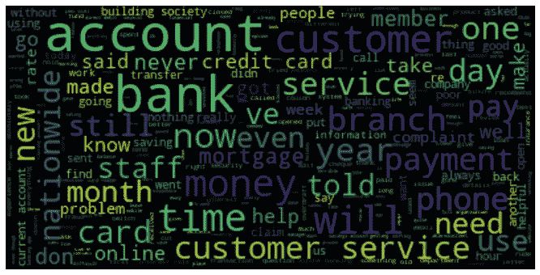
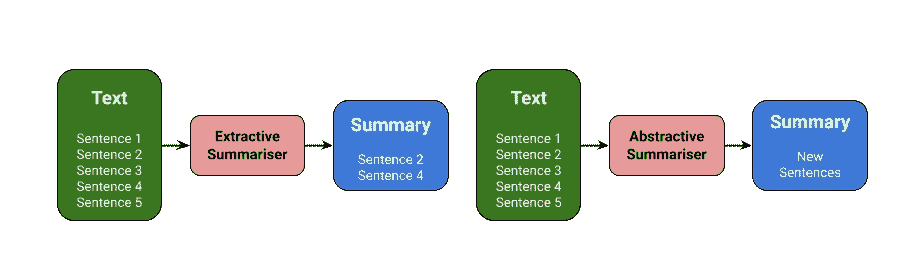
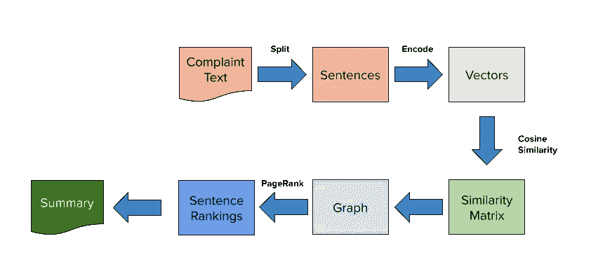
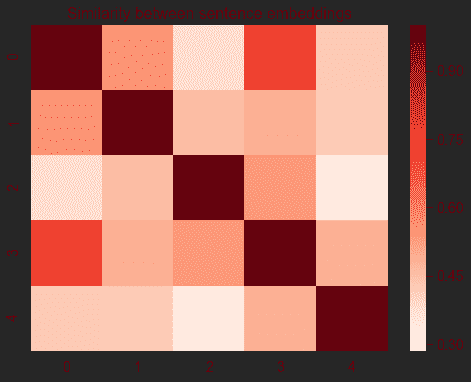
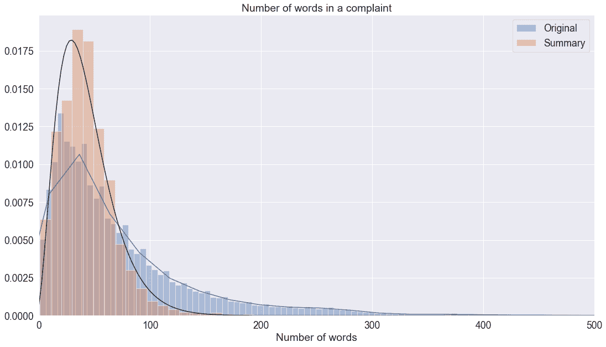
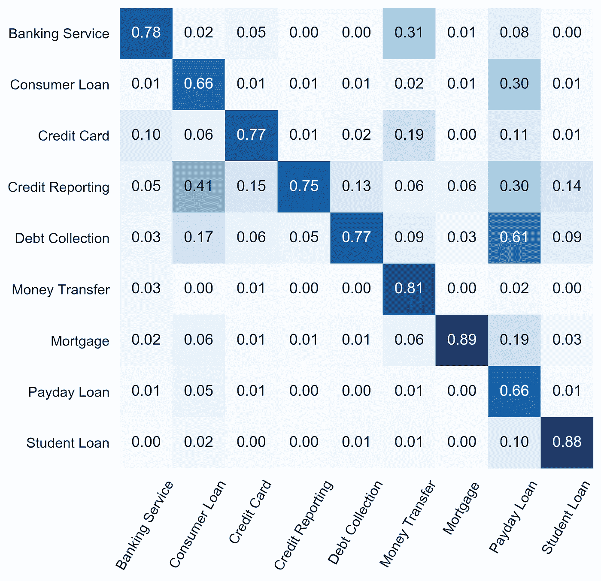

# 自动文本摘要

> 原文：<https://towardsdatascience.com/automatic-text-summarisation-ccc98d2b323f?source=collection_archive---------46----------------------->

## 用 TextRank 凝聚客户投诉



# 动机

这项工作来自我使用美国消费者投诉数据集完成的 NLP 分类任务。任务是仅使用文本叙述来预测客户抱怨的金融产品。这是一个相当简单的监督问题，因为训练数据有标签，简单的逻辑回归分类器可以给出 0.80 的精度。当我浏览被错误分类的投诉时，我被它们的冗长所震惊。以下是对一种抵押贷款产品投诉的开始:

```
Hello, we have big problem again, there is a foreclosure sale scheduled for our home on XX/XX/XXXX and we are out of options and we have exhausted ourselves with this horrible company. We have had many attempts to receive an affordable monthly payment but no resolution and no affordable monthly payment offer has been given. We have sent in a request for mortgage assistance form along with bank statements taxes paystubs and other documents necessary for a loan modification review. We recently sent Mr. Cooper all documents but Mr. Cooper ahs the sale still scheduled. As part of this bailout, on XX/XX/XXXX, the United States Government took over XXXX XXXX and pumped billions, which in XX/XX/XXXX, then Treasury Secretary XXXX XXXX said as much as {$XXXX} XXXX would be pumped into XXXX XXXX and XXXX XXXX, each, which was separate from the {$700.00} in TARP funds given out to other lenders. 1\. The guidelines issued by the United States Treasury set forth a detailed process whereby a participating servicer, either action or not acting through its subsidiary, must : a. identify loans that are subject to modification under the HAMP program, both through its own review and in response to requests for modification from individual homeowners ; b. collect financial and other personal information from the homeowners to evaluate whether the homeowner is eligible for a loan modification under HAMP...
```

整份诉状约 2000 字长，引用了美国财政部、联邦和州政府的政策，还掺杂了该公司和特定涉案人员的行为。看到这一点，我对机器学习算法有了真正的了解，这种算法无需人工干预就能对投诉进行分类。对于这个任务，单词“mortgage”的频繁出现会向人暗示我们正在处理一个抵押贷款产品。但是，如果我们想深入到问题的层面，了解投诉的内容，那么我们需要阅读这篇文章——这不是大多数人会喜欢的任务。

幸运的是，我们可以使用机器学习来减少理解文本的努力，通过**自动文本摘要。**

# 自动文本摘要

自动文本摘要的一个很好的定义是“[产生一个简洁流畅的摘要，同时保留关键信息内容和整体含义的任务](https://machinelearningmastery.com/gentle-introduction-text-summarization/)”。有两种不同的方法，**提取总结**和**抽象总结。**

## 摘录摘要

*   从原文中找出最重要的句子或短语
*   仅从原文中提取句子
*   摘录的句子将是我们的总结
*   大多是无监督学习

## 抽象概括

*   从原文中产生新的句子
*   生成的句子可能不会出现在原文中
*   更困难的任务，包括语言理解
*   使用深度学习方法



提取与抽象摘要

在这里，我们将只关注提取总结算法。我们要看的这个叫做 TextRank。

# TextRank 算法

[TextRank 算法](https://www.aclweb.org/anthology/W04-3252)是一种提取的无监督文本摘要算法。这是一个相当古老的方法，于 2004 年首次提出。顾名思义，它与著名的 PageRank 算法有相似之处，page rank 算法用于按重要性对网站进行排序。



应用程序中的文本等级

## TextRank 与 PageRank 的比较

*   代替网页的句子
*   任意两个句子之间的相似度相当于网页转移概率
*   相似性得分存储在一个正方形矩阵中，类似于 PageRank 中使用的矩阵 **M**

首先，将文本拆分成句子。我们计算每对句子之间的相似度。这建立了一个完整的加权图，即每个顶点(句子)连接到所有其他顶点，每个边是它连接的两个顶点之间的相似性得分。边的值基本上类似于为另一个顶点“投票”——投票越多，顶点(句子)的重要性就越高。然而，正如在 PageRank 中，谁投票也很重要:重要的句子在投票时的贡献更高。在过去，他们使用重叠来计算句子之间的相似度，但现在我们可以只使用句子嵌入来计算余弦相似度。

下面是分成句子的示例段落和句子嵌入之间的相似性矩阵。

```
0: ‘I have reached out to the credit bureaus about these debts they have put on my credit file.'
1: ‘This has been a long road.’
2: ‘When ever I apply for anything I am never approved because for some reason I believe me and someone has the same social.’
3: ‘Its extremely frustrating.’
4: ‘I just would like all this inaccurate information removed’
```



我们使用这个矩阵运行 PageRank 算法(PageRank 在 [networkx](https://networkx.github.io/documentation/stable/) 中作为方法可用)，取前五个句子作为文本摘要。

# 结果



在用于进行实验的语料库中，单词的中位数是 51，最大值是 2643 个单词。总结之后，字数的中位数略微下降到 40 个，但是我们基本上消除了长尾效应，现在投诉的最大字数为 482 个。

你可以去我的 [Github repo](https://github.com/yusueliu/customer-complaints) 查看一些文本摘要的例子，这里有一个简单的例子。这是一份在“讨债”下提交的投诉，具体问题是“关于债务的书面通知”。

原文:

```
'It was recently reported on my account that I had a derogatory account with Eastern Connecticut Account. I have never received anything regarding a missing payment to my New York address. This is regarding an XXXX XXXX payment for XXXX dollars. This was a charge from XX/XX/XXXX, I had XXXX XXXX XXXX XXXX XXXX at the time as I was under my father’s insurance. \tI received a few phone calls in XX/XX/XXXX from *XXXX Fraud Alert #*, I obviously did not answer. I had a voicemail saying to please call and confirm a social security number. I XXXX Eastern Connecticut and saw extremely negative reviews. My concern regarding giving them my personal information only began to grow. When I called back I instructed the representative that they showed up on my phone as fraud. Then the representative began to instruct me on an XXXX XXXX debt. I asked from when was this from, they said XX/XX/XXXX. I asked her if XXXX XXXX put my insurance in. XXXX XXXX XXXX XXXX XXXX in and out of state number. I know that my insurance would have went through, as I had XXXX XXXX XXXX and had numerous bills that were all covered. I instructed her to reach out to the XXXX XXXX and try to submit the claim or call me back if there were any issues. I didn’t feel comfortable just making a payment to this organization, especially after the reviews and the type of infection I had during that time. When the organization never called me back, I assumed that the XXXX XXXX had taken care of it.\tAfter I got an update from my XXXX  app on a negative report to my score, I saw it was Eastern Connecticut. I immediately called Eastern Connecticut, and left numerous Voice Mail Messages. I had one representative hang up on me multiple times, when I was trying to explain I don’t live in Connecticut. After finally getting through to one representative, I finally paid the XXXX dollars. I asked if they could send a report to your company saying they didn’t have my address and the person laughed at me over the phone. He said, “Why would I help your credit score”. He said, having a phone number is sufficient enough to report someone as a derogatory account. \tThis organization is taking advantage of people and I don’t want my credit report to be negatively reflected by this. XXXX even reported their entity as fraud. I did pay this organization, however extremely reluctantly. I have attached a copy of the receipt. Please, if your organization can update my credit score and remove this derogatory account information. I have never missed a payment on any of my accounts. I have a number of student loans that I’m trying to pay off, and this negative credit score will hurt my future in receiving a lower interest rate.'
```

总结文本:

```
'He said, having a phone number is sufficient enough to report someone as a derogatory account. This organization is taking advantage of people and I don’t want my credit report to be negatively reflected by this. I asked if they could send a report to your company saying they didn’t have my address and the person laughed at me over the phone. I have never received anything regarding a missing payment to my New York address. I have a number of student loans that I’m trying to pay off, and this negative credit score will hurt my future in receiving a lower interest rate.'
```

这个总结看起来很有意义，但它并不完美，因为句子来自原文，而且没有试图确保连贯性或语法。

# 回到分类

从投诉中删除了这么多单词后，我想检查分类任务现在将如何执行。使用与全文相同的方法——标记化、tf-idf 矢量化，然后应用线性 SVC 分类器，我们获得了 0.80 的精度，这与我使用全文获得的结果相同！召回矩阵如下:



# 结论

在为消费者投诉构建产品分类器时，我注意到长时间的投诉使得人工验证结果成为一项特别艰巨的任务，于是我研究了在不丢失关键信息的情况下总结文本的方法。我们使用了一种叫做 TextRank 的无监督方法，可以快速运行。它产生合理的摘要，并且当使用摘要文本而不是原始全文作为分类的输入时，我们发现该算法在性能上没有损失。当然，该方法的缺点是摘要中的所有文本都来自原始文本。

# 参考

*   https://www.aclweb.org/anthology/W04-3252
*   手套:【http://www.aclweb.org/anthology/D14-1162】T2