# 自动检测新冠肺炎错误信息

> 原文：<https://towardsdatascience.com/automatically-detect-covid-19-misinformation-f7ceca1dc1c7?source=collection_archive---------24----------------------->


图片来源:Unsplash

## NLP，机器学习，新冠肺炎

[普通市民识别假新闻不容易](https://www.washingtonpost.com/politics/2020/04/07/its-not-easy-ordinary-citizens-identify-fake-news/)。而假冠状病毒新闻也不例外。

作为打击关于冠状病毒的错误信息的努力的一部分，我尝试并收集了训练数据，并训练了一个 ML 模型来检测冠状病毒的假新闻。

我的训练数据并不完美，但我希望它可以帮助我们了解假新闻在风格和语言使用上是否与真实新闻有系统的区别。所以，让我们来看看。

# 数据

正如在[上一篇文章](/explore-covid-19-infodemic-2d1ceaae2306)中提到的，我从各种新的来源收集了超过 1100 篇关于新冠肺炎的新闻文章和社交网络帖子，然后给它们贴上标签。数据集可以在这里找到[。](https://raw.githubusercontent.com/susanli2016/NLP-with-Python/master/data/corona_fake.csv)

fake_covid.py

我决定基于新闻标题和新闻文章主体创建几十个新功能。我来一一解释一下。

# 标题中大写字母

*   计算每个标题中大写字母的数量。
*   计算每篇文章正文中大写字母的百分比，而不是简单地计算数字，因为文章的长度差异很大。

title _ 大写. py

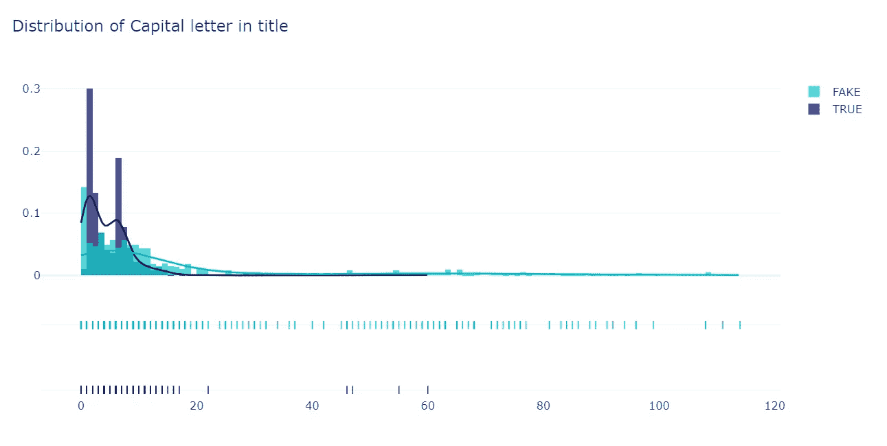

图 1

boxplot_cap.py

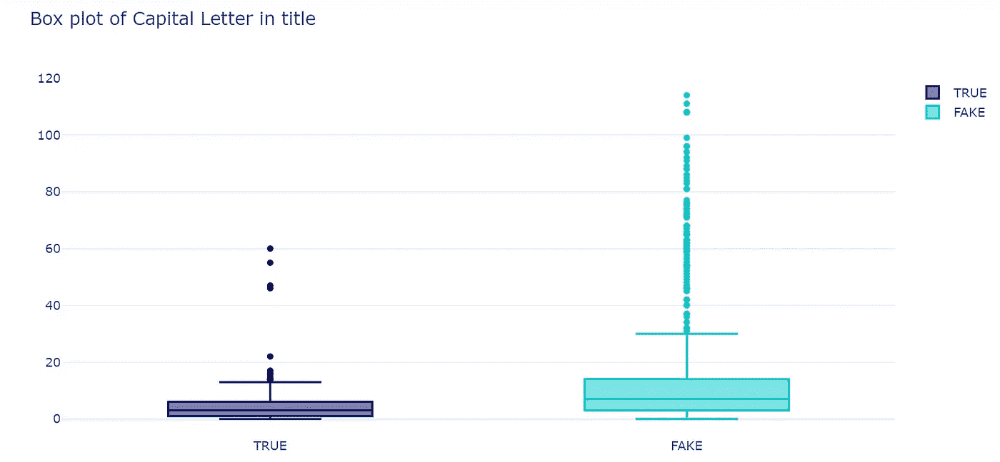

图 2

平均来说，假新闻标题中出现大写字母的单词要多得多。这让我想到假新闻针对的是容易被标题影响的受众。

# 停止标题中的单词

*   统计每个标题中停用词的数量。
*   计算每篇文章正文中停用词的百分比，而不是简单地计算数量，因为文章的长度差异很大。

stop _ words.py

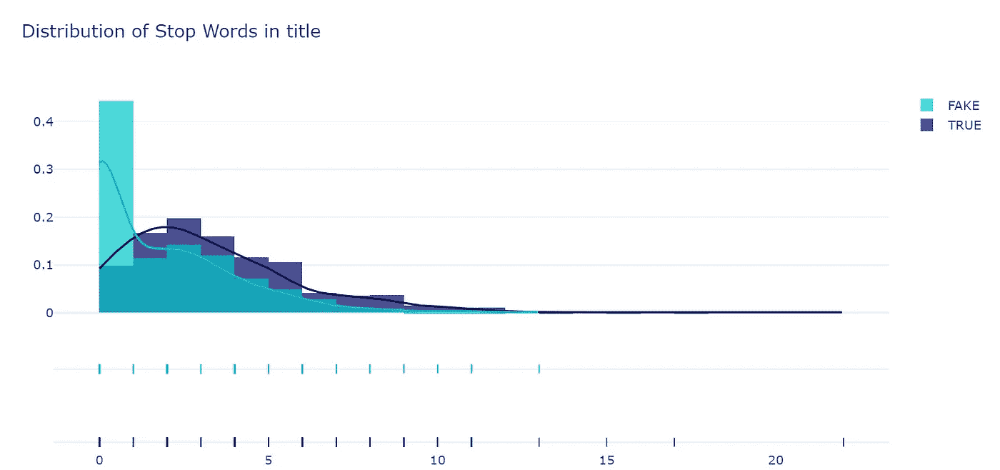

图 3

boxplot_stop_words.py

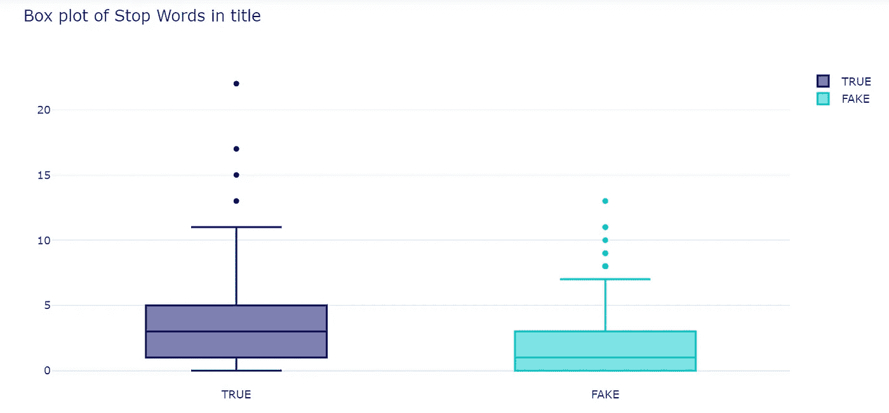

图 4

假新闻标题比真实新闻标题的停用词少。

# 标题中的专有名词

*   计算每个标题中专有名词(NNP)的数量。

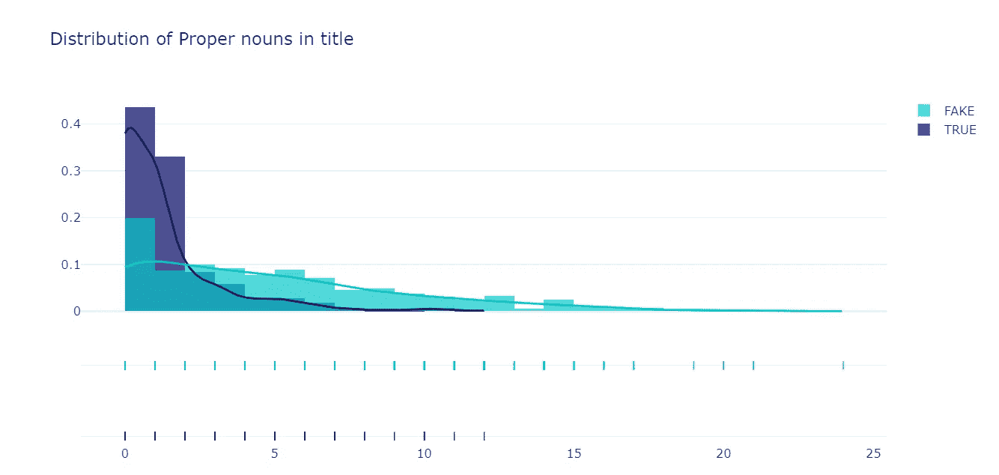

图 5

boxplot_proper_noun.py

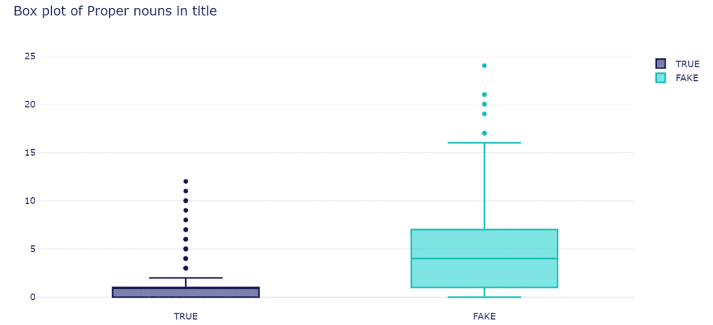

图 6

假新闻标题专有名词比较多。显然，标题中专有名词的使用对于区分真假非常重要。

# **从文章标题分析中抽离**

总的来说，这些结果表明，假新闻的作者试图通过在标题中使用所有大写单词来吸引注意力，并通过跳过停用词和增加专有名词来尽可能多地向标题中挤压内容。我们将很快发现这些是否也适用于文章正文。

这里有一个假新闻标题与真实新闻标题的例子。

假新闻标题:“**《烟枪》重磅采访全文:FRANCES BOYLE 教授揭露新冠肺炎冠状病毒的生物武器来源**”

真实新闻标题:“**冠状病毒这样的疫情为何呈指数级传播，如何‘拉平曲线**’”

# 特征

为了研究虚假和真实的新闻文章，我们在文章主体上计算许多基于内容的特征。它们是:

*   使用词性标注器，记录每个标注在文章中出现的次数。

pos_tag.py

*   文章正文中否定和疑问句的数量。

否定. py

*   使用 Python 库— [textstat](https://pypi.org/project/textstat/) 计算文本的统计数据，以确定任何文章的可读性、复杂性和等级水平。每个统计特征值的解释可以在[这里](https://pypi.org/project/textstat/)找到。

textstat.py

*   [类型-标记比率](https://carla.umn.edu/learnerlanguage/spn/comp/activity4.html#:~:text=A%20type%2Dtoken%20ratio%20(TTR,a%20given%20segment%20of%20language.) (TTR)，是给定语言片段中独特单词(类型)的总数除以单词(标记)的总数。使用 Python 库—[lexical richity](https://pypi.org/project/lexicalrichness/)。

ttr.py

*   文章正文中动力词、休闲词、试探词、情感词的数量。

power_words.py

# 探索

**文章正文中的大写字母**

大写 _text.py

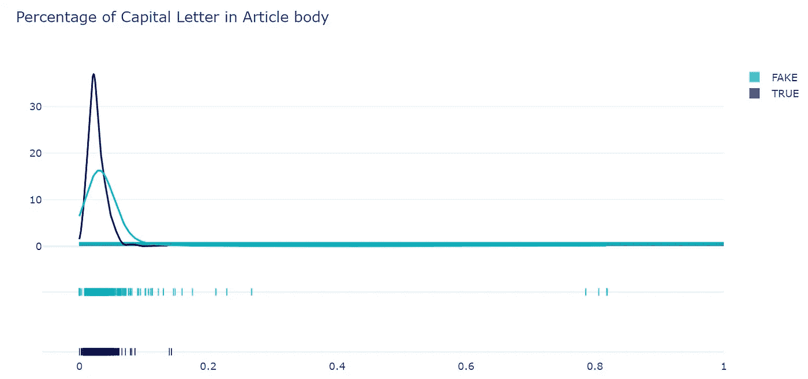

图 7

平均而言，假新闻在文章正文中出现大写字母的单词比真实新闻多。

**文章正文中的停用词**

text_stop_words.py

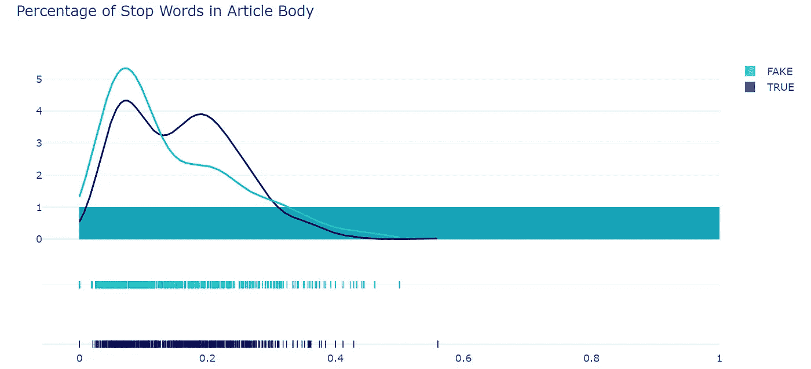

图 8

假新闻和真实新闻中停用词的比例似乎没有显著差异。

**文章正文中的 NNP(专有名词，单数)**

专有名词文本

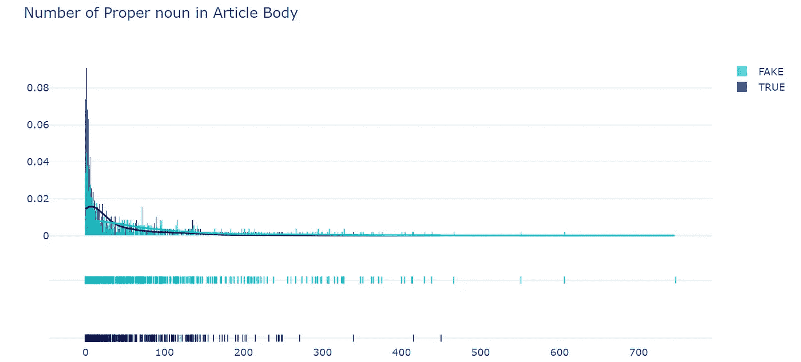

图 9

与标题类似，假新闻在文章正文中也包含更多专有名词。

**文章正文中的否定词**

否定. py

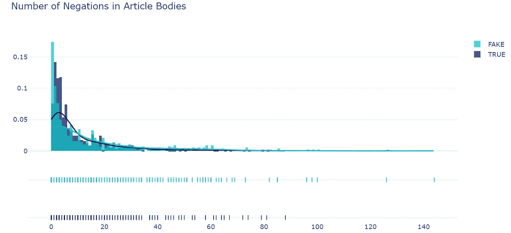

图 10

平均来说，假新闻的否定词比真新闻多一点。

**支架**

括号. py

出于某种原因，在我的数据中，假新闻在文章正文中使用了更多的括号。

**类型-令牌比(TTR)**

ttr.py

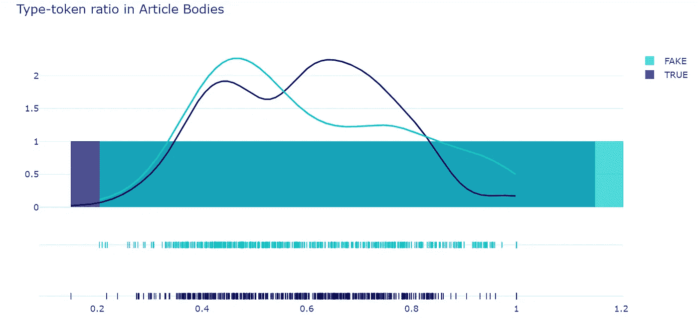

图 11

就 TTR 而言，假新闻和真实新闻之间似乎没有显著的区别。

我没有探究所有的数字特性，你可以自己做。然而，从我的探索中，我发现假新闻文章在标题上比在正文上有更多的不同。

# **哈佛健康出版社诉自然新闻**

记住，[自然新闻是极右的阴谋论和假新闻网站](https://en.wikipedia.org/wiki/Natural_News)。我从那里收集的新闻文章都被贴上假新闻的标签。

哈佛 _natural.py

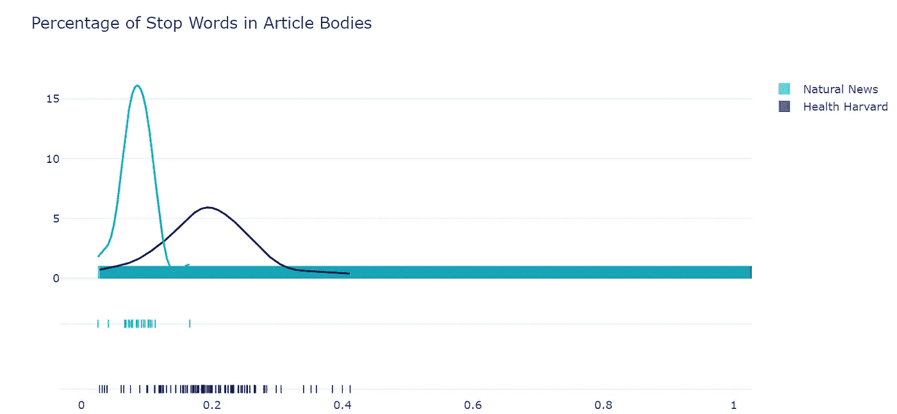

图 12

在预期范围内，自然新闻文章使用的停用词比哈佛健康出版社少得多。

哈佛 _ 自然 _ttr.py

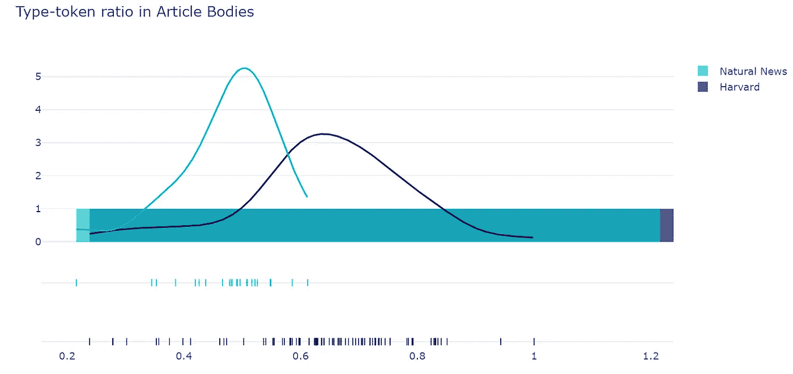

图 13

[TTR](https://carla.umn.edu/learnerlanguage/spn/comp/activity4.html#:~:text=A%20type%2Dtoken%20ratio%20(TTR,a%20given%20segment%20of%20language.) 意在捕捉文档中词汇的[词汇多样性](https://en.wikipedia.org/wiki/Lexical_diversity#:~:text=Lexical%20diversity%20is%20one%20aspect,number%20of%20words%20(tokens).)。低的 [TTR](http://carla.umn.edu/learnerlanguage/spn/comp/activity4.html#:~:text=A%20type%2Dtoken%20ratio%20(TTR,a%20given%20segment%20of%20language.) 意味着文档有更多的单词冗余，高的 [TTR](http://carla.umn.edu/learnerlanguage/spn/comp/activity4.html#:~:text=A%20type%2Dtoken%20ratio%20(TTR,a%20given%20segment%20of%20language.) 意味着文档有更多的单词多样性。很明显，在 TTR 方面,《哈佛健康杂志》和《自然新闻》有很大的不同。

# 分类模型

由于我的数据收集有偏差，我们不会使用“来源”作为特征，例如，我只从脸书和推特上收集假帖子。而事实上，脸书或推特上的大多数帖子都是真实的。

我相信你已经注意到我们已经创建了大量的数字特征。对于第一次尝试，我决定使用它们来拟合一个[支持向量机(SVM)模型，该模型具有线性核](https://scikit-learn.org/stable/modules/generated/sklearn.svm.LinearSVC.html#sklearn.svm.LinearSVC)和 10 重交叉验证，以防止过度拟合。

linearSVC_fake.py

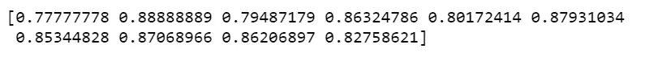

```
print(scores.mean())
```

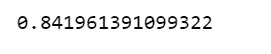

当 10 重交叉验证完成时，我们可以在每次迭代中看到 10 个不同的分数，然后我们计算平均分数。

取 ***C 参数*** 的所有值，检查精度得分。

c_accuracy1.py

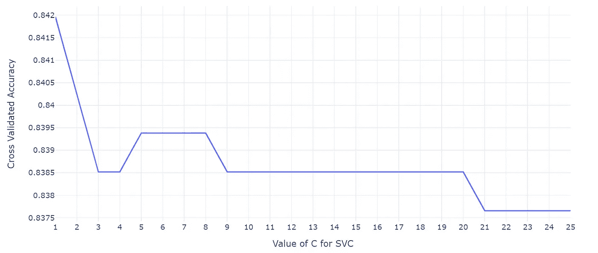

图 14

从上面的图中我们可以看到，对于 C=1，精度接近 84.2%，然后下降到 83.8%左右，并保持不变。

我们将更详细地了解为我们提供良好准确度分数的参数*的确切值。*

*c_accuracy2.py*

*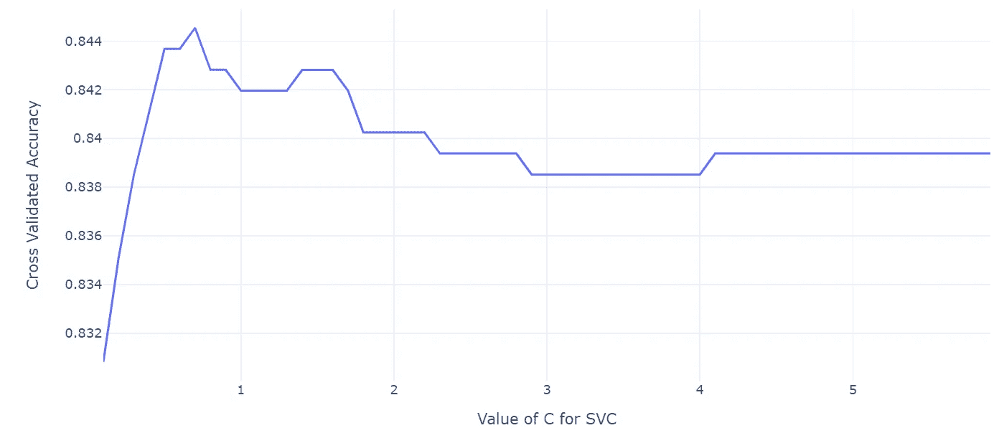*

*图 15*

*上图显示，对于 C=0.7，准确度得分最高。*

# *未来的工作*

*记得为了学习和探索，我创建了几十个新的数字特征，并使用它们来拟合分类模型。我建议您使用假设检验方法来选择前 8 或前 10 个特征，然后运行线性 SVM 模型和 10 重交叉验证。*

*假设检验不能对数据中的预测类说什么，但是，这些检验可以说明哪些特征比其他特征更重要。*

*Jupyter 笔记本可以在 [Github](https://github.com/susanli2016/NLP-with-Python/blob/master/AutoDetect_COVID_FakeNews.ipynb) 上找到。周末愉快！*

*参考:【https://arxiv.org/pdf/1703.09398.pdf *