# 从文件中自动推断关系结构

> 原文：<https://towardsdatascience.com/automatically-inferring-relational-structure-from-files-ee0790c8002c?source=collection_archive---------23----------------------->

## 一种使用 pandas 和 NetworkX 自动推断和显示类似 CSV 数据的底层关系结构的方法


从数据文件的集合到对业务有意义的信息空间地图。(*原始图像，在 DataSmith* 中生成的图形)

# 背景

他们叫你来是因为他们需要洞察力。也许是对未来的计划，或者是对现在的批判性评估——无论哪种方式，你的愿景都需要有严肃具体的证据支持。为了实现这一点，你需要获取一些原始数据，并将这些数据快速转化为知识*。*

*实际上，放在你办公桌上的很可能是一捆 CSV 文件，由业务分析师匆忙汇编而成，或者是在地下室布满灰尘的服务器上发现的。*

*我们需要知道这些文件意味着什么，但我们不能为此目的轻易采用标准的 ML 算法，因为我们可能要查看的业务数据是高度分类的——名词将是法律实体、员工、销售、产品和客户，而不是数字观察。*

*在本文中，我们将看看如何使用 Python、 [pandas](https://pandas.pydata.org/about.html) 和 N [etworkX](https://networkx.github.io/) 快速洞察这些 CSV 文件的底层结构。本文中讨论的功能的后端代码(不是特别简洁)可以根据需要获得。*

**(本文所有图片均为原创。我自己的图形可视化工具 DataSmith 生成的图形图像。)**

# *用例示例*

*为了便于讨论，让我们以这个描述销售的真实(并且真实地枯燥……)的 CSV 文件为例。*

*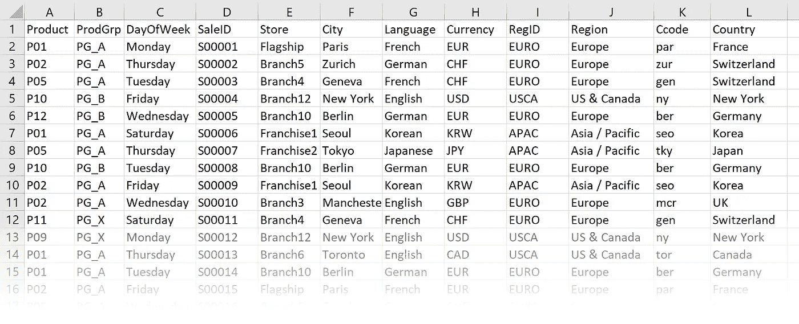*

*图 1:自然环境中的示例 CSV 文件。*

*显然，这些列中的一些彼此之间具有特定的关系。给定的“国家”可能总是在同一个“地区”。“Region”和“RegID”似乎大致是一回事。目前还不清楚“货币”是否总是与“国家”或“城市”匹配，或者“ProdGrp”是否与其他任何东西有任何关系。“SaleID”看起来很适合作为主键。*

*我们想要的是一种工具，它能产生类似于我的纸笔分析的东西:*

*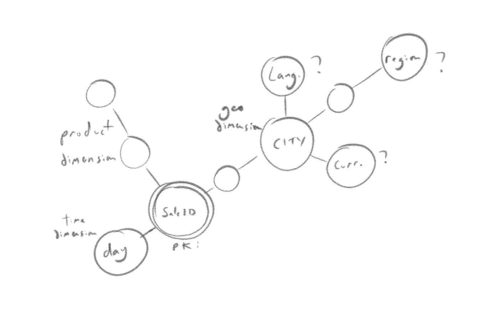*

*图 2:两分钟的 CSV 文件铅笔和纸分析*

*只是我们希望它是即时的、正确的、像样的。本文的其余部分描述了解决这个问题的方法。*

*我们可以使用许多技术来推断数据结构的近似值，但是大体上我们需要一些基本的构建块:*

*   *衡量一列对另一列的依赖程度的方法*
*   *一种基于该度量值构建列关系图的方法*
*   *一种简化和表示图形方法*

*事实上，以上三个步骤是许多(如果不是全部)关系信息可视化挑战的特征。现在，我们将依次查看如何定义一个度量、构建一个图表，以及从图表中呈现有用的结论。*

# *措施*

*本节考虑了测量列之间相关性的方法，并提出了一种自定义的测量方法，即“码头系数”。为了推断关系结构，我们主要想回答以下问题:*

*   *“A 列可能是 B、C 和 D 列的关键字吗？”*
*   *' A 列是 B 列可能是其属性或子维度的维度吗？'*

## *相关性，卡方和他们的朋友*

*我们需要一个度量来告诉我们列之间是否相关，以及相关程度如何。我们的 ML 本能可能会告诉我们寻找列之间的相关性。不过，这并不是很有效，因为纯粹的相关性并不真正适用于分类变量之间。*

*所以，我们寻找一个相关的分类版本。常见的[卡方测度](https://en.wikipedia.org/wiki/Chi-squared_test)就是这样；它为我们提供了两个分类变量独立性的数值度量。*

*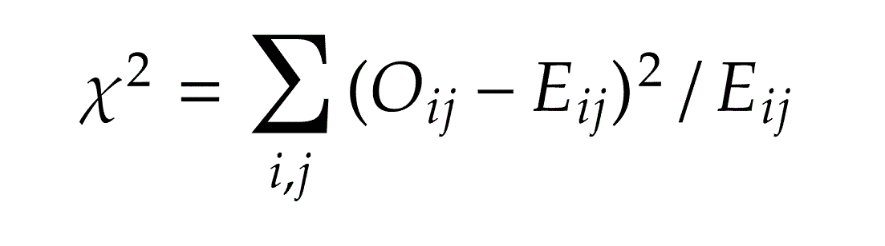*

*图 3:卡方公式*

*在实践中，卡方是一个可怕的相关性度量，因为它没有缩放，并且很难知道我们应该如何对更大或更小的卡方值做出不同的反应。为了找到列之间相关度的度量，我们可以使用一个叫做 Cramer V 的度量；这种测量是一种缩放的卡方:*

*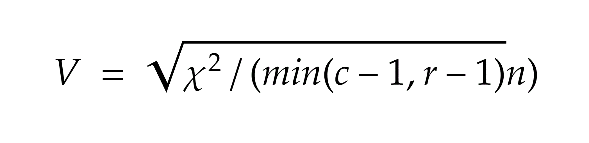*

*图 4:克莱姆的 V——一个缩放的卡方检验*

*维基百科建议对克莱姆的 V [这里的](https://en.wikipedia.org/wiki/Cram%C3%A9r%27s_V)进行额外的缩放步骤，这可能是分类字段的“最正确”的类似相关性的度量。然而，在实践中，它对当前的任务并不那么有用。*

*这些方法的问题在于它们是相互关联的度量。为了回答我们的问题，我们想要一个方向性的度量；我们正在寻找不对称的关系，其中 A 列暗示 B 列，但不是(通常)反之亦然。*

## *贝叶斯定理的*

*为了测量 A 列隐含 B 列的程度，我们可以使用[贝叶斯](https://en.wikipedia.org/wiki/Bayesian_probability)逻辑。这有两大好处:*

*   *它产生了一个“信心水平”，这是我们正在寻找的；我们想知道给定 A 列的值，我们对 B 列的值有多大的把握。*
*   *这是一种单向关系，很容易表达 A 暗示 B 的情况，但反之则不然。*

*在实践中，贝叶斯逻辑对我们的问题是有用的，但它有一些缺点。特别是，贝叶斯模型的大多数可用实现对于分类输入都不太适用。例如，为了在 sklearn 中使用非常有用的 [Bernoullian Bayes 实现，我们必须使用所谓的‘one hot’编码来将输入列表示为一组布尔值:](https://scikit-learn.org/stable/modules/generated/sklearn.naive_bayes.BernoulliNB.html)*

*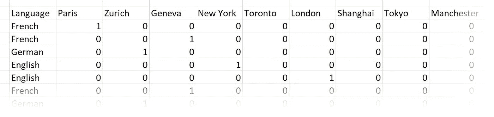*

*图 5:一键编码；决定“语言”是否依赖于“城市”*

*这是将分类数据转换成适合普通 ML 算法的状态的一般问题的一个特例，这本身就是一个有趣的问题(参见[这篇关于数据科学的文章](/smarter-ways-to-encode-categorical-data-for-machine-learning-part-1-of-3-6dca2f71b159)中的介绍)。*

*虽然贝叶斯方法当然不应该被拒绝用于结构推断——事实上，它们可能非常有用——但这里的目标是构建一个快速、简单的工具。特别是，要推断整个文件的结构，这可能很大，我们需要将每一列与几乎每一列进行比较，而这需要使用贝叶斯方法。此外，当一列*几乎*暗示另一列的值时，贝叶斯置信水平产生一个难以解释的数字。*

## *码头系数*

*出于这些原因，对于手头的任务，值得建议一个新的衡量标准，即“码头系数”(之所以这么叫，是因为它在金丝雀码头很有用，金丝雀码头是伦敦的一部分，那里有大量的 CSV 文件)。这是一个回答问题的简单方法:*

*如果我用 A 列的值来猜测 B 列的值，那么我的正确率是多少？*

*码头系数计算如下:*

*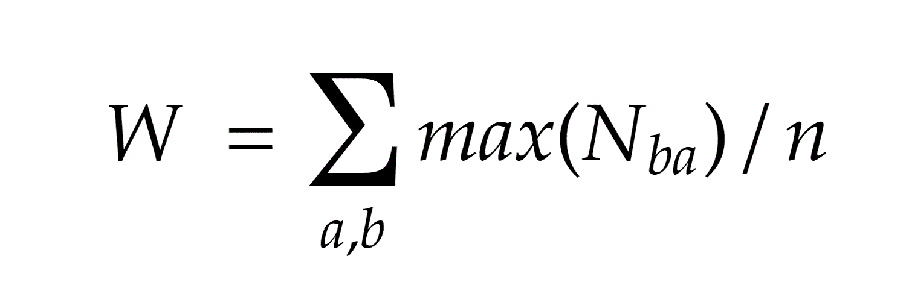*

*图 6:码头系数*

*…其中 *a* 是我们的目标列的可能值， *b* 是我们的从属列的可能值，N *ba* 是在两列中具有特定值对的记录数。换句话说，它是每个可能的 *a* 值的最频繁 *b* 值的总和。*

*当然，当 A 列暗示 B 列时，码头系数为 1。如果码头系数略低于 1，则表明除了特定数量的数据错误外，A 列暗示 B 列。如果该值较低，则建议在列之间进行一些关联，并且需要进行一些调整，以便很好地猜测是否存在实际的关系。*

*码头系数的一个优点是，它可以表示为熊猫(奇怪的心理图像，那里)的单个快速运行线，这对于我们的用例来说是理想的。*

```
*w = (df.groupby([cb,ca])[ca].count().max(level=0)).sum()/df.shape[0]*
```

*另一个优点是，它表达了一个对商业有意义的事实:“如果你假设 A 列暗示了 B 列，那么你会得到完全错误的答案(1-w)* 100%”。*

# *构建图表*

*选择了一个列对另一个列的依赖性的度量之后，我们继续构建一个推断的底层数据结构的图。我们需要图表，因为为了从蕴涵矩阵中提取知识，我们将使用图表技术来简化图表以便显示。*

## *构建蕴涵矩阵*

*我们通过测量每对列之间的蕴涵度来构建一个蕴涵矩阵。在我们枯燥的销售数据示例中，隐含矩阵恰好是:*

*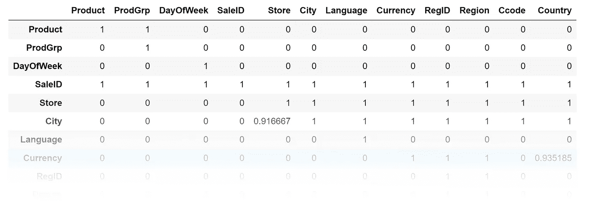*

*图 7:示例数据的隐含矩阵。我们看到“City”几乎意味着“Store ”,但不完全是。*

## *阈值*

*我们可以在这里决定一段关系有多脆弱才值得考虑。我们可以通过定义一个阈值来做到这一点，低于该阈值的两列之间的关系将被忽略。假设我们使用码头系数，以下阈值是一个很好的起点:*

*   *1 —如果我们正在寻找完全的关系完整性，并且我们假设数据没有损坏，则使用此选项。*
*   *0.98 —如果我们正在寻找完全的关系完整性，但我们预计底层关系结构可能会因数据质量问题而略微模糊，请使用此值。*
*   *0.85 —使用此值，我们将寻找不一定等于实际外键约束的强关系*

## *列移除*

*在构建矩阵之前，应该从数据集中删除某些类型的输入列。例如:*

*   *基数非常低的列可能没有用。基数为 1 的列是没有意义的，因为每隔一列就意味着它们。*
*   *看起来像数字度量的列，例如浮点数，可能不构成关系结构的一部分。*
*   *基数很高但很大的列可能是不构成关系结构一部分的文本值。*

*在现实生活中，这一步几乎总是需要的。在我们的示例数据中，为了简洁起见，已经删除了这样的列。*

## *清洗*

*可能需要填充 nan，纠正 Excel 中引入的空白问题，并进行其他清理。幸运的是，Python/pandas 是完成这类任务的强大工具。*

## *从矩阵中构建图形*

*我们的“蕴涵矩阵”有表示列之间单向关系强度的单元。这恰好意味着它也是一个图邻接矩阵(其中关系强度是列权重)。*

*因此，构建关系的图形表示很容易；我们挥动 python 魔棒，非常有用的 NetworkX 库一步就为我们构建了一个图形:*

```
*g = nx.from_numpy_matrix(mat,create_using=nx.DiGraph)*
```

*在现实生活中，我们必须在这里完成一些簿记任务——特别是，原始的 DataFrame 列名需要变成 NetworkX 图中的节点名。*

*现在，我们可以使用一系列技术(有些在 Python 中已经可用，有些没有)从图中提取决策输入，即知识。*

# *图表的分析和展示*

*在这一节中，我们考虑从我们的列关系图中呈现快速、可读的输出的步骤。*

## *主键*

*我们可以很容易地识别主键候选；它们是暗示其他列的列。*

*出于几个目的，我们想要删除主键，这样它们就不会因为它们的许多关系而使图形变得混乱。*

## *同义词*

*我们也可以很容易地识别同义词列组；如果两列互相暗示，则它们是同义词。这在现实生活中经常发生，因为如此多的文件包含像‘汽车序列号’、‘汽车牌照号’、‘汽车 ID’等我们期望一起变化的字段。虽然查找成对的同义词列很容易，但是识别大组同义词需要一点图论知识，而 NetworkX 可以很容易地为我们完成:*

```
*filter(lambda x:len(x)>1, nx.strongly_connected_components(g))*
```

*我们在这里做的是识别“强连接组件”，这是图中所有节点都具有双向关系的子图。如果它们有双向关系，它们就是同义词，所以每个结果子图都是一组同义词。然后我们过滤掉只有一个节点的子图。*

*我们简化图形的下一步是将所有同义词压缩在一起。为此，我们可以使用各种方法，但“最正确的”可能是使用极其强大的 PowerGraph 方法。这种方法将具有相似关系的节点压缩成单个节点。下图给出了一个想法:*

*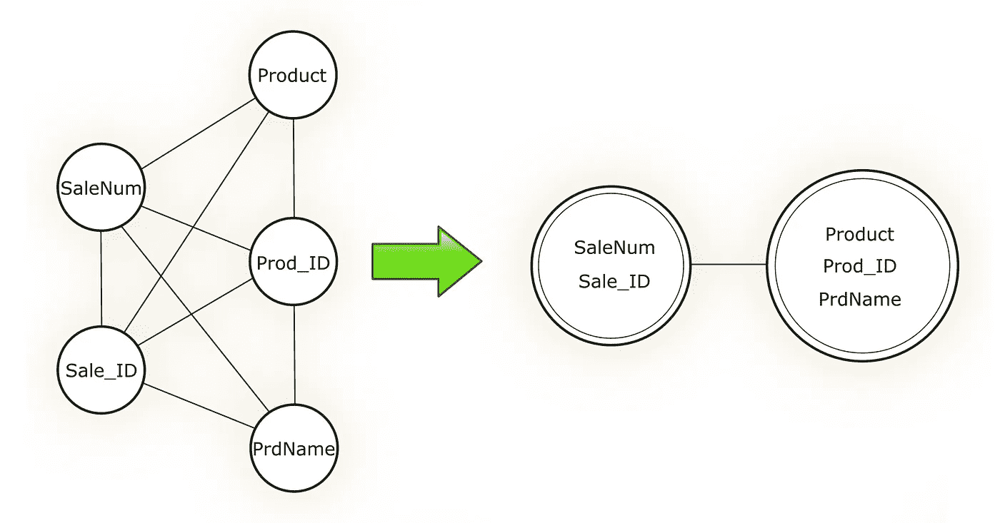*

*图 8:用于简化包含同义词的图的 PowerGraph 方法*

*对 PowerGraph 的全面讨论，以及[超图](https://en.wikipedia.org/wiki/Hypergraph)的迷人世界，超出了本文的范围。 [cola 项目](https://ialab.it.monash.edu/webcola/examples/powergraph.html)包含一个相当容易实现的 PowerGraph。在本文附带的我自己的代码中，我使用了一种更线性的方法；可惜 NetworkX 这次没有给我们一个预打包的算法。*

## *属性*

*找到键和压缩同义词后，我们现在可以寻找维度。事实上，剩下的每一个不是键的列都是一个维度(因为我们之前已经清除了所有的度量)，但是仅仅知道这一点并没有太大的用处。现实生活中，有趣的维度是有结构的；例如，在我们的例子中，我们期望“城市”有一个属性“国家”,可能还有一个属性“语言”和/或“货币”,即使我们不太确定它们是如何连接在一起的。*

*我们使用更方便的 NetworkX 算法来发现这些属性。*

```
*dimensions = list(nx.weakly_connected_components(r))*
```

*弱连通分量是由单向关系连接的子图；这正是我们所期望的每个维度，因为维度中的属性通过单向“是属性”关系连接。*

*当我们执行这一步时，我们发现了另一个简化的机会。我们的维度会以过多的关系结束。例如，如果真正的基础结构是“城市意味着国家，意味着地区”，那么隐含矩阵也将显示城市意味着地区，即使这对人类读者来说不是有用的信息。我们需要去除这些多余的关系，如下所示。*

*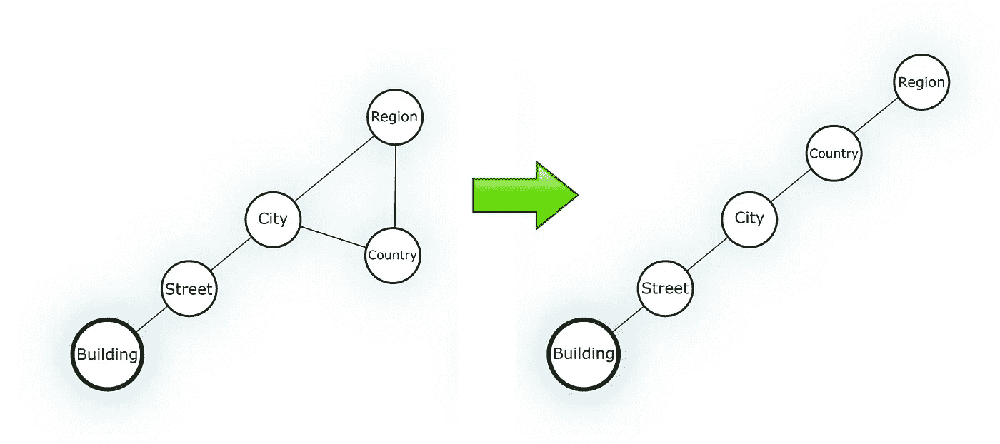*

*图 9:通过寻找生成树从维度中移除多余的关系*

*为此，我们可以使用另一种 NetworkX 算法来找到表示维度的子图的“最小生成树”。这是用尽可能少的边来表示图形，并删除不必要的关系。*

## *布局*

*最常见的可视化表示图形的方式是古老而重要的 [d3](https://d3js.org/) 项目称之为“[力定向布局](https://en.wikipedia.org/wiki/Force-directed_graph_drawing)”。如果您使用 NetworkX 和 matplotlib，这就是您将得到的结果(尽管 NetworkX 称之为“spring layout”)。这通常不是一种非常有用的方式来呈现对业务有意义的项目的小图表(我认为，这甚至也不是一种有用的方式来呈现一般的大多数图表)。默认情况下，NetworkX 和 matplotlib 为我们的示例图形生成了以下可视化效果:*

*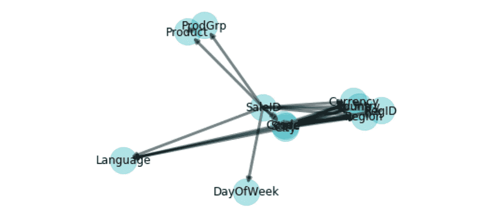*

*图 10:未简化图形的简单力导向布局的严酷结果*

*这对于检查代码是否工作以及我们是否有一个图表来说是不够的，但是对于演示或决策来说是没有用的。*

*在这种情况下，适当的布局选择应该是利用这样一个事实，即我们知道在中间有零个或多个主键，并且有零个或多个分支维度连接到它们。像 GraphViz [twopi](https://stackoverflow.com/questions/13749885/control-spacing-in-twopi-graphviz) 这样的放射状布局会更好，但仍然会引入视觉噪音——定位的变化看起来有意义，但却是布局逻辑而不是图形的产物。我实现了一个特定于任务的布局，将维度约束为从主键辐射出来的一条直线(带有分支)。*

# *结果*

*我们的最终输出如下所示:*

*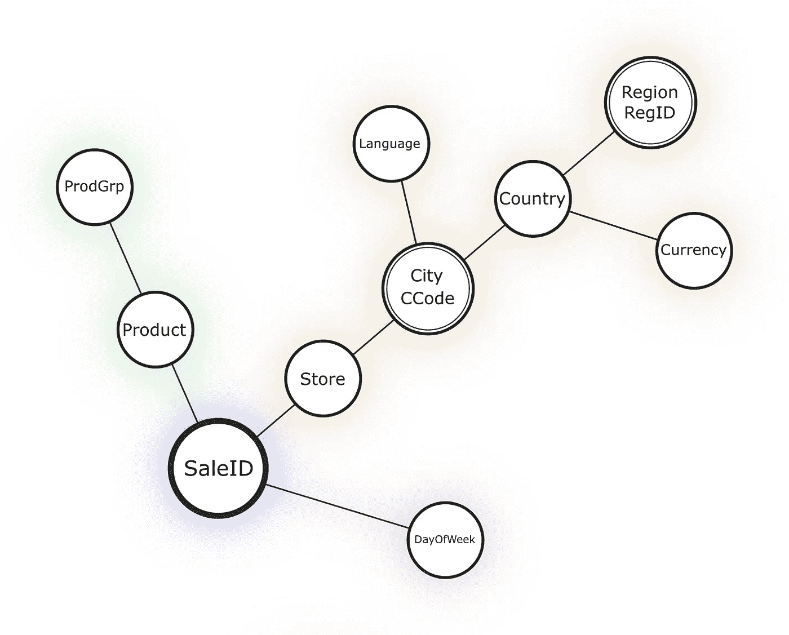*

*图 11:在 DataSmith 中生成的最终结果，显示了输入文件的维度结构*

*这与我们的预期相差不远，但对于所花的几秒钟来说，结果还不错(在 7000 行的输入文件上)。三个维度是可见的，我们可以看到，虽然货币是每个国家，语言是每个城市，这是我们可能不会采取其他方式。几个同义词已经确定并压缩在一起。该工具使用了适合显示维度信息的布局，并添加了一些微妙的颜色来帮助我们直观地对列进行分组。*

## *进一步的步骤*

*我在这里只讨论了基础知识。进一步的工作可能沿着以下路线进行:*

*   *跨多个输入文件关联数据。这涉及到在文件间寻找[关联 id](https://theburningmonk.com/2015/05/a-consistent-approach-to-track-correlation-ids-through-microservices/)，这是一项重要的任务，但适用于许多用例。*
*   *更好地使用贝叶斯逻辑。我认为码头系数对于基本上相关的数据是理想的，但是对于仅统计相关的数据，以及对于使测量而不是维度有意义的数据，将贝叶斯逻辑融入其中将是有趣的。*
*   *数据质量用例。这里描述的技术可以构成数据质量链中非常有用的一部分，特别是对于取代基于数据透视表的操作。*

*如果你有兴趣讨论这样的问题，请联系我们。如上所述，本文中显示的函数的后端代码可以根据请求获得(不保证)！这是一个为应用分析和可视化的最新进展提供巨大机会的领域，可以降低成本，让生活更轻松。*