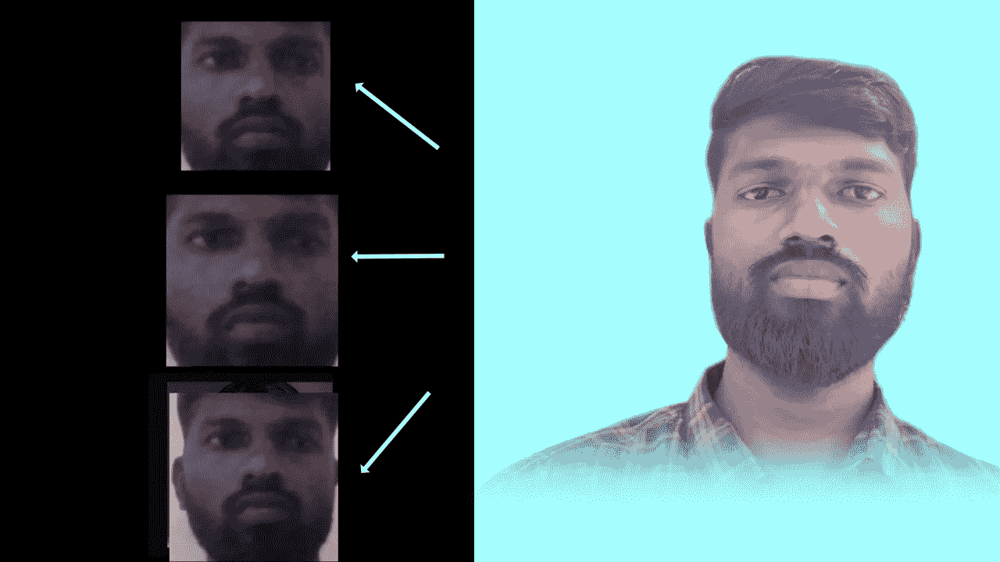

# 使用人脸通过计算机视觉自动锁定和解锁 Ubuntu！！！

> 原文：<https://towardsdatascience.com/automatically-locking-unlocking-ubuntu-with-computer-vision-using-a-human-face-db35cbe312f7?source=collection_archive---------38----------------------->

## 我用 OpenCV 和人脸识别库实现了一个自动人脸解锁技术。


Ubuntu Face

在玩代码之前，让我们看看你的 Ubuntu 机器上需要安装的库。

> **要求**

1.  **python 3.7**
2.  **OpenCV 4.1.0**
3.  **NumPy**
4.  **人脸识别**
5.  **sudo apt-get 安装 gnome 屏保**
6.  **sudo apt-get 安装 xdotool**

> 下面是三个 python 文件，刚好可以实现这一点！！！

> 1.face_generate.py
> 
> 2.face_train.py
> 
> 3.face_unlock.py

演示视频

# 1.face_generate.py



生成面

作为第一步，我们必须生成训练图像来训练模型。我已经创建了一个 python 文件来生成我们的面部图像。当你执行这个文件时，它会在命令行中询问你的名字，然后系统会用给定的名字创建一个文件夹。

```
number=0;
frame_count=0
detector = dlib.get_frontal_face_detector()
print("enter the person name")
name = input()
folder_name="dataset/"+nameif os.path.exists(folder_name):
    print ("Folder exist")
else:
 os.mkdir(folder_name)
```

之后，我们需要使用 OpenCV 库通过网络摄像头读取我们的脸，并将其存储在相应的文件夹中，在保存到该文件夹之前，我们应该调整我们的图像大小。

```
image = imutils.resize(image, width=500)
  gray = cv2.cvtColor(image, cv2.COLOR_BGR2GRAY)
   # detect faces in the grayscale image
  rects = detector(gray, 1)
  # loop over the face detections
  for (i, rect) in enumerate(rects):
   # determine the facial landmarks for the face region, then   
   (x, y, w, h) = face_utils.rect_to_bb(rect)
   #print rect.dtype
   cro=image[y: y + h, x: x + w]out_image = cv2.resize(cro,(108,108))

   fram= os.path.join(folder_name+"/",str(number)+ "." + "jpg")
   number+=1  
   cv2.imwrite(fram,out_image)  
   cv2.rectangle(image, (x, y), (x + w, y + h), (0, 255, 0), 2)   
  frame_count+=1
```

这将需要 50 张人脸图像来训练模型，你可以根据自己的需要改变图像的数量。

# 2.face_train.py

该文件将读取由 face_genrate.py 文件生成的每个人脸图像。完成后，我们需要将它们传递给 load_image_file 方法，以获取图像的面部位置。

```
face = face_recognition.load_image_file("dataset/" + person + "/" + person_img)
# location is in css order - top, right, bottom, left
height, width, _ = face.shape
face_location = (0, width, height, 0)
```

在训练我们的人脸模型之前，我们应该对我们的图像进行编码，所以我使用了 face_encoding 方法。此外，我们应该将我们的名字存储在一个数组中，以便用 k-最近邻算法进行训练。

```
face_enc = face_recognition.face_encodings(face, known_face_locations=[face_location])face_enc = np.array(face_enc)
face_enc = face_enc.flatten()

# Add face encoding for current image with corresponding label (name) to the training data
encodings.append(face_enc)
names.append(person)
```

Sci-kit 学习库是机器学习算法的流行库。我们使用了 sci-kit 学习库提供的 KNeighborsClassifier 算法。

```
knn_clf = neighbors.KNeighborsClassifier(n_neighbors=n_neighbors,         algorithm=knn_algo, weights='distance')
knn_clf.fit(encodings,names)
```

最后，我们应该使用 [pickle 库](https://docs.python.org/3/library/pickle.html)保存我们的模型文件。

```
# Save the trained KNN classifier
if model_save_path is not None:
    with open(model_save_path, 'wb') as f:
        pickle.dump(knn_clf, f)return knn_clf
```

# 3.face_unlock.py

这个 python 文件将根据训练好的图像锁定和解锁 ubuntu 系统。让我们首先使用 OpenCV 库通过网络摄像头捕捉我们的脸。使用 read 方法后，我们可以将人脸图像作为帧来读取。

```
camera = cv2.VideoCapture(0)
(grabbed, image1) = camera.read()
```

我们必须从图像中检测人脸的位置，因此我使用了 face_location 方法。得到人脸位置后，我们应该传递给 face_encodings 方法对人脸图像进行编码，以便进行下一步处理。

```
image = image1[:, :, ::-1]X_face_locations = face_recognition.face_locations(image)# If no faces are found in the image, return an empty result.
if len(X_face_locations) != 0:

# Find encodings for faces in the test iamge
faces_encodings = face_recognition.face_encodings(image,   known_face_locations=X_face_locations)
```

在预测之前，应该使用 knn 模型来找到给定人脸的最佳匹配。下面是验证脸的预测方法。它将返回名称和顶部、左侧、右侧和底部变量。

```
closest_distances = knn_clf.kneighbors(faces_encodings,   n_neighbors=1)are_matches = [closest_distances[0][i][0] <= 0.4 for i in range(len(X_face_locations))]predictions = [(pred, loc) if rec else ("unknown", loc) for pred, loc, rec in zip(knn_clf.predict(faces_encodings), X_face_locations, are_matches)]
```

使用 [gnome shell](https://en.wikipedia.org/wiki/GNOME_Screensaver) 命令锁定和解锁 ubuntu 系统。

```
if name not in "unknown":
    os.popen('gnome-screensaver-command -d && xdotool key Return')
else
    os.popen('gnome-screensaver-command -a')
```

如果用户的面部未知或未被检测到，系统将保持锁定状态。

## 结论

就这样，在上面列出的三个 python 文件的帮助下，我们已经使用人脸成功测试了 ubuntu 的自动锁定和解锁技术。你可以在这里得到完整的源代码

> 如果您需要任何帮助或协助，请联系我 [LinkedIn](https://www.linkedin.com/in/bala-venkatesh-67964247/) 和 [Twitter](https://twitter.com/balavenkatesh22) 。