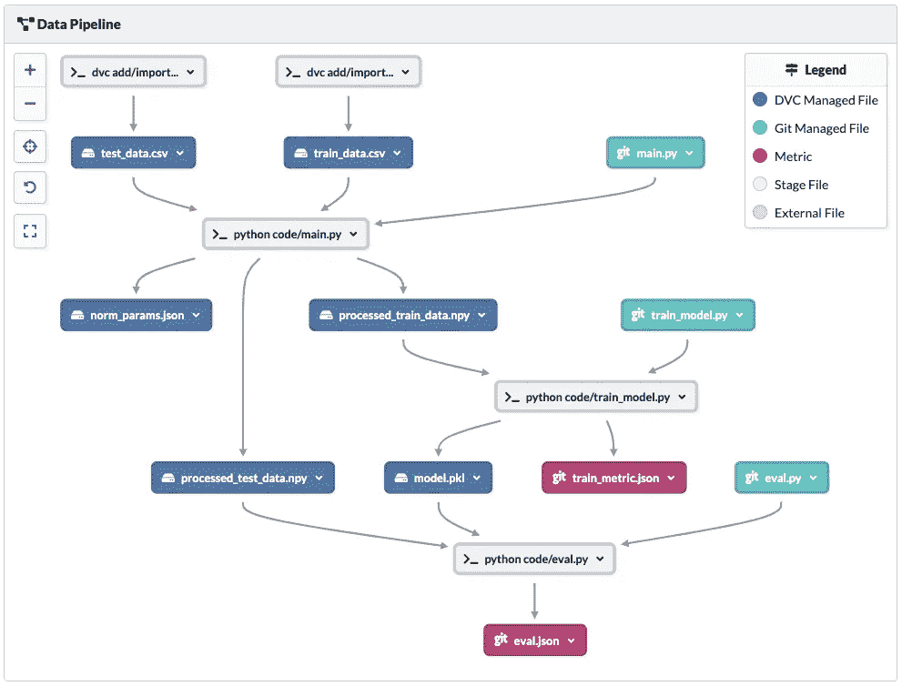
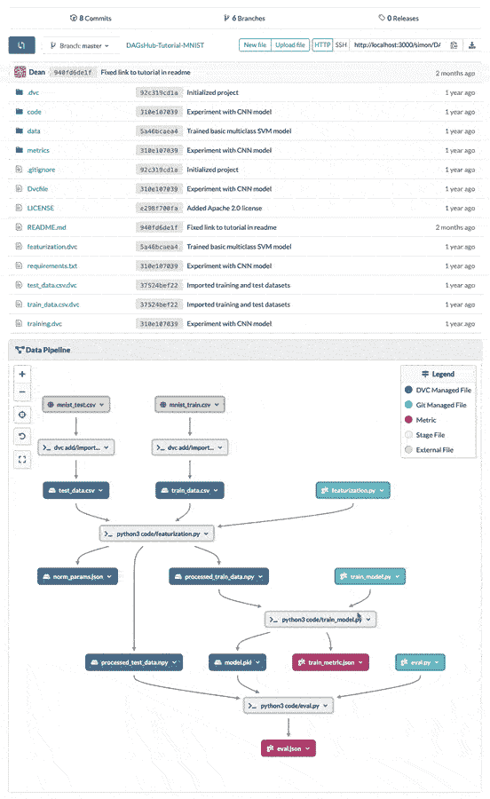

# 自动将您的项目从 DVC≤ 0.94 迁移到 DVC 1.x

> 原文：<https://towardsdatascience.com/automatically-migrate-your-project-from-dvc-0-94-to-dvc-1-x-416a5b9e837b?source=collection_archive---------77----------------------->

## 将您的项目从 DVC ≤ 0.94 迁移到 DVC 1.x 可能是一个非常复杂的过程。这里有一个简单的方法。

# DVC 1.0 已经发布了！

DVC 1.0 已经发布，并带来了一整套期待已久的功能。如果你对新功能的完整列表感兴趣，你应该看看 DVC 官方发布的。其中一个主要的变化是一个单独的`dvc.yaml`文件，它存储了描述管道的所有必要信息。这在充当 git 存储库中缓存文件占位符的`.dvc`文件和调用`dvc repro`时要运行的管道的描述之间创建了一个清晰的分离。

这次升级的一个注意事项是，将包含大量`.dvc`文件的存储库迁移到新的格式是一个相当复杂的过程。在这篇文章中，我将带你完成从 DVC ≤ 0.94 到 DVC 1 的迁移过程。x 使用一个**单一自动化脚本**，然后演示一种方法来检查您的迁移是否成功。

## 迁移一个装满。dvc 文件到新 DVC 1。X YAML 格式

## 设置

1.  首先，在终端中打开您的存储库目录。

```
cd path/to/your/repository
```

2.我强烈建议创建一个新的分支，专门用于这个迁移，这对于以后比较新旧配置也很有用

```
git checkout -b dvc-1-migration
```

3.升级至最新的 DVC 1。x 版本(现在是时候了)。

```
**# Homebrew (Mac)** brew upgrade dvc**# Chocolatery (Windows)** choco upgrade dvc**# Conda** conda update -c conda-forge dvc**# pip** pip install dvc -U
```

# 运行迁移脚本

## 捷径——不要告诉我细节！

我建议您继续阅读，看看脚本在做什么，但是如果您只是想运行脚本，您可以在您的目录中执行以下操作:

```
curl 'https://raw.githubusercontent.com/DAGsHub/Dvc1Migration/master/migrator.py' | python -
```

## 漫漫长路——我想明白！

在 DVC ≤ 0.94 阶段以包含其细节的文件命名— `Dvcfile`或`<name>.dvc`。从 DVC 1 开始，您定义了阶段的名称，而不是包含它的文件的名称。

由 DVC 的合作者之一提供的这个 python 脚本正在将一个单阶段文件转换成`dvc.yaml`和`dvc.lock`中的一个阶段。它将原始的`.dvc`文件(或`Dvcfile`)和应该出现在新管道中的 stage 的名称作为参数。这意味着你必须手动运行`python migrator.py <file.dvc> <stage_name>`无数次。当涉及到具有许多阶段的管道时，这可能会变得很麻烦。此外，一些`.dvc`文件并不代表管道中的阶段，而只是跟踪文件缓存信息。这意味着它们是由 DVC 在运行命令`dvc add`或`dvc import`时创建的。这些不应该作为阶段出现在您的`dvc.yaml`文件中。

我冒昧地修改了脚本，这样它就可以移植一个包含我想要的任意多的`.dvc`文件的整个项目。简而言之，它将搜索带有“cmd”键的`.dvc`文件，并将它们的内容添加为新格式的 stage。例如，如果您当前有一个名为`train.dvc`的阶段文件，脚本将假设您想要调用阶段`train`。您可以根据自己的喜好随意改变这种行为！

你可以这样下载:

```
curl 'https://raw.githubusercontent.com/DAGsHub/Dvc1Migration/master/migrator.py' -O
```

所有原始的`.dvc`文件将被备份为`<old_file>.dvc.bak`，并且在您的工作目录的根目录下将创建两个新文件

1.  [dvc.yaml](https://dvc.org/doc/user-guide/dvc-files-and-directories#dvcyaml-file)
2.  [dvc.lock](https://dvc.org/doc/user-guide/dvc-files-and-directories#dvclock-file)

要运行命令，请执行以下操作:

```
python migrator.py
```

输出应该如下所示:

```
Creating 'dvc.yaml'
Adding stage 'featurization' in 'dvc.yaml'
Generating lock file 'dvc.lock'
Adding stage 'training' in 'dvc.yaml'
Updating lock file 'dvc.lock'
Adding stage 'Dvcfile' in 'dvc.yaml'
Updating lock file 'dvc.lock'
...
```

如果你不认识这种模式，请在下面的评论中描述你的问题，我会尽我所能来看看。

否则，通过运行以下命令开始跟踪新生成的文件:

```
git stage -u .
git add dvc.yaml dvc.lock
git commit -m "migration to dvc 1"
git push -u origin dvc-1-migration
```

这将:

1.  在 git 中将旧的`.dvc`文件标记为已删除，同时保持工作目录中的备份文件不被跟踪
2.  将新的`dvc.yaml`和`dvc.lock`添加到 git 树中
3.  将分支`dvc-1-migration`提交并推送到您的`origin`遥控器

## 差不多完成了

就这样，您现在已经将您的项目迁移到 DVC 1 号了！


由[本杰明·戴维斯](https://unsplash.com/@bendavisual?utm_source=medium&utm_medium=referral)在 [Unsplash](https://unsplash.com?utm_source=medium&utm_medium=referral) 拍摄的照片

没那么快！您希望确保您的管道也这样做，并且您的所有数据文件都被正确地跟踪。

# 比较您的管道

**检查 YAML 文件** 一个选项是手动检查创建的文件，并验证所有阶段、部门、输出和指标都存在，并且运行正确的命令。或者，您可以…

**直观地比较管道图** 理想情况下，您会希望轻松地查看新旧管道，直观地描述两个版本的差异。 [DAGsHub](https://dagshub.com/?utm_source=medium&utm_medium=blog&utm_campaign=migrating-to-dvc-1) 是一个致力于数据科学社区的平台，可以为您做到这一点，它支持 DVC 1 和更老的版本(也有其他很酷的功能)。欢迎你使用任何你喜欢的其他工具来可视化这些差异，但实际上我是有偏见的；-)



通过将您现有的存储库连接到 DAGsHub，您可以通过切换分支将您以前的管道与您在分支`dvc-1-migration`中创建的管道进行比较。



## 注意

计算 DVC 1 管道图时，DAGsHub 执行的计算与原始计算略有不同。dvc 文件。这可能会导致节点以不同的顺序出现。除此之外，节点和边应该还是一样的。

# 谢谢大家！

感谢你阅读了这一点，我希望你觉得有用。如果您有任何建议或反馈，请在下面留下评论，或加入 [DAGsHub discord channel](https://discord.com/invite/9gU36Y6) 。