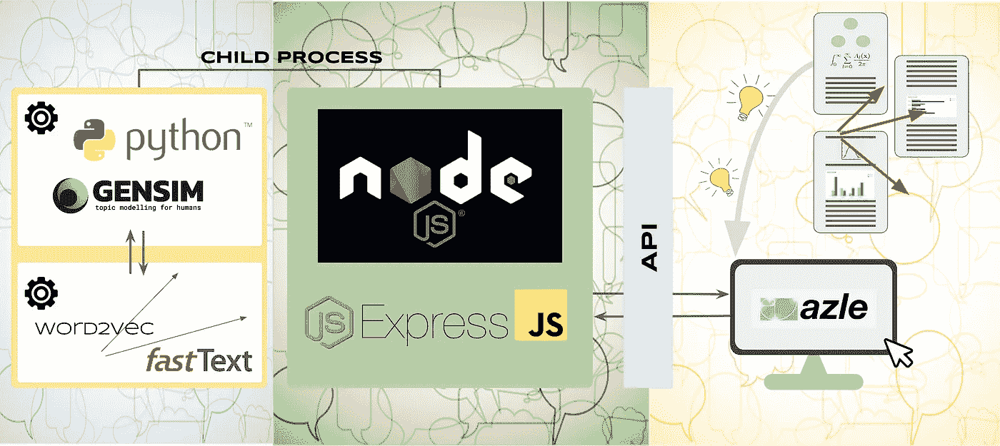
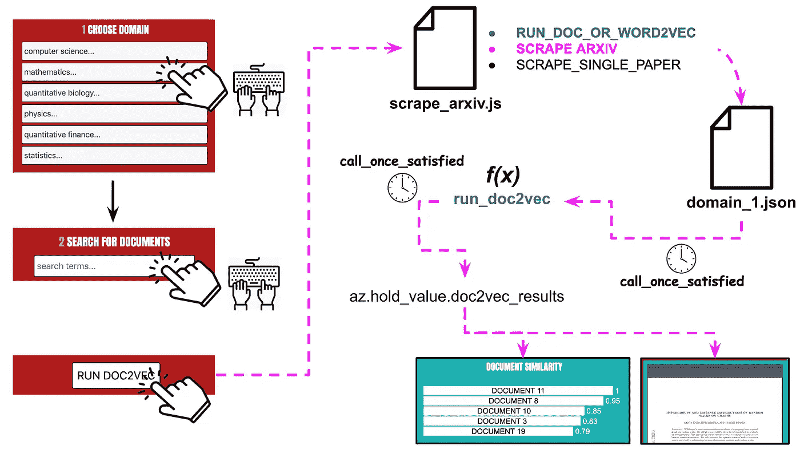
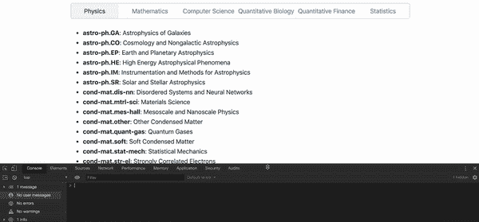
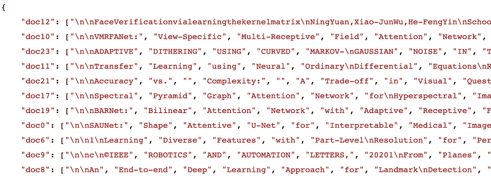
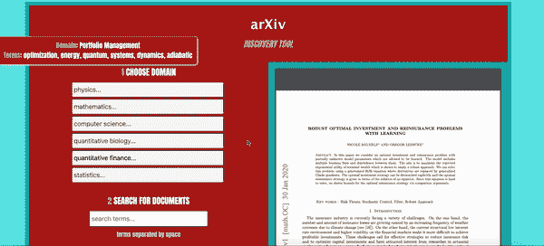
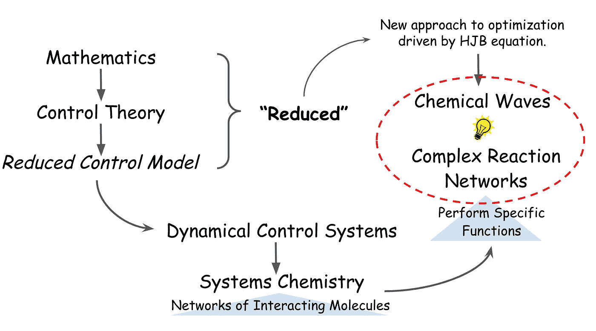

# 自动化类比:通过人工智能识别跨领域的意义

> 原文：<https://towardsdatascience.com/automating-analogy-using-ai-to-help-researchers-make-discoveries-1ca04e9b620?source=collection_archive---------25----------------------->

## 通过揭示类比联系促进科学发现



# 介绍

在最近的《自然》杂志文章中，研究人员使用[单词嵌入](https://en.wikipedia.org/wiki/Word_embedding)来发现材料科学的候选化合物。其中一名作者 Vahe Tshitoyan 也发表了一篇关于[介质](/using-unsupervised-machine-learning-to-uncover-hidden-scientific-knowledge-6a3689e1c78d)的综述。具体来说，他们表明新的热电材料可以通过挖掘科学期刊来发现。

我认为这是著名的[单词嵌入](https://en.wikipedia.org/wiki/Word_embedding)技术的一个有趣的应用。使用单词嵌入，我们希望为文档中的重要单词创建矢量表示。一旦矢量化，这些单词就可以用于线性代数中常见的向量运算。因此，我们可以通过*加*和*减*单词来找到符合我们直觉的结果。常见的例子是`“king” minus “queen” approximately equals “man” minus “woman”`。

矢量化的单词还允许我们匹配在某种潜在意义上与相似的单词。例如，*父亲*和*母亲*会比*鸡*和*钱*彼此更亲近。这意味着单词向量可以用来捕获复杂的概念*，而无需显式编码这些概念*。

我认为这将是一个很好的应用。一个人们可以用来搜索与他们的研究相关的术语的工具。该工具将返回最近在各种领域发表的文章，这些文章包含与用户搜索词相似的词。

重要的是，相似性是“类比驱动”的，因为这种联系不是偶然观察就能明显看出的。这个词在其他文章中找不到，相反，其他文章只是在类似的背景下讨论一些事情。在上面提到的《自然》杂志的文章中，新的热电材料可能会被发现，因为其他论文正在以类似于人们讨论热电材料的方式讨论一些事情；*但是其他文章里没有提到热电这个词*。

为了理解单词嵌入在这个应用中做了什么，我们必须掌握它们如何与**类比**的概念相关联。我写过关于类比的力量的文章，before⁵，我强烈推荐 Douglas Hofstadter 的作品。

对于单词向量，我们看到线性行为，例如`“woman is to queen as man is to king”`。这些已经被证明是类比 phenomenon⁴.的基础

> 在**参考文献 4** 中，他们表明[逐点互信息](https://en.wikipedia.org/wiki/Pointwise_mutual_information) (PMI)矩阵的因式分解导致嵌入中的线性相似结构。从概率的角度来看，当词集在所谓的上下文词上引起等价分布时，它们会相互释义。作者通过表明“释义”对应于通过单词转换的类比，将这一点扩展到类比。
> 
> 深入研究数学细节超出了本文的范围。请问我是否想更详细地讨论类比背后的数学。我鼓励在 Twitter 上进行这些对话，这样其他人也能受益。

“语境”是影响其含义的语句前后的词语。当我们在两个不同的领域之间进行类比时，我们认识到了一些潜在的相似性。

> “从一个人和什么样的人交往，你就可以知道他是什么样的人”——弗斯

这就是一直以来的发现。人类通过意识到看似不同的领域之间的潜在联系，将它们联系起来。只有通过阅读其他作者的作品才能建立这种联系。

但是研究人员阅读自己领域之外的论文的可能性有多大呢？在阅读自己领域的论文、教学和撰写资助之间，不太可能。

> 研究人员多长时间审查一次他们领域之外的论文？

这意味着研究者的工作和其他出版物之间潜在联系的财富在很大程度上还没有被开发。如果人工智能可以提供一种方法来自动发现各种领域之间的类比联系，这将非常有用。将这种能力转化为产品可以帮助学术和独立研究人员做出他们可能会错过的发现。

以此为动机，让我们拼凑一个产品，帮助研究人员在他们的工作和许多不同的 STEM 领域之间建立联系。

> **注意**:我并不声称本文中的应用程序是真正的发现。充其量，该应用程序可能会根据研究人员领域之外的上下文相似的领域，为他们指出一个有趣的方向。参见最后的**错误叙述**部分。

最终的应用程序如下所示:

我将介绍用于创建应用程序的高级方法。我使用 gensim 库提供的 Doc2Vec 和 Word2Vec。完整的应用程序可以在 [Github](https://github.com/sean-mcclure/word2vec_arxiv) 上获得。读者可以克隆项目来使用和/或修改。如果需要任何帮助，请联系我。

让我们开始吧。

# 应用

## 流程:第 1 部分

应用程序的后端使用 Node/Express web 服务来实现后端和前端之间的通信。**图 1** 显示了与后端处理相关的**用户流**。



**图 1** 前后端关系。Node 处理 arXiv 抓取，而 Python 处理所有其他与 Doc 和 Word 向量相关的函数。

用户首先从**下拉框**中选择 6 个域中的一个。这是 6 个常见的[词干](https://en.wikipedia.org/wiki/Science,_technology,_engineering,_and_mathematics)字段。一旦他们选择了他们的领域(和一个子领域),他们将被引导填写大量的**搜索词**。在参考文献 1 的例子中，这就是“热电”。

用户可以列出多个搜索词，用空格隔开。一旦他们列出了他们的术语，他们**运行 DOC2VEC** ，此时我们的后端检索所有 6 个域中最近发布的 arXiv 文章，为每篇文章创建文档向量，并根据与用户搜索术语的相关性返回前 5 篇文章。

此时，用户可以查看返回的文章，寻找有趣的对话。同样，这种想法是这些返回的文章可能在与用户的搜索词经常被讨论的相似的上下文中讨论工作(这些返回的文章中的词是“*保持与用户的搜索词相同的公司*”)。

让我们通过从 arXiv 获取主题来开始支持这个用户流。

# 获取主题

我们需要在[arXiv.org](https://arxiv.org/)获得所有**主题**。由于 arXiv 不太可能频繁添加新主题，我将在浏览器控制台中使用客户端 JavaScript，而不是设置后端抓取。

我们可以查看 arXiv 的[分析页面](http://arxitics.com/help/categories)并抓取那里的标题和命名代码。我写了下面的 JavaScript 来收集需要的内容:

我们在**浏览器控制台**中为 6 个域中的每一个运行这个。通过单击页面顶部的浅蓝色标题可以访问每个域:



为每个域这样做提供了 6 个 JSON 文件。下图显示了预期结构的一个片段:

我们可以使用这些来填充我们的下拉列表，并帮助我们抓取实际的文章。我将这些添加到应用程序中的**数据文件夹**:

```
├── **data** └── physics.json
    └── mathematics.json
    └── computer_science.json
    └── quant_bio.json
    └── quant_fin.json
    └── stat.json
    └── words.txt
```

我们可以通过过滤掉任何可能出现在 arXiv 论文中的非英语单词/符号来提高结果的质量。我将使用这个 50 个英语单词的列表:

[http://www.mieliestronk.com/corncob_lowercase.txt](http://www.mieliestronk.com/corncob_lowercase.txt)

我会将这些文字复制并粘贴到一个名为 **word.txt** 的文件中，并将其放入数据文件夹。这些将在我们运行 Word2Vec 时使用。

# 刮擦 arXiv

当用户点击 **RUN DOC2VEC** 时，我们首先需要抓取 arXiv 上的文章。这意味着获取所选领域的每篇文章并创建文档向量。我们可以通过使用 Node.js 包 [**cheerio**](https://github.com/cheeriojs/cheerio) 得到每篇文章的链接。这个代码在`scrape_arxiv.js`文件中。

我们以`.list-identifier`类为目标，用`href`来检索每个元素的 URL。这保存了一个名为 **domain_1.json** 的文件，其中保存了所有 25 个文档的所有单词，如图**图 2** 所示。



**图 2** 每个文档的(arXiv 文章)单词作为一个值保存在 domain_1.json 文件中。

这将由`Doc2Vec`函数读取(并使用 words.txt 进行清理),以便创建文档向量并找到(推断出)与用户搜索词最匹配的文档。我们现在就写吧。

# Doc2Vec

我们使用 gensim 的`Doc2Vec`方法，该方法期望从我们读入的 JSON 中得到一个`dict`对象作为 **domain_1.json** 。

您可以在 GitHub 上检查项目，看看我们的 API 如何将这些结果返回到前端。现在，用户已经返回了相关文档，我们可以支持用户流的第二部分。

## 流程:第 2 部分

在第 1 部分中，用户能够查看返回的文章。这使他们能够找到与自己的工作相关的潜在有用的讨论。然而，阅读整篇文章仍然很费时间，尤其是当所建立的“联系”可能在很大程度上是多余的时候。为了帮助确定这篇文章是否值得一读，我们可以尝试*发现这篇文章中的哪些词与用户的搜索词*最相似。如果这些返回的单词中有任何一个与用户相关，那么这篇文章可能值得进一步研究。

在第 2 部分中，我们抓取用户选择的文章(从返回的 5 篇文章中)，使用 gensim 的 **fastText** (最初来自脸书)生成单词向量，并从第 1 部分中推断出与用户的搜索词最接近的单词。如图**图 3** 所示支持该流程。


**图 3** 用户可以运行 Word2Vec 来生成单词向量，并返回与搜索词最匹配的单词。这有助于用户决定所选文章是否值得进一步探索。

现在让我们创建 **Word2Vec** 函数。

# Word2Vec

既然我们已经有了与用户搜索词最匹配的文档，我们想在一张纸上运行 Word2Vec。用户选择的任何论文都将通过 fastText 由 gensim 的 Word2Vec 方法进行处理，以找到最相关的单词。

与第 1 部分中返回的文档一样，您可以查看应用程序的代码库，看看这些结果是如何返回到前端的。

# 运行应用程序

让我们打开应用程序，运行几个实验，看看我们有什么发现。

**从 GitHub 克隆**应用程序:

```
git clone [https://github.com/sean-mcclure/word2vec_arxiv.git](https://github.com/sean-mcclure/word2vec_arxiv.git)
```

进入目录并**启动 REST API** :

```
node api/scrape_arxiv.js
```

从终端启动一个简单的 web 服务器:

```
python3 -m http.server
```

最后，将您的浏览器指向:

`[**http://localhost:8000/app/**](http://localhost:8000/app/)`

您应该会看到应用程序的启动状态:


# 结果

让我们做些试验。我们能从我们选择的一组搜索词中找到有趣的新研究思路吗？这个想法是为了看看单词嵌入是否与我们的直觉一致。

也许我想为我的**分子动力学**研究发现一种新的优化方法。我对量化金融或其子领域投资组合管理一无所知，但也许这一领域的人们正在尝试与我的工作类似的东西，尽管他们没有从事任何与物理或化学直接相关的工作。

让我们试试:

*   **领域**:量化金融>投资组合管理
*   **搜索词**:最优化、能源、量子、系统、动力学、绝热

我从量化金融下拉列表中选择投资组合管理，并填写我的 6 个搜索词。

> 用户可以列出任意数量的搜索词，甚至只有一个。

第**篇论文** **返回**按相关程度排列:

1.  带学习的鲁棒最优投资和再保险问题
2.  具有路径依赖劳动收入的最优投资组合选择:无限地平线情形
3.  半度量投资组合优化:一种减少同时资产冲击的新算法
4.  使用自动编码器重建比率检测资产共同运动的变化
5.  高维夏普比率:样本外最大值、约束最大值和最优投资组合选择的案例


我可以**审核**申请中显示的文件:



这些论文肯定是在谈论最优化，并且似乎提到了与动力学相关的东西。让我们在我们的顶级论文上运行 **Word2Vec** 来**聚焦与我们的搜索词相关的具体讨论**:


*约简*、*顺序*、*策略*和*过滤*这几个词或许值得一查。同样，这些是 Word2Vec 返回的单词，表明它们与我的搜索词相关的一些讨论有关联。让我们仔细检查一下这张纸，看看是否是这样。

**简化**一词是指论文使用了所谓的*简化控制模型*。这来自于**控制理论**，它是数学的一个子领域，研究影响动力系统的行为。动力系统与**系统化学**有联系，系统化学是研究相互作用分子网络及其涌现特性的科学。系统化学的一个主要目标是揭示复杂的反应网络，其中分子不断消耗能量来执行特定的功能。

经济模型处理多条业务线以及它们之间的依赖关系。他们试图通过创建一个通过优化学习到的参数模型来最大化财富的效用。这种优化是由[汉密尔顿-雅可比-贝尔曼方程](https://en.wikipedia.org/wiki/Hamilton%E2%80%93Jacobi%E2%80%93Bellman_equation) (HJB)驱动的，其中导数由广义克拉克梯度代替。

HJB 方程已被用于研究“化学波”，即信息在整个反应扩散系统中快速传播，以同步和协调生物事件。

通过在网上做一些研究，我们已经能够在单词“ **reduced** ”和我们对**分子动力学**的兴趣之间建立联系。这是因为出现在我们最相关的文档中的单词 vector“reduced”与我们的搜索词“很接近”；*优化*、*能量*、*量子*、*系统*、*动力学*、*绝热*。深入研究后，我们很快意识到“减少”这个词确实是在优化的**上下文**中讨论的。这似乎是我们的词向量捕捉有用概念*而没有显式编码这些概念*的一个例子。



记住，我们最相关的文档也是通过使用嵌入发现的，通过*文档向量*。通过将 Doc2Vec 和 Word2Vec 放在一起，我们可以在不同的研究领域之间建立有趣和相关的联系。

这就是使用**自动类比**在我们可能永远不会想到的领域之间建立联系的力量。这是一个很好的例子，通过使用以类似方式运行的“智能”机器，增强了人们已经有的工作方式。

**但是**像一份经济学期刊的作者所使用的那样，探索使用与克拉克梯度相匹配的 HJB 方程来学习应用于复杂化学系统的优化参数，真的值得吗？也许吧。

或者也许我从一开始就知道(相信)这是不可行的。但是，在自动类比的鼓励下，沿着这种道路走下去不会有太大的害处。我只尝试了第一篇相关论文的第一个词，一个领域的第一个词，在我尝试的第一个词干领域。

至少这个应用程序让我重新考虑我目前的研究方法，看看其他人在做什么。这可能会引发新的见解，或者迫使我寻找不同的道路。它可能会让我想起我在另一本杂志上读过的东西，促使我重温某些概念。在领域之间建立松散的联系有助于我们远离短视的想法。

# 虚假叙述？

每当我们“发现”一些有趣的东西时，如果不提出一个困扰人类的基本问题，那将是我的失职。很容易看出我们想要什么，以为有联系，但实际上没有。我们必须小心，不要对看似有趣，但实际上不相关或不切实际的东西赋予太多的权重。

因此，当我们建立联系时，我们应该对任何相关的发现保持怀疑。科学的美妙之处在于(如果做得恰当的话),任何新的想法都必须经过严格的可证伪性检验，并证明它确实站得住脚。

愉快的探索。

# 参考

1.  [无监督单词嵌入从材料科学文献中捕获潜在知识](https://www.nature.com/articles/s41586-019-1335-8)
2.  [利用无监督机器学习揭开隐藏的科学知识](/using-unsupervised-machine-learning-to-uncover-hidden-scientific-knowledge-6a3689e1c78d)
3.  [Word2Vec 和 FastText Word 嵌入 Gensim](/word-embedding-with-word2vec-and-fasttext-a209c1d3e12c)
4.  [类比解释:理解单词嵌入](https://arxiv.org/pdf/1901.09813.pdf)
5.  [人类智能、计算和通用机器](/human-intelligence-computation-and-the-universal-machine-f8e78c93355f)