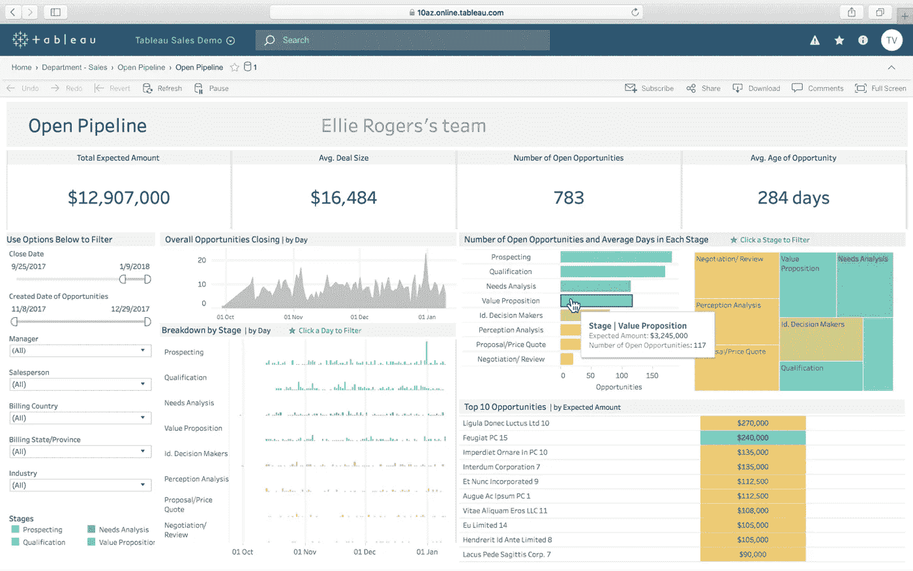
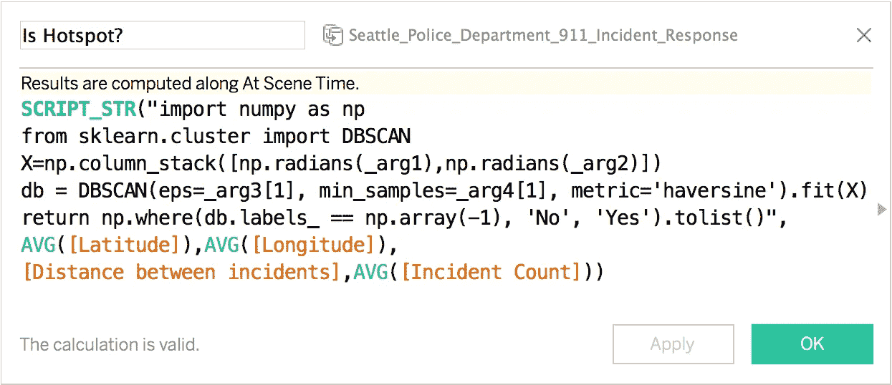
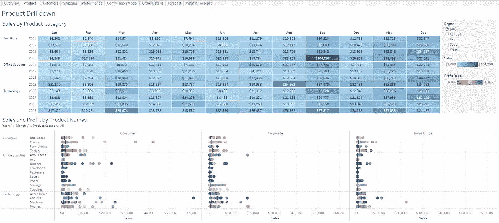
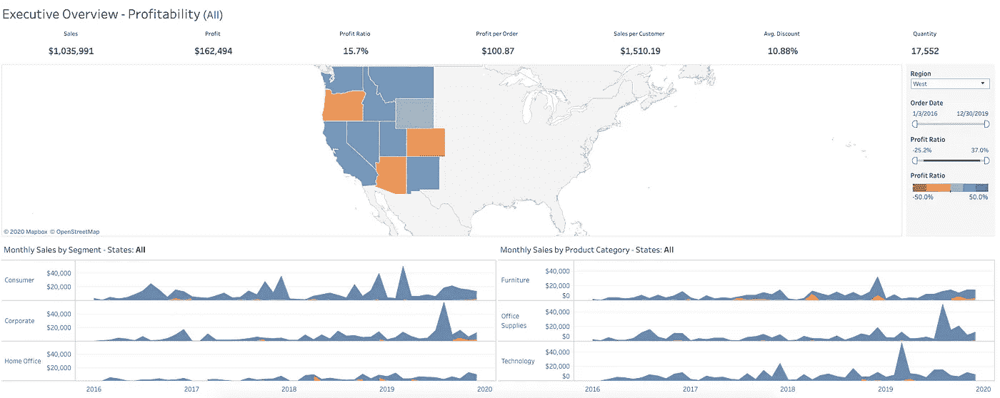

# Tableau 中的自动化分析— Python 和 Tabcmd

> 原文：<https://towardsdatascience.com/automating-analytics-in-tableau-5516e1e7134c?source=collection_archive---------18----------------------->

## 概述了如何使用 Python 来自动洞察 Tableau，并介绍了 Tableau 命令行实用程序 Tabcmd。

# **简介**

Tableau 连续七年被 [Gartner](https://www.tableau.com/about/blog/2019/2/tableau-7-years-leader-2019-gartner-magic-quadrant-101644) 评为分析和商业智能平台的领先工具。几乎每个行业中各种形状和规模的公司的 BI/数据团队都开发了仪表板，以便在整个组织中有效地交流关键业务指标。

使用 Tableau 的一个主要优点(这一点经常被忽略)是，它公开了一个公共 API 来以编程方式处理几乎所有可以在应用程序 GUI 上执行的任务，包括管理。

这就是 Python 的用武之地。大量库的脚本功能和支持使其成为在 BI 工作流中处理端到端流程自动化的流行选择。



来自 tableau.com/products/viewer[的](http://tableau.com/products/viewer)

> **在您继续之前…**
> 
> *为了有效地使用集成，Tableau 工作簿应在以下位置可用:*
> 
> 1.[**Tableau Server**](https://www.tableau.com/products/server)允许您在组织服务器上或使用云服务提供商托管内部工作簿和数据源。
> 
> **2。**[**Tableau Online**](https://www.tableau.com/products/cloud-bi)Tableau 管理服务器基础设施，您可以通过它们托管您的工作簿，只需支付一些额外费用。
> 
> *通过上述方法之一将工作簿托管在 Tableau 服务器上通常是一种好的做法——尤其是如果您的仪表板经常被多方查看，并且涉及定期数据刷新(每天/每小时)。*

> Tableau Online 有一个 14 天的免费试用期，默认情况下会加载一些示例工作簿。您可以[创建一个免费试用帐户](https://www.tableau.com/products/online/request-trial)来试用下面列出的一些测试集成和代码片段。

创建 tableau 在线账户后，保存*用户名、密码、Tableau 服务器地址*和*网站名称*的凭证。一台 tableau 服务器可以有多个站点，每个站点都承载一组工作簿和数据源。

# 条条大路通罗马

将 Python 与 Tableau Server 集成有多种方式，每种方式都基于不同的用例。

1.  ***Tableau 服务器客户端(TSC)*** 库
    (Python 3.5 或更高版本)

这可能是从 Python 脚本执行服务器相关任务的最佳选择。这是一个由 Tableau 管理的开源项目，它包装了 ***Tableau 服务器 REST API。***

```
pip install tableauserverclient
```

2. ***TabPy*** 库
允许您在 Tableau 的表计算中嵌入和执行 Python 脚本。它本质上允许 Tableau 远程执行 Python 代码。

```
pip install tabpy
```



从这个[tabby 博客](https://www.tableau.com/about/blog/2017/1/building-advanced-analytics-applications-tabpy-64916)——在 Tableau 计算中嵌入 Python

3.使用 ***请求*** 库直接消耗 *Tableau 服务器 REST API* **。一个更简单的方法，但是你可以让 Tableau 以任何你认为合适的方式工作，只要 API 允许。**

**其他整合路线和变体包括:**

1.**JupyTab**

将 Jupyter 笔记本数据带入 Tableau 可视化。

```
pip install jupytab
```

2. ***Tabcmd***
从 Windows Shell 向 Tableau Server 发出命令——Mac/Linux 原生不支持，但有一个 [hack](https://community.tableau.com/thread/118422) 。

[*下载 Tableau 服务器的 tab cmd*](https://help.tableau.com/current/online/en-us/tabcmd.htm)

Tabcmd 的执行可以通过在[计划任务](https://www.windowscentral.com/how-create-automated-task-using-task-scheduler-windows-10)下的[批处理文件](https://www.windowscentral.com/how-create-and-run-batch-file-windows-10)中进行设置来实现自动化。将 Tabcmd 添加到您的 windows `PATH`变量中，或者切换到安装它的目录来运行它的命令。

> 您可以使用`***os***`或`**subprocess**`模块在 Python 源代码中执行 tabcmd 命令。将 tabcmd 语句构造为字符串，并使用`***os.system()***`或`***subprocess.call()***`函数将它们传递给 shell

你可以在 [Tableau 的 GitHub 页面](https://www.github.com/tableau)找到更多支持其他语言(比如 JavaScript)的项目

**这里我们重点讲 TSC 和 Tabcmd 的用法**。

假设每个 TSC 片段都可以访问下面列出的虚拟变量。用你自己的凭证代替这些。

```
tableau_user = 'cricks@gmail.com'
tableau_passwd = '123'
tableau_server = 'http://172.16.22.2/'
tableau_server_site = 'my_site'
server_version = '3.7'
```

对于 Tableau Online，`tableau_server`字段看起来会像这样:
`prod-apnortheast-a.online.tableau.com`基于您的服务器位置。

以下各节详细介绍了如何使用 TSC 和 Tabcmd 在 Tableau 服务器上执行特定任务。

# **认证**

**贸易与供应链**

使用 TableauServerClient 登录到 Tableau 服务器

**Tabcmd**

```
> tabcmd login -s http://172.16.22.2/ -t my_site -u cricks@gmail.com -p 123
```

凭证的每个参数都作为 shell 中的一个标志传递。

输出应该如下所示:

```
===== redirecting to http://172.16.22.2/auth
===== Signed out
===== Creating new session
=====     Server:   http://172.16.22.2/
=====     Username: cricks@gmail.com
=====     Site:     my_site
===== Connecting to the server...
===== Signing in...
===== Succeeded
```

> 如果任一路由的身份验证失败，请向 Tableau 服务器管理员检查您的用户权限/用户授权。

# 获取并下载工作簿

> *“超市”工作簿可作为所有 Tableau 发行版的样本。它将是我们代码片段演示中的默认工作簿。*

**找到工作簿&将其下载为** `**.twbx**` **文件**

**TSC**T30`workbooks.get()`上带`TSC.Filter()`的
— `TSC.Pager()` — `TSC.RequestOptions()`可以找到一个工作簿。

TSC 返回一个带有工作簿 ID、工作簿名称等属性的工作簿对象。这些选项中的每一个都在下面的要点中被详细描述为一个函数。

可以使用
- `TSC.Server().workbooks.download(workbook_id)`将工作簿下载为`twbx` (Tableau 打包工作簿)

从服务器获取工作簿对象并作为 twbx 下载的两种不同方法

您可以通过引用 workbook 对象上的`id`属性在服务器上检索工作簿的 ID。



超市工作簿的产品视图

**Tabcmd**

Tabcmd 保持简短:

`tabcmd get “/workbooks/Superstore.twbx”`

> *可能有几个警告，特别是对于 Tabcmd 中的* `*get*` *命令的权限。请务必在此* *查看完整的清单* [*。您可以使用* `*get*` *下载 PDF 或 PNG 格式的工作簿。*](https://help.tableau.com/current/server/en-us/tabcmd_cmd.htm#id7e0a0627-ad89-4135-a1c2-85b1d8472568)

# 对视图应用过滤器并作为文件下载

我们可以查询工作簿中的特定视图，并对其应用过滤器。

*工作原理:*
我们发出一个以过滤器为参数的视图请求。API 将请求应用于视图，并将快照取回请求客户端。

**过滤前:**


超市——所有地区概览

**后过滤**为`Region = West`:



超级商店-区域字段过滤为一个值的概览

**TSC**

假设`workbook id`可以被获取，我们将使用它作为一个虚拟变量。

过滤视图并以 PDF 格式下载

`view_items`包含一个`view`对象列表。一个视图对象有`id`、`workbook_id`、`name`、`csv`等属性。个人最喜欢的是`total_views`属性，它返回当前引用的视图在服务器上被用户查看的总次数。

我们需要"`populate`" pdf 格式的视图，因为它允许 TSC 仅从网络上获取必要的属性。工作簿或视图对象包含对服务器上该对象的所有其他属性的引用。当需要填充其中一个对象时，TSC 让请求获取所需的属性以满足填充参数。

使用`ImageRequestOptions()`可以将图像保存为 PNG，使用`CSVRequestOptions()`可以保存 CSV。

关于[的用法，请参见此处](https://tableau.github.io/server-client-python/docs/api-ref#requests)的文档。

**Tabcmd**

export 命令接受指定视图的 URL 和下载选项的可选参数。

```
tabcmd export -t my_site "Superstore/Overview?refresh=yes&Region=West" --pdf --pagesize a4 --pagelayout landscape -f "Overview.pdf"
```

视图也可以导出为 PNG 或 CSV 格式。

> *引号中指定的 URI 与用于通过浏览器访问 Tableau 服务器上的视图的 URL 的子字符串完全相同。*

以下是相同命令在浏览器上的 URL:

```
http://172.16.22.2/#/site/my_site/views/Superstore/Overview?Region=West
```

这有助于在使用 Tabcmd 将视图导出到本地之前，在浏览器上试验视图的外观。

> `'refresh=yes'` *强制服务器端刷新视图并获取最新结果。*
> 
> *应用*多个过滤器*，在参数中用* ' `&'`将它们分开
> 
> *日期可以过滤为:‘*..`?report_date=2020–01–01`

# 数据源和连接

Tableau 作为一个软件的核心特性之一是它允许用户处理数据源、提取和连接输入可视化的数据的能力。

**贸易与供应链**

获取服务器上的所有数据源作为对象，并打印每个数据源的名称。

与工作簿或视图对象类似，`datasource`对象也可以被过滤或分页。

**Tabcmd**

```
tabcmd refreshextracts --datasource sales_ds
```

# TSC 与 Tabcmd

> TSC 和 Tabcmd 都允许您对数据源、连接、工作簿、视图、用户等执行重要的 CRUD 操作。

虽然 TSC 本身与操作系统无关，但是如果您有 windows 系统或者能够将其配置为在 Mac/Linux 上手动运行，Tabcmd 仍然足以在服务器上执行大多数日常任务。

TSC 胜过 Tabcmd 的一个特殊用例是它能够并行处理对服务器*的大量请求*。使用 Tabcmd，请求总是在每个 shell 会话中序列化。TSC 可以多线程处理数十或数百个工作线程，从而大幅提升其服务器请求的性能。在 Python 上，您可以在一个使用 TSC 的函数的列表上实现带有`map()`的`ThreadPoolExecutor()`,并让它为您所用。

这可能有助于启动快速高效的 BI 报告。将这些与[Python for Google Sheets/Excel](/replacing-sheets-with-python-f1608e58d2ca)或 [Python for SQL](/pivoting-your-data-using-python-sql-or-spreadsheets-62736ba23921) 结合在一起可以增强你的工作流程。

Tableau 有丰富的关于使用 TSC 和 Tabcmd 的文档。本文中的代码片段只是触及了它们在 Tableau 服务器上可以执行的大量操作的表面。下面详细检查一下。

> [TableauServerClient 文档](https://tableau.github.io/server-client-python/#)
> 
> [Tabcmd 文档](https://help.tableau.com/current/server/en-us/tabcmd_cmd.htm)

# 其他参考文献

1.  [VisualBI 在基本选项卡上的博客 cmd](https://visualbi.com/blogs/tableau/automate-admin-tasks-tabcmd/)
2.  [用 Tabcmd](https://www.youtube.com/watch?v=sqrTUUay8uk) 指挥
3.  [Tableau 服务器客户端和 REST API 演示](https://www.youtube.com/watch?v=NHomg6M9RcA)

希望这是一个足够温和的介绍，可以让您站起来开始这些集成。

干杯。