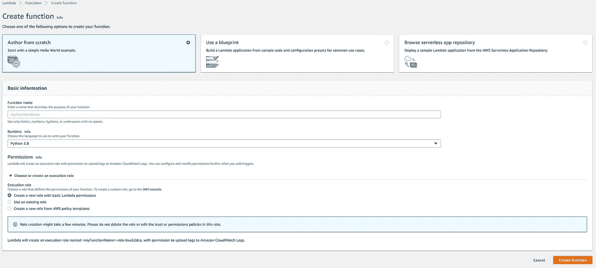
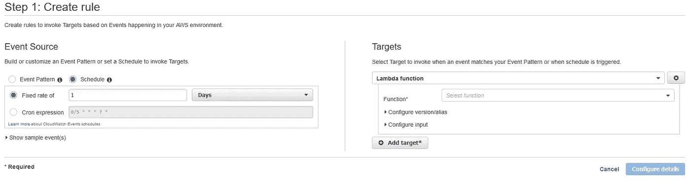
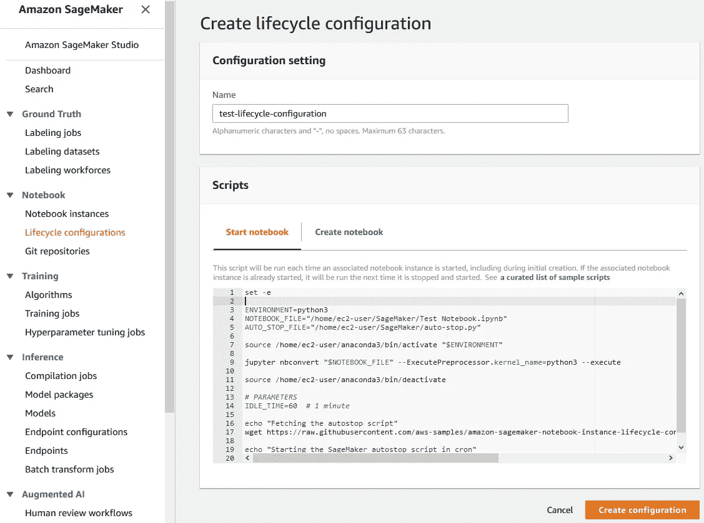
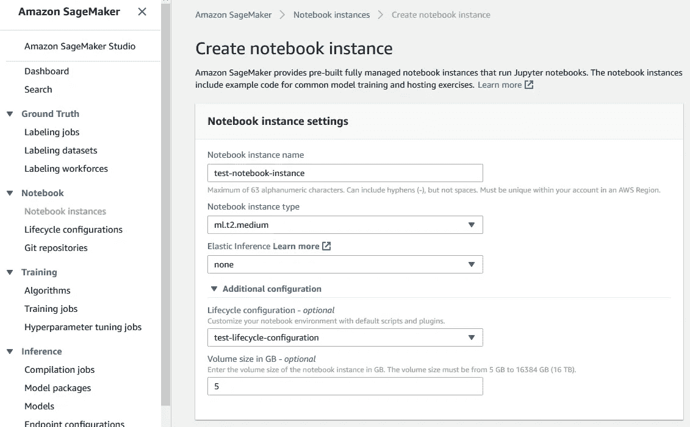

# 自动化 AWS SageMaker 笔记本电脑

> 原文：<https://towardsdatascience.com/automating-aws-sagemaker-notebooks-2dec62bc2c84?source=collection_archive---------8----------------------->

在 [Unsplash](/s/photos/automation?utm_source=unsplash&utm_medium=referral&utm_content=creditCopyText) 上由 [Franck V.](https://unsplash.com/@franckinjapan?utm_source=unsplash&utm_medium=referral&utm_content=creditCopyText) 拍摄的照片

## 了解如何使用 CloudWatch、Lambda 和生命周期配置安排自动执行 AWS SageMaker 笔记本

# **简介**

SageMaker 提供了多种工具和功能来大规模标记、构建、训练和部署机器学习模型。其中最流行的是笔记本实例，用于准备和处理数据，编写代码来训练模型，将模型部署到 Amazon SageMaker 主机，以及测试或验证模型。我最近在做一个项目，涉及自动化 SageMaker 笔记本。

使用 Amazon Glue 在 Sagemaker 中部署模型有多种方式，如这里的[和这里的](/automating-machine-learning-workflows-with-aws-glue-sagemaker-and-aws-step-functions-data-science-b4ed59e4d7f9)和[所述。您还可以使用](https://www.cloudreach.com/en/resources/blog/machine-learning-model-aws/)[端点 API](/aws-sagemaker-endpoint-as-rest-service-with-api-gateway-48c36a3cf46c) 来部署模型。如果您不部署模型，而是一次又一次地执行脚本，那该怎么办？SageMaker 目前还没有直接的方法来实现自动化。另外，如果您想在执行完脚本后立即关闭笔记本实例，该怎么办呢？这肯定会节省你的钱，因为 AWS 是按小时收费的。

# 我们如何实现这一点？

## 正在使用的其他 AWS 功能和服务

*   [生命周期配置](https://aws.amazon.com/blogs/machine-learning/lifecycle-configuration-update-for-amazon-sagemaker-notebook-instances/):生命周期配置提供了 shell 脚本，这些脚本仅在您创建 notebook 实例或启动一个实例时运行。它们可用于安装软件包或配置笔记本实例。
*   [AWS CloudWatch](https://aws.amazon.com/cloudwatch/) :亚马逊 CloudWatch 是一项监控和可观测性服务。它可用于检测您环境中的异常行为，设置警报，并排显示日志和指标，并采取自动化措施。
*   [AWS Lambda](https://aws.amazon.com/lambda/) : AWS Lambda 允许您在不提供或管理服务器的情况下运行代码。您只需为您消耗的计算时间付费，当您的代码不运行时，则不收费。

用于自动化的主要步骤:

*   使用 CloudWatch 触发调用 lambda 函数的执行
*   lambda 函数启动相应的笔记本实例。
*   笔记本实例一启动，生命周期配置就会被触发。
*   生命周期配置执行脚本，然后关闭笔记本实例。

# **详细步骤**

**λ函数**

我们利用 lambda 函数来启动一个笔记本实例。假设 lambda 函数被称为*‘测试-lambda-函数’*。确保选择一个有权限访问 lambda 和 SageMaker 的执行角色。

这里*‘test-notebook-instance’*是我们想要自动化的笔记本实例的名称。

**云观察**

*   转到规则>创建规则。

*   输入刷新频率
*   选择 lambda 函数名:*‘测试-lambda-函数’*。这是我们在上面创建的同一个函数。

**生命周期配置**

我们现在将为我们的'*测试笔记本实例'*'创建一个生命周期配置。让我们称这个生命周期配置为“测试-生命周期-配置”。

代码:

代码功能的简要说明:

1.  启动 python 环境
2.  执行 jupyter 笔记本
3.  下载包含自动停止功能的 AWS 示例 python 脚本
4.  等待 1 分钟。可以根据需要增加或降低。
5.  创建一个 [cron](https://en.wikipedia.org/wiki/Cron) 作业来执行自动停止 python 脚本

之后，我们将生命周期配置连接到笔记本电脑。

我喜欢在 LinkedIn 上联系——https://www.linkedin.com/in/taufeeqrahmani/

查看我在 [Data Sleek](https://data-sleek.com/) 的朋友的工作，寻找所有数据的解决方案。