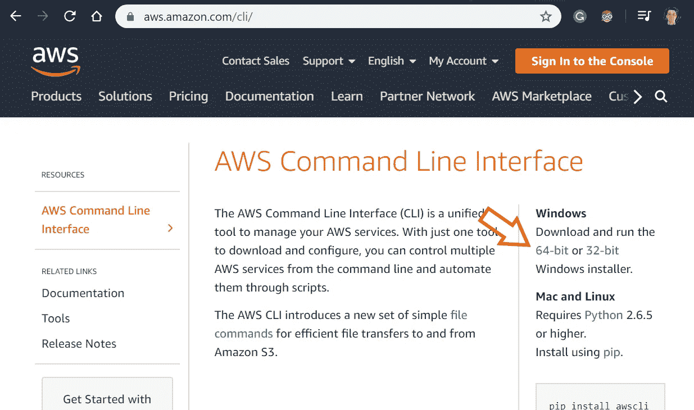
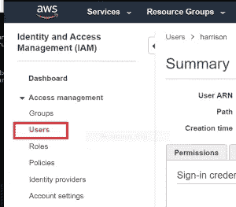
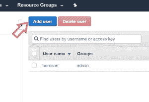
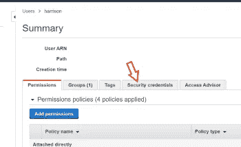
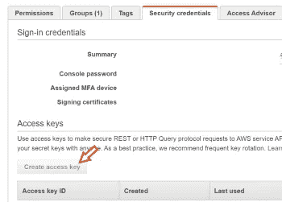
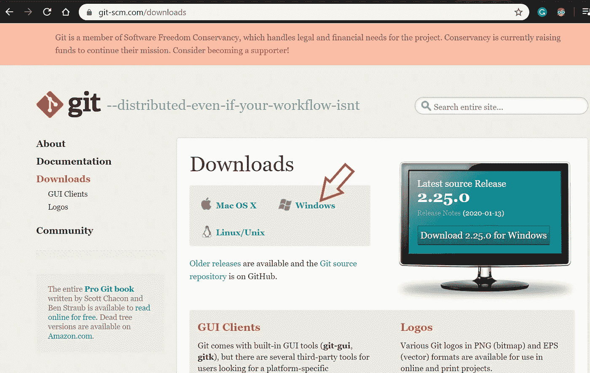
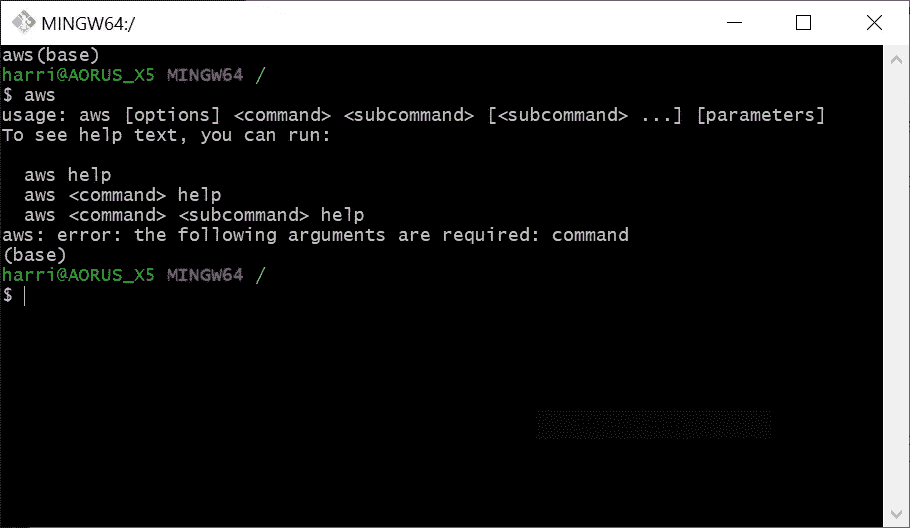

# 自动关闭 AWS 服务器以进行深度学习

> 原文：<https://towardsdatascience.com/automating-aws-server-shut-down-for-deep-learning-5d5de1301c70?source=collection_archive---------17----------------------->

## 因为每个人都有忘记的时候，没关系。


[混合动力](https://unsplash.com/@artbyhybrid?utm_source=medium&utm_medium=referral)在 [Unsplash](https://unsplash.com?utm_source=medium&utm_medium=referral) 上拍照

最近，我一直在为一个机器学习项目使用 AWS EC2 服务器。我看到的每篇文章都在说同样的事情……“不要忘记关闭 EC2 实例”。看这个让我焦虑。只要一想到让 GPU 开着会在口袋里烧个洞，我就会莫名其妙地出汗。

**所以我决定编写一个 Bash 脚本来启动服务器，SSH 进入，这样我就可以继续我的项目，然后当我退出时关闭服务器。我甚至在桌面上保存了一个脚本的快捷方式，这样我只需点击两下就可以开始工作了。**

不幸的是，让脚本工作的过程并不简单，而且有点令人恼火。所以我决定写一个快速的帖子，这样社区也可以同样安心。

**我的工作站是 Windows 10 PC，所以这些步骤对于 Mac 可能会有所不同。**

## 先决条件 1:拥有一个 AWS 帐户并创建一个实例

您需要有一个 AWS 帐户，并实例化一个 AWS EC2 实例。FastAI 有一个关于如何做到这一点的教程[在这里](https://course.fast.ai/start_aws.html)。如果这是您第一次创建 GPU 实例，您可能需要请求增加“p 型”实例的限制。对我来说，这花了大约两天时间才收到 AWS 的回复。

## 先决条件 2:设置 AWS CLI

您将需要 AWS CLI，这样 Bash 脚本就可以调用来启动/关闭服务器。你可以从[这里](https://aws.amazon.com/cli/)下载 CLI。



AWS CLI 下载

在接下来的几个步骤中，我们将在 AWS [IAM](https://console.aws.amazon.com/iam) 中为您自己创建一个用户，然后生成并保存安全凭证，以便我们可以使用 AWS CLI。



IAM 控制台

如果 IAM 控制台中有用户，则不需要新用户。只需确保您拥有用户的“安全凭证”



如果您没有用户，请创建一个。

如果您创建了一个用户，请确保授予其“编程访问”权限。接下来，您将为用户生成安全密钥。



保存这些钥匙！

在 Windows 命令提示符下，您需要运行`aws configure`并按照提示进行操作。用从 IAM 控制台获得的密钥填写访问密钥 ID 和秘密访问密钥。将默认区域设置为服务器所在的区域。

完成这些步骤后，您应该能够从命令行访问 AWS 实例了。尝试运行`aws ec2 describe-instances`，您应该会看到 EC2 实例的列表。

## 先决条件 3:将 Git-Bash 连接到 AWS

如果您还没有安装 Git-Bash，请在这里安装 Git-Bash。您将需要它来运行 Bash 脚本。



Git-Bash 下载

下一步是将 Git-Bash 连接到 AWS CLI。为此，您需要在 bash 的根目录下创建一个. bashrc 文件。打开一个 Git-Bash 终端并执行以下操作。

```
cd ~vim .bashrc
```

这将打开一个文本编辑器。您可以在其中粘贴以下内容。

```
#!/bin/bashalias aws=”winpty -Xallow-non-tty -Xplain C://Program\ Files/Amazon/AWSCLI/bin/aws.exe”
```

现在 Git-Bash 终端将识别命令`aws`。如果你跳过这一步，你将得到错误`bash: aws: command not found`。确保上面插入的文件路径指向您的文件目录中的 aws.exe。

完成后，通过键入`esc`和`:wq`退出 vim 终端，然后按 enter 键。为了使更改生效，您需要关闭并重新打开 Git-Bash。这样做并执行`aws`。您应该看到以下内容。



测试 AWS CLI 命令

# 创建脚本

这样，我们就非常接近我们的目标了。制作一个 Bash 脚本，自动启动、登录和关闭 EC2 服务器。

现在我们可以结束并编写脚本了。在您的 bash 终端中，导航到您想要脚本的任何地方(对我来说是`cd C://Users/harrison/Desktop`)，然后运行`vim aws.sh`

```
#!/bin/bashINSTANCE_ID=**<YOUR EC2 INSTANCE-ID HERE>** SSH_KEY=**<path/to/sshkey.pem>**echo "Starting AWS Server."
aws ec2 start-instances --instance-ids $INSTANCE_ID#Wait for server to come online
STARTED=False
while [ "$STARTED" != "True" ]; do
 SERVER_STATUS=$(aws ec2 describe-instance-status --include-all-instances --instance-ids $INSTANCE_ID --output text --query 'InstanceStatuses[].InstanceState.Name')
 if [ "$SERVER_STATUS" == "running" ]; then
    STARTED=True
 else
    sleep 3
 fi
 doneSERVER_PUBLIC_DNS=$(aws ec2 describe-instances — instance-ids $INSTANCE_ID — output text — query ‘Reservations[].Instances[].PublicDnsName’)echo “Attempting to log into server.”
ssh -L localhost:8888:localhost:8888 -i $SSH_KEY ubuntu@$SERVER_PUBLIC_DNSecho “Shutting down server.”
aws ec2 stop-instances — instance-ids $INSTANCE_ID
echo "Sent shutdown command."
sleep 1echo "Querying instance status..."
aws ec2 describe-instance-status --include-all-instances --instance-ids $INSTANCE_ID --output text --query 'InstanceStatuses[]'
sleep 5
```

**注意:我会定期对这个脚本进行改进。**

用您的 EC2 实例的实例 id 填充`INSTANCE_ID`。在`SSH_KEY`中填入您的 SSH 密钥的路径。

现在，当您想开始在 EC2 服务器上工作时，只需运行 bash 脚本，您就可以连接到您的服务器了。从那里，您可以运行一个`jupyter notebook`或者从 GitHub 加载 python 脚本。当您`exit`退出实例时，脚本将继续运行并为您关闭服务器。

# 工作原理(可选)

`aws ec2 start-instances — instance-ids $INSTANCE_ID` **启动 EC2 实例**。

您需要服务器的公共 DNS 才能登录。不幸的是，当您关闭服务器时，DNS 可能会改变。以下代码查询服务器的公共 DNS。

```
SERVER_PUBLIC_DNS=$(aws ec2 describe-instances — instance-ids $INSTANCE_ID — output text — query ‘Reservations[].Instances[].PublicDnsName’)
```

**用`ssh -L localhost:8888:localhost:8888 -i $SSH_KEYubuntu@$SERVER_PUBLIC_DNS`登录 EC2 实例**

`aws ec2 stop-instances — instance-ids $INSTANCE_ID` **停止 EC2 实例。**