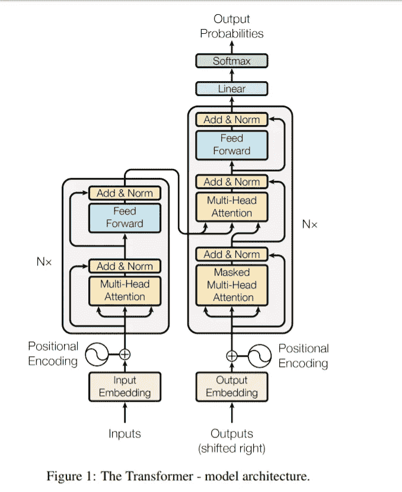

# 用机器智能自动化代码

> 原文：<https://towardsdatascience.com/automating-code-with-machine-intelligence-d7aae24f851f?source=collection_archive---------28----------------------->

## 以及来自 OpenAI 的 GPT3 语言处理 API 的更多含义。

[*这是我的自由星期五关于机器人学& AI 的文章节选，请查阅。*](https://democraticrobots.substack.com/) 看看这个视频，这是我见过的第一个引人注目的自动化软件生成演示。

[来源](https://twitter.com/sharifshameem/status/1283322990625607681)。

## 这是什么

OpenAI 最新的语言处理模型 GPT-3(生成式预训练转换器)从两个示例片段创建了各种前端代码片段。(*前端代码是在网站上呈现的代码，通常会大量重复以获得相同设计的变体，因此它是自动化的一个简单的初始目标)。*

你可以在这里 (Twitter)与工具[的作者进行交流。你可以](https://twitter.com/sharifshameem/status/1283322990625607681)[在这里](/gpt-3-creative-potential-of-nlp-d5ccae16c1ab)找到更多有创意的例子，或者在这里找到另一个代码生成例子[。我特别喜欢的一个是写的](https://twitter.com/hturan/status/1282261783147958272)[创意小说](https://www.gwern.net/GPT-3)或者是写的[自动生成的游戏](https://play.aidungeon.io/)关于上一代的模型。

## 这是如何工作的

语言模型“生成式预训练转换器”使用了来自 OpenAI 的一个新的即插即用 API。下面是我的帖子中关于 NLP 和变形金刚的摘录( [AI &仲裁真相](https://democraticrobots.substack.com/p/ai-arbitration-of-truth-808b57a93a97)——貌似每周都需要重温)。

> ***科技—变形金刚& NLP***
> 
> 自然语言处理(NLP)是机器学习的子领域，涉及从文本中处理和提取信息。 [*用在智能助手、翻译器、搜索引擎、网店等等。*](https://en.wikipedia.org/wiki/Natural_language_processing) *NLP(以及计算机视觉)是少数货币化的最先进的机器学习发展之一。*是被用来诠释真理的候选人。
> 
> *迄今为止最好的 NLP 工具是一个叫做* ***的神经网络架构，变压器*** *。长话短说，变形金刚使用一种* [*编码器和解码器结构*](/understanding-encoder-decoder-sequence-to-sequence-model-679e04af4346) *，将单词编码到潜在空间，并解码为翻译、打字错误修复或分类(*你可以认为编码器-解码器是通过神经网络将复杂的特征空间压缩到更简单的空间——非线性函数逼近)*。NLP 领域的一个关键工具是一种叫做* [*注意力*](https://medium.com/@joealato/attention-in-nlp-734c6fa9d983) *的东西，它学习关注哪些单词以及关注多长时间(而不是硬编码到一个工程系统中)。*
> 
> *一个*[*transformer*](https://arxiv.org/pdf/1810.04805.pd)*结合了这些工具，以及一些其他的改进，允许模型被高效地并行训练。下图显示了数据如何流经转换器。*

*一个可视化来自一个* [*牛逼教程*](https://jalammar.github.io/illustrated-transformer/) *我找到的。*

## 为什么它很重要

这是我看到的第一个应用程序，人们可以用它来代替工程时间。前端设计人员可以借助这款工具大幅提高工作速度。这可能会被出售给许多现有的公司，新的企业将在未来使用它来创造有价值的服务。找到最好的应用程序需要一个有创造力的人，当然受到我们人类设计师的限制，很快就会被下一个最先进的模型所取代。

这是令人瞩目的，因为 OpenAI 著名的宪章。简而言之——我们将朝着 AGI 前进，如果另一家公司想抢先一步， ***我们将加入他们的*** 。该产品背后的说法是，这些资金将帮助他们执行人工智能研究，但他们的领导层过去曾撤回模型，因为担心它们“太危险，无法分享”。**这种 AI 危险的细线只会越来越尖锐。**

书呆子角落:这个模型的训练量是 50[PETA](https://en.wikipedia.org/wiki/Peta-#:~:text=Peta%20(%2F%CB%88p%C9%9Bt,%CF%80%CE%AD%CE%BD%CF%84%CE%B5%2C%20meaning%20%22five%22.)翻牌/秒-天(这到底是什么意思？)仅培训费用就超过 1200 万美元[ [来源](https://venturebeat.com/2020/06/11/openai-launches-an-api-to-commercialize-its-research/#:~:text=Certainly%2C%20OpenAI's%20advancements%20haven't,training%20costs%20exceeding%20%2412%20million.) ]。这是从费用中收回的一点成本。我喜欢思考这个模型如何与我用于回归任务的浅层神经网络相比较— *它的参数数量超过 1 亿倍*。这是一个完全不同的函数逼近体系。对于书呆子来说，学术论文在这里是。

# 机器人和生成文本

我请求进入机器人研究的测试版。我有兴趣看看一个语言模型(大神经网络)的规划能达到什么水平，以游戏的形式给定上下文。 ***语言是否抓住了游戏中的基本意图和解决方案的结构？***

从长远来看，我认为将语言整合到机器人奖励中是令人感兴趣的——它将允许与机器人一起工作的人类给机器下达口头任务(验证所述任务是另一个问题)。

示例:

*   *给定一个游戏板的嵌入(书写、网格、其他方法)，说“我应该移动到哪里。”*
*   *给出一个环境描述:“积木在椅子右边的球上，”问“球在椅子上面吗？”*

这是一个非常初级的例子，但我认为来自商业化机器学习领域的链接，如视觉和语言的深度学习，是很有潜力的。

 [## 自动化大众化

### 一个关于机器人和人工智能的博客，让它们对每个人都有益，以及即将到来的自动化浪潮…

robotic.substack.com](https://robotic.substack.com/) 

照片由[负空间](https://www.pexels.com/@negativespace?utm_content=attributionCopyText&utm_medium=referral&utm_source=pexels)从[像素](https://www.pexels.com/photo/office-working-app-computer-97077/?utm_content=attributionCopyText&utm_medium=referral&utm_source=pexels)拍摄