# 与 Jenkins 一起自动化数据科学项目

> 原文：<https://towardsdatascience.com/automating-data-science-projects-with-jenkins-8e843771aa02?source=collection_archive---------28----------------------->

## 了解如何使用 Jenkins 自动化数据科学代码

让我们描绘一个场景，您正在进行一个数据科学项目，起初，您有一个 80%的模型准确性，您使用 Flask 将该应用程序作为 API 部署到生产中。然后几天后，你决定继续这个项目，在调整了一些参数并增加了一些数据后，你有了比之前建立的模型更好的精确度。现在，您计划部署该模型，您必须经历构建、测试和再次将该模型部署到生产环境的麻烦，这是一项繁重的工作。在本文中，我将向您展示我们如何使用一个名为 **Jenkins** 的强大工具来自动化这个过程。


[扬西·敏](https://unsplash.com/@yancymin?utm_source=medium&utm_medium=referral)在 [Unsplash](https://unsplash.com?utm_source=medium&utm_medium=referral) 上的照片

# 詹金斯是什么？

Jenkins 是一个免费的开源自动化服务器。它帮助自动化与[构建](https://en.wikipedia.org/wiki/Software_build)、[测试](https://en.wikipedia.org/wiki/Test_automation)和[部署](https://en.wikipedia.org/wiki/Software_deployment)相关的[软件开发](https://en.wikipedia.org/wiki/Software_development)部分，促进[持续集成](https://en.wikipedia.org/wiki/Continuous_integration)和[持续交付](https://en.wikipedia.org/wiki/Continuous_delivery)——维基百科

借助 Jenkins，您可以使用大量插件，在整个生命周期中自动化并加速软件交付过程。例如，您可以设置 Jenkins 自动检测存储库中的代码提交，并自动触发命令，从 Docker 文件构建 Docker 映像、运行单元测试、将映像推送到容器注册表或将其部署到生产服务器，而无需手动执行任何操作。我将解释一些我们需要知道的基本概念，以便在我们的数据科学项目中执行一些自动化。

# 詹金斯的优势

1.  它是开源的
2.  易于使用和安装
3.  大量适合 DevOps 环境的插件
4.  在代码上花更多时间，在部署上花更少时间
5.  大型社区

# 詹金斯装置

Jenkins 支持跨平台安装，无论您是 Windows、Linux 还是 Mac 用户。您甚至可以将它安装在支持 PowerShell 或 Linux 实例的云服务器上。要安装 Jenkins，可以参考文档[这里](https://www.jenkins.io/doc/book/installing/)。

Jenkins 有很多惊人的特性，有些超出了本文的范围，要掌握 Jenkins 的窍门，你可以查看[文档](https://www.jenkins.io/)。

在我们开始实际操作之前，我想解释一些非常重要的术语，其中包括:

## 詹金斯工作

Jenkins 作业只是指由 Jenkins 控制的可运行任务。例如，你可以分配一个任务给 Jenkins 来执行一些特定的操作，比如运行“Hello World”，执行单元和集成测试等等。在 Jenkins 中创建工作非常容易，但是在软件环境中，你可能不会创建一个单独的工作，相反，你会做被称为**管道**的事情。

## **詹金斯管道**

管道按照特定的顺序运行一组作业，让我用一个例子来解释。假设我正在 Jenkins 上开发一个应用程序，我想从代码库中提取代码，构建应用程序，测试并将其部署到服务器上。为此，我将创建四个作业来执行每个进程。因此，第一个作业(作业 1)将从存储库中提取代码，第二个作业(作业 2)将构建应用程序，第三个作业(作业 3)将执行单元和集成测试，第四个作业(作业 4)将代码部署到生产环境中。我可以使用 Jenkins 构建管道插件来执行这项任务。在创建作业并将它们按顺序链接起来之后，构建插件会将这些作业作为一个管道来运行。

詹金斯管道的类型:

1.  声明性管道:这是一个支持管道作为代码概念的特性。它使管道代码更容易阅读和编写。这段代码写在一个 **Jenkinsfile** 中，它可以被签入一个源代码控制管理系统，比如 Git。
2.  脚本管道:这是编写代码的老方法之一。使用这种方法，管道代码被**写在 Jenkins 用户界面实例**上，而不是写在文件中。尽管这两个管道执行相同的功能，并且使用相同的脚本语言(Groovy)。

在讨论了主要概念之后，让我们构建一个简单的迷你项目，并使用 Jenkins 实现自动化。

这个项目包含一个经过训练的机器学习模型，它可以检测来自 twitter 的与自杀相关的情绪，我使用 flask 将它部署为一个 API。我构建了我的 Jenkins 管道:

提交时从存储库中提取更改>>>构建 Docker 映像>>>将构建的映像推送到 DockerHub > > >删除未使用的 Docker 映像。

# 步伐

启动一个 Jenkins 服务器，安装 Git、Docker、Pipeline 和 build 插件，并在实例中安装 Git 和 Docker。对于本文，我在 AWS EC2 实例上使用了 Jenkins。

将代码推送到存储库，在本文中我使用了 Github。你可以在这里找到这篇文章的代码。

我的工作目录:

```
.
├── app.py
├── CustomCode
│   └── data_preprocessing.py
├── Dockerfile
├── Jenkinsfile
├── ML_model
│   └── model.pkl
└── requirements.txt
```

然后，我们需要告诉 Jenkins，每当代码库中发生更改时，就开始构建管道。为此，您需要将 Jenkins webhook 添加到 Github 存储库中，以便 GitHub 在代码发生变化时与 Jenkins 进行通信。为此:

点击代码库中的**设置**

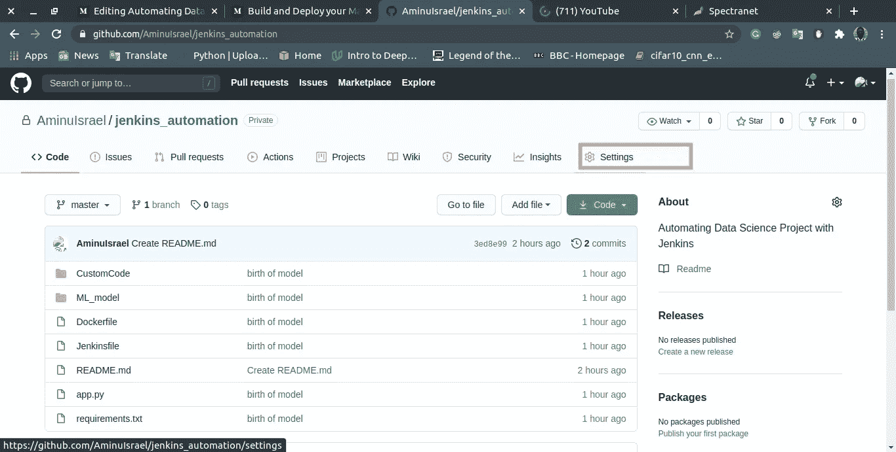

然后导航到 webhooks，点击**添加 Webhook**

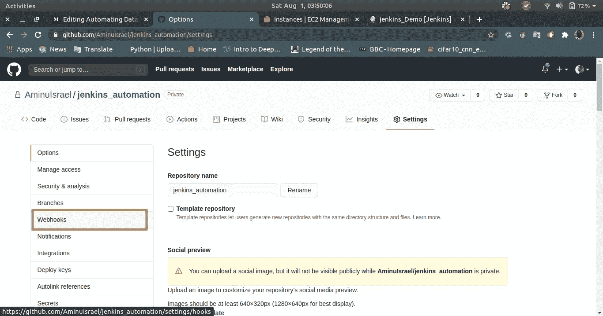

然后使用你的 Jenkins 服务器的公共 DNS 或公共 IP 并在末尾添加“**/github-web hook/”**，然后选择 application/json 作为内容类型。在“您希望哪个事件触发此网页挂钩？”，选择单个事件并选择**仅推**并点击添加 webhook。

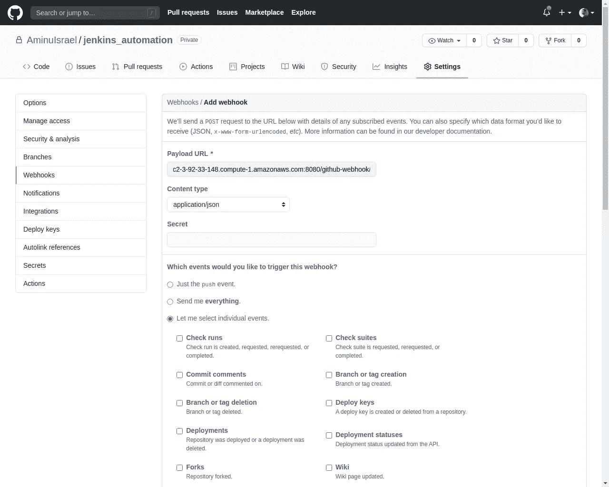

现在，前往 Jenkins 并点击**新项目**

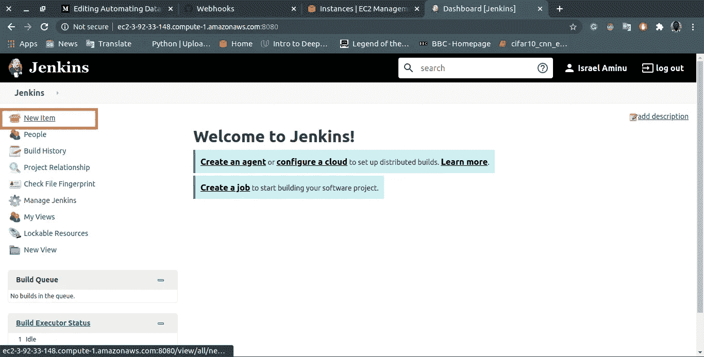

输入项目名称，选择管道，点击**确定**

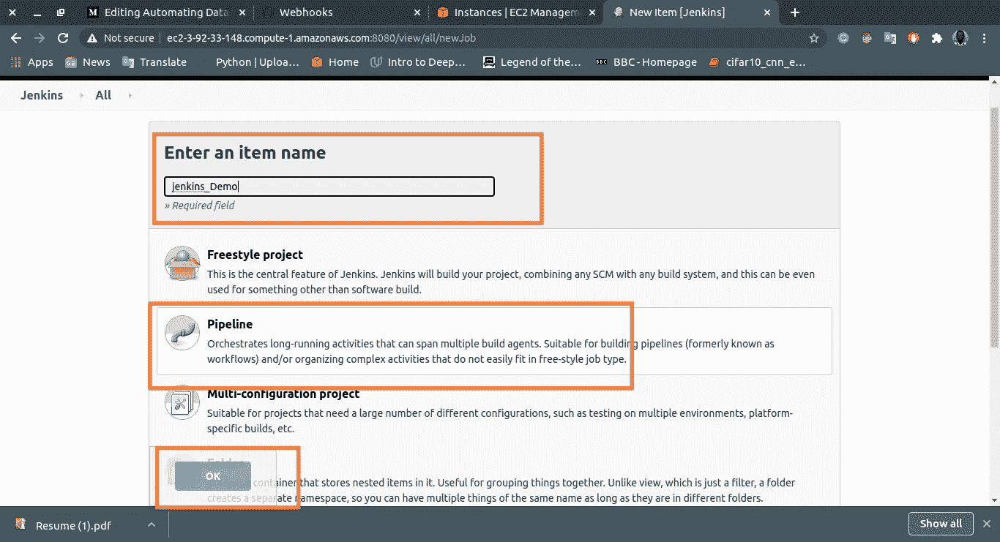

从 General 向下滚动到 Build Triggers 并选择**Github hook trigger for git SCM polling**。它的简单作用是，每当代码中有提交时，帮助我们构建管道


然后滚动到管道，并在定义中从下拉列表中选择来自 SCM 的管道脚本。在 SCM(源代码管理)中，选择 Git 并输入存储库 URL，如果您的存储库是私有的，您需要使用您的用户名和密码创建一个凭证。在分支说明符中，您可以选择 master 或者您的代码存储库所在的任何分支，脚本路径选择 **Jenkinsfile，**Jenkins file 是我为项目编写管道的地方。然后选择**保存**。

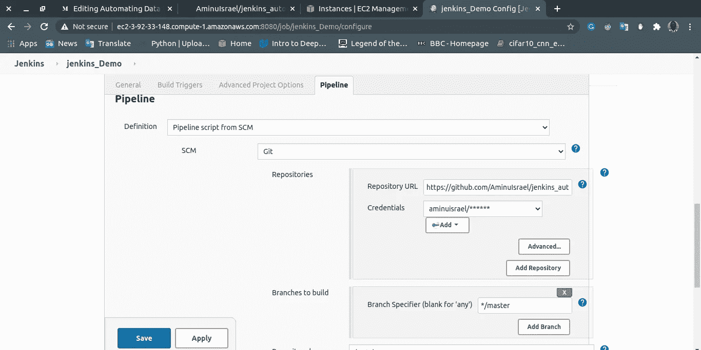

现在让我们建立管道…

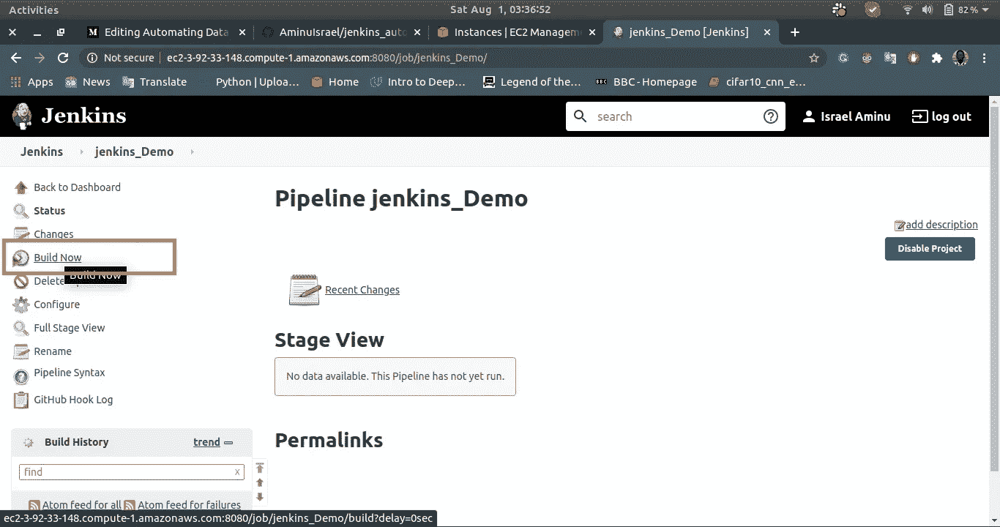

它贯穿了所有的阶段，构建是成功的

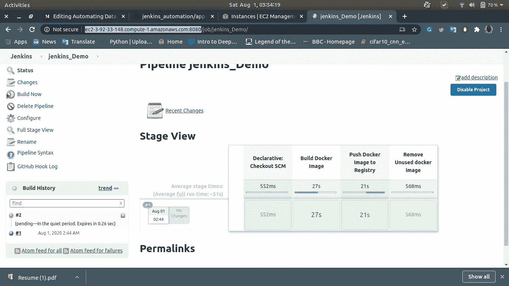

如果你查看你的 Docker Hub 库，你会在那里找到 Docker 图片。

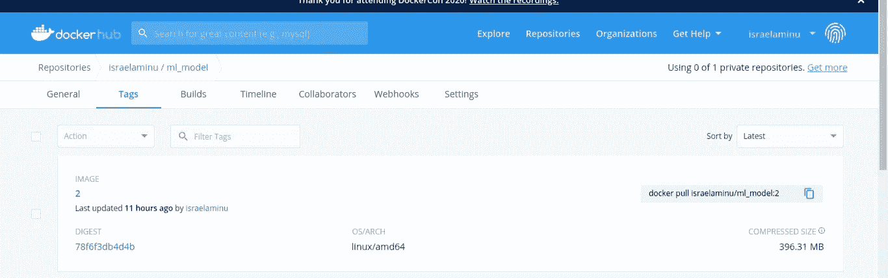

现在让我们在代码库中做一点小小的改变

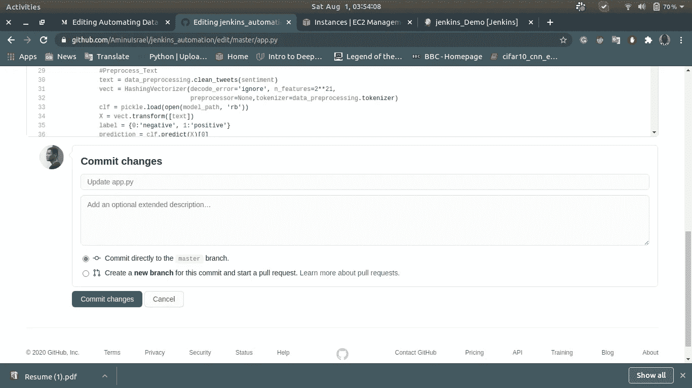

现在，如果你回到 Jenkins，你会看到它已经检测到已经做出的更改，并自动触发另一个构建。

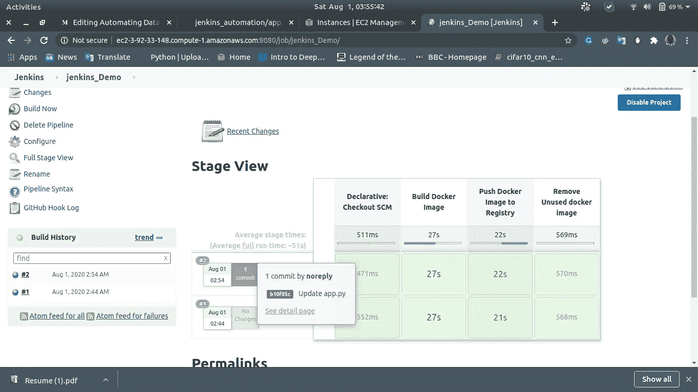

这就是如何使用 Jenkins 来自动化这三个过程。

感谢阅读😃