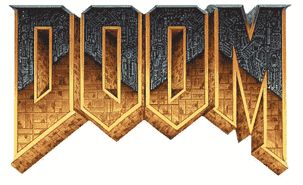
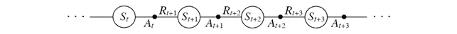
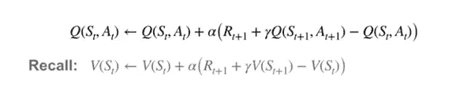
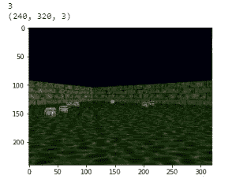
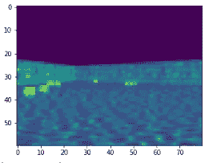
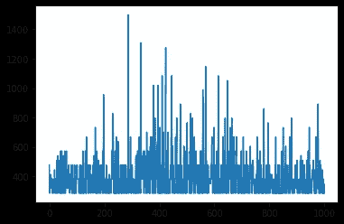

# 深度 Q 学习的自动化毁灭:Tensorflow 中的一个实现。

> 原文：<https://towardsdatascience.com/automating-doom-with-deep-q-learning-an-implementation-in-tensorflow-db03c1b03a9c?source=collection_archive---------37----------------------->

## 强化学习的基础

# 介绍



在线学习方法是一个动态的强化学习算法家族，它是过去十年来人工智能领域许多成就的背后。在线学习方法属于[基于样本的学习](https://medium.com/gradientcrescent/fundamentals-of-reinforcement-learning-automating-pong-in-using-a-policy-model-an-implementation-b71f64c158ff)类强化学习方法，允许简单地通过重复观察来确定状态值，消除了对转换动态的需要。与它们的[离线对应方式](https://medium.com/gradientcrescent/fundamentals-of-reinforcement-learning-understanding-blackjack-strategy-through-monte-carlo-88c9b85194ed)，**不同，在线学习方法允许在环境事件期间对状态和动作的值进行增量更新，允许观察到持续的、增量的性能改进。**

除了时间差异学习(TD ),我们还讨论了 Q-learning 的[理论](https://medium.com/gradientcrescent/fundamentals-of-reinforcement-learning-navigating-cliffworld-with-sarsa-and-q-learning-cc3c36eb5830)和[实际实现](/automating-pac-man-with-deep-q-learning-an-implementation-in-tensorflow-ca08e9891d9c),这是 TD 的一种发展，旨在允许增量估计和状态-动作值的改进。Q-learning 因成为模拟游戏环境的强化学习方法的支柱而闻名，如在 OpenAI 的健身房中观察到的那些。因为我们已经在[过去的文章](/automating-pac-man-with-deep-q-learning-an-implementation-in-tensorflow-ca08e9891d9c)中涉及了 Q-learning 的理论方面，所以这里不再重复。

在线学习方法(如 TD)的快速情景内响应能力使其适用于高度动态的环境，在这种环境中，状态和动作的值通过多组估计值不断更新。也许最值得注意的是， **TD 是 Q-learning 的基础，**这是一种更先进的算法，用于训练代理处理游戏环境，如在 OpenAI Atari 健身房中观察到的环境，正如我们之前的实现中的[一些](/optimized-deep-q-learning-for-automated-atari-space-invaders-an-implementation-in-tensorflow-2-0-80352c744fdc)所涵盖的。

在本文中，我们将探索如何通过使用开源的 OpenAI gym 包装库 [Vizdoomgym](https://github.com/shakenes/vizdoomgym) ，将 Q-learning 应用于训练代理玩经典 FPS 游戏 **Doom** 。我们将指导您设置您的第一个代理，并为未来的工作奠定基础。

永恒经典的演变。我们将在这里关注 1993 年的版本。

# **超越 TD: SARSA & Q-learning**

回想一下，在时间差异学习中，我们观察到一个主体在一个环境中通过一系列状态(S)、动作(A)和(奖励)循环地行为。



在 TD 期间，我们可以在到达下一个状态时更新前一个状态的值。我们可以进一步扩展我们的模型的范围，以包括状态-动作值，在一种称为 **SARSA 的方法中，一种用于估计动作值**的基于策略的 TD 控制算法。在 SARSA 期间，我们在给定的策略下连续地估计跨增量时间步长的动作值，同时使用这种知识来修改策略，使其趋向于动作值贪婪的替代方案。

让我们比较状态-动作和状态-值 TD 更新方程:



**Q-learning 不同于 SARSA，它在更新**期间强制选择具有当前最高动作值的动作，这与使用[贝尔曼优化方程观察到的情况类似。](https://medium.com/gradientcrescent/fundamentals-of-reinforcement-learning-markov-decision-processes-policies-value-functions-94f7389e1e82)我们可以检查贝尔曼和贝尔曼优化方程旁边的 SARSA 和 Q-learning，如下所示:


你可能想知道如何确保我们的状态-动作空间的完整探索，给定需要不断地为具有最高现有动作值的状态选择动作。从理论上讲，我们可能只是因为一开始就没有评估而避免了最佳行动。**为了鼓励探索，我们可以使用一个衰减的 e-greedy 策略，**本质上迫使代理以衰减的概率选择一个明显的次优行为，以便了解更多关于其价值的信息。通过使用衰减值，我们可以在评估完所有状态后限制探索，之后我们将为每个状态永久选择最佳操作。

有了我们的理论，让我们开始我们的实现。

# 履行

我们的 Google 协作实现是利用 Tensorflow Core 用 Python 编写的，可以在 [GradientCrescent Github 上找到。](https://github.com/EXJUSTICE/GradientCrescent)关注我们出版物的读者会发现代码与我们之前在[雅达利](/automating-pac-man-with-deep-q-learning-an-implementation-in-tensorflow-ca08e9891d9c)T4 环境中的实现相似。由于这种方法的实现非常复杂，让我们用**总结一下所需动作的顺序**:

1.**我们定义我们的深度 Q 学习神经网络**。这是一个 CNN，它拍摄游戏中的屏幕图像，并输出 Ms-Pacman gamespace 中每个动作的概率，或 Q 值。为了获得概率张量，我们在最后一层不包括任何激活函数。

2.由于 Q-learning 要求我们了解当前和下一个状态，我们需要从数据生成开始。我们将表示初始状态 *s* 的游戏空间的预处理输入图像输入到网络中，并获取动作的初始概率分布，或 Q 值。在训练之前，这些值将是随机的和次优的。

3.利用我们的概率张量，我们然后**使用 argmax()函数选择具有当前最高概率的动作**，并使用它来构建ε贪婪策略。

4.使用我们的策略，我们将选择动作 *a* ，并评估我们在健身房环境中的决定**接收关于新状态*s’*、奖励 *r*** 以及该集是否已结束的信息。

5.我们以列表形式~~将该信息组合存储在一个缓冲区中，并重复步骤 2-4 预设次数，以建立一个足够大的缓冲区数据集。~~

6.一旦步骤 5 完成，我们转到**生成我们的目标*y*-值*R’*和*A’***，这是损失计算所需的。虽然前者只是从 *R* 中减去，但是我们通过将*S’*输入到我们的网络中来获得 A’。

7.有了所有的组件，我们就可以**计算训练网络的损耗**。

8.一旦训练结束，我们将评估我们的代理在新一集游戏中的表现，并记录表现。

让我们开始吧。随着 Tensorflow 2 在实验室环境中的使用，我们已经使用新的 *compat* 包将我们的代码转换为符合 TF2 标准。注意，这段代码不是 TF2 本地的。

让我们通过导入所有必需的包，包括 OpenAI 和 Vizdoomgym 环境以及 Tensorflow 核心:

```
import gym
import vizdoomgym
!pip install tensorflow==1.15
import numpy as np
import tensorflow as tf
from tensorflow.contrib.layers import flatten, conv2d, fully_connected
from collections import deque, Counter
import random
from datetime import datetime
```

接下来，我们定义一个预处理函数，对健身房环境中的观察结果进行标准化和调整大小，并将它们转换成一维张量。

```
from skimage.color import rgb2gray
from skimage import transform#prepro (240, 320, 3) uint8 frame into 30x40 1D float vector 
color = np.array([240, 320, 74]).mean()
def preprocess_observation(obs):

 img =obs/255.0
 img[img==color] = 0 img_gray = rgb2gray(img)
 preprocessed_frame = transform.resize(img_gray, [60,80])

 return preprocessed_frame
```

接下来，让我们初始化健身房环境。我们将使用 Vizdoomgym 的健康收集场景，其中的目标是收集尽可能多的健康令牌，以便在通过一个具有破坏性酸性地板的方形房间时保持活着。

```
env = gym.make(‘VizdoomHealthGathering-v0’)
n_outputs = env.action_space.n
print(n_outputs)observation = env.reset()import tensorflow as tf
import matplotlib.pyplot as pltfor i in range(22):

 if i > 20:
 print(observation.shape)
 plt.imshow(observation)
 plt.show()observation, _, _, _ = env.step(1)
```

我们可以查看游戏画面，也可以查看游戏空间中的 3 个可用动作，即左转、右转或前进。当然，我们的代理人无法获得这些信息。



原始观察输入

我们可以借此机会比较我们的原始和预处理输入图像:



预处理图像输入

接下来，我们将**输入帧堆叠**和**帧合成**引入我们的预处理流水线，这是 Deepmind 在 2015 年推出的两项技术。这些方法分别为我们的输入提供时间和运动参考。

我们通过获取两个输入帧来应用帧合成，并返回这两个帧的元素式最大总和 *maxframe* 。然后，这些合成的帧被存储在一个队列或“堆栈”中，当引入新的条目时，它会自动删除旧的条目。

```
stack_size = 4 # We stack 4 composite frames in total stacked_frames = deque([np.zeros((60,80), dtype=np.int) for i in range(stack_size)], maxlen=4)def stack_frames(stacked_frames, state, is_new_episode):
 # Preprocess frame
 frame = preprocess_observation(state)

 if is_new_episode:
   # Clear our stacked_frames
   stacked_frames = deque([np.zeros((60,80), dtype=np.int) for i in  range(stack_size)], maxlen=4)

   # Because we’re in a new episode, copy the same frame 4x, apply  elementwise maxima
   maxframe = np.maximum(frame,frame)
   stacked_frames.append(maxframe)
   stacked_frames.append(maxframe)
   stacked_frames.append(maxframe)
   stacked_frames.append(maxframe)

   # Stack the frames
   stacked_state = np.stack(stacked_frames, axis=2)

 else:
   #Since deque append adds t right, we can fetch rightmost element
   maxframe=np.maximum(stacked_frames[-1],frame)
   # Append frame to deque, automatically removes the oldest frame
   stacked_frames.append(maxframe) # Build the stacked state (first dimension specifies different frames)
   stacked_state = np.stack(stacked_frames, axis=2) 

 return stacked_state, stacked_frames
```

接下来，让我们定义我们的模型，一个深度 Q 网络。这基本上是一个三层卷积网络，它采用预处理的输入观察值，将生成的展平输出馈送到一个全连接层，生成将游戏空间中的每个动作作为输出的概率。请注意，这里没有激活层，因为激活层的存在会导致二进制输出分布。

```
tf.compat.v1.reset_default_graph() def q_network(X, name_scope):

 # Initialize layers
 initializer =  tf.compat.v1.keras.initializers.VarianceScaling(scale=2.0) with tf.compat.v1.variable_scope(name_scope) as scope: # initialize the convolutional layers
   layer_1 = conv2d(X, num_outputs=32, kernel_size=(8,8), stride=4,  padding=’SAME’, weights_initializer=initializer) 
   tf.compat.v1.summary.histogram(‘layer_1’,layer_1)

   layer_2 = conv2d(layer_1, num_outputs=64, kernel_size=(4,4),  stride=2, padding=’SAME’, weights_initializer=initializer)
   tf.compat.v1.summary.histogram(‘layer_2’,layer_2)

   layer_3 = conv2d(layer_2, num_outputs=64, kernel_size=(3,3), stride=1, padding=’SAME’, weights_initializer=initializer)
   tf.compat.v1.summary.histogram(‘layer_3’,layer_3)

   # Flatten the result of layer_3 before feeding to the fully connected layer
   flat = flatten(layer_3)
   # Insert fully connected layer
   fc = fully_connected(flat, num_outputs=128,  weights_initializer=initializer)
   tf.compat.v1.summary.histogram(‘fc’,fc)
   #Add final output layer
   output = fully_connected(fc, num_outputs=n_outputs, activation_fn=None, weights_initializer=initializer)
   tf.compat.v1.summary.histogram(‘output’,output) # Vars will store the parameters of the network such as weights
   vars = {v.name[len(scope.name):]: v for v in   tf.compat.v1.get_collection(key=tf.compat.v1.GraphKeys.TRAINABLE_VARIABLES, scope=scope.name)} 
   #Return both variables and outputs together
   return vars, output
```

让我们也借此机会为我们的模型和训练过程定义超参数。注意，由于我们的堆叠帧，X_shape 现在是*(无，60，80，4)* 。

```
num_episodes = 1000
batch_size = 48input_shape = (None, 60, 80, 1)learning_rate = 0.002
#Modified for composite stacked frames
X_shape = (None, 60, 80, 4)
discount_factor = 0.99global_step = 0
copy_steps = 100
steps_train = 4
start_steps = 2000
```

回想一下，Q-learning 要求我们选择具有最高行动价值的行动。为了确保我们仍然访问每一个可能的状态-行为组合，我们将让我们的代理遵循一个衰减的ε-贪婪策略，探索率为 5%。

```
epsilon = 0.5
eps_min = 0.05
eps_max = 1.0
eps_decay_steps = 500000def epsilon_greedy(action, step):
 p = np.random.random(1).squeeze() #1D entries returned using squeeze
 epsilon = max(eps_min, eps_max — (eps_max-eps_min) * step/eps_decay_steps) #Decaying policy with more steps
 if p< epsilon:
   return np.random.randint(n_outputs)
 else:
   return action
```

回想上面的等式，Q-learning 的更新函数要求如下:

*   当前状态 *s*
*   当前动作*一个*
*   当前动作后的奖励 *r*
*   下一个状态*s’*
*   下一个动作*a’*

为了以有意义的数量提供这些参数，我们需要按照一组参数评估我们当前的策略，并将所有变量存储在一个缓冲区中，我们将在训练期间从该缓冲区中提取迷你批次中的数据。让我们继续创建我们的缓冲区和一个简单的采样函数:

```
buffer_len = 20000
exp_buffer = deque(maxlen=buffer_len)def sample_memories(batch_size):
 perm_batch = np.random.permutation(len(exp_buffer))[:batch_size]
 mem = np.array(exp_buffer)[perm_batch]
 return mem[:,0], mem[:,1], mem[:,2], mem[:,3], mem[:,4]
```

接下来，让我们将原始网络的权重参数复制到目标网络中。这种双网络方法允许我们在使用现有策略的训练过程中生成数据，同时仍然为下一个策略迭代优化我们的参数，减少损失振荡。

```
# we build our Q network, which takes the input X and generates Q values for all the actions in the state
mainQ, mainQ_outputs = q_network(X, ‘mainQ’)# similarly we build our target Q network, for policy evaluation
targetQ, targetQ_outputs = q_network(X, ‘targetQ’)copy_op = [tf.compat.v1.assign(main_name, targetQ[var_name]) for var_name, main_name in mainQ.items()]
copy_target_to_main = tf.group(*copy_op)
```

最后，我们还将定义我们的损失。这就是我们的目标动作(具有最高动作值)和我们的预测动作的平方差。我们将使用 ADAM 优化器来最大限度地减少我们在训练中的损失。

```
# define a placeholder for our output i.e action
y = tf.compat.v1.placeholder(tf.float32, shape=(None,1))# now we calculate the loss which is the difference between actual value and predicted value
loss = tf.reduce_mean(input_tensor=tf.square(y — Q_action))# we use adam optimizer for minimizing the loss
optimizer = tf.compat.v1.train.AdamOptimizer(learning_rate)
training_op = optimizer.minimize(loss)init = tf.compat.v1.global_variables_initializer()
loss_summary = tf.compat.v1.summary.scalar(‘LOSS’, loss)
merge_summary = tf.compat.v1.summary.merge_all()
file_writer = tf.compat.v1.summary.FileWriter(logdir, tf.compat.v1.get_default_graph())
```

定义好所有代码后，让我们运行我们的网络并检查培训过程。我们已经在最初的总结中定义了大部分，但是让我们为后代回忆一下。

*   对于每个时期，在使用ε-贪婪策略选择下一个动作之前，我们将输入图像堆栈输入到我们的网络中，以生成可用动作的概率分布
*   然后，我们将它输入到网络中，获取下一个状态和相应奖励的信息，并将其存储到我们的缓冲区中。我们更新我们的堆栈，并通过一些预定义的步骤重复这一过程。
*   在我们的缓冲区足够大之后，我们将下一个状态输入到我们的网络中，以便获得下一个动作。我们还通过贴现当前的奖励来计算下一个奖励
*   我们通过 Q 学习更新函数生成我们的目标 y 值，并训练我们的网络。
*   通过最小化训练损失，我们更新网络权重参数，以便为下一个策略输出改进的状态-动作值。

```
with tf.compat.v1.Session() as sess:
 init.run()
 # for each episode
 history = []
 for i in range(num_episodes):
   done = False
   obs = env.reset()
   epoch = 0
   episodic_reward = 0
   actions_counter = Counter()
   episodic_loss = []
   # First step, preprocess + initialize stack
   obs,stacked_frames= stack_frames(stacked_frames,obs,True) # while the state is not the terminal state
   while not done:
    #Data generation using the untrained network
    # feed the game screen and get the Q values for each action
    actions = mainQ_outputs.eval(feed_dict={X:[obs], in_training_mode:False})
    # get the action
    action = np.argmax(actions, axis=-1)
    actions_counter[str(action)] += 1
    # select the action using epsilon greedy policy

    action = epsilon_greedy(action, global_step)
    # now perform the action and move to the next state, next_obs, receive reward
    next_obs, reward, done, _ = env.step(action)
    #Updated stacked frames with new episode
    next_obs, stacked_frames = stack_frames(stacked_frames, next_obs, False)
    # Store this transition as an experience in the replay buffer! 
    exp_buffer.append([obs, action, next_obs, reward, done]) # After certain steps, we train our Q network with samples from the experience replay buffer
    if global_step % steps_train == 0 and global_step > start_steps:

      o_obs, o_act, o_next_obs, o_rew, o_done = sample_memories(batch_size)
      # states
      o_obs = [x for x in o_obs]
      # next states
      o_next_obs = [x for x in o_next_obs]
      # next actions
      next_act = mainQ_outputs.eval(feed_dict={X:o_next_obs, in_training_mode:False})
      # discounted reward: these are our Y-values
      y_batch = o_rew + discount_factor * np.max(next_act, axis=-1) * (1-o_done) # merge all summaries and write to the file
     mrg_summary = merge_summary.eval(feed_dict={X:o_obs, y:np.expand_dims(y_batch, axis=-1), X_action:o_act, in_training_mode:False})
     file_writer.add_summary(mrg_summary, global_step)
     # To calculate the loss, we run the previously defined functions mentioned while feeding inputs
     train_loss, _ = sess.run([loss, training_op], feed_dict={X:o_obs, y:np.expand_dims(y_batch, axis=-1), X_action:o_act, in_training_mode:True})
     episodic_loss.append(train_loss) # after some interval we copy our main Q network weights to target Q network
   if (global_step+1) % copy_steps == 0 and global_step > start_steps:
     copy_target_to_main.run() obs = next_obs
   epoch += 1
   global_step += 1
   episodic_reward += reward
   next_obs=np.zeros(obs.shape)
   exp_buffer.append([obs, action, next_obs, reward, done])
   obs= env.reset()
   obs,stacked_frames= stack_frames(stacked_frames,obs,True)
   history.append(episodic_reward)
   print(‘Epochs per episode:’, epoch, ‘Episode Reward:’, episodic_reward,”Episode number:”, len(history))
```

一旦训练完成，我们就可以根据增量情节绘制奖励分布图。前 1000 集如下所示:



这一结果是可以接受的，改善的开始是可见的，考虑到最初的 Vizdoom 论文表明，要观察到更显著的改善，需要成千上万的情节。

```
img_array=[]
with tf.compat.v1.Session() as sess:
 init.run()
 observation, stacked_frames = stack_frames(stacked_frames, observation, True)

 while True:# feed the game screen and get the Q values for each action
 actions = mainQ_outputs.eval(feed_dict={X:[observation], in_training_mode:False})# get the action
 action = np.argmax(actions, axis=-1)
 actions_counter[str(action)] += 1# select the action using epsilon greedy policy
 action = epsilon_greedy(action, global_step)
 environment.render()
 new_observation, stacked_frames = stack_frames(stacked_frames, new_observation, False)

 observation = new_observation 
 # now perform the action and move to the next state, next_obs, receive reward
 new_observation, reward, done, _ = environment.step(action)

 img_array.append(new_observation)
 if done: 
 #observation = env.reset()
 break

 environment.close()
```

最后，我们可以将我们的帧列表提供给 scikit-video 库，以生成视频序列输出供检查:

```
from random import choice
import cv2 
from google.colab.patches import cv2_imshowimport numpy as np
import skvideo.ioout_video = np.empty([len(img_array), 240, 320, 3], dtype = np.uint8)
out_video = out_video.astype(np.uint8)for i in range(len(img_array)):
 frame = img_array[i]
 out_video[i] = frame
# Writes the the output image sequences in a video file
skvideo.io.vwrite(“/content/doom.mp4”, out_video)
```

让我们来看看我们的代理是如何工作的！

请注意代理在发现健康包时如何暂停，然后再继续向其移动。只是为了好玩，我们还为*的基本*场景训练了一个代理，目标是尽快击中怪物。而我们则取得了 *ca 的最好成绩。1.3* 秒，我们将在下面展示更早的一集。

这就结束了 Q-learning 的实现。在我们的下一篇文章中，我们将继续用更先进的 Q 学习方法处理更复杂的厄运场景，并将我们的代码切换到 Pytorch，这是人工智能研究中最流行的语言之一。

我们希望你喜欢这篇文章，并希望你查看 GradientCrescent 上的许多其他文章，涵盖人工智能的应用和理论方面。为了保持对 [GradientCrescent](https://medium.com/@adrianitsaxu) 的最新更新，请考虑关注该出版物并关注我们的 [Github](https://github.com/EXJUSTICE/GradientCrescent) 资源库。

**参考文献**

萨顿等人。强化学习

怀特等人。阿尔伯塔大学强化学习基础

席尔瓦等人。阿尔，强化学习，UCL

马卡洛夫等人。al，使用 VizDoom 第一人称射击游戏进行深度强化学习，HSE

肯普卡等人。al，ViZDoom:一个基于 Doom 的人工智能研究平台，用于视觉强化学习，PUT

Ravichandiran 等人。al，用 Python 实践强化学习