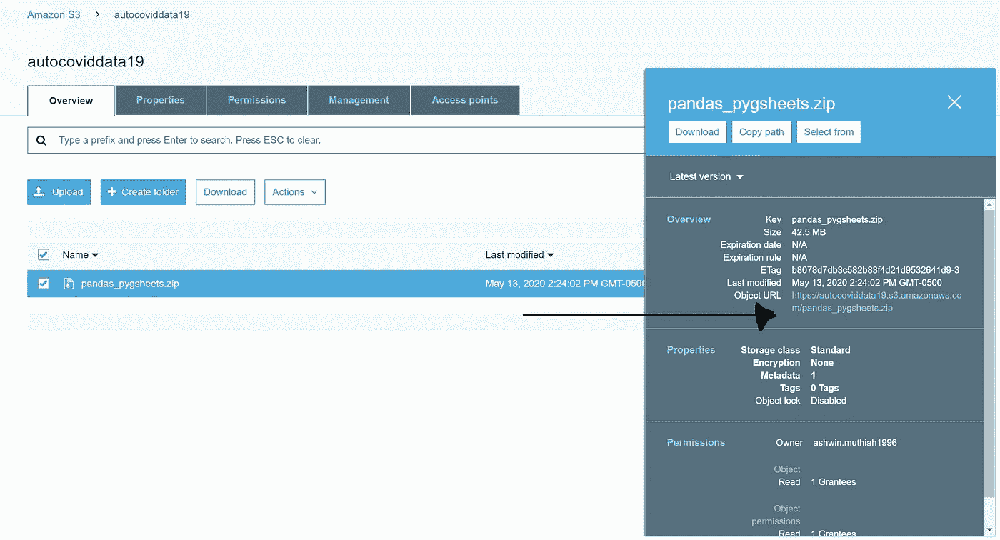

# 使用 AWS Lambda 自动化 ETL

> 原文：<https://towardsdatascience.com/automating-etl-with-aws-lambda-97b9e3404929?source=collection_archive---------7----------------------->

## 使用 AWS Lambda 打包和部署无服务器 ETL 管道

哈桑·阿尔马西在 [Unsplash](https://unsplash.com?utm_source=medium&utm_medium=referral) 上的照片

## 介绍

我们周围的世界变化比以往任何时候都快。我们每天产生的数据量确实令人难以置信。每天会产生 2.5 万亿字节的数据，这意味着我们今天使用的数据明天可能就不再适用了。因此，我们需要一种方法来完全自动化我们的数据流流程，好消息是您不必担心需要昂贵的服务器和硬件来实现这一点，AWS 让您可以通过高性能和可扩展性的额外优势来实现这一点。

在本文中，我们将只使用 AWS 免费层产品。所以你可以跟着去。在我们开始这个过程之前，我们需要了解我们将要使用的 3 个 AWS 服务 EC2、AWS Lambda 和 Cloudwatch。

## **EC2**

亚马逊[弹性计算云](https://aws.amazon.com/ec2/) (EC2)是一项让你租用虚拟机的服务。我们可以用我们想要的任何配置(操作系统、存储等)启动一个[虚拟机](https://en.wikipedia.org/wiki/Virtual_machine)。)任何我们想要的时间。

## **λ**

[AWS Lambda](https://aws.amazon.com/lambda/) 是一种无服务器计算服务，它运行我们的代码来响应事件，并自动为我们管理底层计算资源。我们可以使用 AWS Lambda 通过定制逻辑扩展其他 AWS 服务，或者创建我们的后端服务。 **AWS Lambda 可以自动运行代码来响应多个事件**，例如通过 Amazon API Gateway 的 HTTP 请求、对 Amazon S3 桶中对象的修改、Amazon DynamoDB 中的表更新。在我们的例子中，它将根据时间表运行代码。

## **云观察**

顾名思义， [CloudWatch](https://aws.amazon.com/cloudwatch/) 以日志、指标和事件的形式收集监控和运营数据，为我们提供运行在 AWS 和本地服务器上的 AWS 资源、应用程序和服务的统一视图。我们可以使用 CloudWatch 来检测我们环境中的异常行为，设置警报，并排显示日志和指标，**采取自动操作**，解决问题，并发现洞察力以保持我们的应用程序平稳运行。

AWS lambda 是我们进行编程以执行 ETL 的平台，但 AWS lambda 不包括大多数日常使用的包/库(Pandas，Requests ),标准的 **pip** install pandas **在 AWS Lambda 中无法工作**。所以需要在本地或者 EC2 虚拟机上安装**包/库，把它作为 **zip 文件上传到 S3**并作为**层**附加到 **Lambda 函数。****

这是我所说的工作流程的一个例子，

工作流程

## **创建并启动一个具有 S3 访问角色的 EC2 Linux 实例**

登录 AWS 控制台。在服务下，选择 EC2，然后启动实例:

选择启动实例

第一步:为我们的 EC2 实例选择操作系统，我选择了**Ubuntu Server 18.04 LTS(HVM)**，但是你也可以选择**Amazon Linux 2 AMI(HVM)**或者任何你喜欢的环境。****

********

****选择 Ubuntu Server 18.04 LTS (HVM)****

****第二步:选择一个实例类型，选择 t2.micro(它包含在免费层中，我们每个月最多可以获得 750 小时的微实例)。****

****步骤 3:配置实例细节，除了 **IAM 角色之外，其他都保留默认值。**使用 S3 访问权限创建新角色。选择“创建新的 IAM 角色”。****

********

****创建新的 IAM 角色****

****我们将被重定向到“IAM 角色”页面，在这里我们可以选择创建角色，然后选择 EC2****

********

****选择创建角色****

********

****选择 EC2****

****附加“AmazonS3FullAccess”策略来读写 S3 存储桶，并为角色命名。点击创建角色。****

********

****附加 S3FullAccess 策略，以便我们拥有对 S3 的读写权限****

********

****给出角色名称****

****返回到“启动实例”页面，点击“IAM 角色”旁边的“刷新”,选择我们刚刚创建的角色，然后点击“查看并启动”。如果需要，我们还可以设置存储、标记和配置安全组，但目前，默认设置是好的。****

********

****选择 IAM 角色****

****我们将转到步骤 7:查看实例启动-点击启动。系统将提示我们创建或选择一个密钥对。选择 create a new pair 并给它一个名字，**下载密钥对，**并点击 launch instance。****

********

****创建新的密钥对并启动实例****

****创建实例后，选择 view instance。然后选择我们刚刚创建的实例并点击 connect。****

********

****选择实例并点击连接****

****复制“示例”代码，并在计算机上的命令提示符下连接到实例。****

********

****复制示例代码并将其粘贴到命令提示符下****

****如示例所示粘贴 ssh 命令，更改密钥(my_key.pem)的路径，然后按 enter 键。一旦我们连接到我们的命令提示符，它应该看起来像这样。****

********

****命令提示符****

## ******在虚拟环境中安装我们需要的所有依赖项(库),将依赖项打包成一个 zip 文件，并将其导出到 S3******

****安装、打包和导出依赖项****

****按照上面的代码，我们已经成功地将打包的 zip 文件导出到一个 S3 桶中。****

## ******创建并添加 Lambda 图层******

****选择 AWS 控制台左上角的服务，导航到 AWS lambda，然后导航到 ***层。*** 选择***创建图层。*******

********

****选择创建层****

****复制我们上传到 S3 桶的 zip 文件的**对象 URL** ，并将其粘贴到**“亚马逊 S3 链接 URL”**文本框中。点击创建。****

********

****复制对象 URL****

********

****粘贴 S3 链接，选择兼容运行时****

****选择添加层，并选择我们创建的层和版本。点击添加。****

********

****添加层****

********

****选择你刚刚在最后一步创建的层，点击添加****

******创建 Lambda 函数******

****在 AWS lambda 控制台上，选择函数，然后点击创建函数。给函数起一个名字，并选择用来编写函数的语言。点击创建。****

********

****创建函数****

********

****给出函数名并选择运行时****

****更新 Lambda 函数来提取、转换和加载数据。在这里，我使用熊猫读取 CSV 文件，并将其存储在 S3 桶中。这是我们可以执行转换并决定将数据加载到哪里的地方，在我们的例子中，它是一个 S3 存储桶。****

****λ处理器****

****选择 test，为测试事件输入一个名称，其余的保持默认。点击保存。再次点击 test，代码执行我们的 ETL 过程。****

********

****选择屏幕右上角的测试，并添加测试名称****

********

****给测试事件起一个名字，剩下的保持默认****

****最后一步:计划你的 ETL 过程****

****选择 AWS 控制台左上角的服务，导航到 CloudWatch，然后依次导航到事件和规则。选择创建规则。****

********

****服务-云观察-事件-规则-创建规则****

****步骤 1:选择 schedule 后跟 Cron 表达式，输入 Cron 表达式(4 * *？* *)在每天 4:00 GMT 运行 Lambda 函数。****

****点击了解更多关于 Cron 的表情[。](https://docs.aws.amazon.com/AmazonCloudWatch/latest/events/ScheduledEvents.html#CronExpressions)****

****第 2 步:输入名称和描述。选择创建规则。****

********

****创建规则****

********

****给规则命名和描述****

****恭喜👏！！我们的 ETL 过程是自动化的，将每 24 小时在格林威治时间 4:00 更新一次。****

****PS:确保终止 EC2 以及任何弹性块存储(EBS ),这样您就不会超出自由层的使用范围。****

****祝您的无服务器之旅好运！我希望这篇文章是有帮助的，如果你有任何问题，请随时联系我。****

**** [## Ashwin Muthiah Murugappan -市场监督后数据分析师

### 我是一名充满热情的工业工程研究生，拥有学习先进技术的巨大潜力

www.linkedin.com](https://www.linkedin.com/in/ashwinmuthiah/)****