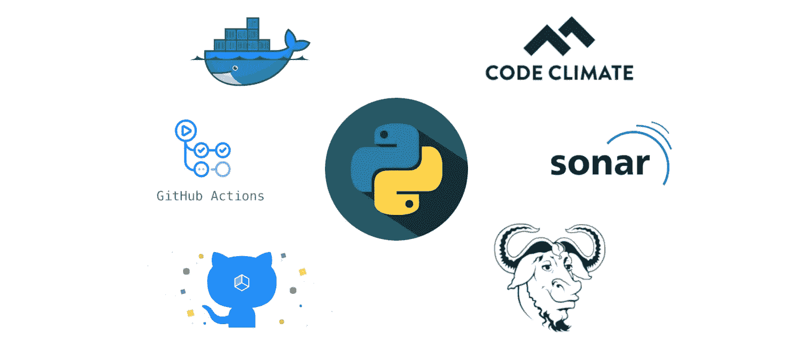

# 自动化 Python 项目的各个方面

> 原文：<https://towardsdatascience.com/automating-every-aspect-of-your-python-project-6517336af9da?source=collection_archive---------3----------------------->

每个 Python 项目都可以从使用 Makefile、优化的 Docker 映像、配置良好的 CI/CD、代码质量工具等自动化中受益…

每个项目——不管你是在做 web 应用、一些数据科学还是人工智能——都可以受益于配置良好的 CI/CD、Docker 映像，它们既可以在开发中调试，又可以针对生产环境进行优化，或者受益于一些额外的代码质量工具，如 *CodeClimate* 或 *SonarCloud* 。所有这些都是我们将在本文中讨论的内容，我们将看到如何将它们添加到您的 *Python* 项目中！

*这是上一篇关于创建* [*【终极】Python 项目设置*](/ultimate-setup-for-your-next-python-project-179bda8a7c2c) *的文章的后续，所以在阅读本文之前，您可能需要检查一下。*

*TL；DR:这是我的储存库，里面有完整的源代码和文档:*[*https://github.com/MartinHeinz/python-project-blueprint*](https://github.com/MartinHeinz/python-project-blueprint)

# 用于开发的可调试 Docker 容器

有些人不喜欢 Docker，因为容器可能很难调试，或者因为它们的映像需要很长时间来构建。因此，让我们从这里开始，构建开发的理想映像——构建速度快且易于调试。

为了使映像易于调试，我们将需要基本映像，它包括*所有*我们调试时可能需要的工具——比如`bash`、`vim`、`netcat`、`wget`、`cat`、`find`、`grep`等。似乎是这项任务的理想人选。默认情况下，它包括许多工具，我们可以很容易地安装所有缺少的东西。这个基础图像很厚，但这并不重要，因为它将只用于开发。你可能也注意到了，我选择了非常特殊的镜像锁定 *Python* 和 *Debian* 的两个版本——这是有意的，因为我们想最小化由 *Python* 或 *Debian* 的更新的、可能不兼容的版本引起的*“破损”*的可能性。

作为替代方案，您可以使用基于*阿尔卑斯山*的图像。然而，这可能会导致一些问题，因为它使用了`musl libc`而不是 *Python* 所依赖的`glibc`。所以，只要记住这一点，如果决定选择这条路线。

至于构建的速度，我们将利用多阶段构建来允许我们缓存尽可能多的层。这样我们可以避免下载依赖项和工具，如`gcc`，以及我们的应用程序所需的所有库(从`requirements.txt`)。

为了进一步加快速度，我们将从前面提到的`python:3.8.1-buster`创建自定义基础映像，这将包括我们需要的所有工具，因为我们无法缓存下载和安装这些工具到最终转轮映像所需的步骤。

说够了，让我们看看`Dockerfile`:

上面你可以看到，在创建最终的*流道*图像之前，我们将通过 3 个中间图像。其中第一个被命名为`builder`。它下载了构建最终应用程序所需的所有必要库，包括`gcc`和 *Python* 虚拟环境。安装后，它还创建实际的虚拟环境，然后由下一个映像使用。

接下来是`builder-venv`映像，它将我们的依赖项列表(`requirements.txt`)复制到映像中，然后安装它。缓存需要这个中间映像，因为我们只希望在`requirements.txt`改变时安装库，否则我们就使用缓存。

在创建最终图像之前，我们首先要对我们的应用程序进行测试。这就是在`tester`图像中发生的情况。我们将源代码复制到映像中并运行测试。如果他们通过，我们将继续进行`runner`。

对于跑步者图像，我们使用自定义图像，包括一些普通 *Debian* 图像中没有的额外图像，如`vim`或`netcat`。你可以在 *Docker Hub* [这里](https://hub.docker.com/repository/docker/martinheinz/python-3.8.1-buster-tools)找到这张图片，你也可以在`base.Dockerfile` [这里](https://github.com/MartinHeinz/python-project-blueprint/blob/master/base.Dockerfile)查看非常简单的`Dockerfile`。因此，我们在这个最终映像中要做的是——首先，我们从`tester`映像中复制包含所有已安装依赖项的虚拟环境，接下来，我们复制已测试的应用程序。现在我们已经有了映像中的所有源代码，我们移动到应用程序所在的目录，然后设置`ENTRYPOINT`以便它在映像启动时运行我们的应用程序。出于安全原因，我们还将`USER`设置为 *1001* ，因为最佳实践告诉我们永远不要在`root`用户下运行容器。最后两行设置图像的标签。当使用`make`目标运行构建时，这些将被替换/填充，稍后我们将看到。

# 用于生产的优化码头集装箱

对于生产级图像，我们希望确保它们小巧、安全、快速。我个人最喜欢的任务是来自*distroles*项目的 *Python* 图像。然而什么是*distroles*？

让我这么说吧——在一个理想的世界中，每个人都将使用`FROM scratch`作为他们的基础图像来构建他们的图像(即空图像)。然而，这不是我们大多数人想做的，因为它需要你静态地链接你的二进制文件，等等。这就是*distroles*发挥作用的地方——这是*大家*的`FROM scratch`。

好了，现在来实际描述一下*发行版*是什么。这是由*谷歌*制作的一组图像，包含你的应用程序所需的最少内容，这意味着没有外壳、包管理器或任何其他工具会使图像膨胀，并为安全扫描仪(如 [CVE](https://cve.mitre.org/) )产生信号噪声，从而更难建立合规性。

既然我们知道我们在处理什么，让我们看看*生产*...实际上，我们不会改变太多，只有两行:

我们需要改变的只是构建和运行应用程序的基础映像！但是差别是相当大的——我们的开发映像是 1.03GB，而这一个只有 103MB，这是相当大的差别！我知道，我已经能听到你了— *“但是阿尔卑斯山可以更小！”是的，没错，但是大小没那么重要*。你只会在下载/上传的时候注意到图片的大小，这并不常见。当图像运行时，大小根本不重要。比尺寸更重要的是安全，在这方面*distroles*肯定更胜一筹，因为 *Alpine* (这是一个很好的选择)有很多额外的包，增加了攻击面。**

*在谈论*发行版*时，最后值得一提的是*调试*映像。考虑到*发行版*不包含*任何*外壳(甚至不包含`sh`)，当你需要调试和探索时，这变得相当棘手。为此，所有的*发行版*镜像都有`debug`版本。因此，当便便遇到麻烦时，您可以使用`debug`标记构建您的生产映像，并将其部署在您的正常映像旁边，执行到其中，并执行例如线程转储。你可以像这样使用`python3`镜像的调试版本:*

# *一切只需一个命令*

*所有的`Dockerfiles`都准备好了，让我们用`Makefile`来自动化它吧！我们要做的第一件事是用 *Docker* 构建我们的应用程序。因此，要构建开发映像，我们可以执行`make build-dev`，它运行以下目标:*

*该目标通过首先用运行`git describe`然后运行`docker build`创建的图像名称和标签替换`dev.Dockerfile`底部的标签来构建图像。*

*接下来—使用`make build-prod VERSION=1.0.0`进行生产建设:*

*这一个与前面的目标非常相似，但是在上面的例子`1.0.0`中，我们将使用版本作为参数传递，而不是使用`git`标签作为版本。*

*当你在 *Docker* 中运行所有东西时，你将需要在 *Docker* 中调试它，为此，有以下目标:*

*从上面我们可以看到入口点被`bash`覆盖，容器命令被参数覆盖。通过这种方式，我们可以直接进入容器，或者运行一个 off 命令，就像上面的例子一样。*

*当我们完成编码并希望将图像推送到 *Docker* 注册表时，我们可以使用`make push VERSION=0.0.2`。让我们看看目标做了什么:*

*它首先运行我们之前看到的`build-prod`目标，然后只运行`docker push`。这假设你已经登录到 *Docker* 注册表，所以在运行之前你需要运行`docker login`。*

*最后一个目标是清理*码头*工件。它使用被替换到`Dockerfiles`中的`name`标签来过滤并找到需要删除的工件:*

*你可以在我的知识库中找到这个`Makefile`的完整代码清单:[https://github . com/MartinHeinz/python-project-blue print/blob/master/Makefile](https://github.com/MartinHeinz/python-project-blueprint/blob/master/Makefile)*

# *具有 GitHub 操作的 CI/CD*

*现在，让我们使用所有这些方便的`make`目标来设置我们的 CI/CD。我们将使用 *GitHub Actions* 和 *GitHub Package Registry* 来构建我们的管道(作业)和存储我们的图像。这些到底是什么？*

*   **GitHub 动作*是*作业/管道*帮助你自动化你的开发工作流程。您可以使用它们来创建单独的任务，然后将它们合并到定制的工作流中，然后在每次推送至存储库或创建发布时执行这些工作流。*
*   **GitHub 包注册表*是一个包托管服务，与 GitHub 完全集成。它允许您存储各种类型的包，例如 Ruby *gems* 或 *npm* 包。我们将使用它来存储我们的 *Docker* 图像。如果你不熟悉 *GitHub 包注册表*并且想要更多关于它的信息，那么你可以在这里查看我的博客文章[。](https://martinheinz.dev/blog/6)*

*现在，要使用 *GitHub 动作*，我们需要创建*工作流*，这些工作流将基于我们选择的触发器(例如，推送至存储库)来执行。这些*工作流*是位于我们存储库中`.github/workflows`目录下的 *YAML* 文件:*

*在那里，我们将创建两个文件`build-test.yml`和`push.yml`。首先，`build-test.yml`将包含两个作业，每次推送至存储库时都会触发这两个作业，让我们来看看这些作业:*

*名为`build`的第一个作业验证了我们的应用程序可以通过运行我们的`make build-dev`目标来构建。在运行它之前，它首先通过执行发布在 *GitHub* 上的动作`checkout`来检查我们的存储库。*

*第二项工作稍微复杂一些。它针对我们的应用程序以及 3 个 linters(代码质量检查器)运行测试。与之前的工作一样，我们使用`checkout@v1`动作来获取源代码。之后，我们运行另一个名为`setup-python@v1`的已发布操作，它为我们建立了 python 环境(你可以在这里找到关于它的详细信息[)。现在我们有了 python 环境，我们还需要来自`requirements.txt`的应用程序依赖项，我们用`pip`安装它。此时，我们可以继续运行`make test`目标，这将触发我们的 *Pytest* 套件。如果我们的测试套件通过，我们将继续安装前面提到的棉条- *皮林特*、*薄片 8* 和*土匪*。最后，我们运行`make lint` target，它触发每个 linters。](https://github.com/actions/setup-python)*

*这就是构建/测试工作的全部内容，但是推送工作呢？让我们也回顾一下:*

*前 4 行定义了我们希望何时触发该作业。我们指定这个作业应该只在标签被推送到存储库的时候开始(`*`指定标签名的模式——在这个例子中是——*任何东西*)。这样我们就不会在每次推送到存储库时都将 Docker 映像推送到 GitHub 包注册表中，而是只有在我们推送到指定应用程序新版本的标签时才会这样做。*

*现在是这项工作的主体——首先检查源代码，并将环境变量`RELEASE_VERSION`设置为我们推送的`git`标签。这是通过使用 *GitHub 动作*的内置`::setenv`功能完成的(更多信息[在此](https://help.github.com/en/actions/automating-your-workflow-with-github-actions/development-tools-for-github-actions#set-an-environment-variable-set-env))。接下来，它使用存储在存储库中的`REGISTRY_TOKEN`密码和启动工作流的用户的登录名(`github.actor`)登录 Docker registry。最后，在最后一行运行`push` target，它构建 prod image 并将其与之前作为 image 标记的`git`标记一起放入注册表。*

*你可以在我的库[中的文件里签出完整的代码清单。](https://github.com/MartinHeinz/python-project-blueprint/tree/master/.github/workflows)*

# *使用 CodeClimate 进行代码质量检查*

*最后但同样重要的是，我们还将使用 *CodeClimate* 和 *SonarCloud* 添加代码质量检查。这些将与上面显示的我们的*测试*作业一起触发。所以，让我们给它添加几行:*

*我们从 *CodeClimate* 开始，首先导出`GIT_BRANCH`变量，我们使用`GITHUB_REF`环境变量检索该变量。接下来，我们下载*code climate*test reporter 并使其可执行。接下来，我们使用它来格式化由我们的测试套件生成的覆盖率报告，在最后一行，我们将它发送给 *CodeClimate* ，它带有测试报告者 ID，我们将它存储在存储库 secrets 中。*

*至于 *SonarCloud* ，我们需要在我们的存储库中创建`sonar-project.properties`文件，如下所示(该文件的值可以在右下角的 *SonarCloud* 仪表板上找到):*

*除此之外，我们可以使用现有的`sonarcloud-github-action`，它为我们做了所有的工作。我们所要做的就是提供两个令牌- *GitHub* 一个是默认在存储库中的，另一个是 *SonarCloud* 令牌，我们可以从 *SonarCloud* 网站获得。*

**注意:关于如何获取和设置前面提到的所有令牌和秘密的步骤在资源库自述* [*这里*](https://github.com/MartinHeinz/python-project-blueprint/blob/master/README.md) *。**

# *结论*

*就是这样！有了上面的工具、配置和代码，您就可以构建和自动化下一个 *Python* 项目的所有方面了！如果你需要更多关于这篇文章中所展示/讨论的主题的信息，那么就在这里查看我的资源库中的文档和代码:【https://github.com/MartinHeinz/python-project-blueprint如果你有任何建议/问题，请在资源库中提交问题，或者如果你喜欢我的这个小项目，就开始吧。🙂*

# *资源*

*   *[Python 应用程序的最佳 Docker 基础映像](https://pythonspeed.com/articles/base-image-python-docker-images/)*
*   *[谷歌发行版](https://github.com/GoogleContainerTools/distroless)*
*   *[扫描您的 Docker 映像中的漏洞](https://medium.com/better-programming/scan-your-docker-images-for-vulnerabilities-81d37ae32cb3)*
*   *[5 款用于容器安全的开源工具](https://opensource.com/article/18/8/tools-container-security)*
*   *[SonarCloud GitHub 动作](https://github.com/SonarSource/sonarcloud-github-action)*

**本文最初发布于*[*martinheinz . dev*](https://martinheinz.dev/blog/17)*