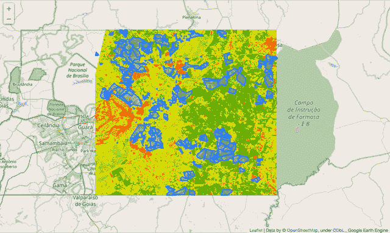
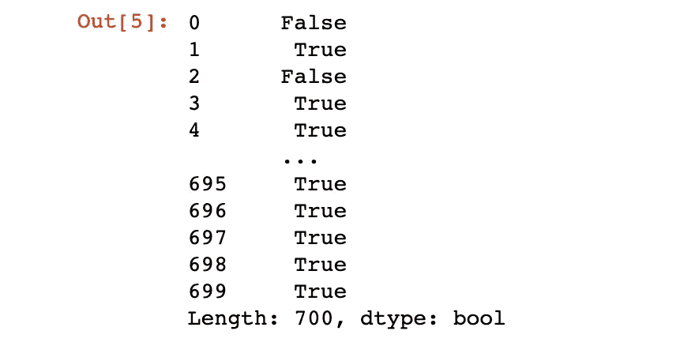
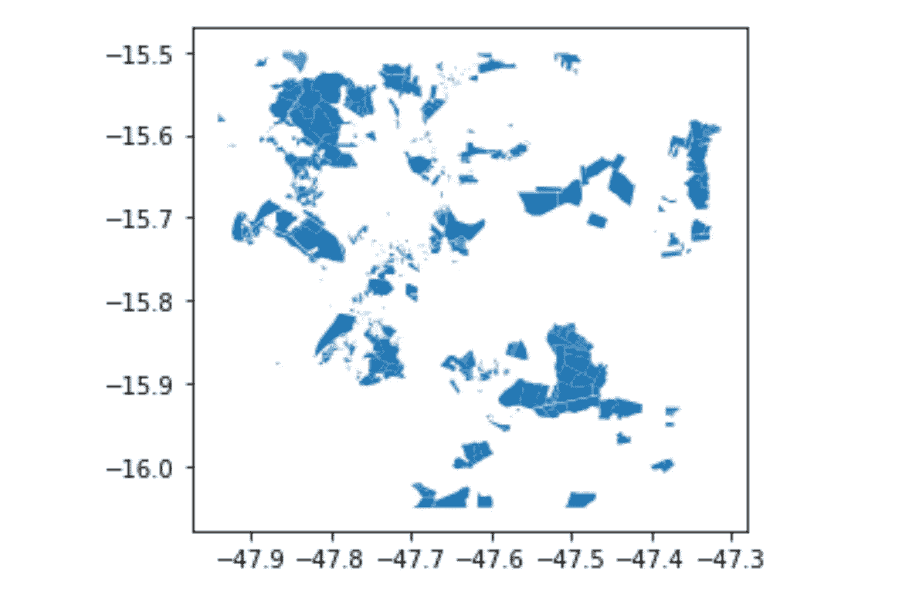
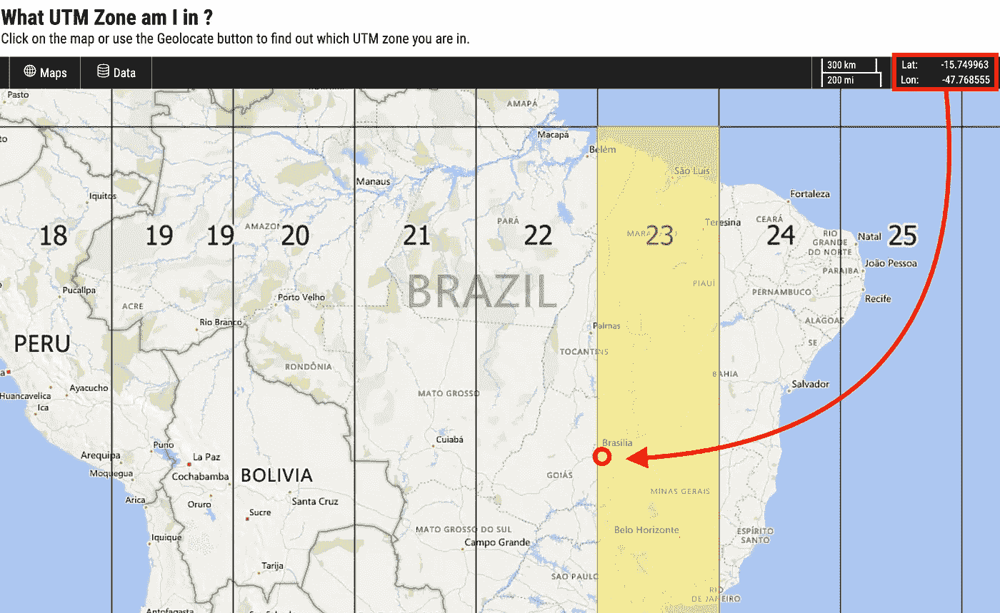
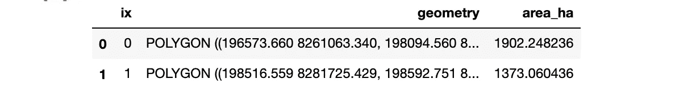
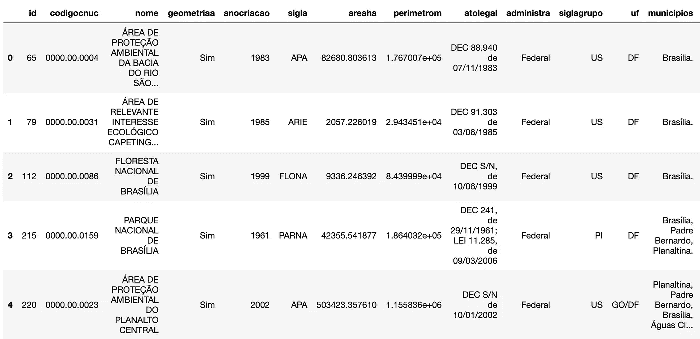
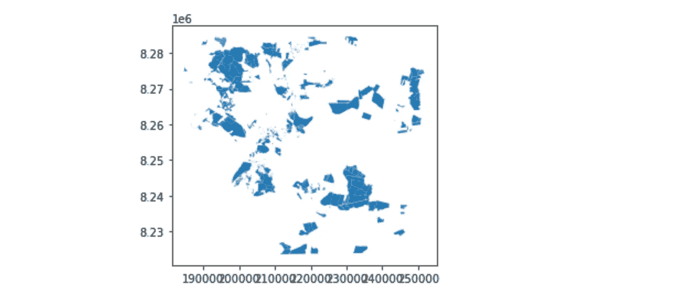
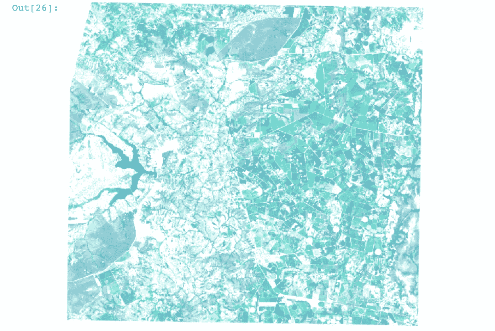
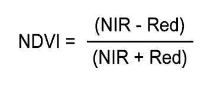
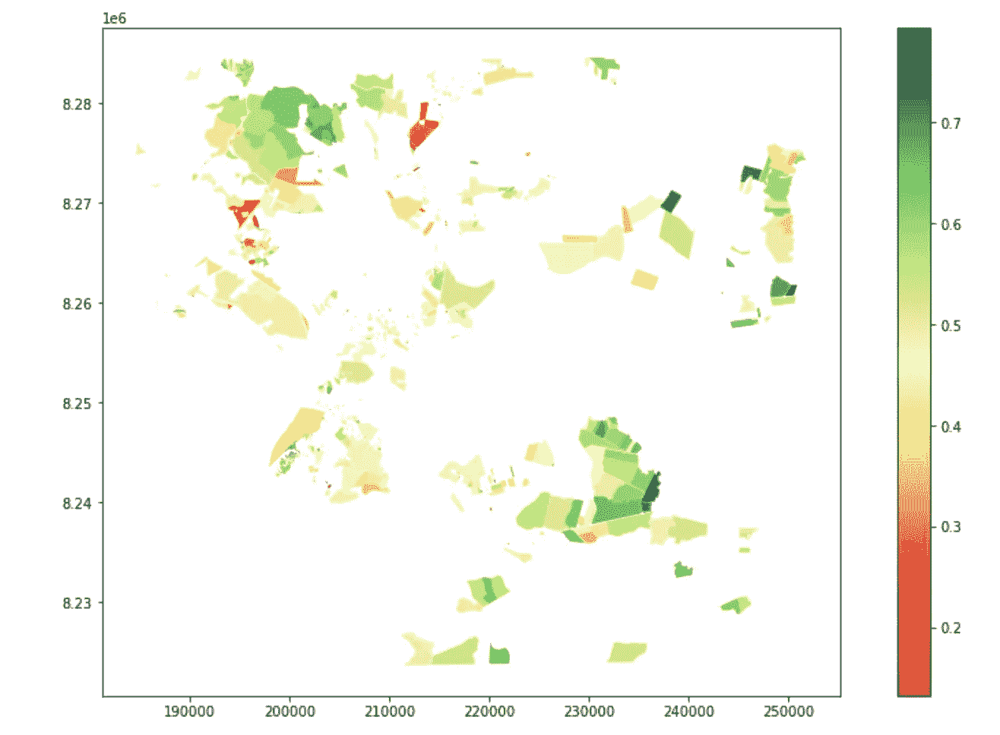

# 使用开放式 python 库实现 GIS 和遥感工作流的自动化

> 原文：<https://towardsdatascience.com/automating-gis-and-remote-sensing-workflows-with-open-python-libraries-e71dd6b049ee?source=collection_archive---------16----------------------->

## 实现空间 python 社区中一些最受欢迎的工具的实践指南

在我的职业生涯中，我使用 ArcGIS 平台参与了许多地理空间相关的项目，我非常喜欢这个平台。这意味着我可以在具有尖端地理空间技术的项目中提供咨询，如[多维栅格、深度学习和空间物联网自动化](https://www.esri.com/en-us/about/events/uc/overview)。考虑到这一点，我总是试图跟踪如何在没有 Esri 精美制作的系统的情况下执行我正在使用的 ***相同的操作。***

在过去的几个周末，在异常乏味的隔离期间，我一直在编写这个小脚本，它将重现我一直在用 [ESRI 的生活地图集](https://livingatlas.arcgis.com/)开发的东西，以实现 **NDVI 区域统计** ( [归一化差异植被指数](https://en.wikipedia.org/wiki/Normalized_difference_vegetation_index)，遥感中的经典)**农村地块的**。

这里的计划是在不借助任何 GIS 桌面软件的情况下执行整个地理处理和遥感例程。我们从一个包含我们感兴趣的一些宗地的图层和一个包含特殊立法适用的保护区的图层开始。python 之外什么都不允许！这是我们今天的计划:

1.  检查 parcels geojson 图层中的无效几何并进行更正；
2.  以公顷为单位计算每个地块的面积；
3.  验证每个宗地是否与任何保护区相交；
4.  计算每个宗地的相交面积，并在宗地属性中插入受保护区域的名称；
5.  获得最新的五张没有云的 Sentinel-2 卫星图像；
6.  计算每幅图像上的 NDVI；
7.  计算分区统计数据(平均值、最小值、最大值和标准差)。戴夫。)为每个包裹上的 NDVI；
8.  创建显示每个宗地中裁剪结果的地图。

# 我们开始吧

所以。重要的事情先来。我们必须导入存储有地块的 geojson 文件。为此，我们将使用 [geopandas 库](https://geopandas.org/)。如果你不熟悉它，我的建议是熟悉它。Geopandas 基本上用 python 模拟了我们在经典 GIS 桌面软件(GRASS、GDAL、ArcGIS、QGIS……)中使用的功能，其方式与数据科学家非常流行的工具 pandas 一致，允许对几何类型进行空间操作。

为了导入我们的 geojson，我们首先必须注意 geopandas 中的数据类型。基本上，当我们运行`.read_file`方法时，我们给`polygons`变量分配了一个`geodataframe`类型。在每个`geodataframe`内部总会有一个`geoseries`，我们可以通过`.geometry`方法访问它。一旦我们找到了`geoseries`，我们就可以利用`.isvalid`方法，为我们系列中的每条记录生成一个真/假值列表。

当然，我们的数据集中存在无效的几何图形。这并不奇怪，因为这些地块来自汽车登记处，巴西的每个农村土地所有者都必须自行申报他们自己的财产范围。

那么，我们如何解决这个问题呢？也许您习惯于运行 ArcGIS 或 QGIS 中的 excelent 无效几何检查工具，这些工具甚至会生成一份报告，说明表中每条记录的问题所在。但我们无法接触到地质公园里的那些东西。相反，我们将做一点小技巧来修正几何图形，对所有几何图形应用 0 米缓冲。

现在我们终于可以通过使用`.plot`方法来看看我们的多边形了，这个方法实际上是从`geopandas`中的`matplotlib`组件继承来的。

这是快速了解我们的数据在空间上的样子的一种快速而有用的方法，但它与地图不同。

# 计算面积

因为我们想知道我们每块土地的公顷面积，我们需要确保我们的地理数据框架在**投影坐标系**中。如果您不熟悉坐标参考系统(CRS ),您至少需要知道的是*地理坐标系统*以度为单位(如纬度和经度),而*投影坐标系统*以距离为单位，使我们能够使用公制计算面积。从我们刚刚创建的绘图中，我们可以看到多边形可能是根据纬度和经度绘制的，大约在-15.7，-47.7 之间。如果我们运行`print(polygons.crs)`，我们将得到`epsg:4326`作为响应。有许多可用的坐标系统，因此 EPSG 系统是跟踪它们的一个非常好的方法； **4326** 表示我们的地理数据框架在 WGS84 坐标系中——实际上是一个*地理坐标系*。

所以我们**确实**需要转换我们地理数据框架的坐标系。为此，我们必须首先决定*我们将把它转换成哪个*系统。在这一点上，我非常习惯于从一个系统转换到另一个系统，但如果你有点迷路，选择投影坐标系的一个好方法是使用 WGS84 系统的**墨卡托**通用横轴投影。所以你要做的就是找出你的数据在哪个 **UTM** **区域**，这样你就知道那是你的数据面积失真最小的区域。一个很好的方法就是这个小小的[网络应用](https://mangomap.com/robertyoung/maps/69585/what-utm-zone-am-i-in-#)。

我们知道我们的数据在[-15.7，-47.7 ]坐标附近的某个地方，所以现在我们知道这相当于 23 度 UTM 区，而且就在巴西利亚市旁边！

所以剩下的就是访问 EPSG 权威网站并检查我们选择的投影的 EPSG 代码。接下来，我们需要使用`.to_crs`方法定义一个新的地理数据框架变量。

现在，我们可以在新的地理数据框架中创建一个新的列，我将其命名为`area_ha`，并计算面积(单位为米，因为我们使用的是 UTM 投影),我们必须除以 10，000 才能得到公顷。

这是我们新的地理数据框架的头部。现在填充 area_ha 字段的值看起来比例正确。

# 检查覆盖

现在，我们可以导入提供给我们的第二个图层，该图层包含所有保护区(UCs，或*Unidades de conservao*),这些保护区可能代表我们正在分析的地块中农业用途的法律限制。我们将导入它，就像我们导入之前的 *geojson* 一样。这一次的主要区别在于，这段数据实际上有更多的字段，有保护区的名称、创建日期以及更多的法律信息。

一个更加丰富的数据集，用 geopanda 绘制。头法。

我们感兴趣的是将所有丰富的信息放入与给定保护区相交的地块的属性表中。使用**叠加**方法，Geopandas 实际上很容易做到这一点。它确实**字面上的** **正是我们要找的**。在我们的示例中，它将创建一个新的地理数据框，其中每个地块的每个相交部分都有一条记录，并包含有关其相交的受保护区域的信息。这样，我们就可以像以前一样，以公顷为单位计算相交区域的新字段。

它看起来像以前的同一块地，但现在我们的土地被分成更小的部分，如果它们与任何保护区相交的话。另外，它们现在包含了更多有用的信息。

# 现在是遥感部分

我们已经完成了本文的 GIS 部分，现在事情变得有趣了。我们想很好地了解每个地块的植被状况，因此我们将尝试获取最新的(免费)卫星图像，并进行一些分析。有许多免费卫星图像的选项，如 [Landsat 系列](http://Landsat Sciencelandsat.gsfc.nasa.gov)，但 [ESA 的 Sentinel2](https://sentinel.esa.int/web/sentinel/missions/sentinel-2) 任务提供了体面的空间比例(20x20m 像素)的免费图像。

要访问它，我们可以使用不止一个库。[哨兵枢纽](https://www.sentinel-hub.com/explore/data/)是一个坚实的，ArcGIS 生活地图集是另一个。但我个人的选择是**谷歌地球引擎**，原因很简单:只需稍作改动，我们就可以用相同的代码访问来自 Landsat **和** Sentinel 的数据，而且它**(仍然)**可以免费使用——但[让我们不要忘记谷歌地图 API](https://geoawesomeness.com/developers-up-in-arms-over-google-maps-api-insane-price-hike/?utm_campaign=carto%205&utm_source=hs_email&utm_medium=email&utm_content=62891143&_hsenc=p2ANqtz-9nilydL_moIkOv83zCc1vzs9B05NGY7pdrPuAmsw81-w_5-8Wl0uDOwOsL39g02nW7IeLizDEXm93jFIkRxnVdnieqgw&_hsmi=62891349&fbclid=IwAR2FAVCkK0mH9xkUZp6OMqY6hb2oKvIJOb6Eosvy8LEGipF66tsFU31Rj-o) 发生了什么。这里真正的缺点是 GEE 的 python API 没有很好的文档记录。

我们想做的事情相当简单。我们必须从 GEE 调用 **Sentinel 2 图像集合**，根据感兴趣的区域、日期和云百分比对其进行过滤，并获得集合中最新的五幅图像。为了获得感兴趣的区域，我们必须使用 geopandas 再运行一个命令，即`.total_bounds`方法，这将为我们提供一个矩形的坐标，该矩形包含我们地块的全部范围。

我们已经获取了这五张最新的图片，并将它们存储在我们的`collectionList`变量中。但是让我们看一看，以确保卫星图像确实符合我们的期望。为此，让我们使用地球引擎的`.Image`，将其设置为 RGB 合成——在 Sentinel 2 中，这意味着使用波段 4、3 和 2——并使用 Ipython 的`.display`绘制它。

看起来不错，巴西利亚。

# 计算 NDVI

这一点其实很简单。GEE 使得计算归一化差异变得非常容易，这正是 NDVI 的情况:

> **归一化差异植被指数** ( **NDVI** )是一个简单的图形指示器，用于评估**被观测目标是否包含活的绿色植被**。与其他波长相比，健康的植被(叶绿素)反射更多的近红外(NIR)和绿光。但是它吸收更多的红光和蓝光。
> 
> NDVI 通过测量**近红外**(植被强烈反射)和**红光**(植被吸收)之间的**差**来量化植被。像陆地卫星[和](https://gisgeography.com/landsat-program-satellite-imagery-bands/) [Sentinel-2](https://gisgeography.com/how-to-download-sentinel-satellite-data/) 这样的卫星传感器都有必要的近红外和红光波段。

NDVI 公式，或近红外和红光之间的归一化差异。

在 GEE 中，我们只需要使用正确波段的`.normalizedDifference`方法。在我们的例子中，是波段 8(近红外)和波段 4(红色)。通常情况下，就是这样，但我是一个老式的 GIS 极客，所以我需要在地图上查看我的数据，以确保一切正常。

为此，我将创建一个简单的[树叶](https://python-visualization.github.io/folium/)地图——一种使用 python 渲染传单地图的方法——并将 NDVI 栅格和地块 geojson 加载到其中。

# 区域统计很有趣

我们快完了。我们现在需要做的是恢复我们刚刚为每个地块中的五个哨兵 2 图像计算的 NDVI 数据。遥感领域的人们已经这样做了很多年，使用了一种叫做**区域统计**的东西。该工具存在于许多 GIS 桌面软件中，甚至在 GEE python API 中也是可行的-同样，文档记录很少。为了简单、易于访问和可靠，我的首选工具实际上是 [**rasterstats**](https://pythonhosted.org/rasterstats/) 。

问题是，到目前为止，我们一直在用自己的格式处理图像。并且 *rasterstats* 将需要那些老派。TIF 档案。所以我们要把图像导出到本地文件夹。

最后，这是奇迹发生的地方。让我们使用一个小 for 循环来打开每个本地 NDVI 栅格文件，计算每个地块的统计数据，然后将*的平均值、最小值、最大值和标准偏差*的结果附加到熊猫的数据帧中。

我们已经为每个图像的每个 stat 创建了一个字段，所以我们将为每种请求的统计类型(最小值、最大值、平均值和标准值)创建五个字段。戴夫。)

现在，我们可以像以前一样，通过绘制数据来可视化每个地块中的 NDVI 统计数据，只是这次我们可以告诉 matplotlib 使用哪一列和哪一种配色方案。由于结果看起来不错，我们可以将地理数据框架导出到 geojson 文件中，并与不太懂技术的同事共享。

这是我们最近的哨兵 2 图像的平均 NDVI 属性的可视化。

# 这是所有的乡亲

这一块就到此为止！我们已经成功实施了经典的地理处理和遥感工作流，无需使用 ArcGIS 或 QGIS 一次！你可以在我的 Github 页面找到整个工作流程。如果你有问题或建议，不要犹豫，随时给我写信！

如果你喜欢这篇文章，考虑给我买一杯咖啡，这样我就可以继续写更多的文章了！

 [## 古伊列梅·亚布洛诺夫斯基正在传播空间数据科学

### 嘿👋我刚刚在这里创建了一个页面。你现在可以给我买杯咖啡了！

www.buymeacoffee.com](https://www.buymeacoffee.com/guilhermeiablo)  [## guillermeiablo/ndvistats

### jupyter Notebook com flow to cálculo de statistics zones para poli gonos selectors utilizations to geo pandas，google…

github.com](https://github.com/guilhermeiablo/ndvistats)