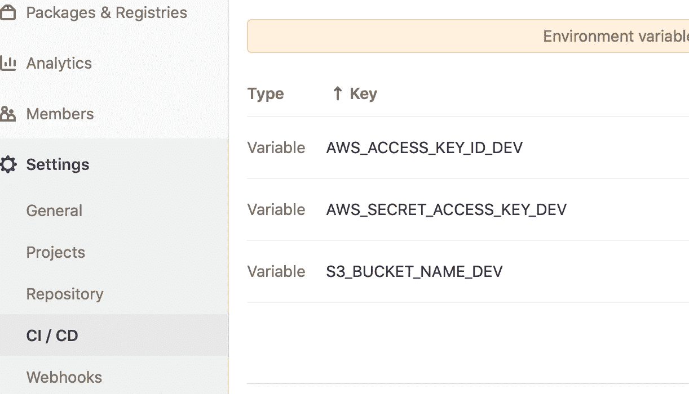

# 使用 GitLab CI 自动部署 Lambda 模块

> 原文：<https://towardsdatascience.com/automating-lambda-modules-deployment-with-gitlab-ci-b34cc58a7ac0?source=collection_archive---------20----------------------->


在 [Unsplash](https://unsplash.com?utm_source=medium&utm_medium=referral) 上 [Sai Kiran Anagani](https://unsplash.com/@_imkiran?utm_source=medium&utm_medium=referral) 拍摄的照片

在使用 terraform lambda 模块时，我很难找到最佳的存储库架构来自动化我的 lambdas 部署。我找不到任何可以作为指南的文章，这就是我写这篇文章的原因。

在从事大型项目时，项目组织是必备的*。在这个故事中，您将会看到一种组织您的存储库的方法，这样可以简化部署过程，使其更具*可扩展性*。*

*在本文中，我们将构建以下存储库架构:*

*   ***Lambda 模块**:包含 Terraform Lambda 模块的存储库。*
*   ***Lambda-Infra** :包含部署到 AWS 中的 Terraform 代码的存储库。*
*   ***Lambda 代码**:包含使用 Gitlab-CI 进行部署的 Lambda 代码的存储库。*

# *λ模块*

*由 *HashiCorp:* 定义*

> **模块*是一起使用的多个资源的容器。*

*使用 terraform 模块解决了组织配置、封装配置、重用配置等问题，并且它提供了一致性并确保最佳实践。*

*我们将使用一个 AWS lambda 模块，可以在[这里](https://github.com/DanielDaCosta/lambda-module)找到。我不会深入讨论如何构建 lambda 模块的细节，因为这不是本文的主要目标。*

# *λ-Infra*

*一旦你准备好了你的模块，你就可以建立一个仓库来集中你所有的 lambdas 基础设施。在下面的例子中，每个*。tf* 代表不同的λ。*

```
*.
├── README.md
├── lambda_alarm.tf
├── lambda_general.tf
├── lambda_sms.tf*
```

*准备好 lambda 模块后，你可以用它来构建你的 lambda 基础设施。*

*从下面的代码中可以看出，我们将 lambda zip 文件存储在 s3 bucket 中，该 bucket 已经激活了版本控制。这是至关重要的一步，因为 s3 中 zip 文件的*版本 id* 将触发 lambda 的重新部署，以防代码发生任何变化。*

*在上面的例子中， *lambda-sms.zip* 是我们的 lambda 源代码，将在下面定义。*

# *λ代码*

*为了自动化 lambda 部署，有必要压缩 lambda 代码并将其放入 s3 存储桶。*

*首先，让我们检查我们的 lambda 代码示例。*

```
*.
├── README.md
└── .gitlab-ci.yml
└── lambda
    ├── config.py
    ├── database.py
    ├── handler.py
    ├── package
    ├── queries
    │   └── save_data.sql
    └── requirements.txt*
```

*我们的 CI 将负责:*

*   *运行 *Flake8* 以检查语法错误和林挺惯例。*
*   *安装在 *requirements.txt* 中定义的 lambda 依赖项*
*   *压缩我们的代码*
*   *使用 AWS CLI 将其移动到 AWS s3 存储桶*

*遵循 AWS 中的*最小特权原则，*您应该创建一个只有 *Put-Object* 权限的 IAM 用户:*

*您将在 GitLab 项目的 CICD 设置中存储您的 AWS CLI 凭据:*

**

*GitLab CICD 设定截图*

*一切就绪后，当你将代码推送到主分支时，你的 lambda 代码将被压缩并存储在你的 S3 桶中。*

# *结论*

*让我们看一下所有的部署程序:*

*   *创建您的 lambda 代码，并将其推送到您的 GitLab 库。*
*   *然后，您的代码将被压缩并存储在您的版本化 s3 存储桶中。*
*   *用 l *ambda-infra* 代码运行 terraform。*
*   *Terraform 将检查您的 lambda 源代码的版本 id 的变化。*
*   *如果它检测到新的。zip 文件已经上传到 s3，它将重新部署您的 lambda。*

*这种架构让我的生活变得更加轻松，给了我的代码更多的可伸缩性。我希望它能像帮助我一样帮助你！*

# *参考*

*[](https://learn.hashicorp.com/tutorials/terraform/module?in=terraform/modules) [## 模块概述

### 当您使用 Terraform 管理基础设施时，您将创建越来越复杂的配置。没有…

learn.hashicorp.com](https://learn.hashicorp.com/tutorials/terraform/module?in=terraform/modules)  [## 自动从 Gitlab 上传文件到 S3

### 更新于 2017 年 12 月 3 日。最近开始使用 GitLab 和他们的自动化管道(GitLab CI)来托管…

correctme.ifiamwrong.com](https://correctme.ifiamwrong.com/posts/gitlabcitos3/)*