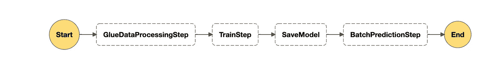
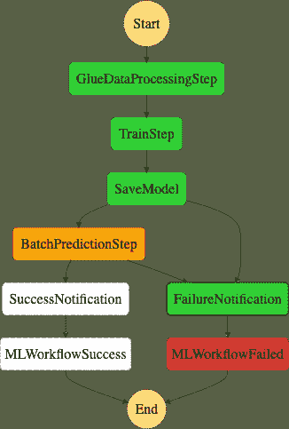
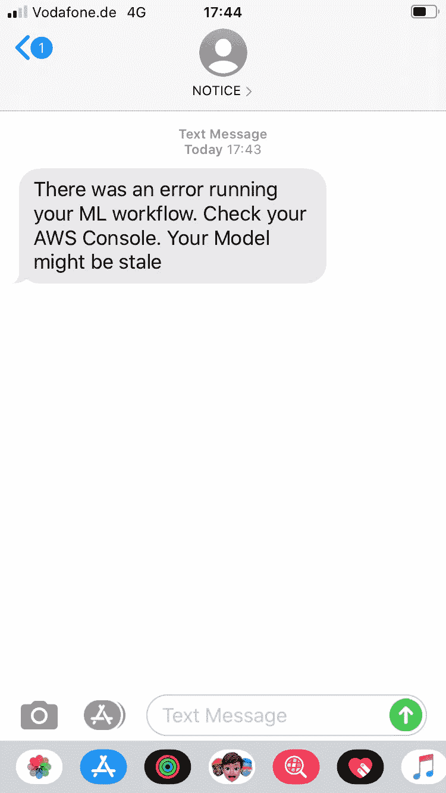

# 使用 Amazon Glue、Amazon SageMaker 和 AWS Step 函数 Data Science SDK 实现机器学习工作流的自动化

> 原文：<https://towardsdatascience.com/automating-machine-learning-workflows-with-aws-glue-sagemaker-and-aws-step-functions-data-science-b4ed59e4d7f9?source=collection_archive---------16----------------------->



使用 Amazon Glue、Amazon SageMaker 和 AWS Step 函数 Data Science SDK 实现机器学习工作流的自动化

自动化机器学习工作流有助于建立可重复和可再现的机器学习模型。这是将机器学习项目投入生产的关键一步，因为我们希望确保我们的模型是最新的，并且在新数据上表现良好。[亚马逊胶水](https://aws.amazon.com/glue/)、[亚马逊 SageMaker](https://aws.amazon.com/sagemaker/) 和 [AWS 步骤函数](https://aws.amazon.com/step-functions/)可以帮助在托管环境中自动执行从数据处理到模型部署的机器学习工作流。

在这篇文章中，我将使用上面提到的 AWS 服务来开发和自动化一个机器学习工作流，其中 [PySpark on AWS Glue](https://docs.aws.amazon.com/glue/latest/dg/aws-glue-programming-python-transforms.html) 用于数据准备和处理，Amazon SageMaker 用于模型训练和批量预测。这样做的目的是为了展示工程师和数据科学家如何快速轻松地创建自动化的机器学习工作流。

# AWS 服务:

**AWS Glue** 是一项完全托管的提取、转换和加载(ETL)服务，使客户能够轻松准备和加载数据进行分析。

**Amazon SageMaker** 是一项完全托管的服务，使数据科学家能够构建、训练、调整和部署任何规模的机器学习模型。该服务提供了一个功能强大、可扩展且易于使用的计算环境。

**Amazon Step Functions** 让您可以将多个 AWS 服务协调到无服务器工作流中，以便您可以快速构建和更新应用。

[**AWS Step 函数 Data Science SDK**](https://aws-step-functions-data-science-sdk.readthedocs.io/en/latest/) 是一个开源库，允许数据科学家使用 Amazon SageMaker 和 Amazon Step 函数轻松创建处理和发布机器学习模型的工作流。

# 概观

编排机器学习工作流程是生产 ML 的关键。为此，我用 AWS Step 函数和 Amazon SageMaker 创建了一个简单的端到端教程，使用了 AWS Data Science Step 函数 SDK。你可以在[Amazon sage maker Samples GitHub](https://github.com/awslabs/amazon-sagemaker-examples/tree/master/step-functions-data-science-sdk)仓库中找到完整的例子。

# 步伐

在这篇文章中，我们将按照以下步骤创建一个机器学习工作流:

*   在 AWS Glue 上编写用于数据处理的 PySpark 脚本
*   训练一个模型，使用[亚马逊 SageMaker XGboost 算法](https://docs.aws.amazon.com/sagemaker/latest/dg/xgboost.html)
*   部署模型
*   用[亚马逊 SageMaker 批量转换](https://docs.aws.amazon.com/sagemaker/latest/dg/batch-transform.html)进行批量预测

# 先决条件

为了完成这个例子，我建议您按照[亚马逊 SageMaker workshop 网站](https://sagemaker-workshop.com/introduction/notebook.html)上的步骤启动一个亚马逊 SageMaker 笔记本实例。我们还建议您阅读[如何创建运行 Amazon Glue 作业所需的 IAM 角色和权限](https://docs.aws.amazon.com/glue/latest/dg/getting-started-access.html)。

# 创建 PySpark 脚本在 Amazon Glue 上运行

我假设您已经熟悉编写 PySpark 作业。这个例子触及了 Glue 的基础，对于更复杂的数据转换，请仔细阅读亚马逊 Glue 和 PySpark。下面的代码片段展示了 AWS Glue 中简单的数据转换。

示例 Amazon Glue PySpark ETL 脚本

创建 PySpark 脚本后，该脚本必须上传到 S3 的一个位置，Amazon Glue 可以访问该位置:

```
$ aws s3 cp glue-etl-processing.py s3://my-code-bucket/glue/glue-etl-processing.py
```

一旦以上成功完成，我们将使用 [AWS Python SDK](https://boto3.amazonaws.com/v1/documentation/api/latest/index.html) 、 [Boto3](https://boto3.amazonaws.com/v1/documentation/api/latest/index.html) 来创建一个胶合作业。请参见下面的示例:

# 准备工作流程

在这篇文章中，我们将使用 Amazon SageMaker 内置的 XGBoost 算法来训练和托管一个回归模型。数据集来自[视频游戏销售预测亚马逊 SageMaker Workshop 示例](https://sagemaker-workshop.com/builtin/xgboost.html)。然而，我们不会深入研究完整的细节，因为它们可以在亚马逊 SageMaker Workshop 网站上找到。

为了准备工作流，我将使用[AWS Step Functions Data Science SDK](https://aws-step-functions-data-science-sdk.readthedocs.io/en/latest/)，这使得在 AWS 上创建 step function 状态机变得更加容易和快速。在下面的步骤中，我将展示如何为数据处理、Amazon SageMaker 模型培训和部署步骤以及 Amazon SageMaker 批量转换步骤创建一个粘合步骤。最后，我们将把这些步骤链接在一起，创建一个工作流，然后用 AWS 步骤函数执行该工作流。

**涂胶作业步骤**

AWS 将作业步骤与 AWS 步骤函数 SDK 粘合在一起

**亚马逊 SageMaker 估算器和训练步骤**

AWS 步骤函数 SDK 训练和模型步骤

最后，让我们将这些步骤串联起来，创建一个工作流

AWS 步骤功能 SDK 链工作流步骤


使用 Amazon Glue、Amazon SageMaker 和 AWS Step 函数 Data Science SDK 实现机器学习工作流的自动化

# 通过批量预测实现工作流程自动化

在本教程中，我们演示了如何使用 [AWS 步骤函数 SDK](https://aws-step-functions-data-science-sdk.readthedocs.io/) 运行 orchestrate 批处理推理机器学习学习管道，从使用[Amazon Glue](https://aws.amazon.com/glue/)for[py spark](https://spark.apache.org/docs/2.1.0/api/python/pyspark.sql.html)进行数据处理开始，到在 [Amazon SageMaker](https://aws.amazon.com/sagemaker/) 上进行模型创建和批处理推理。

# 结论

在这个例子中，我演示了如何使用 Amazon Step 函数创建机器学习工作流。您可以使用 Amazon CloudWatch 预定事件自动进行模型再训练。因为您可以每天进行批量预测，所以您可以用 AWS Glue 准备数据，运行批量预测，并用 step 函数 SDK 将整个步骤链接在一起。您还可以添加一个 [SNSStep](https://github.com/aws/aws-step-functions-data-science-sdk-python/blob/master/src/stepfunctions/steps/service.py#L98-L122) ，这样您就可以通过电子邮件、 [slack](https://github.com/aws-samples/serverless-sagemaker-orchestration) 或 SMS 获得关于您的 ML 工作流状态的通知。许多可能性…



使用 Amazon Glue、Amazon SageMaker 和 AWS Step Functions Data Science SDK 以及 SNS 通知实现机器学习工作流自动化

# 进一步阅读

*   [亚马逊步骤功能](https://aws.amazon.com/step-functions/)
*   [亚马逊 Step 函数开发者指南](https://docs.aws.amazon.com/step-functions/latest/dg/welcome.html)
*   [AWS Step Functions 数据科学 SDK](https://aws-step-functions-data-science-sdk.readthedocs.io/)
*   [亚马逊胶水](https://aws.amazon.com/glue/)

请分享您的想法和意见，期待您的反馈。您可以通过[电子邮件](mailto:elesin.olalekan@gmail.com)联系我，在 [Twitter](https://twitter.com/elesinOlalekan) 上关注我，或者在 [LinkedIn](https://www.linkedin.com/in/elesinolalekan/) 上与我联系。等不及收到你的来信了！！