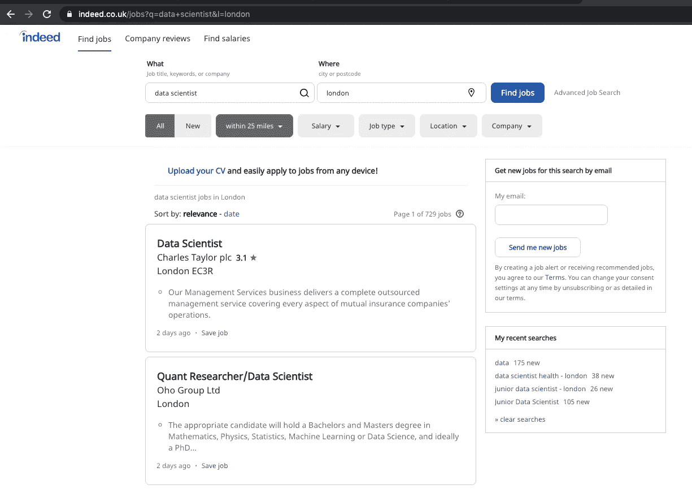
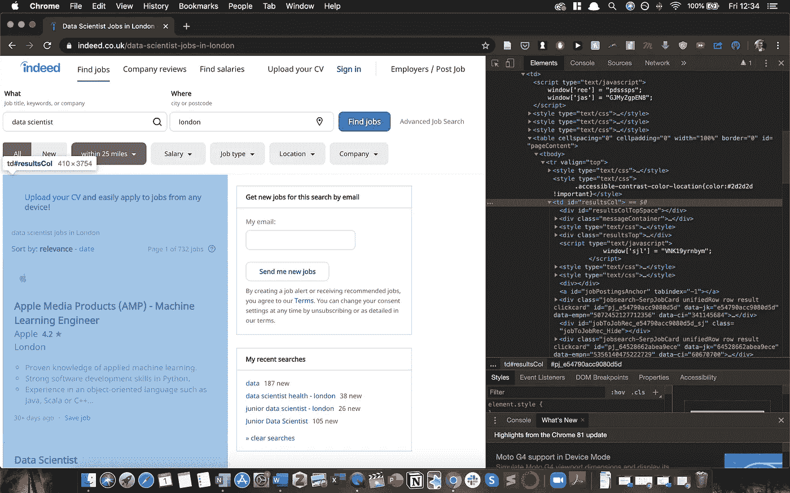
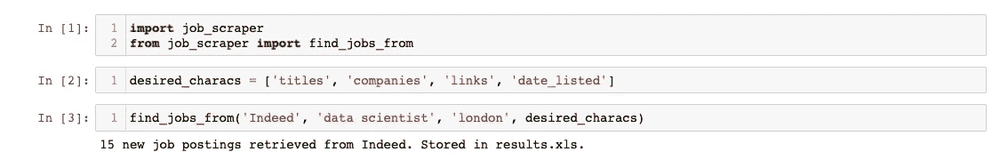

# 用 Python 实现求职自动化

> 原文：<https://towardsdatascience.com/automating-my-job-search-with-python-ee2b465c6a8f?source=collection_archive---------11----------------------->

## 使用美素和硒

资料来源:unsplash.com

# **动机**

我目前正在寻找一个新的数据科学职位，但我发现令人沮丧的是，有这么多不同的网站，在不同的时间列出不同的工作。不断检查每个网站以查看发布了哪些新角色变得很费力。

但后来我想起来了；我是一名数据科学家。一定有更简单的方法来自动化这个过程。因此，我决定创建一个管道，它包括以下步骤，并使用 Python 自动执行部分流程:

## **1。定期提取所有新的职位发布**

我决定写一些 Python 代码来从我最常查看的网站上搜集信息。这是我将在这篇文章中概述的。

## **2。根据我的技能和兴趣查看新的招聘信息**

我本来可以尝试自动化这一点，但我不想冒险忽略一个可能因为我放入代码的标准而感兴趣的工作。我决定手动检查我的网页抓取返回的帖子。

## **3。每周花一次时间申请符合条件的新工作。**

我听说有人把这个舞台自动化了。然而，我相信如果你花时间和精力来定制应用程序，并且在原则上有点不同意这种方法，机会会更好。

***注:本帖讨论的所有代码在*** [***这里***](https://github.com/chris-lovejoy/job-scraper) ***都有。我也在底部分享了我最喜欢的学习资源。***

我决定使用 **BeautifulSoup** 和 **Selenium** ，如果需要的话，我的进口声明如下:

# 来自 Indeed.co.uk 的工作信息—使用 BeautifulSoup

我寻找数据科学工作的主要网站之一是 Indeed.co.uk。

## (1)提取初始 HTML 数据

我很高兴地看到，他们有一个标准化的网址格式，这将使网络抓取更容易。网址是“indeed.co.uk/jobs？”依次为*【q =职位】*&*【l =位置】* *—* 如下:

在伦敦 Indeed.co.uk 寻找“数据科学家”的工作

这使得修改职位名称和位置变得相当容易。我决定创建一个函数，将职位和位置作为参数，这样任何人都可以定制搜索:

使用来自 **urllib** 的 **urlencode** 函数使我能够插入参数来创建完整的 url。我在 URL 中包含了“fromage=list”和“sort=date ”,这样就只显示了最近的工作。

然后，在 **BeautifulSoup** 的便捷帮助下，我可以提取 HTML 并适当地解析它。

最后，我想找到包含所有工作列表的适当的

。我通过打开 URL(*indeed.co.uk/jobs?q=data+scientist&l =伦敦*)并使用‘Inspect’元素找到了它。使用这个，我可以看到<TD id = " results coll ">包含了所有的工作列表，所以我使用 soup . find(id = " results coll ")来选择所有这些工作。

截图:Indeed.co.uk 网站

## (2)提取工作细节

现在我有了包含所有工作列表的 HTML“汤”,下一步是提取我想要的信息，它们是:

*   职位名称
*   这些公司
*   完整职务简介的链接
*   列出了日期

对于其中的每一个，我再次使用 Inspect 来识别适当的部分，并使用了**。find()** 函数来识别它们，如下:

## (3)迭代每个工作列表

使用‘Inspect’我看到每个工作卡都包含在一个 div 中，该 div 的类为‘jobsearch-SerpJobCard ’,所以我使用了 BeautifulSoup 的**。find_all** 功能如下:

然后，对于每张卡，我想提取上面列出的 4 条关键信息，并将它们保存在一个列表中。

我想让我的函数通用化，这样人们可以选择他们想要搜索的特征(在列出的职位、公司、链接和日期之外)，所以我创建了一个列表‘desired _ characts’来指定这一点。

对于每个特征，我循环并将其添加到列表中，如下所示:

最后，我将所有这些放入一个 jobs_list 中，然后可以导出为所选的格式 Excel、DataFrame 或其他格式:

使用“cols”使我能够根据提取的特征为 jobs_list 字典的每个键指定标题。

“extracted_info”是一个列表列表；例如，每个列表包含所有职位或所有公司。

使用这些数据结构使得编译最终的 jobs_list 字典更加容易。

## (4)存储和保存作业

我将“jobs_list”字典转换为数据帧，然后将其导出到用户使用以下函数选择的文件名和文件类型:

## (5)集成到单个函数调用中

最后，我希望用户可以通过一个函数调用来完成上述所有工作。我是这样做的:

令人满意的是，这产生了一个可以很容易地调用的最终结果，如下所示:

# 来自 CWjobs.co.uk 的工作刮擦——使用硒

下一步是概括我的脚本，也从其他网站的工作列表。另一个我经常搜索的网站是 CWjobs。然而，添加这一点被证明是一个更大的挑战。

当我检查 URL 时，我注意到关键字参数没有一致的模式。

因此，我决定使用 Selenium Webdriver 与网站进行交互——输入指定的职位和位置，并检索搜索结果。

## (1)下载并启动驱动程序

我使用 Google Chrome，所以我从这里的[下载了合适的 web 驱动程序，并将其添加到我的工作目录中。然后，我创建了一个函数来启动驱动程序，如下所示:](https://sites.google.com/a/chromium.org/chromedriver/downloads)

(如果使用替代浏览器，您需要下载相关驱动程序，并确保其名称和位置如上所述)

## (2)使用驱动程序提取作业信息 HTML‘soup’

## (3)提取工作信息

接下来的步骤与上面真正的 job scraping 中的**步骤 2 和 3** 相同，只是针对 CWjobs 的 [DOM](https://en.wikipedia.org/wiki/Document_Object_Model) 结构进行了调整，所以我在这里不再赘述。

一旦我完成了代码，看到我的网络浏览器被控制，而我没有触摸鼠标或键盘，这是非常酷的:

屏幕录制:web 驱动程序的使用

# 包扎

我对我的功能代码非常满意，并决定就此打住(毕竟我确实不得不*申请工作*)。

在 GitHub 上快速搜索发现，人们已经为 LinkedIn 和其他一些平台制作了类似的工作抓取工具。

我将代码上传到了一个带有自述文件的 GitHub 库中，以防其他人想用这个代码完成工作。

然后我坐下来，对自己感到非常满意。现在，我只是每周运行一次脚本，然后挑选出我想申请的工作。

老实说，使用脚本比手工操作节省的时间和精力是微不足道的。然而，我从编写代码中获得了很多乐趣，并且在 BeautifulSoup 和 Selenium 上得到了更多的实践。

作为一个潜在的下一步，我可能会在 Amazon Lambda 上设置这个，这样它就可以每周自动搜索一次新的工作，而不需要我去做。所以如果我真的做了，将来可能会有一个关于这个的帖子。

我希望这是有帮助的/有趣的！

# **我在做这个项目时找到的最好的资源**

[https://realpython.com/beautiful-soup-web-scraper-python/](https://realpython.com/beautiful-soup-web-scraper-python/)——**一个关于网页抓取的很好的概述/复习，还有漂亮的汤**

[https://towards data science . com/looking-a-house-build-a-web-scraper-to-help-you-5b ab 25 badc 83 e](/looking-for-a-house-build-a-web-scraper-to-help-you-5ab25badc83e)—**web scraper 的另一个有趣的用例:识别潜在的可购买房屋**

[https://towards data science . com/controlling-the-web-with-python-6 fceb 22 C5 f 08](/controlling-the-web-with-python-6fceb22c5f08)—**Selenium 的精彩介绍**

[https://www.youtube.com/watch?v=-vqRAkcWoM](https://www.youtube.com/watch?v=--vqRAkcWoM)—**硒在使用中的精彩演示**

[https://github.com/kirkhunter/linkedin-jobs-scraper](https://github.com/kirkhunter/linkedin-jobs-scraper)——**一个领英刮刀，既展示硒又美汤**

# 我制作了一个关于这个的视频