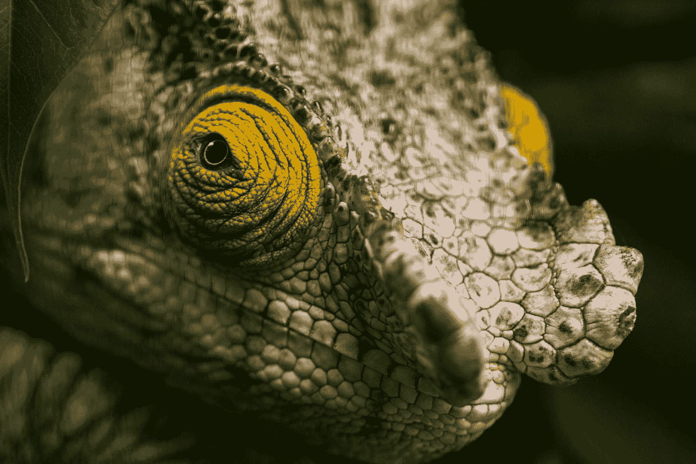
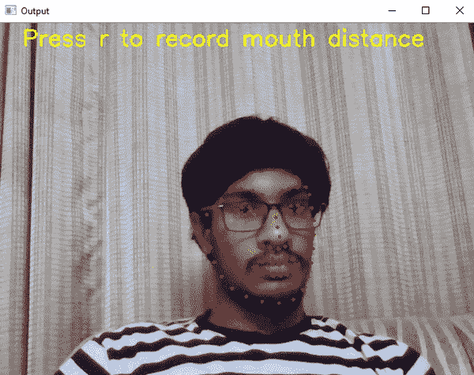

# 使用人工智能实现在线监考自动化

> 原文：<https://towardsdatascience.com/automating-online-proctoring-using-ai-e429086743c8?source=collection_archive---------6----------------------->

## 基于视觉和音频的半自动监考功能，可防止在线考试中的作弊，并同时监控多名学生。

照片由[日常基础](https://unsplash.com/@zanardi?utm_source=medium&utm_medium=referral)在 [Unsplash](https://unsplash.com?utm_source=medium&utm_medium=referral)

随着新冠肺炎的出现，远程学习蓬勃发展。学校和大学可能已经关闭，但他们转向像微软团队这样的应用程序来完成他们的学年。然而，没有解决考试的办法。有些人把它改成了作业形式，学生可以从网上复制粘贴，而有些人干脆取消了。如果我们的生活方式要成为新的标准，就需要一些解决方案。

ETS 组织托福和 GRE 等考试，允许学生在家考试，在整个考试过程中，监考老师会全程监督。由于所需的劳动力，大规模实施这一计划是不可行的。因此，让我们用 python 创建一个人工智能，它可以使用网络摄像头和笔记本电脑麦克风本身来监控学生，并使教师能够同时监控多个学生。完整的代码可以在我的 Github [repo](https://github.com/vardanagarwal/Proctoring-AI) 上找到。

人工智能将具有四种基于视觉的功能，这些功能使用多线程技术结合起来，以便它们能够协同工作:

1.  视线跟踪
2.  嘴巴张开或闭上
3.  人数统计
4.  手机检测

除此之外，来自麦克风的语音将被记录，转换为文本，并且还将与试卷的文本进行比较，以报告考生说出的常用单词的数量。

# 要求

*   OpenCV
*   Dlib
*   张量流
*   语音识别
*   PyAudio
*   NLTK

# 基于视觉的技术

## 视线跟踪

照片由 [S N Pattenden](https://unsplash.com/@sipattenden?utm_source=medium&utm_medium=referral) 在 [Unsplash](https://unsplash.com?utm_source=medium&utm_medium=referral) 上拍摄

我们的目标是跟踪考生的眼球，并报告他是否在向左、向右或向上看，他可能是在看笔记本或向某人发出信号。这可以通过使用 Dlib 的面部关键点检测器和 OpenCV 进行进一步的图像处理来完成。我已经写了一篇关于如何进行实时眼球追踪的文章，详细解释了后面将要用到的方法。

 [## 使用 OpenCV 和 Dlib 的实时眼睛跟踪

### 在本教程中，学习通过 python 中的网络摄像头创建一个实时凝视探测器。

towardsdatascience.com](/real-time-eye-tracking-using-opencv-and-dlib-b504ca724ac6) 

## 嘴部检测

嘴部追踪结果

这和眼睛检测很像。Dlib 的面部关键点再次用于该任务，并且要求测试者坐直(如他在测试中所做的那样)，并且记录 100 帧的嘴唇关键点(5 个外部对和 3 个内部对)之间的距离并取平均值。

如果用户张开他/她的嘴，点之间的距离增加，并且如果对于至少三个外部对和两个内部对，距离的增加大于某个值，则报告侵权。

## 人数统计和移动电话检测

我使用在 COCO 数据集上训练的 YOLOv3 的预训练权重来检测网络摄像头馈送中的人和手机。关于如何在 TensorFlow2 中使用 YOLOv3 并执行人数统计的深入解释，您可以参考这篇文章:

 [## 使用预先训练的 YOLOv3 计算网络摄像头中的人数

### 学习使用实例分割(YOLOv3)来计算使用 TensorFlow 预训练权重的人数…

medium.com](https://medium.com/analytics-vidhya/count-people-in-webcam-using-yolov3-tensorflow-f407679967d5) 

如果计数不等于，可以发出警报。COCO 数据集中手机的索引是 67，因此我们需要检查是否有任何类别索引等于该索引，然后我们也可以报告一部手机。

## 使用多线程合并

现在让我们深入研究代码。由于眼球跟踪和嘴巴检测是基于 dlib 的，我们可以为它们创建一个单独的线程，另一个线程可以用于 YOLOv3 任务:人数统计和移动检测。

首先，我们导入所有必要的库以及助手函数。然后加载 dlib 和 YOLO 模型。现在在`eyes_mouth()`函数中，我们找出面部关键点并对其进行处理。对于嘴部检测，已经定义了外部点和内部点之间的原始距离，并且我们计算当前距离。如果某个数量大于预定义的数量，则通知监考人。对于眼睛部分，我们找出它们的质心，如链接的文章所示，然后我们检查它们最接近哪个面部关键点。如果两者都在边上，则相应地进行报告。

在`count_people_and_phone()`功能中，YOLOv3 应用于网络摄像头馈送。然后，检查检测到的对象的类别，如果检测到不止一个人或者检测到移动电话，则采取适当的行动。

这些函数在不同的线程中传递，其中有无限的循环，proctor 可以通过按两次“q”来打破这些循环。

# 声音的

由[伊森·麦克阿瑟](https://unsplash.com/@snowjam?utm_source=medium&utm_medium=referral)在 [Unsplash](https://unsplash.com?utm_source=medium&utm_medium=referral) 上拍摄的照片

这个想法是从麦克风录制音频，并使用谷歌的语音识别 API 将其转换为文本。API 需要来自麦克风的连续语音，这是不合理的，因此音频是以块的形式记录的，因此在使用这种方法时没有强制的空间要求(十秒钟的 wave 文件的大小为 1.5 Mb，因此三个小时的考试应该有大约 1.6 Gb)。使用不同的线程来调用 API，以便可以不间断地进行连续记录，并且 API 处理最后存储的一个，将其数据附加到文本文件，然后删除它以节省空间。

之后使用 NLTK，我们从其中删除停用词。抽取问题纸(文本格式),其停用词也被移除，并且它们的内容被比较。我们假设如果有人想作弊，他们会从试卷上说些什么。最后，将常用词及其频率呈现给监考人。监考人也可以查看包含考生在考试中所说的所有单词的文本文件。

直到代码中的第 85 行，我们一直在记录、转换和存储文件中的文本数据。顾名思义，函数`read_audio()`用于使用由`stream_audio()`传递给它的流来记录音频。函数`convert()`使用 API 将其转换为文本，并将其附加到文件 test.txt 中，同时添加一个空格。这一部分将贯穿整个考试过程。

在这之后，使用 NLTK，我们将存储的文本转换为标记，并删除停用词。对试卷的文本文件也进行同样的操作，然后找出常用词并报告给监考人。

这个系统可以和安全浏览器结合起来防止作弊。该项目并没有消除对监考人的需要，因为他需要执行某些操作。通过这个系统也有一些作弊的方法，比如一个人坐在笔记本电脑后面通过写作与考生交流。为了彻底杜绝作弊，我们需要像眼镜摄像头这样的外部硬件来覆盖考生的整个视野，并在图像上应用计算机视觉。但这将消除制造一个任何人都可以使用的人工智能的目标，而不需要使用除了标准笔记本电脑之外的任何额外东西，并且使用这个监考人还可以一次使用多个学生。

完整的代码请参考[这里](https://github.com/vardanagarwal/Proctoring-AI)。