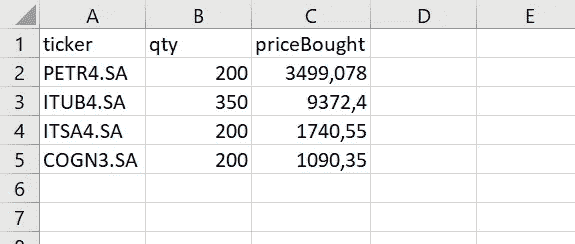
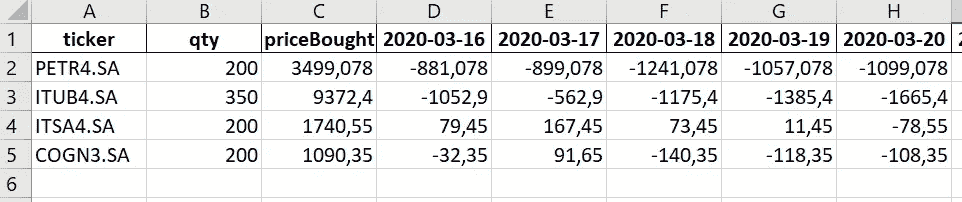
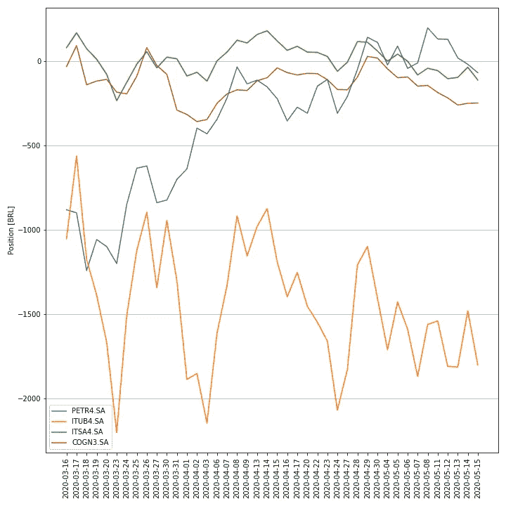

# 使用 Excel 和 Python 实现个人投资自动化

> 原文：<https://towardsdatascience.com/automating-personal-investments-with-excel-and-python-6f6a95898522?source=collection_archive---------32----------------------->

## 如你所愿，随时更新你自己的股票投资数据。

在 [Unsplash](https://unsplash.com?utm_source=medium&utm_medium=referral) 上由 [Ishant Mishra](https://unsplash.com/@ishant_mishra54?utm_source=medium&utm_medium=referral) 拍摄的照片

还入门 Python？

很长一段时间以来，我一直想知道如何开发 Python 项目，因为 Python 在我的日常工作中并没有被大量使用。所以，我在这里看到两种你可能适合的情况:

> *要么你的工作没有给你提供你正在寻找的编程技能*，要么事实上*根本没有给你提供任何使用它的机会*。

无论你的情况如何(甚至是不包括在上面的情况)，在这篇文章中，你可能会发现一个有趣的 Python 项目，现在就开始。那么，到底是什么？我设法开发了一种方法，你可以输入你所拥有的股票，并每天跟踪每只股票的表现。

首先，代码实际上是做什么的？简而言之，你必须在一个 Excel 文件中提供关于你所拥有的每一只股票的 3 个输入，然后，使用本文中分享的 Python 脚本，以便每天更新每一只股票的表现。

Excel 文件中需要输入哪些信息？**股票交易代码(“股票行情”)**、**、**、**股票数量(“数量”)、**和**每只股票的总成本(“买入价格”)**。很简单吧？除了这些输入非常简单这一事实之外，强调您只需要输入一次也很重要。

*PS:我是巴西人，所以考虑了一个例子，我从巴西股市挑选了一些股票。*

Excel 文件输入— Stock.xlsx

事不宜迟，我们最后来看看代码本身。

# 代码:

我的目标是分享我构建分析的方式，并强调我认为最重要的事情。还有一点很重要，我鼓励你搜索任何你不确定如何工作的*库*、*方法、*或*属性*。

# 第一部分:

每次您想要加载过去的数据时，都应该执行以下命令。

## 1.1:

你可能从未听说过的库是 yfinance。这是我们代码的核心，因为它通过 [Yahoo Finance](https://finance.yahoo.com/) API 提供了您可能想要跟踪的股票价格(和其他一些信息)。

*PS:你可能注意到了我在 Excel 文件输入图像中使用的语法，重要的是确保你写下了*股票*谈判的名称，因为它们在雅虎财经中是可用的。*

## 1.2:

还记得我之前提到的 Excel 文件吗？在我的例子中，它保存为“Stock.xlsx ”,与我保存的目录相同。py 文件(这就是为什么您不必像在其他示例中看到的那样担心提供完整的文件位置，例如“C:/Documents/…”)

## 1.3:

除了逻辑结构之外，我强烈建议您花点时间去理解，我列出了最重要的事情:

*   ^BVSP 是巴西主要的股票市场指数，类似于纳斯达克综合指数(^ixic)；
*   “收盘”是每只股票的市场收盘价，这是 yfinance 的一个属性。

## 1.4:

这是我称为“第 1 部分”的结尾。你在这之前都有什么？您创建了一个 [Pandas DataFrame](https://pandas.pydata.org/pandas-docs/stable/reference/api/pandas.DataFrame.html) ，涵盖了您在 Excel 文件“Stock.xlsx”中考虑的过去一段时间(在本例中为 2 个月)内每天开市的股票价格。

为了避免创建多个 Excel 文件，您可能会注意到我覆盖了原始文件。您应该能够看到类似下面的内容(来自表的一部分的快照):

Excel 文件被股票信息覆盖

# 第二部分:

你应该在每天股市开盘时执行以下命令。

## 2.1:

我只添加了 [matplotlib.pyplot](https://matplotlib.org/3.2.1/api/_as_gen/matplotlib.pyplot.html) *库*(对我们要做什么有任何猜测吗？).

## 2.2:

这取决于你将如何保存你的。py 文件。按照我上面写的方法去做，“第 2 部分”会被认为是一个不同的。py 文件(有一部分 1。py 分隔文件，“StockHistory”，因为我只需要执行一次)。如果你想在一个地方拥有一切。py 文件，只需忽略这段代码，将它与所有其他代码行放在一起(但是，您需要注意，您将每天执行不必要的任务)。

## 2.3:

*closePriceList* 是由执行*方法*当天的每只股票价格组成的列表(注意到“[-1]”元素了吗？看看这行代码提供了什么)。

## 2.4:

这里的要点是向我们一直使用的 Excel 文件“追加”一个新列。这些列中的每一列都由最近股票价格的列表组成。

## 2.5:

这是最长的代码块，但是它的目标很简单:处理 *df* 以便它的每一行都作为列表提供。需要这些列表来生成以下内容:

股票每日余额[BRL 价值]

这个投资组合所有者应该考虑改变策略，对吗？

我希望你喜欢它。

这是我在 Medium 上的第一篇文章。这里重要的是分享一些有用的东西，这些东西可以用 Python 来完成，特别是对于那些不直接使用它，但希望学习更多的人。例如，您可以修改此代码来绘制累计余额，并区分您购买每只股票的日期。这取决于你自己的想象力和必要性。