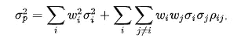

# 使用 Python 自动化投资组合优化和分配

> 原文：<https://towardsdatascience.com/automating-portfolio-optimization-using-python-9f344b9380b9?source=collection_archive---------8----------------------->

## 使用 Python 中的现代投资组合理论为您的投资组合计算优化的资产权重和分配


尼克·崇在 [Unsplash](https://unsplash.com?utm_source=medium&utm_medium=referral) 上的照片

## **现代投资组合理论——(MPT)**

现代投资组合理论(MPT)或均值-方差分析是一种数学模型/研究，用于开发和创建投资组合，旨在使给定风险的回报最大化。这种数学很大程度上基于一种假设和经验，即普通人更喜欢风险较低的投资组合。降低风险可以通过投资于传统的安全港或多样化来实现，这是 MPT 倡导的一项事业。

这个理论是由亨利·马科维茨在 20 世纪 50 年代提出的，他因此获得了诺贝尔奖。虽然 MPT 受到了相当多的批评，部分原因是其向后看的倾向以及无法将商业和经济中的不可抗力/趋势考虑在内，但我发现，通过衡量波动率作为代理，这一工具对于衡量一个人投资组合的风险很有价值。

## **模型的基础知识**

我将使用 Python 来自动优化投资组合。该理论的概念简述如下

1.  **投资组合预期收益-**

投资组合的预期回报的计算方法是将资产的权重乘以其回报，然后将所有资产的价值相加。为了引入前瞻性估计，可以引入概率来生成和合并商业和经济中的特征。


投资组合预期收益

**2。投资组合差异-**

在该模型中，投资组合方差被用作风险的度量。较高的方差表明资产类别和投资组合的风险较高。该公式表示为



投资组合风险(方差)|ρ—资产 i/j 之间的相关系数

**3。夏普比率**

夏普比率衡量与无风险利率(国债利率)及其风险状况相关的投资回报。一般来说，夏普比率值越高，表明投资越好，利润越大。因此，如果比较两个具有相似风险特征的投资组合，在其他条件相同的情况下，最好投资具有较高夏普比率的投资组合。


夏普比率


**4。有效前沿-**

该图衡量风险与回报，用于在考虑风险状况和投资者特征后选择最佳投资组合。根据目标和投资者的能力/特征，有效边界是第一和第二象限曲线的重要部分。


资本配置线(CAL)本质上是有效边界的切线。切线和边界之间的交点被认为是最佳投资，在正常情况下，对于给定的风险状况，它具有最大的回报

## **在 Python 中自动化投资组合优化**

1.  **导入库**

我们将首先导入所有相关的库，以便随着我们的进展使我们的生活变得更容易。

```
#Importing all required libraries
#Created by Sanket Karve
import matplotlib.pyplot as plt
import numpy as np
import pandas as pd
import pandas_datareader as web
from matplotlib.ticker import FuncFormatter
```

此外，一个重要的库是 PyPortfolioOpt，它包含了帮助我们优化投资组合的函数。我们将使用以下命令安装该库

```
!pip install PyPortfolioOpt#Installing the Portfolio Optimzation Library
```

导入将进一步需要的函数-

```
from pypfopt.efficient_frontier import EfficientFrontierfrom pypfopt import risk_modelsfrom pypfopt import expected_returnsfrom pypfopt.cla import CLAfrom pypfopt.plotting import Plottingfrom matplotlib.ticker import FuncFormatter
```

**2。从网上删除股票和金融数据**

我们将从雅虎获取数据！各种股票报价机的融资。我用过的代码有 Boston Scientific、Berkshire Hathway、Invesco Trust、S&P 指数基金、AES Corp .和 Sealed Air Corp .这些代码被选择用于分散各种行业的投资。

输入报价器后，我们需要创建一个空白的数据框架，用于通过循环捕捉所有股票的价格。出于本练习的目的，我进行了过滤，以捕捉我们正在研究的股票的调整后收盘价。

```
tickers = ['BSX','AES','BRK-B','SEE','QQQ','SPY']thelen = len(tickers)price_data = []for ticker in range(thelen):prices = web.DataReader(tickers[ticker], start='2015-01-01', end = '2020-06-06', data_source='yahoo')price_data.append(prices.assign(ticker=ticker)[['Adj Close']])df_stocks = pd.concat(price_data, axis=1)df_stocks.columns=tickersdf_stocks.head()
```

检查捕获的值是否为“NaN”。较不重要的是零值。如果有 NaN 值，好的做法是考虑不同的时间序列，或者用 D-1，D+1 的平均价格填充数据。如果出现大的空白，我宁愿不考虑和删除时间序列数据，也不愿插入零值。


```
#Checking if any NaN values in the datanullin_df = pd.DataFrame(df_stocks,columns=tickers)print(nullin_df.isnull().sum())
```

**3。计算**

我们将继续进行投资组合优化的计算。从获取所选投资组合的预期收益和方差开始。

```
#Annualized Returnmu = expected_returns.mean_historical_return(df_stocks)#Sample Variance of PortfolioSigma = risk_models.sample_cov(df_stocks)
```

接着分别计算并存储具有最大夏普比率和最小波动性的投资组合权重值。

```
#Max Sharpe Ratio - Tangent to the EFef = EfficientFrontier(mu, Sigma, weight_bounds=(-1,1)) #weight bounds in negative allows shorting of stockssharpe_pfolio=ef.max_sharpe() #May use add objective to ensure minimum zero weighting to individual stockssharpe_pwt=ef.clean_weights()print(sharpe_pwt)
```

这将为你提供不同持股的权重。如果你想最小化“零”持有或重量，请随意使用 L2 回归。此外，weight_bounds 被设置为从-1 到 1，以允许计算“做空”股票。最小方差投资组合也将进行同样的操作。


**4。绘制有效边界并优化投资组合配置**

最后一步是为了直观的目的绘制有效边界，并计算投资组合中给定美元金额的资产分配(即购买或卖空的股票数量)。出于本练习的目的，我考虑了 10，000 美元 investopedia 上的默认起始值。


```
latest_prices = discrete_allocation.get_latest_prices(df_stocks)# Allocate Portfolio Value in $ as required to show number of shares/stocks to buy, also bounds for shorting will affect allocation#Min Volatility Portfolio Allocation $10000allocation_minv, rem_minv = discrete_allocation.DiscreteAllocation(minvol_pwt, latest_prices, total_portfolio_value=10000).lp_portfolio()print(allocation_minv)print("Leftover Fund value in$ after building minimum volatility portfolio is ${:.2f}".format(rem_minv))
```

这将为您提供优化的投资组合，如下所示


对于计算具有最大夏普比率的投资组合，也可以这样做。

## **结论**

据说投资既是艺术又是科学。Python 和它的库允许我们自动化优化，并在这个过程中节省宝贵的时间。然而，必须注意的是，这些孤立的技术不太可能是最好的投资方法。

接下来，我将发布关于我们如何通过机器学习选择股票来复制指数基金，以建立我们的投资组合和 Python 可以帮助我们的许多其他功能。最后，我还创建了一个程序，用蒙特卡洛模拟来计算股价的潜在损失或变动。这个工具可以和这个投资组合优化器一起使用。

[](/var-calculation-using-monte-carlo-simulations-40b2bb417a67) [## 使用蒙特卡罗模拟的风险值计算

### 自动计算风险价值(VaR ),使用 Monte 管理 Python 中的投资组合风险、股权和股票…

towardsdatascience.com](/var-calculation-using-monte-carlo-simulations-40b2bb417a67) 

*以上信息绝不是专业的投资建议或实践，而仅仅是我讨论如何通过现代投资组合理论(MPT)使用 Python 来自动化投资组合优化所做的努力。如需完整的源代码或任何讨论，请随时联系*