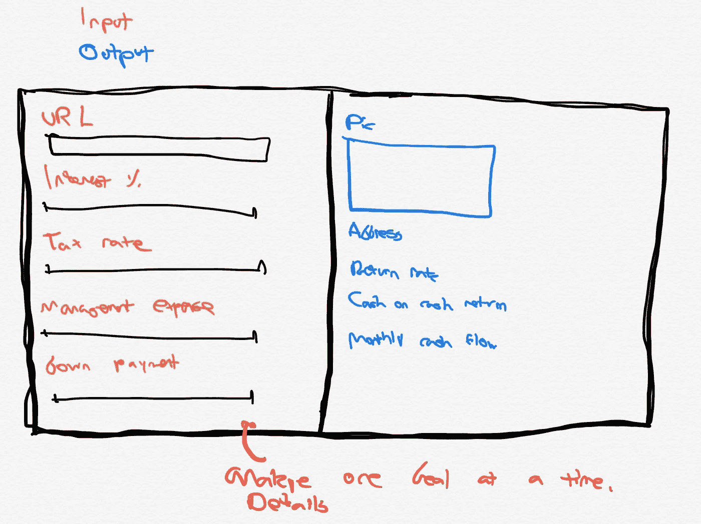
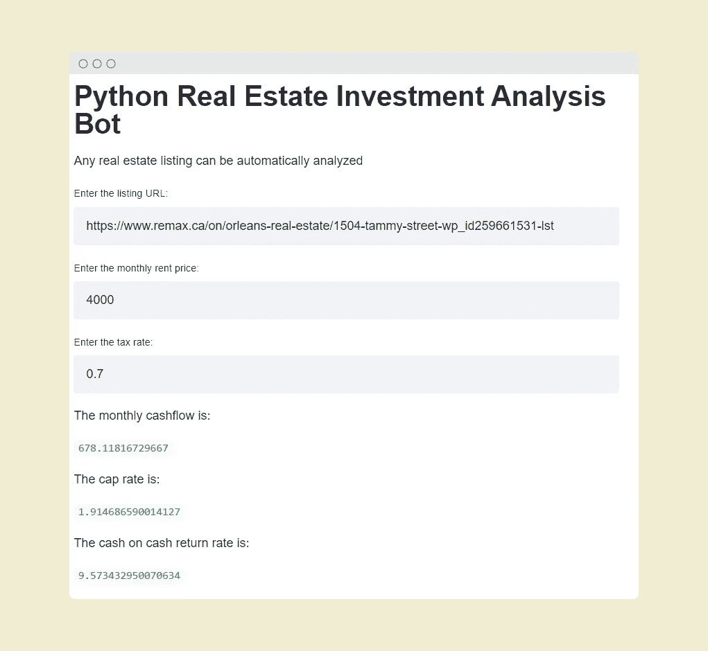
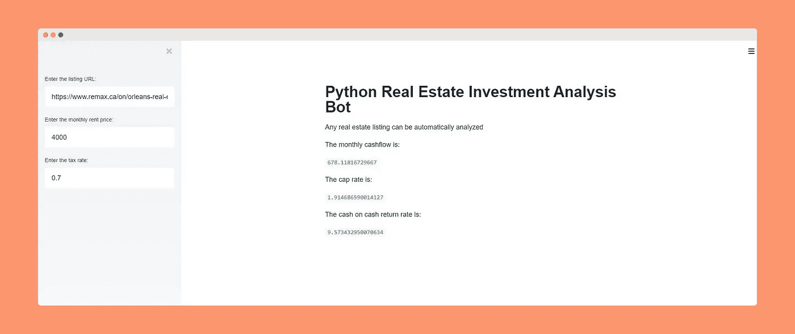

# 自动化房地产投资分析:Python 网络抓取机器人

> 原文：<https://towardsdatascience.com/automating-real-estate-investment-analysis-d2b07395833b?source=collection_archive---------6----------------------->

## python 中的数据挖掘实现房地产交易筛选自动化。


房屋图片(来自 [unsplash](https://unsplash.com/)

# 摘要

目标是构建一个能够分析投资属性的 python web 工具。该工具将使用数据挖掘来查找房地产价格，然后分析回报率。

# 索引

> 摘要
> 
> 索引
> 
> 动机
> 
> 该应用程序
> 
> 这些功能
> 
> 总结和展望

# 动机

机器人或自动化在交易和投资中的应用并不新鲜。多个例子包括股票交易机器人，其任务是根据不同的模型或指标来购买或出售资产。复兴科技因其通过算法投资获得的回报率而受到世界关注，该回报率在 30 年的时间跨度内平均达到 [60%以上的年化回报率](https://www.businessinsider.com/how-jim-simons-renaissance-technologies-has-outperformed-market-30-years-2019-12)。

自动化的好处有可能改变不同规模的企业。单个重复性任务可通过内部开发的软件或第三方 SaaS 平台实现自动化。

对于个人散户投资者来说，python 机器人为房地产投资的各种元素提供了一个有前途的解决方案。在本文中，我们将研究分析属性过程的自动化。其他可以自动化的流程包括:列出物业，向租户发送通知，筛选租户(机器学习或人工智能)，甚至自动派遣维护人员。

# 该计划

## 输入和输出

该程序有三个输入:房源 URL、月租金价格和财产税税率。它返回每月现金流、上限利率和现金回报率。

*   ***现金流*** —扣除所有费用(抵押贷款、物业管理、维修补贴、空置费用)后的每月利润
*   *—每年的净收入除以资产价格(百分比)*
*   **—每年净收入除以用于资产的首付款(百分比)**

## **包装**

**使用了以下软件包。注意对于那些在 Anacondas 环境中工作的人来说，streamlit 目前似乎不能通过这个包管理器使用。Streamlit 是和 pip 一起安装的，当 PIP 和 Anacondas 一起使用时[可能会导致问题](https://www.anaconda.com/using-pip-in-a-conda-environment/)**

*   *****请求*** —这个包用于通过 HTTP 请求访问 python 中的网站。**
*   *****美汤 4*** —用于网页抓取和数据挖掘。我们能够使用这个包来检索描述网站内容和样式的 HTML 代码。一旦检索到 HTML 代码，就可以利用 beautiful soup 来隔离站点的特定部分。例如，在这个项目中，我们使用美丽的汤来获取房价。**
*   *****Streamlit*** —这个包让部署 web 应用程序变得超级简单。代码是在 Jupyter 笔记本上开发的，然后转换成。py 脚本一旦开始工作。Streamlit 允许无缝部署，并最大限度地减少用户界面上花费的时间。使用 streamlit，将 python 用于后端、flask 用于部署、react 用于动态内容的经典部署选项要简单得多。**

## **编写代码**

**完成大部分繁重工作的函数是 **price_mine** 、 **mortgage_monthly** 和 **net_operating** 。**

**这些是分别执行以下职责的主要功能:**

*   **从 URL 中检索标价**
*   **计算每月抵押贷款成本**
*   **计算扣除所有费用后的每月净营业收入**
*   *****price _ mine****|*该函数用于从房源中检索房价。可以使用 API，但是网络抓取更强大。web 抓取的缺点是站点结构的改变需要在代码中更新。在这里，网页刮包使用的是美丽的汤。这个过程相对简单，使用 f12 检查网页，然后在 HTML 代码中找到所需的元素。这段代码可以被隔离在 beautiful soup 中，以检索页面的特定部分。检索到代码后，内置的 python 函数 replace 用于删除逗号、美元符号和不必要的空格，以便建立一个浮点变量。**

```
 ****def** price_mine(url):
    *#Currently this function takes an input of a URL and returns the listing prices* 
    *#The site it mines is remax*
    *#The input must be a string input, we can reformat the input to force this to work*
    *#Next we use regex to remove space and commas and dollar signs* 
    headers = ({'User-Agent':
            'Mozilla/5.0 (Windows NT 6.1) AppleWebKit/537.36 (KHTML, like Gecko) Chrome/41.0.2228.0 Safari/537.36'})
    response = get(url)
    response_text = response.text
    html_soup = BeautifulSoup(response_text, 'html.parser')
    prices = html_soup.find('h2',{'class': 'price'}).text
    prices = prices.replace(",", "")
    prices = prices.replace("$", "")
    prices = prices.replace(" ", "")
    prices = float(prices)

    **return** prices** 
```

*   *****mortgage _ monthly*|**该函数将挂牌价格、抵押期限和利率作为输入，并返回每月抵押价格。有许多方法来计算每月抵押贷款价格，没有作出具体的决定，至于使用哪种方法和一个通用算法，是相当容易实现的使用。**

```
****def** mortgage_monthly(price,years,percent):

    *#This implements an approach to finding a monthly mortgage amount from the purchase price,*
    *#years and percent.* 
    *#Sample input: (300000,20,4) = 2422*
    *#*

    percent = percent /100
    down = down_payment(price,20)
    loan = price - down
    months = years*12
    interest_monthly = percent/12
    interest_plus = interest_monthly + 1
    exponent = (interest_plus)**(-1*months)
    subtract = 1 - exponent
    division = interest_monthly / subtract
    payment = division * loan

    **return**(payment)** 
```

*   *****net_operating* |** 该函数以月租金、税率和价格作为输入，返回每月的净营业收入。净营业收入的金额分别代表支付抵押贷款(本金和利息)、财产税、支付管理费(每月 10%)、物业维修补贴和空置补贴后的现金。有人可能会说，只有每月支付的利息才构成费用，因为本金是建立在股本基础上的。虽然这是真的，但我们的模型想知道在支付所有费用后还剩多少现金。个人投资分析机器人可以改变像这样的元素，使个人投资者的计算个性化。**

```
 ****def** net_operating(rent, tax_rate, price):

    *#Takes input as monthly mortgage amount and monthly rental amount*
    *#Uses managment expense, amount for repairs, vacancy ratio*
    *#Example input: net_operating(1000,1,400,200)*
    *#879.33*
    *#1000 - 16.67 (tax) - 100 (managment) - 4 (repairs)*

    mortgage_amt = mortgage_monthly(price,20,3)
    prop_managment = rent * 0.10
    prop_tax = (price * (tax_rate/100)/12)
    prop_repairs = (price * 0.02)/12
    vacancy = (rent*0.02)
    *#These sections are a list of all the expenses used and formulas for each*

    net_income = rent - prop_managment - prop_tax - prop_repairs - vacancy - mortgage_amt
    *#Summing up expenses*
    output = [prop_managment, prop_tax, prop_repairs, vacancy, net_income]

    **return** output** 
```

****其他功能:****

**使用的其他函数，如 cap_rate，以百分比计算净收入与资产价格的比率。完整的函数列表可以在项目的 GitHub 资源库中找到，但是不包括在本文档中。**

# **构建界面**

## **早期概念化**

**想法是让输入在页面的左边，输出在页面的右边。输入被放置在侧边栏中，这样输入和输出在视觉上是不同的。**

****

**初始用户界面概念草图**

## **介绍 streamlit**

**构建这个仪表板的一个常见方法是用 HTML 创建一个静态网站，用 flask 部署后端，在某种数据库中存储值，然后用 react 链接所有内容。[一种比这种方法更具优势的新的替代部署途径被称为 streamlit。](https://medium.com/swlh/part-1-will-streamlit-kill-off-flask-5ecd75f879c8)**

**Streamlit 允许从 python 脚本快速过渡到现代用户体验。它还提供了一种简单快速的部署途径。转换的第一步是替换内置的 python 输入函数，并用 streamlit 输入框替换它们。对输出进行了同样的替换。**

**一旦完成，就可以从控制台[部署](/quickly-build-and-deploy-an-application-with-streamlit-988ca08c7e83)streamlit 应用程序，并通过外部 IP 地址进行访问。**

****

**streamlit 内置的初始用户界面**

**一旦在 streamlit 中构建了用户界面，就要修改代码，为输入添加一个侧栏，如上面草图中最初描述的那样。**

****

**带有输入侧边栏的用户界面**

## **最终代码**

**最终代码可以在 GitHub 上找到。**

**项目的 GitHub 存储库**

# **总结和未来方向**

**尽管复兴科技(renaissance technology)等集团能够从应用于投资的数学模型中获利，但个人散户投资者也能从中受益，而且实施起来要容易得多。**

**房地产投资者可以从自动化中受益，处理许多以前需要助理或占用大量时间的任务。这是一个使用自动化来减少过滤交易时间的例子。如果自动生成摘要报告，并且只将最好的资产呈现给人类，投资者可以审查更多的交易。夫妻店、房地产投资者和企业家可以从自动化中受益，而不仅仅是财富 500 强公司。**

*****注来自《走向数据科学》的编辑:*** *虽然我们允许独立作者根据我们的* [*规则和指导方针*](/questions-96667b06af5) *发表文章，但我们不认可每个作者的贡献。你不应该在没有寻求专业建议的情况下依赖一个作者的作品。详见我们的* [*读者术语*](/readers-terms-b5d780a700a4) *。***