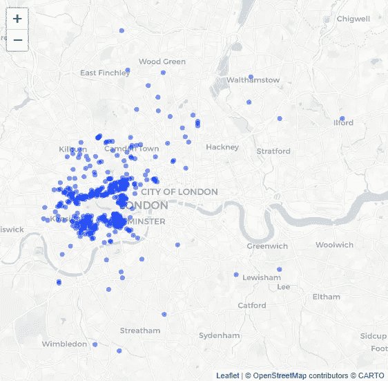
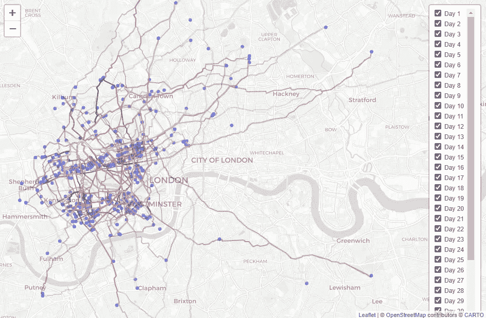

# R 中运行路线的自动化

> 原文：<https://towardsdatascience.com/automating-running-routes-in-r-1e97eb4ed716?source=collection_archive---------37----------------------->

## [实践教程](https://towardsdatascience.com/tagged/hands-on-tutorials)

## 使用 Graphhopper API(在 rvest 和 PostcodesIO 的帮助下)运行伦敦的每个 Mews

冬天已经来到了英国，当其他人都在匆忙修理锅炉时，我最关心的是保持每周的运行里程，而温度却在相反的方向。

探索伦敦的新地方似乎是个好主意，而且不必考虑走哪条路似乎更好。所以计划是跑遍伦敦的每一条消息，让 R 决定怎么做。

本文中有一些代码片段，其余的在 [fredwise/run_the_mews](https://github.com/fredwise/run_the_mews) 上。

# 新闻

照片由[布鲁诺·马丁斯](https://unsplash.com/@brunus?utm_source=medium&utm_medium=referral)在 [Unsplash](https://unsplash.com?utm_source=medium&utm_medium=referral) 拍摄

隐藏在伦敦一些大排屋后面的是 386 个原始的和幸存的消息。这些小街是真正的马动力的残余，虽然马厩和马车房现在大多是车库和底层厨房，但它们仍然是很好的观光景点。

## 找到他们

[Everchanging Mews](https://everchangingmews.com/) 在这里做了腿的工作，在过去的 10 年里，他们访问了 1200 多个 Mews，在他们的百科网站上对它们进行了分类。

原始/幸存的 mews 列表分为 8 页，每个列表都有一个包含更多详细信息的网页。Chrome Dev Tools 找到保存这个网址的元素，并对 R 包做了一些工作 [rvest](https://github.com/tidyverse/rvest) 列出了它们。

## 对它们进行地理编码

这些网页中的每一个都有一个邮政编码，[邮政编码员](https://docs.ropensci.org/PostcodesioR/)将查询[的邮政编码，io](http://postcodes.io) 以获得位置数据。当邮政编码不可靠或者在[邮政编码. io](http://postcodes.io) 数据库(386 中的第 7 个)中不存在时，这里需要进行一些手工清理。之后，只需通过[邮政编码 _ 查找](https://www.rdocumentation.org/packages/PostcodesioR/versions/0.1.1/topics/postcode_lookup)运行它们。

## 映射它们

在这里，我们只需要将经度和纬度作为一个形状文件传递给活页。

一页上的 386 条原始/幸存的消息

## 路由它们

希望所有这些的真正价值来自于路线生成的自动化。最初的问题陈述是:

> 在 20 公里或更短的路线中，查找覆盖所有 386 家酒店的最短总路线。每条路线都从同一个地方开始。

GraphHopper 是这类路线优化的优秀免费资源。它允许所有种类的车辆(在这个例子中是脚)的路线，但是它的免费 API 只允许每个请求最多 5 个位置。

GraphHopper 甚至可以让你为一辆小型摩托车导航。

一个简单的解决方案是一次随机选择 5 个位置。这样做的代价是没有优化总距离，但是在这种情况下，这意味着完成了更多的运行，并且没有消息被访问两次(只要随机采样没有替换)，所以应该这样做！

## 使用 GraphHopper API

GraphHopper 的[文档](https://docs.graphhopper.com/)非常棒，所需要的就是以正确的格式传递 5 个位置的纬度和经度。下面的代码片段显示了一个函数，它将这个请求构建为 R 列表，并使用 [jsonlite](https://rdrr.io/cran/jsonlite/) 将其转换为 JSON。提醒一下，完整的脚本可以在 [Github](https://github.com/fredwise/run_the_mews) 上找到。

对我们的 5 个位置运行路线的 78 个查询使用 httr::POST 发送到 GraphHopper API

使用 [sf 包](https://r-spatial.github.io/sf/)将响应路径坐标转换成简单特征，并在[活页](https://rstudio.github.io/leaflet/)中绘制成折线。

Graphopper 做了大量的工作来优化我们五个 mews 集合之间的路线

## 线串到 GPX

最后但并非最不重要的是，在设备上具有这些路线将是有用的，以便跟随该路线。只需将从每个 GraphHopper 响应路径创建的简单特性传递给 sf::st_write

哇，78 个 GPX 文件和 78 天的奔跑，不用考虑去哪里！