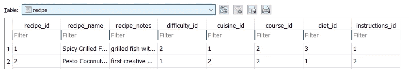

# 使用 SQLite 关系数据库和 Python 实现周日膳食准备自动化

> 原文：<https://towardsdatascience.com/automating-sunday-meal-preps-using-sqlite-relational-databases-and-python-c85821099ca8?source=collection_archive---------35----------------------->

## 创建和使用储物件，满足您所有的烹饪需求


[百合网](https://unsplash.com/@lvnatikk?utm_source=medium&utm_medium=referral)在 [Unsplash](https://unsplash.com?utm_source=medium&utm_medium=referral) 上拍摄的照片

成为一个真正的成年人(现在，被隔离)意味着加入 r/meal prep Sunday，重新创造所有的膳食准备食谱。然而，随着我的食谱越来越多，我对存储的需求也越来越大。


我现有的谷歌电子表格的快照，准备在未来几年成倍增长

我最初在一个电子表格中跟踪我所有尝试过的食谱，首先按照餐点，然后按照主料精心组织。我还包括了我想要跟踪的其他属性，包括烹饪、难度和食谱中的任何饮食限制。但是行数的增长也意味着组织和搜索时间的增长。我需要一个新的，更强大的存储单元。那时，我开始研究电子表格的轻量级(尽管在 UI 方面没有那么吸引人)表亲 SQLite 关系数据库的用途。

我想要这个新的食谱数据库来补救我的电子表格的困境。因此，我将它设计成:

1.  最大化增长空间(我可能会在我的烹饪生涯中一直使用它
2.  允许使用我现有的属性轻松存储和排序
3.  通过汇总我为这一周选择的食谱中的所有材料来简化购物

最终，我的食谱数据库完成了所有这些目标。结果证明这是最用户友好/可行的选择吗？可能不会，而且我了解到 SQLite 可能不是这样一个项目的最佳选择。然而，我确实创建了食谱数据库的一些基本构件，并对现有的电子表格应用程序有了新的认识。如果您有兴趣了解 SQLite 和 python 的 pandas 如何用于食谱的上下文，那么让我们来看看实用性。

*完整代码可以在我的 Github* [*这里*](https://github.com/jenniferrkim/recipe_database) *找到。为了方便查看，我用了一个 Jupyter 笔记本，但是你可以随意把它分成有标签的文件。*

## **目录:**

1.  设置关系数据库模式
2.  Python for SQLite 入门
3.  Python 中的 SQLite 关系基础:配方版
4.  用关键字参数和熊猫检索食谱
5.  随时可用— Python 的 input()作为 UI
6.  结论

# 设置关系数据库模式

我希望我的数据库满足的第一个标准是最大化增长空间，这直接受其结构的影响。随着数据库的扩展，最大限度地减少可能影响存储效率的冗余尤为重要。这个概念叫做规范化。

虽然不同的规范化形式包含它们自己特定的[规则](https://www.geeksforgeeks.org/normal-forms-in-dbms/)，但是作为一个整体，规范化通常需要将一个大表分解成多个小表，并维护这些部分之间的联系。这些小表的结构由底层数据的关系决定，有三种类型:一对一、一对多和多对多。

## 一个配方对应一套说明

最简单的数据库关系是一对一的。这是指表 A 中的一条记录与表 b 中的一条且仅有一条记录相关联。在配方数据库中，配方及其说明具有一对一的关系，因为两个配方几乎不可能具有完全相同的说明。因此，配方名称表和配方指令表将具有一行配方名称，对应于仅仅一行配方指令。


一对一的配方数据库模式

## 一个配方多种属性

对于大多数其他食谱属性(例如，难度、烹饪、课程和饮食类型)，存在一对多的关系。表 A 中有一条记录链接到(你猜对了！)表 b 中的多个记录。例如，一个难度级别(例如“容易”)可以有许多与其相关联的食谱，因为可以有许多“容易”食谱。然而，反过来就不正确了——一个食谱不可能既“简单”又“困难”(除非我的烹饪能力一天比一天有很大的变化)。


一对多配方数据库模式

## 多种配料的多种食谱

表之间的最后一种关系是多对多关系。在配方数据库中，一个配方可以有许多配料，一种配料可以用于许多配方。

多对多关系的实现需要第三个连接表来符合规范化规则。在我的 Recipes 表和 Ingredient 表之间，我创建了一个名为 Recipe_Ingredient 的连接表。第三个表将多对多关系分解为两个一对多关系。


多对多配方数据库模式

在图的右侧，您可能已经注意到不只是一个成分表，而是四个独立的表，包括单位表、数量表和制备方法表。这种结构利用了配料的单位、数量和制备方法与食谱之间的多对多关系。虽然我可以利用配料及其各自的单位、数量和制备方法之间的一对多关系，但我更喜欢将所有与配料相关的信息集中在 Recipe_Ingredients 表中的一个地方。

## 主键和外键

既然表已经拆分，那么如何将它们链接起来的问题就出现了。所有以前的模式图都有箭头，从一个特定的表指向另一个表中与其等价的“id”列。箭头底部表示主键，或特定表中行的唯一标识符。箭头的尖端指向一个外键，或者指向一个主键的引用。

这些关键不仅有助于建立关系，还能减少冗余。在做改变的时候，如果有一天我想把“容易”变成“毫不费力”，我只需要在难度表上做一个改变。如果主外键关系不存在，我需要用“easy”遍历所有行，并单独进行更改。建立此链接还可以通过防止删除具有依赖外键的主键来保存孤立记录。有关 SQLite 外键的更多信息，请查看这里的文档[。](https://www.sqlite.org/foreignkeys.html)

# Python for SQLite 入门

现在设置已经完成，是时候用 Python 实现了。

## **选择数据库管理系统**

数据库管理系统，简称 DBMS，是帮助处理数据库的系统的总称。其中的一个子集可以处理关系，将它们分类到 RDBMS 下，用额外的 R 表示关系。因为我需要关系管理，所以我选择了 SQLite，一个 RDBMS，因为它的[易于设置并且不需要服务器](https://www.sqlite.org/different.html)。

## **设置和关闭**

```
# getting start with sqlite
import sqlite3# create database file by specifying location
cnn = sqlite3.connect(r"C:\file\path\here\mealpreprecipes.db")# initialize cursor object to interact with database
cur = cnn.cursor()
```

当我们希望 Python 与数据库交互并处理 SQL 查询时，Cursor 对象将会派上用场。更多信息可以在 Python 文档[这里](https://docs.python.org/2.5/lib/sqlite3-Cursor-Objects.html)找到。

一旦进行了任何更改，您需要使用 Commit 语句进行保存。

```
cnn.commit()
```

完成连接后，使用以下命令关闭它:

```
cnn.close()
```

或者，您可以使用`with`语句来确保在运行必要的代码后连接被关闭。

```
with cnn:
    * insert code *
```

更多直接来自源代码的设置信息，请访问 Python 文档[这里](https://docs.python.org/2/library/sqlite3.html)。

# Python 中的 SQLite 关系基础:配方版

虽然我不会介绍简单的 SQL 语法，但我会解释在实现本文开头创建的数据库结构时我发现有用的技巧和诀窍。

## **创建具有主键和外键的表**

前面建立的主键和外键现在可以在我们创建表时实现。以下是一个配方表示例:

```
cur.execute("""CREATE TABLE recipe 
                (recipe_id INTEGER PRIMARY KEY NOT NULL, 
                recipe_name TEXT, 
                recipe_notes TEXT,
                difficulty_id INTEGER,
                cuisine_id INTEGER,
                course_id INTEGER,
                diet_id INTEGER,
                instructions_id INTEGER,
                FOREIGN KEY (difficulty_id) REFERENCES difficulty(difficulty_id),
                FOREIGN KEY (cuisine_id) REFERENCES difficulty(cuisine_id),
                FOREIGN KEY (course_id) REFERENCES difficulty(course_id),
                FOREIGN KEY (diet_id) REFERENCES difficulty(diet_id),
                FOREIGN KEY (instructions_id) REFERENCES difficulty(instructions_id))""")
```

应用这些`FOREIGN KEY`约束可以确保`recipe`表的任何一行中的所有外键都将链接到另一个表的主键。例如，如果插入到`recipe`表的`difficulty_id`中的一行在`difficulty`表中没有对应的主键，插入将会失败。

## **插入主键和外键的值**

在设置了具有主键和外键的表之后，我们现在想要插入一些值。

感谢我们使用的`INTEGER PRIMARY KEY NOT NULL`关键字，我们不必为表的主键插入显式值。只需为该行插入一个值，表就会自动生成一个唯一的整数对其进行编号。


diet_id 列表示稍后要引用的主键

为了插入外键，我喜欢使用下面的语法:

```
sql = """INSERT INTO recipe(recipe_name, recipe_notes,      difficulty_id, cuisine_id, course_id, diet_id, instructions_id)    VALUES (?, ?, 
    (SELECT difficulty_id FROM difficulty WHERE difficulty = ?), 
    (SELECT cuisine_id FROM cuisine WHERE cuisine = ?),
    (SELECT course_id FROM course WHERE course = ?),
    (SELECT diet_id FROM diet WHERE diet = ?),
    (SELECT instruction_id FROM instructions WHERE instructions = ?))"""
```

以这种方式使用`SELECT`语句可以确保我找到正确的对应主键，即使我不知道唯一的整数。



具有外键列的配方表条目

## **数据插入**

我希望既不是主键也不是外键的行条目是用户给定的值。幸运的是，SQL 为我们提供了准备好的语句来插入我们事先不知道的值。有了准备好的语句，我们可以将参数指定为查询，使用问号作为语法。这些用来代替传统的 Python 字符串格式来保护我们免受 SQL 注入的影响。在下面的函数中，我使用了一条准备好的语句来插入食谱的指令。

```
def insert_instructions(self):
        sql = "INSERT INTO instructions (instructions) VALUES (?)"
        # insert values as tuples
        # single item tuples need trailing comma to show tuple-ness
        values = (self.instructions,)

        cur.execute(sql, values)
        cnn.commit()
```

**检查是否存在**

对于某些属性，比如 cuisine，我知道插入的值很可能是数据库中已经存在的值。为了与效率的主题保持一致，我想通过检查存在来防止重复。在 select 表中，我在一个准备好的语句中使用了一个`SELECT`语句。

```
sql = "INSERT INTO cuisine (cuisine) SELECT (?) WHERE NOT EXISTS (SELECT 1 FROM cuisine WHERE cuisine = ?)"values = (self.cuisine, self.cuisine)cur.execute(sql, values)
cnn.commit()
```

**插入已知的表格值**

虽然我的大多数表都根据用户输入插入了行，但是我希望我的两个表`course`和`diet`只包含我预先选择的值。

```
# example in diet table
cur.execute("""CREATE TABLE diet
                (diet_id INTEGER PRIMARY KEY NOT NULL,
                diet TEXT)""")cur.execute("""INSERT INTO diet (diet) VALUES ("None", vegan", "vegetarian", "gluten-free")""")
```

虽然 SQLite 不支持 None 类型，如`NULL`，但我添加了字符串“None”作为选项。我发现当我使用 select 方法插入外键时，SQLite 不认为`NULL`是可搜索的值。因此，我选择将“None”作为一个值，这样食谱就可以被表示为没有饮食限制。

*关于 execute()与 executemany()的补充说明*

正如上面两个例子中所使用的，Cursor 对象有一个`Cursor.execute()`方法，用于将 SQL 查询作为字符串传递。上面没有显示的是`Cursor.executemany()`，方便一次插入多行。确保将您想要插入的行作为*列表传入。*

## **我如何处理配料**

规划这个食谱数据库时最大的挑战是配料处理，因为一种配料有四个属性:名称、数量、单位和制备方法。我最终选择将这些属性按照每种成分组成一个字典。对于 Python 来说，这似乎是一个自然的电子表格，每一列都被转换成一个键。

```
pesto_tilapia = {'ingredient': ['butter', 'pesto', 'coconut milk'],
              'unit': ['tbsp', 'cup', 'can'],
              'quantity': [3, 1, 1],
              'prepmethod': ['room temp', 'None', 'None']}
```

虽然手动输入这样的词典很麻烦，但一个好的用户界面有望使这变得易于管理。

# 用关键字参数和熊猫检索食谱

检索和查看食谱对使用至关重要。为了实现这个数据库的第二个和第三个目标，我在 view.py 中构建了两个函数:一个用于查看选择的食谱，另一个用于收集配料的汇总列表。

## 查看选定的配方

第一个函数我命名为【非常原本】`print_recipes()`。我想根据我选择的标准过滤和选择食谱，并使用关键字参数实现这个“搜索”功能，然后格式化成一个 SQL `SELECT`查询。关键字 arg 将 category 作为键，将 category selection 作为值。因为参数不是位置性的，所以我可以根据需要传入任意多的标准。

不幸的是，Python 中的 SQL 查询是麻烦的字符串，所以函数的其余部分专门用于格式化参数。在有多个参数的情况下，我决定用一个`OR`而不是一个`AND`来连接搜索标准。这是因为我知道我的大部分搜索会是前一周我想用完的成分。为了找到包含所有我想用的配料的食谱，我需要配料的联合，而不是交集。如果你要寻找的东西需要你的标准的交集，请随意将它改为`AND`。如果你感觉更有野心，尝试在`OR`和`AND`搜索之间集成一个切换。

在所有的字符串格式化之后，您将会得到一个函数，它会显示出您用关键字参数选择的食谱的数据帧。现在是时候列出购物清单了。


带有 kwarg {'ingredients': 'fish'}的示例数据帧

## 收集成分的汇总列表

第二个函数在一个名为`convert()`的函数中返回我的购物清单。它获取在前面的函数`print_recipes()`中创建的食谱数据帧，并返回其配料的字典，其中包括所有重复的配料。

虽然具有相同单位的成分组合起来很简单，但是需要单位转换的成分就比较棘手了。使用 pandas 的`groupby()`和`nunique()`，该函数首先在数据帧中搜索独特的配料。基于该成分的单位是否可转换(字典`conversion_chart`中硬编码的选项)，该函数将该成分的多个实例聚合(在大量数据帧过滤之后)成用户在`convert()`参数中指定的一个单位。

所有的食材都加入字典后，你就有了你的购物清单！


用户提示后的购物清单词典

# 随时可用— Python 的 Input()作为 UI

由于没有用户界面经验，我需要一种快速简单的方法来访问我的数据库。我使用 Python 的`input()`函数来获得用户响应并实现基本的控制。然后，这些输入用于启动 main.py 文件中的数据库插入和检索。


使用 input()的用户提示

# 结论

现在你有了一个全功能的(有些易坏的)食谱数据库，它最大化了增长空间，允许简单的分类和搜索，并简化了你一周的购物。

如果你更愿意拥有一个充满来自互联网的食谱的数据库，尝试使用 Selenium 和 Beautiful Soup 从你最喜欢的网站上收集食谱。可以在[这里](/how-i-diyd-my-budget-using-python-for-selenium-and-beautiful-soup-4d2edc5c519)找到这些工具不同用例的教程。

快乐的用餐准备！

*完整代码可以在我的 Github* [*这里*](https://github.com/jenniferrkim/recipe_database) *找到。为了方便查看，我用了一个 Jupyter 笔记本，但是你可以随意把它分成有标签的文件。*