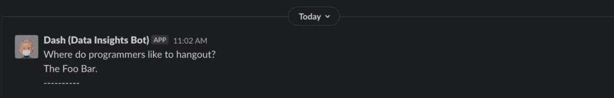
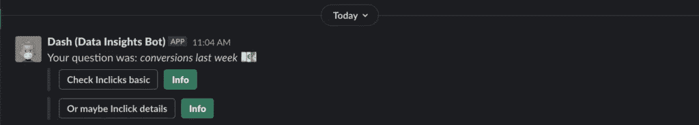

# 自动化枯燥的东西:数据问题

> 原文：<https://towardsdatascience.com/automating-the-boring-stuff-simple-questions-about-data-4403167eabe2?source=collection_archive---------46----------------------->

## 一个懂 SQL 的机器人

加入 froma tob 10 天后，2019 年 9 月，当我还住在酒店的时候，我们决定重组我们的 Google DataStudio 仪表盘。目的是帮助人们理解哪些问题已经可以用图表来回答了。关于数据的简单、重复的问题不应该在每次被问到时都手动回答。在理想的情况下，人们应该能够通过快速访问仪表板来回答这些问题。

为了让我们的仪表板更加用户友好，我有了开发 Slack bot 的想法。一个友好的 Slack 机器人，将用户重定向到我们的仪表板。破折号就是这样诞生的:

来源:[迪士尼粉丝维基](https://the-incredibles.fandom.com/wiki/Dashiell_Robert_Parr/Gallery)

这个想法很简单:每次你问 Dash 一个问题，他都会给你一两个与可能答案最匹配的仪表盘链接。

我记得我花了一个晚上学习 node.js，做了第一个 Dash 原型。最大的挑战实际上是让他能够与我们的 Slack 组织沟通。后来，定义内部逻辑是我最接近手动*解决机器学习问题的一次。我定义了一个 dashboard 字典- >(关键字列表)，以及一个 dashboard 评分系统，我必须手动调整它的权重，直到我的所有测试都通过，并且我认为我的工具足够健壮，可以使用。*

*Dash 使用下义词/上义词系统、拼写检查器、字符串相似性和单词嵌入的概念，还会讲笑话:*

**

*来源:作者*

*当被问到一个问题(“上周的皈依”)时，他是这样回答的:*

**

*来源:作者*

*与 Dash 的所有通信对其他用户来说是不可见的。这意味着你可以在任何频道或私人对话中使用 Dash，其他人不会注意到你使用了这个机器人。无数次，我在谈话中使用它来快速回答我关于数据的问题。*

*几个月前，我发现了谷歌的 DataQnA，并要求访问他们的私人 alpha。DataQnA 允许您将自然语言中的问题转换为 SQL 查询。*

*经过几次面试后，我获得了访问权限，并开始在 Dash 的新版本中工作。首先，2020 年的 Dash 现在有了一个面具:*

**

*来源:[迪士尼粉丝维基](https://the-incredibles.fandom.com/wiki/Dashiell_Robert_Parr/Gallery)*

*第二，Dash now 不仅仅会将你指向一个仪表盘— **它现在会尝试直接回答你的问题**，因此你甚至不需要放松。DataQnA 的整合并不容易——但这是值得的。我们将不断集成越来越多的数据表到 Dash 中。这里有一个视频演示——当然是用假数据:*

*演示。来源:作者*

*我迫不及待地想看到 Dash 是如何不断成长的，直到我自动失业，然后他们解雇我。*

**原载于 2020 年 10 月 8 日*[*https://fluent data . tech*](https://fluentdata.tech/automating-the-boring-stuff-simple-questions-about-data)*。**