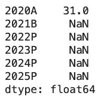
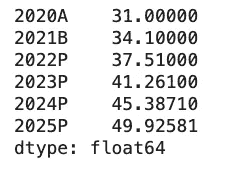
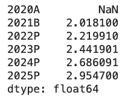
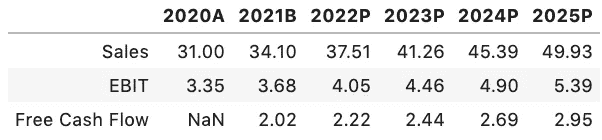
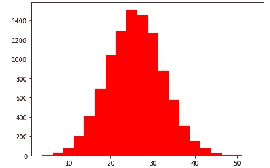

# 自动化 DCF 估价

> 原文：<https://towardsdatascience.com/automating-the-dcf-valuation-35abde04cdb9?source=collection_archive---------13----------------------->

## 使用蒙特卡罗模拟预测财务状况

DCF(贴现现金流)估值模型可能是金融专业人士拥有的最重要的金融工具。这种模型在理论和实践上都很棒，但是传统上在 excel 中执行，它有时在功能上相当繁琐。幸运的是，使用 Python，我们可以自动化这些评估步骤，然后更进一步，创建一个蒙特卡罗模拟函数，用于可视化潜在 DCF 结果的分布。


在 [Unsplash](https://unsplash.com?utm_source=medium&utm_medium=referral) 上由 [Carlos Muza](https://unsplash.com/@kmuza?utm_source=medium&utm_medium=referral) 拍摄的照片

```
**import** numpy **as** np
**import** pandas **as** pd
**import** matplotlib.pyplot **as** plt
%matplotlib inline
```

我们首先需要的是对我们年销售额的预测。我们将创建一个未来六年的数据框架，从理论上讲，它将从以前的财务报表中结转初始销售数据。

```
years = ['2020A', '2021B', '2022P', '2023P', '2024P', '2025P']
sales = pd.Series(index=years)
sales['2018A'] = 31.0  
sales
```



我们现在已经构建了未来五年的销售增长(注:“A”=实际；“B”=预算；“P”=预计)。现在，我们将把预计的年度销售增长用于未来的预测。最终，我们可以用概率分布来代替这些估计，从而得到更真实的预测。

```
growth_rate = 0.1**for** year **in** range(1, 6):
    sales[year] = sales[year - 1] * (1 + growth_rate)

sales
```



类似地，我们现在需要为 DCF 模型中的所有关键变量分配值或公式。这些变量将保持标准的财务定义。(注意:纳税将需要一个额外的 lambda 函数，以确保如果税前利润为负，我们就不会有正的纳税)。

```
ebitda_margin = 0.14
depr_percent = 0.032
ebitda = sales * ebitda_margin
depreciation = sales * depr_percent
ebit = ebitda - depreciation
nwc_percent = 0.24
nwc = sales * nwc_percent
change_in_nwc = nwc.shift(1) - nwc 
capex_percent = depr_percent
capex = -(sales * capex_percent)
tax_rate = 0.25
tax_payment = -ebit * tax_rate
tax_payment = tax_payment.apply(**lambda** x: min(x, 0))
free_cash_flow = ebit + depreciation + tax_payment + capex + change_in_nwc free_cash_flow
```



我们现在有了预计的自由现金流(百万)。现在我们有了 FCF，我们可以开始实际的 DCF 估值模型。我们将计算终值，并将所有现金流贴现回现在。

```
cost_of_capital = 0.12
terminal_growth = 0.02terminal_value = ((free_cash_flow[-1] * (1 + terminal_growth)) / 
                 (cost_of_capital - terminal_growth))discount_factors = [(1 / (1 + cost_of_capital)) ** i **for** i **in** range (1,6)]dcf_value = (sum(free_cash_flow[1:] * discount_factors) +
            terminal_value * discount_factors[-1])
```

为了便于查看，让我们将这些变量打包成一个熊猫数据帧:

```
output = pd.DataFrame([sales, ebit, free_cash_flow],
                     index=['Sales', 'EBIT', 'Free Cash Flow']).round(1)output
```



# 创建蒙特卡洛模拟

因为我们对 DCF 模型变量使用了硬编码值，所以我们没有一个非常健壮的模型。幸运的是，我们可以通过引入蒙特卡罗模拟来改进这一点，该模拟将使用正态分布来随机生成和采样大量变量输入，然后将它们绘制成分布图。我们使用 numpy 来生成这些随机样本，然后迭代 10，000 次。

```
iterations = 10000**def** **run_mcs**():

    *# Create probability distributions*
    sales_growth_dist = np.random.normal(loc=0.1, scale=0.01, size=iterations)
    ebitda_margin_dist = np.random.normal(loc=0.14, scale=0.02, size=iterations)
    nwc_percent_dist = np.random.normal(loc=0.24, scale=0.01, size=iterations)

    *# Calculate DCF value for each set of random inputs*
    output_distribution = []
    **for** i **in** range(iterations):
        **for** year **in** range(1, 6):
            sales[year] = sales[year - 1] * (1 + sales_growth_dist[0])
        ebitda = sales * ebitda_margin_dist[i]
        depreciation = (sales * depr_percent)
        ebit = ebitda - depreciation
        nwc = sales * nwc_percent_dist[i]
        change_in_nwc = nwc.shift(1) - nwc 
        capex = -(sales * capex_percent)
        tax_payment = -ebit * tax_rate
        tax_payment = tax_payment.apply(**lambda** x: min(x, 0))
        free_cash_flow = ebit + depreciation + tax_payment + capex + change_in_nwc

        *# DCF valuation*
        terminal_value = (free_cash_flow[-1] * 1.02) / (cost_of_capital - 0.02)
        free_cash_flow[-1] += terminal_value
        discount_factors = [(1 / (1 + cost_of_capital)) ** i **for** i **in** range (1,6)]
        dcf_value = sum(free_cash_flow[1:] * discount_factors )
        output_distribution.append(dcf_value)

    **return** output_distribution
```

当我们绘制这个模拟图时:



这个输出图向我们显示，当迭代 10，000 个模型输入变量的潜在组合时，我们的贴现现金流值最常见的是在 2，300-2，500 万左右。

这是一个非常基本的介绍，介绍了 Python 在自动化金融操作方面的强大功能，但是蒙特卡洛模拟清楚地展示了这种强大的计算能力，它给了我们我们开始寻找的最终数字。请关注未来的帖子，这些帖子将进一步详细介绍如何使用 Python 实现日常财务任务的自动化。