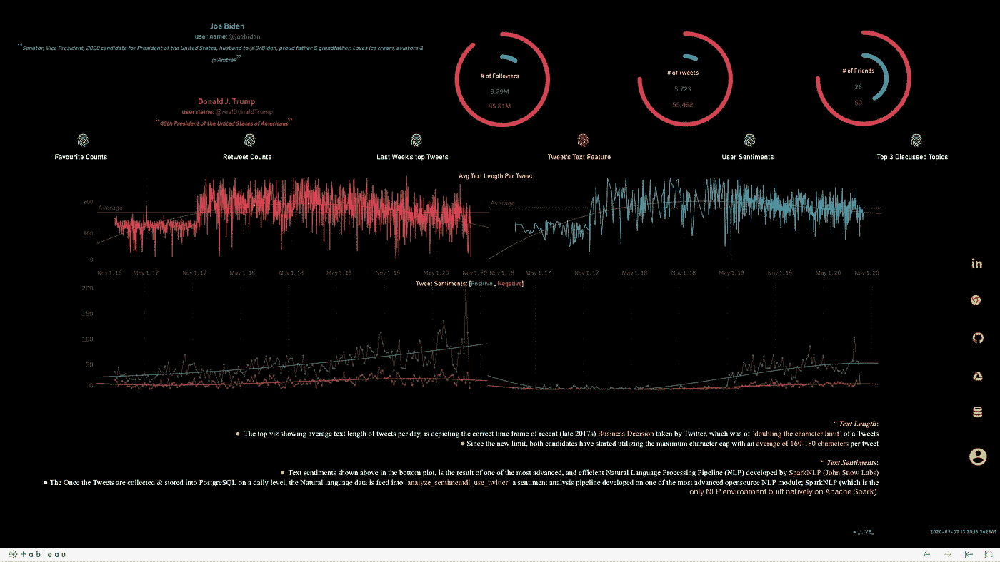

# Py-Spark & SparkNLP 上的情感分析和主题建模自动化(使用 Twitter 大数据)

> 原文：<https://towardsdatascience.com/automation-of-sentiment-analysis-topic-modeling-using-py-spark-sparknlp-twitter-data-2b2d55b5198d?source=collection_archive---------23----------------------->

## 大数据平台 SparkNLP 上的高级 NLP

## 如何使用 spark 框架处理文本大数据并自动化 NLP 模型

马库斯·温克勒在 [Unsplash](https://unsplash.com/s/photos/election?utm_source=unsplash&utm_medium=referral&utm_content=creditCopyText) 上的照片

> “如今的选举不一样了，社交媒体已经大大改变了它们！”—哦，是的，我。

在过去的十年里，政治社交媒体(主要是推特)账户的使用量激增。许多政治领袖(有时是他们的家人)正在使用 Twitter 作为与他们的公民交流的一种卓越模式。然而，这导致了一些有趣的问题。不仅是美国的选举，最近世界上最大的民主国家印度的选举也因社交媒体的影响而被指责为**'*'***(查看*此文由'* [*《华盛顿邮报》*](https://www.washingtonpost.com/opinions/2019/04/30/social-media-is-key-battleground-indias-elections-modi-is-currently-king/) *'* 了解我这里的意思)。这种偏见，主要以 ***两极化的“公众情绪”*** 的形式，通过扭曲脆弱的社交媒体结构而注入。

想到美国政治和推特，你脑海中可能会浮现唐纳德·特朗普总统。自 2015 年特朗普发起政治竞选以来，他因所谓的负面、贬损&有些挑衅的推文而臭名昭著。给他 280 个字符的限制，他会把它翻译成一个由情感、情绪、事实和观点组成的包(通过' [*《纽约时报》*](https://www.nytimes.com/interactive/2019/11/02/us/politics/trump-twitter-presidency.html) *'* 了解他玩的大部分推文)。甚至[***Vox***](https://www.vox.com/2016/5/16/11603854/donald-trump-twitter)(美国著名新闻与观点网站)，在其一篇文章中，也证实了特朗普发**很多**，&量子真的*在那里*。

> 所有上述事实，结合我先进的分析知识，让我思考——我能开发一个能够跟踪 2020 年美国总统大选候选人社交媒体行为的**直播应用吗？**
> 
> **我花了大约一个月的时间，用下面的话完整地回答了我上面的问题:**

**

作者图片** 

# **研究问题:**

**在进行这个项目时，我特别关注以下问题，同时牢记两位候选人(*Donald j . Trump&Joe Biden*):**

1.  **两位候选人的***【Twitter-holdings】***(用户群)是否存在微小差异？(*回答人:*子话题 1.2 中的一般 Twitter 分析)**
2.  **候选人试图从他们的日常推文中获得什么样的*？(*回答人:*使用子主题 2.2 中的 SparkNLP 对推文进行情感分析)***
3.  ******【用户行为】*** (通过研究用户层面的推文情绪)对这些候选人的日常表现如何？(*回答人:*使用子主题 2.2 中的 SparkNLP 对推文进行情感分析)***
4.  ***这些候选人在推特上谈论的*(前 3 名)‘讨论最多的话题’是什么？(*回答人:*使用子主题 2.3 中的 SparkNLP 进行 LDA 主题建模)****
5.  ****有没有一种方法可以让我每天的分析*自动化？(*回答:*使用 windows cmd 的模型本地部署&将数据连接到子主题 3 中的实时开源 RDBMS PostgreSQL)*****

# ****1.数据管道:****

****回答上述问题的第一步是收集适当的数据&将它们存储在数据库中。为了理解候选人水平分析(问题 1、2 和 4)，我需要与特定候选人相关的信息。对于用户层面的分析(用户观点——问题 3 ),我需要与接受调查的候选人相关的一般推文数据。****

## ******1.1 候选级别数据收集:******

****为了获取候选级别的数据，我决定使用官方的[tweeper 的开发者 API](https://developer.twitter.com/en) ，而不是 python 原生的[‘Tweepy Package’](http://docs.tweepy.org/en/latest/index.html)。在处理新获取的自然文本数据时，我还使用了一个清理函数(“clean_tweets”)，如下面的代码片段所示:****

## ****1.2 用户级数据收集:****

****根据官方指南，Twitter API 每 3 小时只允许 3 [00 条推文。因此，这么多的数据不允许我对用户级别的数据进行适当的情感分析。为了避开这个限制，在做了一些研究之后，我决定使用](https://developer.twitter.com/en/docs/twitter-api/v1/rate-limits)[优化的 Get Old Tweets 3](https://github.com/marquisvictor/Optimized-Modified-GetOldTweets3-OMGOT/tree/master/GetOldTweets3-0.0.10) 包装器。它允许我获取与候选人相关的历史性推文。尽管如此，推特的最高点击率是 10，000 次。因此，我每次点击都附上 15 分钟的睡眠周期。****

## ****1.3 在 RDBMS PostgreSQL 中存储数据:****

****由于我计划自动化模型，并考虑到每天 20k+ tweet 数据读取量，我正在寻找一个开源 RDBMS 来存储我的数据。我使用 python 的[*【psycopg 2】*](https://pypi.org/project/psycopg2/)库将我的数据连接到 PostgreSQL，在这里，我将候选人级别和用户级别的数据分别存储在不同的表中。****

# ****2.使用 SparkNLP 进行情感分析和主题建模:****

****由于我计划每天更新我的应用程序数据，我一直在寻找一个 NLP 解决方案，它可以让我获得最快且更准确的“情感分析”和“主题建模”框架。经过几天的研究，我发现了一个由 [***约翰斯诺实验室***](https://www.johnsnowlabs.com/) ***开发的 ***大数据框架。*** 该框架被称为[***【Spark NLP】***](https://github.com/JohnSnowLabs/spark-nlp)***。*** 它是建立在 Apache Spark ML 之上的。它提供了 ***简单的*******表演的****&****精确的*** NLP 标注，便于在分布式环境下为机器学习流水线中的**进行缩放。Spark NLP 自带*220+***管道*** 和 ***型号*** 超过 ***46+*** 语言。它支持最先进的变形金刚，如 ***伯特*** *，****XLNet****，****【ELMO****，* ***艾伯特*** *，* ***通用它还提供了标记化、词性标注、命名实体识别、依存解析、拼写检查、多类文本分类、多类情感分析以及更多 NLP 任务。**************

## *****2.1 设置 Spark NLP 环境:*****

***那些使用过 py-spark 的人应该知道在我的本地机器上实现 py-spark 环境的挑战。经过多次修改安装&卸载各种版本的 py-spark，终于找到了正确的组合***'***[***py spark 2.4。***](https://spark.apache.org/downloads.html)***4’***&Java 版本***’***[***JDK v . 8.0***](https://www.oracle.com/java/technologies/javase/javase-jdk8-downloads.html)***’***与 spark NLP 完美配合。一旦我安装了&并为我的 pyspark 设置了路径，我就安装了最新版本的“ [sparkNLP](https://nlp.johnsnowlabs.com/docs/en/install) ”。此外，在安装了 spark & sparkNLP 之后，我使用 sparkNLP 启动了一个 spark 会话(您也可以使用 spark 本身启动一个自定义会话)&导入了必要的 SQLContext，在模型构建的后续阶段，可能需要用到它来处理 spark 数据帧。***

## ***2.2 使用 SparkNLP 设置情感分析管道:***

***设置好环境后，我构建了一个主函数，它将我之前构建的 ***熊猫数据帧作为输入*** &提供每条推文的 ***文本长度*** 以及 ***情感分数*** 。该函数是使用类似于许多其他机器学习库的 [***管道***](https://nlp.johnsnowlabs.com/docs/en/pipelines) 概念构建的，它由两个主要组件组成，如*估计器*(估计数据和训练模型)和 [***转换器***](https://nlp.johnsnowlabs.com/docs/en/transformers) (转换数据和应用模型)，它们被定义为 [***注释器***](https://nlp.johnsnowlabs.com/docs/en/annotators) 。在构建管道时，注释格式保持非常特定，这与***'***[***注释指南***](https://nlp.johnsnowlabs.com/docs/en/annotators#annotators-guideline)***'***相匹配，因为它们以非常特定的格式获取输入和输出数据。因此，保持按特定顺序构建的管道的流动变得非常重要。例如，在**标记器**的 Spark NLP 的 [*文档*](https://nlp.johnsnowlabs.com/docs/en/annotators#tokenizer) 中，您可以看到这个注释器只接受注释器类型文档的输入数据，并输出标记类型的数据。因此，在 Spark NLP 管道中进出注释器的正确类型需要特别注意。***

***以下是用于我的分析的管道元件的流程和基本功能:***

***I . '[document assembler](https://nlp.johnsnowlabs.com/docs/en/transformers#documentassembler-getting-data-in)' Transformer:为我们的第一个注释器格式化原始输入文本数据***

***二。[标记器](https://github.com/JohnSnowLabs/spark-nlp/tree/master/src/main/scala/com/johnsnowlabs/nlp/annotators/Tokenizer.scala)‘注释器:用标记化开放标准识别标记***

***三。[规格化器](https://github.com/JohnSnowLabs/spark-nlp/tree/master/src/main/scala/com/johnsnowlabs/nlp/annotators/Normalizer.scala)注释器:清理数据并执行小写***

***四。 [LemmatizerModel](https://github.com/JohnSnowLabs/spark-nlp/tree/master/src/main/scala/com/johnsnowlabs/nlp/annotators/Lemmatizer.scala) '注释器:将数据中的所有单词放到它的 lemma(基本形式)中***

***动词 （verb 的缩写）[停用词清理器](https://nlp.johnsnowlabs.com/api/index#com.johnsnowlabs.nlp.annotators.StopWordsCleaner)'注释器:删除不必要的(重复的)常用词集(如' a '、' the '、' in '、' is '、' to '、' at '等)。)***

***不及物动词注释器:将 n 元语法合并到我们的 NLP 管道中***

***七。[感知器模型](https://github.com/JohnSnowLabs/spark-nlp/tree/master/src/main/scala/com/johnsnowlabs/nlp/annotators/pos/perceptron/PerceptronModel.scala)’注释器:使用一个预建的[词性标注模型](https://nlp.johnsnowlabs.com/docs/en/models#english---models)来避免我们的 n 元语法中不相关的词性(POS)标签组合***

***八。[完成器](https://nlp.johnsnowlabs.com/api/index#com.johnsnowlabs.nlp.Finisher)转换器:将最终的注释器输出转换成可用的格式***

***一旦在输入数据上拟合了上述管道(代码行 1 : 78)，我就利用一个 ***预训练管道‘analyze _ sentiment dl _ use _ Twitter’***来确定我的*完成器*输出的情感分数(代码行 80 : 85)。***

***最后，一旦安装了定制管道并计算了情感分数，所有的原始列都在‘id _ tmp’列上被连接到新的' ***sentscores*** '列(代码行 95: 98)，并生成最终输出。一旦制作了 Spark 数据帧，它将再次转换为 pandas 数据帧，以供用户使用(代码行 107: 120)***

***上述函数的输出如下所示(对于每个传递的数据文件):***

## ***2.3 使用 SparkNLP & Py-Spark 进行主题建模:***

***因为 SparkNLP 本身不支持文本矢量化，所以我结合 SparkNLP 和 Py-spark ML 特性来构建 LDA 模型。我使用了从 SparkNLP 管道开发的干净的 n-grams & unigrams 作为对 ***pyspark ml 库*** 的“*”模型(帮助我们计算 [TF-IDF](https://en.wikipedia.org/wiki/Tf%E2%80%93idf) 词频-逆词频/词重要性)的输入。此外，TF-IDF 输出用于训练 pyspark ml 的 [LDA](https://en.wikipedia.org/wiki/Latent_Dirichlet_allocation) 聚类模型(最流行的主题建模算法)。****

# ****3.自动化:****

****为了实现上述所有步骤的自动化，我结合使用了 python 框架和 windows 命令提示符。我将所有的函数和它们的 python 脚本按顺序连接起来，产生了一个主函数。py 文件。这个 python 主脚本被本地 python.exe 使用 windows 批处理(.bat)文件。最后，使用 windows 任务计划程序将批处理文件置于自动执行模式。此外，使用 python 中适当的打印行文本命令，我设法在每天执行代码时在. txt 文件中获得' ***执行报告*** '。执行报告的一个片段如下:****

****为了利用我的开源 twitter (Election2020)数据&关于用 Python 中的 Spark 进行主题建模管道的更详细脚本，请查看我的 [github 代码报告](https://github.com/RKaransinh/RKaransinh-Automation-of-Sentiment-Analysis-Topic-Modeling-on-Py-Spark-SparkNLP-using-Twitter-data)。****

****检查我的[Live-App](https://public.tableau.com/views/KnowtheTweeterofYourVote/Dashboard?:language=en&:display_count=y&:origin=viz_share_link)(Tableau-Public)，在一个平台上展示所有上述分析。****

****在我的 [LinkedIn](https://www.linkedin.com/in/karansinhraj/) 、[电子邮件](mailto:kraj5@uic.edu)、&、[个人作品集](https://kraj54.wixsite.com/analytics-karansinh)中找到更多我的信息。****