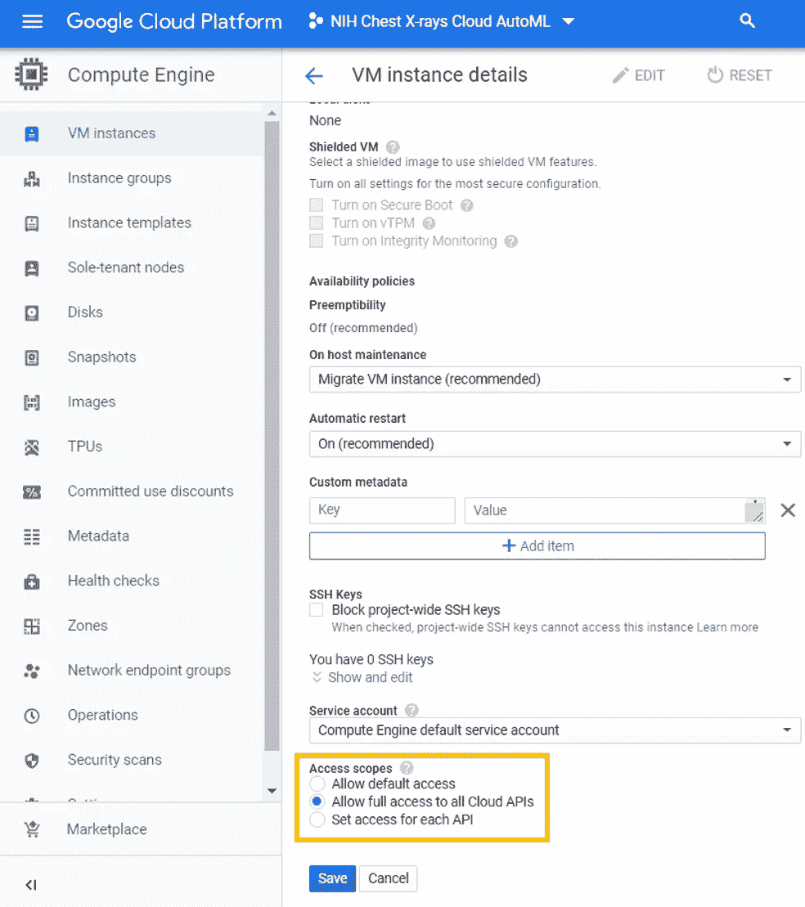

# 大数据和自动化

> 原文：<https://towardsdatascience.com/automl-and-big-data-980e24fba6fa?source=collection_archive---------39----------------------->

## 或者如何对 40+ GB 的数据集使用 Google AutoML


照片由[科迪板](https://unsplash.com/@codypboard?utm_source=medium&utm_medium=referral)在 [Unsplash](https://unsplash.com?utm_source=medium&utm_medium=referral) 上拍摄

Cloud AutoML 是谷歌云平台的一部分。AutoML 提供令人印象深刻的图像分类结果，无需任何数学或技术背景知识。对于 40 GB 以下的图像数据，图像可以直接加载到 AutoML 模块中。对于更大的数据集，必须首先将数据下载到一个虚拟机中，然后传输到存储桶，再从那里传输到 AutoML。

对于小于 40 GB 的数据，请考虑这个[教程](/google-cloud-automl-vision-for-medical-image-classification-76dfbf12a77e)(它为你节省了一些开销)。

我使用的数据集由 112，120 张 X 射线图像组成，这些图像带有来自 30，805 名不同患者的疾病标签[1]。本教程的目标不是深入医学细节，而是展示大型数据集的 AutoML 工作流。您可以在以下位置找到本教程的数据:

[](https://www.kaggle.com/nih-chest-xrays/data) [## NIH 胸部 x 光检查

### 来自 30，000 多名不同患者的 112，000 多张胸部 x 光图像

www.kaggle.com](https://www.kaggle.com/nih-chest-xrays/data) 

# 新项目

在 [Google 云平台](https://cloud.google.com/)中，首先创建一个新项目。


并建立一个新的帐户。有了 300 美元的免费积分，本教程对于了解 AutoML 工作流来说是完美的。


# 虚拟计算机

设置新的虚拟机实例。我用的是 50 GB 磁盘的 Debian GNU/Linux 9 (stretch)。


设置好 VM 后，打开云 Shell 并输入以下命令来下载 python 和 pip。

```
sudo apt update
sudo apt install python3 python3-dev
wget [https://bootstrap.pypa.io/get-pip.py](https://bootstrap.pypa.io/get-pip.py)
sudo python get-pip.py
pip –version
```

然后执行:

```
sudo pip3 install kaggle
```

能够通过 kaggle API 下载数据集。

将您的 kaggle API 令牌上传到环境中。你可以在你的卡格尔账户里找到它。


创建一个新文件夹，并将 API 令牌放入其中。

```
mkdir .kaggle
mv kaggle.json .kaggle/kaggle.json
```

然后下载数据集:

```
kaggle datasets download -d nih-chest-xrays/data
```

在不到 15 分钟的时间里，您已经下载了完整的 42 GB。最后，解压缩数据:

```
unzip data.zip
```

传输文件可能需要允许完全访问所有云 API。



查看这篇 [StackOverflow 帖子](https://stackoverflow.com/questions/28612080/resumableuploadabortexception-403-insufficient-permission)以获得更多帮助。

# 存储桶

解压文件后，你将数据传输到谷歌云存储中。创建一个新的存储桶，并给它一个明确的名称。


执行

```
gsutil -m cp -r [DATA FOLDER] gs://[BUCKET NAME]
```

将所有数据复制到云存储中。为了加速这个过程,–m 标志确保使用所有的虚拟机内核。尽管如此，这需要一些时间。–r 标志复制完整的文件夹。

# AutoML

在数据被完全复制后，转到 Google Cloud 中的 AutoML 并创建一个新的数据集。


在这种情况下，我们有一个多标签分类。这些图像将通过您必须提供给 AutoML 的 CSV 来选择。


AutoML 需要标签的 CSV 文件来指示图像是如何分类的。标签必须以字母开头，并且只能包含字母、数字和下划线。一张图片最多可以容纳 20 个标签。您还可以将标签留空，以便使用 UI 或人工标注服务进行手动标签定义。

有关详细信息，请查阅:

[https://cloud.google.com/vision/automl/docs/prepare](https://cloud.google.com/vision/automl/docs/prepare)

# 培养

然后你看到你的图像的标签，你可以开始训练一个模型。我建议从 1 或 2 小时这样的低预算(训练时间)开始。完成训练后，你总是可以训练更长时间。


为了避免成本，请记住关闭您的虚拟机，或者在不再需要该项目时将其完全删除。

我希望这篇教程能帮助你用 Google Cloud AutoML 处理大型数据集！

[1] X. Wang，Y. Peng，L. Lu，Z. Lu，M. Bagheri 和 RM .Summers， [ChestX-ray8:医院级胸部 X 射线数据库和常见胸部疾病弱监督分类和定位基准](https://www.nih.gov/news-events/news-releases/nih-clinical-center-provides-one-largest-publicly-available-chest-x-ray-datasets-scientific-community) (2017)，IEEE CVPR