# 15 个人对 2 台机器。谁赢了？

> 原文：<https://towardsdatascience.com/automl-faceoff-2-machines-vs-15-humans-bfc9d03e590f?source=collection_archive---------36----------------------->

## 15 名学生研究了 8 个数据集，试图超越 2 个领先数据科学平台的性能。找出谁赢了！

*博客作者:* [郭磊](https://www.linkedin.com/in/leiguo1996)，[张家欣](https://www.linkedin.com/in/jiaxinzhang1997)

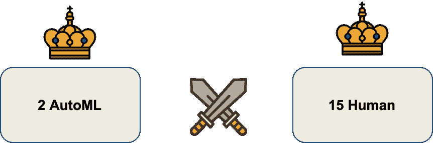

有很多关于自动机器学习(AutoML)工具的讨论，这些工具可以自动化数据科学流程，从而自动生成数据驱动的见解，而不需要数据科学专家。听起来很有希望，但他们在现实中表现如何？这样的平台能胜过人类吗，数据科学家会过时吗？还是人类能打败机器？

在这篇博客中，15 名学生使用机器学习模型研究了 8 个数据集，试图击败 2 个领先的数据科学平台(H2O 和 SparkBeyond)的性能。

# **选手们**

## **机器**

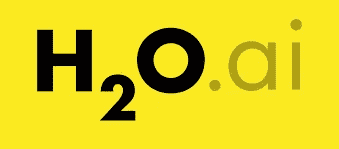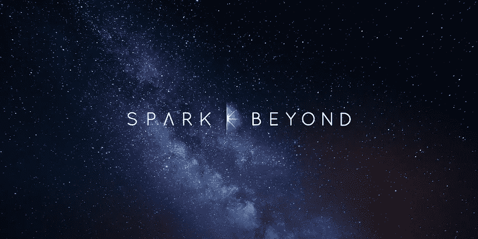

https://www.h2o.ai/products/h2o-driverless-ai/([)H2O 无人驾驶人工智能使数据科学家能够更快、更有效地开展项目，通过自动化在几分钟或几小时内，而不是几个月内完成关键的机器学习任务。它提供自动特征工程、模型验证、模型调整、模型选择和部署、机器学习可解释性、自带配方、时间序列和模型评分的自动管道生成。](https://www.h2o.ai/products/h2o-driverless-ai/)

spark beyond([https://www.sparkbeyond.com/](https://www.sparkbeyond.com/))是一个人工智能驱动的研究引擎，用于发现模式，预测结果，并利用网络上的数据仓库。SparkBeyond 的独特竞争优势在于其强大的特征发现引擎。专注于提高模型预测准确性的特征，SparkBeyond 能够在短时间内生成数十万个特征，并根据其重要性进行筛选。

## **学生们**

来自 NYU 的 15 名金融工程硕士学生参与了这个项目。我们有相关的机器学习经验，并努力成为合格的数据科学家。我们深入研究了 AutoML，以加深我们对机器学习领域的理解。

# 数据集

我们在比赛中使用了 8 个著名的开源数据集。

*分类:*

泰坦尼克号(从 H2O 下载):利用乘客的信息预测泰坦尼克号上乘客的生存情况。

[鸢尾](https://scikit-learn.org/stable/modules/generated/sklearn.datasets.load_iris.html#sklearn.datasets.load_iris):利用萼片和花瓣的长度和宽度预测鸢尾的种类。

[心脏病](https://www.kaggle.com/ronitf/heart-disease-uci):利用生理数据预测患者是否患有心脏病。

Lending Club(由 Spark Beyond 提供):使用财务指标预测贷款违约。

*回归:*

零售销售预测(由 H2O 提供):使用商店和区域数据预测销售量。

[广告](http://faculty.marshall.usc.edu/gareth-james/ISL/Advertising.csv):利用不同媒体上的广告支出预测销售额。

[波士顿房价](https://www.kaggle.com/vikrishnan/boston-house-prices):利用社区和房屋数据预测波士顿房价。

[金县的房屋销售](https://www.kaggle.com/harlfoxem/housesalesprediction):利用房屋特征预测房屋销售价格。

# **实施**

对于实现，我们使用最低接触(以避免给机器人类的优势！)H2O 和 SparkBeyond 的 AutoML 功能；我们还花了 1 周时间让学生建立模型和预测数据。

对于 H2O，用户可以使用它开箱即用，没有很多调整。对于 SparkBeyond，用户可以选择他们想要使用的算法和功能数量。对于人类，15 名学生在每个数据集上测试了几种算法，保留了最好的一种与 AutoML 进行比较。

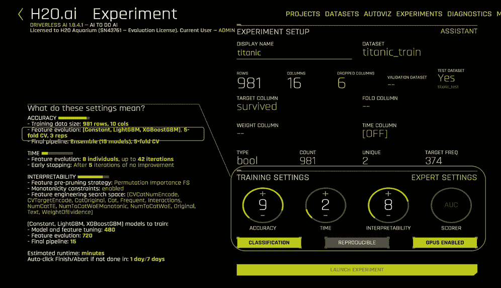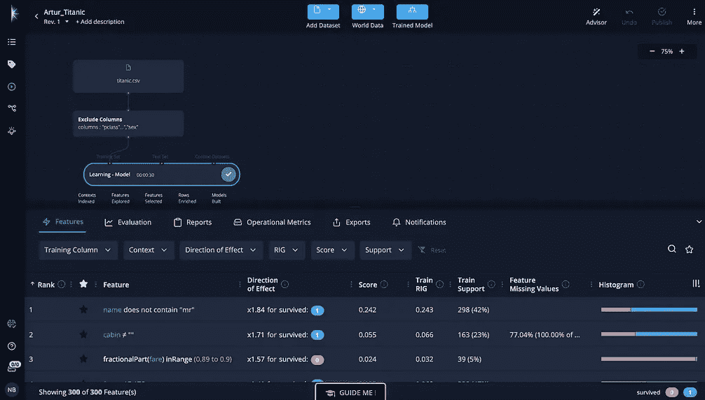

超越界面的 H2O 和火花

# **结果**

下图是*机器对人类*和 *H2O 对 SparkBeyond* 的赢家数量的饼状图。决定获胜者的标准是:如果该方法的 CV 和测试分数都获胜，则该方法为获胜者；如果该方法的 CV 或测试分数中只有一个获胜，则结果为“平局”。

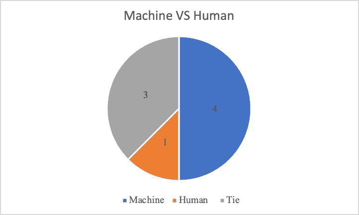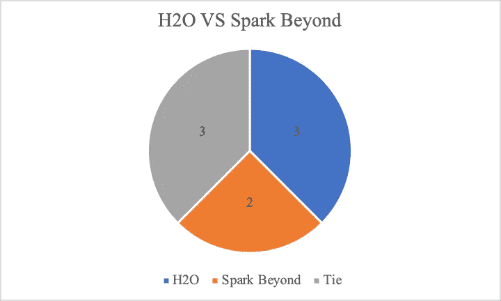

**中奖人数**(详细数据见附录中的表 1 和表 2)

下面的条形图显示了标准化的指标—人与机器的百分比。需要注意的是，我们对前 3 个数据集使用了均方误差，包括金县的房屋销售、波士顿房价和广告。为了更容易与其他指标进行比较，我们选择使用这 3 个数据集的归一化指标的倒数。

如果标准化度量> 100%，则表明人类优于机器。我们可以看到，对于 CV 分数，人类只在一个数据集上对机器有细微的优势。然而，就考试成绩而言，一半的人打败了机器。

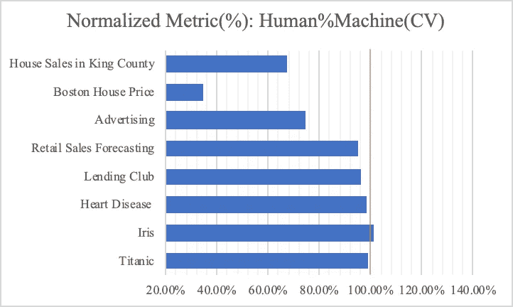

人%机器(人的结果占机器结果的百分比)

# 那么谁赢了，人还是机器？

> ***“竞争”的结果是，在 8 个数据集里，AutoML 赢了 4 场，3 场平局，人类赢了 1 场。***

对于我们测试的 8 个基本数据集，AutoML 模型相对于手工挑选的模型显示出明显的优势。然而，如果我们仔细观察预测分数，**人类和 AutoML 之间的表现差距是微妙的**。

只有一组在交叉验证分数上超过了机器。然而，有 4 组在测试分数上超过了机器。这个特殊的实验表明**人类模型在测试集上比在训练集上有更好的机会击败 AutoML 模型。** AutoML 的特征工程和模型选择完全基于性能，这可能会在训练集上获得更高的分数。然而，这种方法也降低了模型的可解释性，并可能导致轻微的过度拟合问题。另一方面，学生更依赖于对数据集的理解，因此，人类模型可以生成有竞争力的样本外结果。但请注意，即使是样本外的分数，也只有一半的人类模型击败了机器模型。**总体而言，AutoML 仍有不可忽视的优势。**

# **关于 AutoML 的利与弊，你需要知道什么**

总的来说，AutoML 可以成为数据科学家解决问题的一个很好的起点。它还可以帮助非数据科学家轻松获得最好的机器学习。

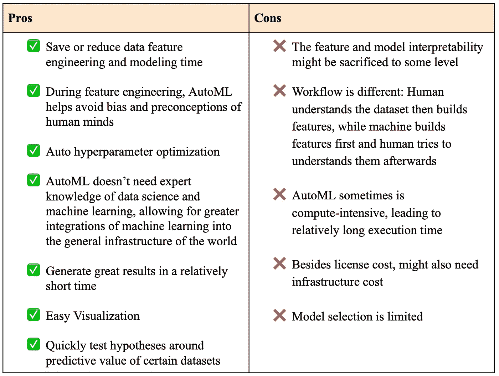

# H2O 和斯帕克比谁更强？

总的来说，在我们测试的 8 个数据集(H2O 3 胜，spark beyond 2 胜，3 平)上，一个平台相对于另一个平台没有明显的优势。在这两个平台上的实验中，学生们发现 SparkBeyond 具有更好的特征工程功能，而 H2O 通过提供详细的报告和模型解释功能而更加用户友好。

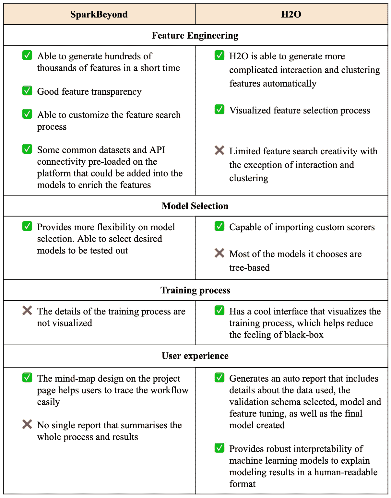

# 下一步是什么？

在我们的实验中，一些团队通过将 SparkBeyond 生成的要素添加到数据集，然后在 H2O 上执行 AutoML，取得了出色的结果。结合每个数据科学解决方案提供商的最佳功能可能是未来探索的一个有趣方向。

我们在这个实验中使用的数据集既简单又普通。当处理更复杂的数据集时，数据科学平台可能会展现出更多的魅力。我们的团队将继续探索这些平台，在具有不同结构的更复杂的数据集上实现它们的功能，如时序数据、非结构化/文本数据、不平衡/倾斜数据等。请继续关注我们的下一篇文章。

如果您想了解我们项目的更多信息，请随时通过 LinkedIn 联系 15 名才华横溢、训练有素的 NYU 金融工程硕士学生。我们对与 AutoML、数据科学和量化金融相关的讨论持开放态度。

> 分类:
> 
> 泰坦尼克号:，[于](http://www.linkedin.com/in/yiping2987)
> 
> 虹膜:，[顾](http://linkedin.com/in/zheyugu)
> 
> 心脏病:[孙](https://www.linkedin.com/in/shiqisun/)、[杨](https://www.linkedin.com/in/tingwen-yang/)、[、](https://www.linkedin.com/in/jiaxinzhang1997)
> 
> 借贷俱乐部:[梁如心](http://www.linkedin.com/in/ruxin-caroline-liang)，[孔祥俊](https://www.linkedin.com/in/xiangjun-kong/)
> 
> 回归:
> 
> 零售额预测:[董](https://www.linkedin.com/in/yuesheng-dong/)，[董一凡](https://www.linkedin.com/in/yifan-dong-24aba3187)
> 
> 广告:，[杨](https://www.linkedin.com/in/tingwen-yang/)
> 
> 波士顿房价:[刘贺静](https://www.linkedin.com/in/hejing-liu/)，
> 
> 景县房屋销售:[元泰谢](www.linkedin.com/in/YuantaiXie)，

**附录**

**最佳机器和最佳人类的表现**

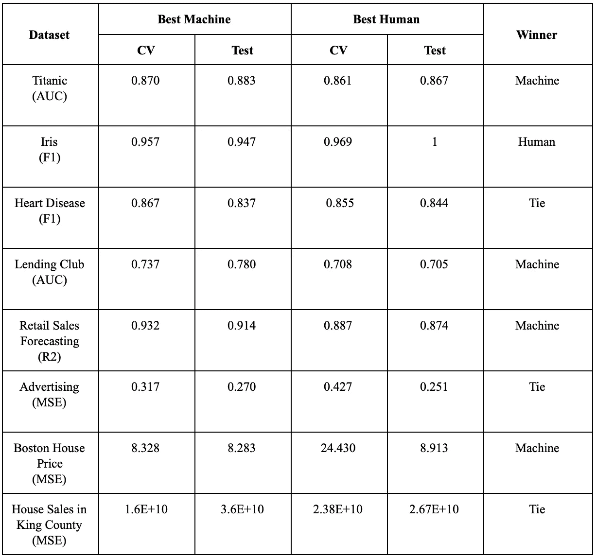

**H2O 和斯帕克的表现**

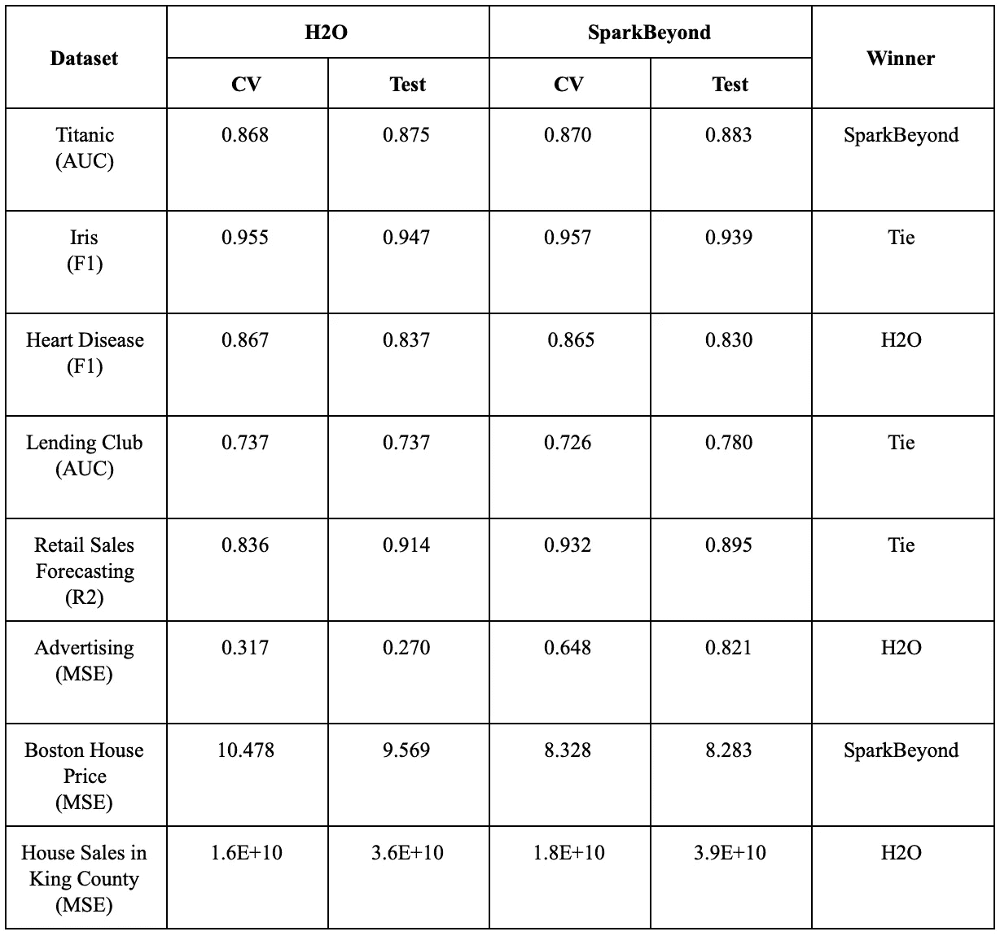

**标准化指标:人%机器**

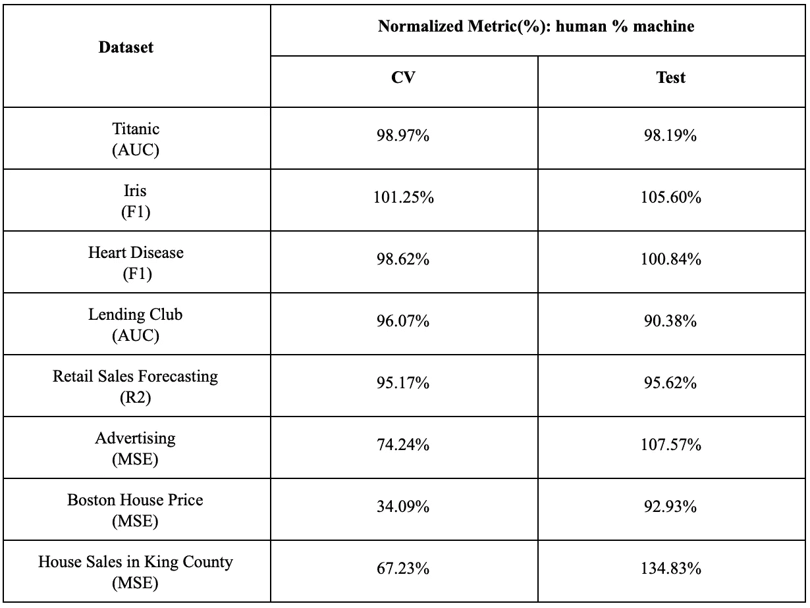