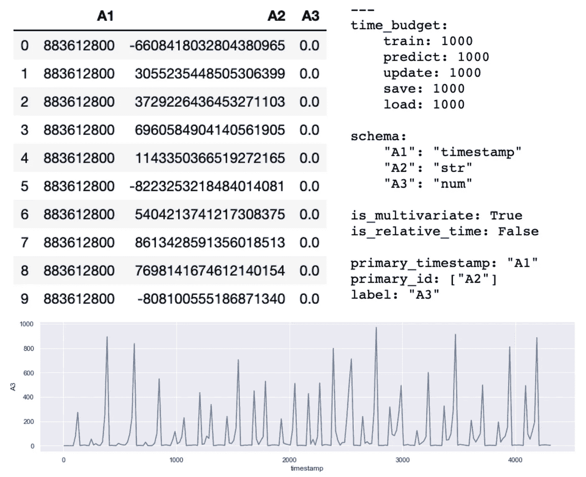
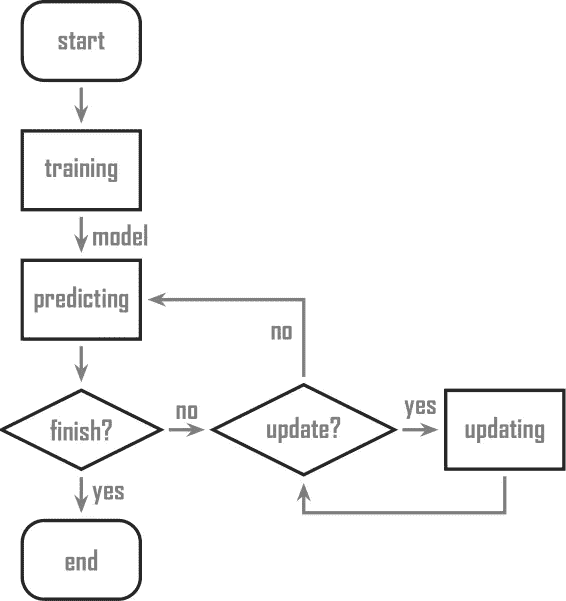
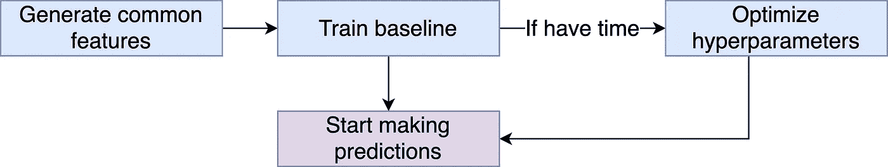
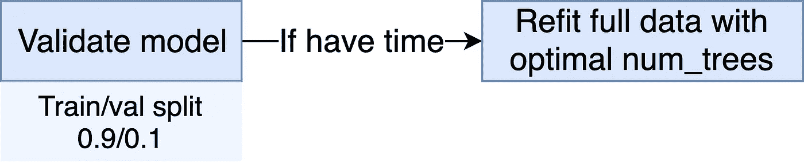
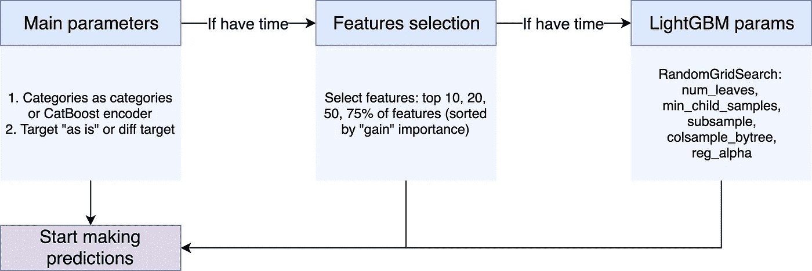
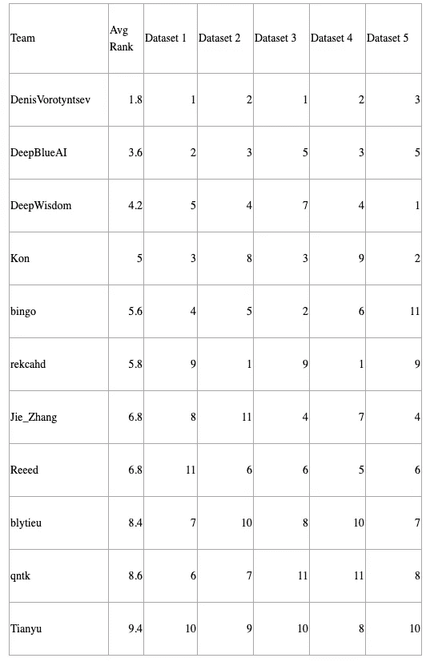

# 时间序列预测的 AutoML

> 原文：<https://towardsdatascience.com/automl-for-time-series-forecasting-6caaf194d268?source=collection_archive---------9----------------------->


《辛普森一家》第七季第 135 集(“特大号荷马”)

虽然我不是现在汽车的粉丝，但我喜欢参加汽车比赛。我相信这样的比赛是一个很好的学习机会，可以为未来的项目提供强大的管道。AutoML 竞赛介于 Kaggle 类竞赛和 LeetCode 任务之间:您的代码应该给出高分，并且应该稳定快速。

最近我参加了[汽车系列](https://autodl.lri.fr/competitions/163)——汽车时间序列数据竞赛，我在 40 名参赛者中获得了第一名(15 名进入决赛)。这篇文章概述了我的解决方案。

我在莫斯科 2020 年奥维托 ML 培训期间关于最终解决方案概述的讲话

# 竞争描述

AutoSeries 是网络搜索和数据挖掘( [WSDM](http://www.wsdm-conference.org/2020/index.php) )大会的竞赛项目之一。该比赛是由 4Paradigm 和 ChaLearn 举办的第 10 届 AutoML 比赛。之前的目标是为表格数据、计算机视觉、自然语言处理和语音识别任务提供自动化的机器学习解决方案。过去挑战赛的完整列表可以在 AutoML 挑战赛的官方网站[上找到。](http://automl.chalearn.org/)

这项挑战旨在为时间序列回归任务提出自动化解决方案。AutoSeries 仅限于多元回归问题，这些问题来自不同的时间序列领域，包括空气质量、销售、工作场所、城市交通等。挑战中的每个数据集都是表格数据，其特征主要有三种类型:Id(可能有多个特征，也可能没有)、时间戳(每个数据集只有一个时间戳)、其他特征(数字或分类)以及预测目标。Id 特征的组合识别一个变量(一个时间序列)。



给定数据集的示例。正如你所看到的，数据是混乱的，但是有一些时序模式

参与者要提交代码，代码将在 Docker 容器中运行(CPU: 4 核，16 Gb RAM，无 GPU)。首先，该模型是在完整数据上训练的，但是在推理过程中，它可以被更新或重新训练。公共排行榜是在五个数据集上计算的，私人——没有人为干预的五个新数据集。私有数据集的结果决定了最终的排名。



# 最终解决方案概述



最终解决方案的一般步骤

这一部分专门讨论最终解决方案的主要部分。它的代码公布在这里:

[](https://github.com/DenisVorotyntsev/AutoSeries) [## DenisVorotyntsev/汽车系列

### 此时您不能执行该操作。您已使用另一个标签页或窗口登录。您已在另一个选项卡中注销，或者…

github.com](https://github.com/DenisVorotyntsev/AutoSeries) 

## 特征工程

该解决方案由几个步骤组成。首先，为时序任务生成公共特征。这些特征的数量和类型是管道的超参数，应该针对每个任务分别进行优化，但是由于缺乏计算时间，我决定为所有任务生成相同的特征，并在特征选择阶段删除无用的特征。

第一批特征是基于最关键的数字特征的特征。数字特征对的数字运算(加、减、乘、除)总是提高基于树的模型的得分，因为新特征可能揭示数据中的一些隐藏关系。

让我们以预测公寓的价格为例。关于公寓楼层( *ap_floor* )和建筑物中楼层总数( *total_floors* )的已知信息可以通过添加新特征来丰富，该新特征显示公寓楼层在建筑物中的相对位置:

```
*rel_floor* = *ap_floor / total_floors*
```

此功能可能有助于模型理解排屋中的第三层( *rel_floor* 更接近 1)与摩天大楼中的第三层( *rel_floor* 更接近 0)不同。

然而，如果我们执行所有可能对的数值运算，这种特征工程策略有两个重大问题:过拟合，这在时序任务中尤其重要，以及存储器问题(使用了 16 RAM docker)。为了减少负面影响，选择一小部分特征用于配对。这是通过将整个数据集拟合到浅层 LigtGBM 模型(10 棵树)来完成的。所有使用的特征按照“增益”重要性排序，即使用该特征的分裂的增益的总和。然后 *top-n* 最重要的数字特征被选择成对。

下一批特征基于数据的时间序列性质:以前的值和差异。我计算目标的滞后值、最重要的数字和分类特征、目标的最后值(滞后= 1)和目标的滞后值(滞后> 1)之间的差异。这些新特性是最重要的特性之一。

最后一批是时间序列特征:年、月、星期几、一年中的某一天和小时。我可以添加更多基于时间的特性，比如一天中的一分钟，一年中的四分之一，等等，但是我决定不这样做，所以我的解决方案是通用的。将这些新特征分类有时会提高分数，但在其他情况下，会显著降低分数。我在推理过程中没有足够的计算时间来优化这个超参数(即，作为数值或分类处理)，所以它们都被作为数值处理。

## 验证和基线模型



在生成新特征之后，基线模型被训练。基线模型使用所有初始和创建的特征。它使用 CatBoost 编码器对类别进行编码，并按原样使用目标。该模型分两步训练:

1.  首先，数据被分成训练和验证部分。通常，您希望您的培训/验证/测试分割能够模拟“生产设置”中模型的使用。在时间序列的情况下，这意味着模型不会频繁更新，您在验证部分采用 20–30%的数据(或使用相同比例的滚动窗口)。在这个竞赛中，模型的频繁更新是可能的，因此，验证部分应该更小:验证部分是全部训练数据的 10%。它用于早期停止，即优化 boosting 集成中的树的数量。在这一步之后，模型可以开始进行预测，接下来的所有步骤都是可选的(对于高分来说是至关重要的)。
2.  使用最佳数量的树在全部数据上重新调整模型。

我使用 solo LigthGBM 模型进行预测。我测试了 CatBoost(没有 GPU 太慢)和 LinearModels(不够准确)。我还用不同的种子测试了打包和训练，以减少预测的方差，但这些方法花费了大量时间，并且没有将分数提高到足以包含在最终解决方案中。

## 超参数优化



超参数优化的步骤

我在超参数优化的推理过程中时间太少，所以我决定将所有可能的超参数组合缩小到最有希望的组合，即:

1.  处理分类变量:将分类特征视为 pandas 类别类型，将难题留给 LightGBM，或者用 CatBoost 编码对每个类别进行编码(如果您还没有阅读，请查看我以前关于编码类别的文章)。
2.  目标预处理:按原样使用目标或者通过微分计算一个新的目标进行回归:*new _ target(t)= target(t)-target(t-1)*。差分有助于克服时间序列数据的非平稳性。我还测试了 power transformation(对 target 和 Box-Cox 求根)来减少平稳性，但它没有将分数提高到足以包含在最终解决方案中。

[](/benchmarking-categorical-encoders-9c322bd77ee8) [## 基准分类编码器

### 通过选择最佳类别编码器来增加 ML 模型的分数

towardsdatascience.com](/benchmarking-categorical-encoders-9c322bd77ee8) 

首先对每组参数进行验证，如果新的验证分数更高，则对模型进行改装。在选择了最佳的管线超参数集之后，模型开始特征选择:使用前 5、10、20 等来重新调整模型。最重要特性的百分比(“获得”重要性)。如果分数有所提高——一组新的特征被用于最后的可选步骤——优化超参数(随机网格)。

## 更新

更新很简单:用完整的数据(训练数据加上新的训练数据)改装最优模型。然而，频繁更新对高分至关重要。

# 结果

我在这个项目上投入了大量的精力，奋斗得到了回报。我在公共排行榜上获得第三名，在私人排行榜上获得第一名。



比赛的最终私人排行榜(已更新)

## 经验教训

在比赛期间，我面临了很多 bug，这些 bug 耗费了我的时间和提交材料。bug 是不可避免的，但是有注释，如果一开始就用的话对我帮助很大:

1.  记录尽可能多的有用信息:数据框中的列(训练和测试数据中的列顺序可能不同)、数据类型(训练和测试数据框中的数据类型可能不同)、每次训练的时间、训练的剩余时间等。这将有助于理解为什么提交失败或得分低。例如，由于一个愚蠢的错误，我提交的一些模型没有更新，我没有注意到这一点。因此，我的分数远低于应有的水平。一条简单的消息*打印出来("型号更新！")*化险为夷，帮我找到了 bug。
2.  在 AutoML 中，对未知数据的测试是必不可少的。您可能很容易使您的解决方案过度适应公共部分，并且它可能会在看不见的数据上崩溃。这就是我的情况——我提交的第一个任务失败了。尽量在比赛开始的时候收集更多的数据。新的数据集应该是多样化的，例如，在类别和其他因素中缺少值或字符串，这可能会使您的代码崩溃。用不同的时间预算来测试它们:当你时间紧迫时，试着输出甚至很差的模型。
3.  以“即插即用”的方式组织代码:管道的每个部分都不应该依赖于其他部分。例如，我想拟合线性回归而不是 LightGBM，这样做容易吗？如果你的代码是组织良好的，它将是。在这次比赛中，我朝着更干净、更有条理的代码迈出了一大步。然而，有时我认为它仍然是垃圾，我看到了进步。
4.  不要在熊猫身上使用*代替*操作，因为[有问题](https://github.com/pandas-dev/pandas/issues/30484)。只要有可能，就不要使用它。

# 感谢

我要感谢汽车系列赛的组织者——4 个 Paradigm 和 ChaLearn 团队。他们做得很好:收集了数据，准备了提交评分引擎，编写了一个强大的基线解决方案，并回答了论坛和电子邮件中出现的问题。谢谢你的工作！