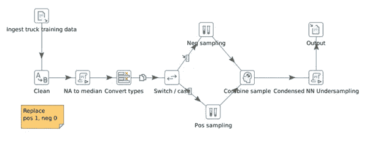

# AutoML + Pentaho + Grafana 用于快速解决方案原型制作

> 原文：<https://towardsdatascience.com/automl-pentaho-grafana-for-fast-solution-prototyping-e3c83b7209?source=collection_archive---------66----------------------->

## TPOT 机器学习实验。

*作者* [*艾琳娜*](https://medium.com/@salova.lena) *和* [*葛温*](https://medium.com/@devblues)


克里斯托弗·伯恩斯在 [Unsplash](https://unsplash.com/s/photos/welding?utm_source=unsplash&utm_medium=referral&utm_content=creditCopyText) 上拍摄的照片

在构建机器学习解决方案时，数据科学家通常会凭直觉选择适当的特征、建模技术和超参数来解决手头的问题。在实践中，这涉及到利用经验(和代码！)从以前的项目中，结合来自主题专家的领域知识，以及许多(许多、许多、许多、许多…！？！)迭代开发周期。

无论实验阶段是有趣的、极其乏味的还是介于两者之间的，有一点是肯定的；这个开发过程**并不**适合快速解决方案原型，尤其是对于新的或者不熟悉的问题领域。

在本帖中，我们将介绍使用自动化机器学习(AutoML)和 Pentaho(我们的数据集成平台选择)和 Grafana(可视化)快速设计、构建和评估大量建模方法，以预测重型斯堪尼亚卡车中的气压系统(APS)故障(2016 年工业挑战在第 15 届智能数据分析国际研讨会上举行)。我们想看看这种方法是否能够:

(1)加快充分执行模型的时间。

(2)帮助我们探索替代的建模/数据准备方法。

(3)为我们未来的项目提供一个可重复的、快速的开发模板。

**数据集**

我们决定在 [UCI 机器学习库](https://archive.ics.uci.edu/ml/datasets/IDA2016Challenge)上使用 Scania CV AB 发布的数据集。它分为训练集和测试集，都有 171 个属性。由于专有原因，属性名称被匿名，但每个字段都对应于卡车上的传感器。训练集总共有 60，000 个样本，其中 59，000 个属于负面类别，1000 个属于正面类别。为了处理数据集中的许多缺失值，我们使用了中位数插补技术。数据集是高度不平衡的，为了对负类进行欠采样，我们使用了随机欠采样和压缩最近邻规则欠采样的组合，以便创建平衡的数据集。至于评分，我们使用了与本文中相同的[成本指示值。在这种情况下，每个假阳性将花费 10 美元(不必要的检查)，假阴性花费 500 美元进行相关的修复。基于这些价值，我们将计算总成本。](https://medium.com/swlh/aps-failure-at-scania-trucks-203975cdc2dd)

**我们的 AutoML 工具包**

AutoML 库旨在使特征工程和模型选择的过程自动化。我们决定使用 [Python TPOT(基于树的流水线优化工具)](http://epistasislab.github.io/tpot/)库，该库使用进化算法来评估多种机器学习技术、特征工程步骤和超参数。换句话说，TPOT 尝试了一种特定的机器学习管道，评估其性能，并随机改变管道的部分内容，以寻求更好的整体预测能力。

除此之外，我们使用 [Pentaho](https://www.hitachivantara.com/en-us/products/data-management-analytics/pentaho-platform.html) 为未来项目构建可重用的 AutoML 模板，管理实时模型目录和管理数据准备。 [Grafana](https://grafana.com/) 用于显示搜索过程中各种管道/算法组合的性能。

**入门**

在 [Pentaho](https://www.hitachivantara.com/en-us/products/data-management-analytics/pentaho-platform.html) 中，我们导入了 Scania APS 数据，采样以重新平衡类，并将所需的 Python 代码嵌入到数据流中以利用 TPOT 函数。



图 Pentaho 中的数据清理和欠采样

我们当前的任务是分类任务(APS 系统故障/无故障)，所以我们将使用 TPOT 分类器。TPOT 的用法和语法类似于任何其他 sklearn 分类器。分类器参数的完整列表可在[这里](http://epistasislab.github.io/tpot/api/)找到。出于开发目的，我们使用了:

**世代**:运行流水线优化过程的迭代次数。

**population_size** :每一代在遗传编程群体中保留的个体数量。

**mutation_rate:** 告诉进化算法每一代应用随机变化的管道数量。

**评分:**功能用于针对分类问题评估给定管道的质量。我们使用“召回”作为开始，因为由于较大的相关成本，最初优化识别所有真正的 APS 故障是有意义的，而不是最小化不必要的呼叫。

**periodic _ check point _ folder:**如果提供，这是一个文件夹，TPOT 将在优化时定期保存帕累托前沿的管道。我们希望在搜索过程中实时记录性能最佳的管道，以感受性能最佳的算法，并记录下来供以后比较。

**详细程度:**TPOT 在运行时传递了多少信息。随着搜索的进行，我们希望看到一切。

```
#example TPOT codeimport pandas as pd
import numpy as np
import pickle
import timefrom tpot import TPOTClassifier
from sklearn import preprocessing
from sklearn.model_selection import train_test_split
from sklearn.externals import joblib#scaling training data and saving scalermin_max_scaler = preprocessing.MinMaxScaler()x_scaled = min_max_scaler.fit_transform(x)scaler_name=’/home/demouser/Desktop/Aldrin/scalers/scaler’+str(int(time.time()))+’.save’joblib.dump(min_max_scaler, scaler_name)X=np.asarray(x_scaled)#splitting train and CV setsX_train, X_test, y_train, y_test = train_test_split(X, y, test_size=0.1, random_state=None)#Training TPOT classifiertpot = TPOTClassifier(generations=50, verbosity=3,population_size=100, periodic_checkpoint_folder=path_to_folder, scoring=’roc_auc’ , mutation_rate=0.9)tpot.fit(X_train, y_train)output_score=str(tpot.score(X_test, y_test))tpot.export(path_to_pipeline)pickle.dump(tpot.fitted_pipeline_, open(file_name, ‘wb’))
```

**构建并可视化模型目录**

我们还运行了一个 [Pentaho](https://www.hitachivantara.com/en-us/products/data-management-analytics/pentaho-platform.html) 作业来收集 TPOT 生成的 ML 管道，并创建一个实时模型目录(图 2 & 3)。


图 2: Pentaho 收集 TPOT 管道并将结果传输到 Grafana 的工作。


图 3:用于数据摄取、争论和执行 TPOT 模型搜索算法的 Pentaho 转换。

我们在 Grafana(图 4)中可视化搜索性能最佳的管道，这使我们能够调整初始 TPOT 搜索参数，以获得运行时间与精度的正确平衡。


图 Grafana AutoML 仪表板的初始示例，用于跟踪 TPOT 搜索进度，包括一段时间内表现最佳的模型管道和召回分数。

**快速成型？**

我们的测试集由 16k 个样本组成，其中 375 个是 APS 系统中的类阳性故障。具体来说，对于斯堪尼亚来说，这些失败的成本是 375 * 500 美元= 187，500 美元。

我们能够在第一次通过时获得相当好的结果:在不到 30 分钟的时间内，使用我们的训练数据集，在测试集的肯定类上获得了 82%的召回率和 78%的准确率。然而，总的来说，成本相当高——33，400 美元。跑了 30 分钟后，TPOT 建议使用基于 XGBoost 的模型。你需要运行 TPOT 多长时间才能让它正常工作，这取决于数据的大小、维度、精度要求以及你必须投入的计算能力。通常用户运行 TPOT 算法几个小时甚至几天来得到最好的管道。我们的目标是获得总成本

**模型可解释性**

接下来，我们想了解 170 个特征(在这种情况下是传感器馈电)中的每一个对我们的 APS 故障预测有多大贡献。这将有助于我们了解哪些传感器反馈是重要的(鉴于我们缺乏斯堪尼亚重型卡车的专业知识！)，以及那些积极阻碍我们成功的因素。使用[SHAP(SHapley Additive exPlanations)库](https://github.com/slundberg/shap)并将所需的 Python 代码嵌入到我们的 Pentaho 数据流中，我们能够从 170 个特征中识别出 30 个最重要的特征，并减少模型训练中使用的数量。

**探索不同的建模方法**

Grafana 中的 AutoML 仪表板允许我们看到哪些建模方法对我们的用例表现良好(图 4 中的示例视图)。除此之外，SHAP 值使我们能够探索哪些特征对模型预测最重要，每个特征的分布对正确分类的概率的贡献，以及不同特征之间的依赖关系(图 5)。


图 5:在 Grafana 中可视化 SHAP 值，探索哪些特征对模型预测最重要，以及不同特征之间的依赖关系。

**初步结果**

在运行了 8 个小时的优化数据流后，TPOT 提出了一个随机森林模型，这与[之前的工作【1】](https://medium.com/swlh/aps-failure-at-scania-trucks-203975cdc2dd)是一致的，随机森林也产生了最好的结果。就平衡假阳性和假阴性而言，我们确定 0.2 的阈值是最有希望的。我们的阳性类别概率阈值为 0.2 的最终模型识别出 357 个真阳性、639 个假阳性、14986 个真阴性、18 个假阴性或 95.2%的召回率和 35.8%的精确度。这相当于不必要的维护呼叫的总成本为 6390 美元，错过的 APS 故障的总成本为 9000 美元，与最初挑战期间[先前工作](https://medium.com/swlh/aps-failure-at-scania-trucks-203975cdc2dd)和[中报告的成本相当。总成本为 15390 美元，比最初运行时提高了两倍多。](https://archive.ics.uci.edu/ml/datasets/IDA2016Challenge)

**进一步改进**

我们能够显著提高模型性能，但它仍远未达到[1] 中所示的最佳模型性能[。我们决定用超参数调谐来获得 TPOT 输出的最佳管道。在对随机森林模型(最佳参数 n_estimators=200，max_depth=10)执行超参数网格搜索后，我们能够得到 12320 美元的总成本，其中有 13 个假阴性和 582 个假阳性，38.3%的精确度和 96.5%的召回率。这让我们更接近于](https://medium.com/swlh/aps-failure-at-scania-trucks-203975cdc2dd)[车型在【1】](https://medium.com/swlh/aps-failure-at-scania-trucks-203975cdc2dd)和[原挑战赛【2】](https://archive.ics.uci.edu/ml/datasets/IDA2016Challenge)中产生的最佳成本。

**总结**

TPOT 图书馆与 SHAP 合作，为探索各种模型提供了一个很好的工具集，同时更好地理解了哪些功能正在影响模型的行为。这种方法的优点包括相对容易使用和需要配置的参数最少。另一方面，TPOT 能够找到最佳的模型配置，但无法在 10 小时的运行周期内优化超参数。从我们的角度来看，这突出了两种方法(TPOT 和 SHAP)的计算复杂性。人们需要等待相当长的时间(例如 10 个小时)才能得到结果，但正如 TPOT 的创造者所说，AutoML 算法并不意味着运行半个小时。总之，考虑到我们对数据集的不熟悉，我们认为 AutoML 方法减少了我们的实验时间或“获得合适的原型解决方案的时间”。当使用熟悉的数据源时，在减少开发时间方面可能没有什么好处，但是 TPOT 可以以辅助方式用于寻找替代的建模方法，或证明当前使用的建模技术。

**参考文献**

[1]Mr unal sawant 在 https://link.medium.com/zrKQJkThv6 T2 @ the startup _ 的斯堪尼亚卡车上的 APS 故障

[2]费雷拉·科斯塔，卡蜜拉和纳西门托，马里奥。(2016).IDA 2016 工业挑战:使用机器学习预测故障。381–386.10.1007/978–3–319–46349–0_33.【https://archive.ics.uci.edu/ml/datasets/IDA2016Challenge 

*由* [*埃琳娜·萨洛娃*](https://medium.com/@salova.lena) *和* [*葛温·伊文斯*](https://medium.com/@devblues)