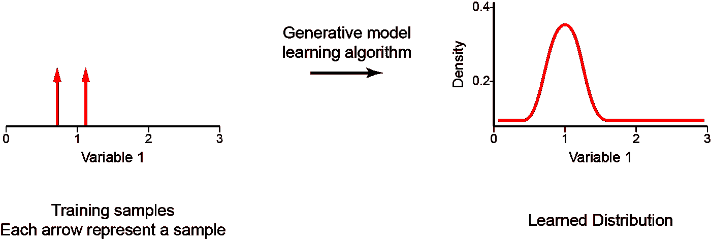
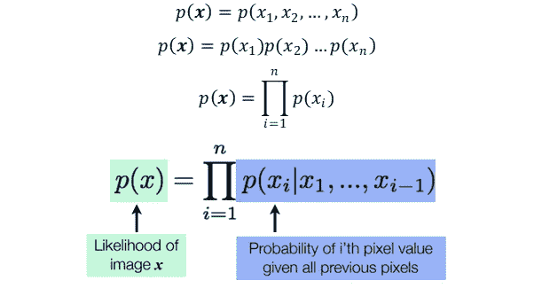
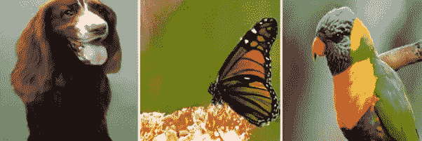
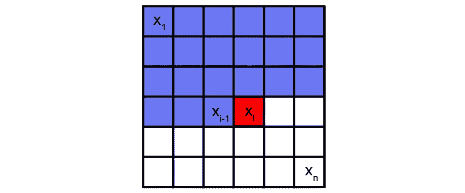
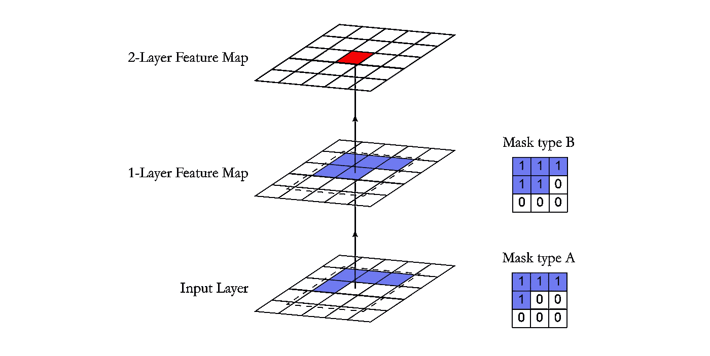
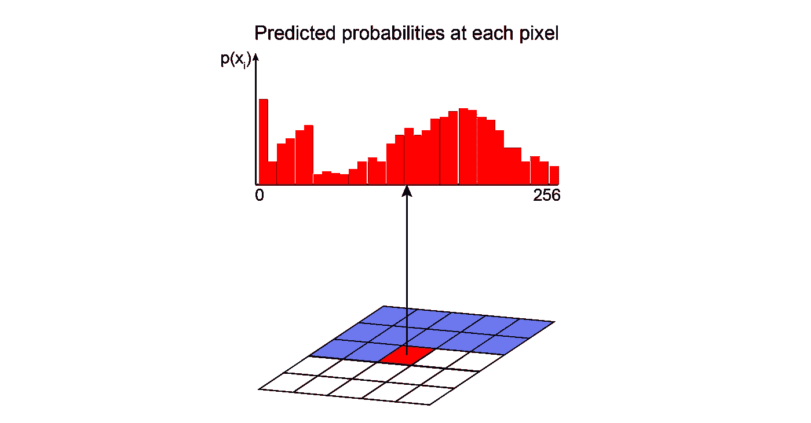
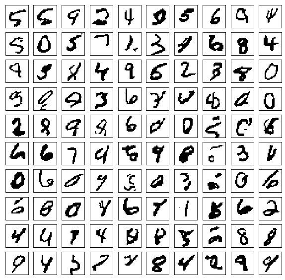
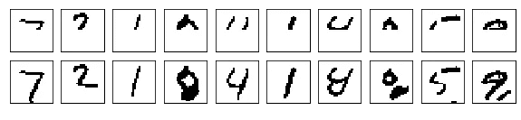
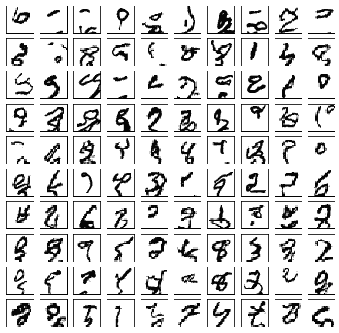
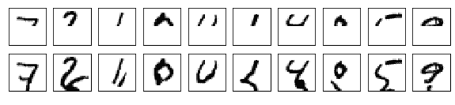

# 自回归模型— PixelCNN

> 原文：<https://towardsdatascience.com/autoregressive-models-pixelcnn-e30734ede0c1?source=collection_archive---------16----------------------->

## 深度学习/生成模型

## 使用深度生成模型创建数字！

编剧[沃尔特·雨果·洛佩兹·皮纳亚](https://twitter.com/Warvito)、[佩德罗·f·达·科斯塔](https://twitter.com/thepfcosta)和[杰西卡·达弗伦](https://twitter.com/jessdafflon)

大家好！这是我们关于现代自回归模型系列的第一篇文章。以下是我们将在本系列中涉及的主题:

## **总结**

1.  自回归模型— PixelCNN
2.  [模拟彩色图像](https://medium.com/@pedro.hpf.costa/modelling-coloured-images-acd0ebde0102)
3.  [PixelCNN 的盲点及如何修复——门控 PixelCNN](/pixelcnns-blind-spot-84e19a3797b9)
4.  使用门控像素 CNN 的条件生成
5.  带裁剪卷积的门控像素 CNN
6.  提高性能— PixelCNN++
7.  缩短采样时间—快速 PixelCNN++
8.  使用注意机制——pixels nail
9.  生成多样化的高保真图像——VQ-VAE 2

每个主题的实现都可以在[这个库](https://github.com/Mind-the-Pineapple/Autoregressive-models)中找到

开始吧！

# 介绍

生成模型是来自无监督学习的一类重要的模型，在过去的几年中受到了很多关注。这些可以被定义为一类模型，其目标是学习如何生成看起来来自与训练数据相同的数据集的新样本。在训练阶段，生成模型试图解决**密度估计的核心任务。**在密度估计中，我们的模型学习构造一个估计量——*p model(****x****)*——尽可能的类似于不可观测的概率密度函数——*pdata(****x****)*。值得一提的是，创成式模型应该能够从分布中构造新的样本，而不仅仅是复制和粘贴现有的样本。一旦我们成功地训练了我们的模型，它就可以用于各种各样的应用，从图像修复、着色和超分辨率等重建形式到艺术作品的生成。

有几种不同的方法可以用来进行这种概率密度估计，例如:

1.  **生成敌对网络(GANs)** 使用一种方法，其中模型执行 ***隐式密度估计*** 。在这种情况下，我们训练一个模型，它可以从*p model(****x****)*创建样本，而无需显式定义*p model(****x****)*；该模型学习产生数据的随机程序，但不提供观察概率的知识或指定条件对数似然函数；
2.  **变分自动编码器(VAE)** 使用一个 ***显式密度估计*** 但是定义了一个难以处理的密度函数，其潜在变量不能被直接优化。所以，为了训练模型，我们改为推导并优化似然的下界( ***近似密度***)；我们通过最大化证据下限(ELBO)来优化数据的对数似然性(更多细节可在此处的[和此处](https://www.cs.ubc.ca/~lsigal/532S_2018W2/Lecture13b.pdf)的[中找到)；](https://arxiv.org/abs/1906.02691)
3.  **自回归(AR)模型**创建一个 ***显式密度*** 模型，该模型易于处理以最大化训练数据的可能性( ***易于处理的密度*** )。为此，使用这些方法，很容易计算数据观察的可能性，并获得生成模型的评估度量。

正如我们提到的，自回归是一种实用的方法，它提供了似然函数的显式建模。然而，为了对具有多个维度/特征的数据进行建模，自回归模型需要施加一些条件。首先，输入空间 *X* 需要有一个**来决定其特征的** **排序**。这就是为什么自回归模型通常用于具有内在时间步长序列的时间序列。然而，它们可以用于图像，例如，通过定义左边的像素在右边的像素之前，顶部的像素在底部的像素之前。第二，为了对数据观察中的特征的联合分布进行易处理的建模(*p(****x****)*，自回归方法将*p(****x****)*作为条件分布的**产物。自回归模型在给定先前特征的值的情况下，对每个特征使用条件来定义联合分布。例如，来自图像的像素具有特定强度值的概率取决于所有先前像素的值；而一幅图像的概率(所有像素的联合分布)就是它所有像素的概率的组合。因此，自回归模型使用链式法则将数据样本 ***x*** 的可能性分解为一维分布的乘积(下面的等式)。因式分解将联合建模问题转化为序列问题，在序列问题中，人们学习在给定所有先前生成的像素的情况下预测下一个像素。**

这些条件(即确定排序和条件分布的乘积)是自回归模型的主要定义。

现在，**大挑战**是计算这些条件可能性 *p(x ᵢ| x₁，…，x ᵢ ₋ ₁)* 。我们如何在一个易于处理和扩展的表达模型中定义这些复杂的分布呢？一种解决方案是使用通用近似器，如深度神经网络。

# 像素 CNN

DeepMind 在 2016 年推出了 pixel CNN([Oord et al .，2016](https://arxiv.org/abs/1601.06759) )，这个模型开启了自回归生成模型最有前途的家族之一。从那时起，它就被用于[生成语音](https://deepmind.com/blog/article/wavenet-generative-model-raw-audio)、[视频](https://arxiv.org/abs/1610.00527)和[高分辨率图片](https://arxiv.org/abs/1906.00446)。

使用 VQ-VAE-2 生成图像([链接](https://arxiv.org/abs/1906.00446))

PixelCNN 是一个深度神经网络，可以捕捉其参数中像素之间的依赖关系分布。它沿着两个空间维度在图像中一次一个像素地顺序生成。

感兴趣的像素 I(红色)由所有先前的像素(蓝色)定义。PixelCNN 可以沿着深度神经网络使用卷积层对它们的关联进行建模。

使用卷积运算，PixelCNN 可以并行学习图像中所有像素的分布。然而，在确定特定像素的概率时，标准卷积层的感受野违反了自回归模型的顺序预测。在处理一个中心像素的信息时，卷积滤波器考虑其周围的所有像素来计算输出特征图，而不仅仅是前面的像素。**然后采用掩模**来阻挡来自尚未预测的像素的信息流。

# 屏蔽卷积层

可以通过将不应考虑的所有像素置零来进行掩蔽。在我们的实现中，创建了一个与卷积滤波器大小相同、值为 1 和 0 的掩码。在进行卷积运算之前，该遮罩与权重张量相乘。在 PixelCNN 中，有两种类型的遮罩:

*   **掩码类型 A** :该掩码仅适用于第一个卷积层。它通过将遮罩中的中心像素置零来限制对感兴趣像素的访问。这样，我们保证模型不会访问它将要预测的像素(下图中的红色)。
*   **屏蔽类型 B** :该屏蔽应用于所有后续卷积层，并通过允许从一个像素到其自身的连接来放松屏蔽 A 的限制。为了说明第一层的像素预测，这是很重要的。

掩码 A 仅用于第一卷积层。在所有其他层中使用掩码 B，以允许以感兴趣的像素为中心的卷积运算的信息沿着网络传播。

在这里，我们展示了一个片段，展示了使用 Tensorflow 2.0 框架实现的掩码。

# 体系结构

在 Oord et al. 2016 中，PixelCNN 使用了以下架构:第一层是带有 7x7 滤波器的掩蔽卷积(A 型)。然后，使用 15 个残差块。每个模块使用掩码类型为 B 的 3×3 卷积层和标准 1×1 卷积层的组合来处理数据。在每个卷积层之间，有一个非线性 ReLU。最后，残余块还包括残余连接。

像素 CNN 的架构。

在块序列之后，网络具有 RELU-CONV-RELU-CONV 层链，使用具有 1x1 滤波器的标准卷积层。然后，输出层是预测像素的所有可能值中的值的 softmax 层。模型的输出具有与输入图像相同的空间格式(因为我们需要每个像素的输出值)乘以可能值的数量(例如，256 个强度级别)。

在这里，我们展示了使用 Tensorflow 2.0 框架实现网络架构的一个片段。

# 预处理

像素 CNN 的输入值被缩放到[0，1]的范围内。在这个预处理过程中，有可能以较低数量的强度等级量化像素值。在我们的实现中，我们首先呈现用两个强度级别训练的模型，然后用所有 256 个级别。我们注意到，由于问题复杂性较低(在像素的概率分布中要考虑的可能值较少)，该模型在具有较少级别的数据中表现更好。

目标数据对应于指示像素强度的分类(整数)值。

# 模型评估

PixelCNN 有一个简单的训练方法。该模型通过**最大化训练数据**的可能性来学习其参数。

由于大多数优化问题被定义为最小化问题，一个常用的技巧是将训练目标转化为最小化**负对数似然** (NLL)。

由于 *p(xᵢ|θ)* 对应于 softmax 层输出的概率，NLL 等价于**交叉熵损失**函数——监督学习中常用的损失函数。此外，NLL 是一种用于比较生成方法之间性能的指标(使用 nats 单位或每像素位数)。

# **推论**

由于 PixelCNN 是一个自回归模型，推理恰好是顺序的——我们必须逐个像素地生成。首先，我们通过向模型传递零来生成图像。它不应该影响第一个像素，因为它的值被建模为独立于所有其他像素。因此，我们执行向前传递并获得它的分布。给定分布，我们从多项式概率分布中抽取一个值。然后，我们用采样的像素值更新我们的图像，并且我们重复这个过程，直到我们产生所有的像素值。这里使用 PixelCNN 使用 MNIST 数据集在 150 个时期后生成样本。每张生成的图像都有四级像素强度。

相同的采样过程可以用于部分遮挡的图像作为起点。

现在，我们还尝试训练或建模以产生具有 256 个像素强度级别的图像。

生成了 256 个强度级别的数字。

部分遮挡的图像。

与其他生成模型(VAE 和甘斯)相比，这种采样过程相对较慢，在其他模型中，所有像素都是一次性生成的。然而，最近的进展已经使用缓存值来减少采样时间(快速 PixelCNN++，在接下来的帖子中解决)

# 结论

PixelCNN 模型的优点是联合概率学习技术是易处理的，并且可以使用梯度下降来学习。没有近似值；我们只是试图在给定所有先前像素值的情况下预测每个像素值。由于 PixelCNN 是通过最小化负对数似然来训练的，因此与替代方法(例如 GANs 需要找到纳什均衡)相比，它的训练更加稳定。然而，由于样本的生成是连续的(逐个像素)，原始的 PixelCNN 在可扩展性方面存在问题。在下一篇文章中，我们将在具有 RGB 通道的数据集中训练 PixelCNN 模型。

# 参考

*   [http://sergeiturukin.com/2017/02/22/pixelcnn.html](http://sergeiturukin.com/2017/02/22/pixelcnn.html)
*   [https://towards data science . com/auto-regressive-generative-models-pixel rnn-pixel CNN-32d 192911173](/auto-regressive-generative-models-pixelrnn-pixelcnn-32d192911173)
*   【https://deepgenerativemodels.github.io/ 
*   [https://eigenfoo.xyz/deep-autoregressive-models/](https://eigenfoo.xyz/deep-autoregressive-models/)
*   [https://wiki.math.uwaterloo.ca/statwiki/index.php?title = stat 946 f17/Conditional _ Image _ Generation _ with _ pixel CNN _ Decoders](https://wiki.math.uwaterloo.ca/statwiki/index.php?title=STAT946F17/Conditional_Image_Generation_with_PixelCNN_Decoders)
*   [https://www . code project . com/Articles/5061271/pixel CNN-in-auto regressive-Models](https://www.codeproject.com/Articles/5061271/PixelCNN-in-Autoregressive-Models)
*   [https://towards data science . com/blind-spot-problem-in-pixel CNN-8c 71592 a 14 a](/blind-spot-problem-in-pixelcnn-8c71592a14a)
*   https://www.youtube.com/watch?v=5WoItGTWV54&t = 1165s
*   [https://www.youtube.com/watch?v=R8fx2b8Asg0](https://www.youtube.com/watch?v=R8fx2b8Asg0)
*   [https://arxiv.org/pdf/1804.00779v1.pdf](https://arxiv.org/pdf/1804.00779v1.pdf)
*   [https://blog.evjang.com/2019/07/likelihood-model-tips.html](https://blog.evjang.com/2019/07/likelihood-model-tips.html)
*   [https://arxiv.org/abs/1810.01392](https://arxiv.org/abs/1810.01392)
*   [http://bjlkeng.github.io/posts/pixelcnn/](http://bjlkeng.github.io/posts/pixelcnn/)
*   [https://jrbtaylor.github.io/conditional-pixelcnn/](https://jrbtaylor.github.io/conditional-pixelcnn/)
*   [http://www.gatsby.ucl.ac.uk/~balaji/Understanding-GANs.pdf](http://www.gatsby.ucl.ac.uk/~balaji/Understanding-GANs.pdf)
*   [https://www.cs.ubc.ca/~lsigal/532S_2018W2/Lecture13b.pdf](https://www.cs.ubc.ca/~lsigal/532S_2018W2/Lecture13b.pdf)
*   [https://tinyclouds.org/residency/](https://tinyclouds.org/residency/)
*   [https://tensor flow . blog/2016/11/29/pixel CNN-1601-06759-summary/](https://tensorflow.blog/2016/11/29/pixelcnn-1601-06759-summary/)
*   [https://web . cs . hacettepe . edu . tr/~ ay Kut/classes/spring 2018/CMP 784/slides/le C10-deep _ generative _ models-part-I _ 2 . pdf](https://web.cs.hacettepe.edu.tr/~aykut/classes/spring2018/cmp784/slides/lec10-deep_generative_models-part-I_2.pdf)