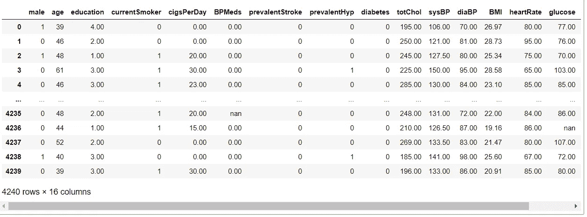
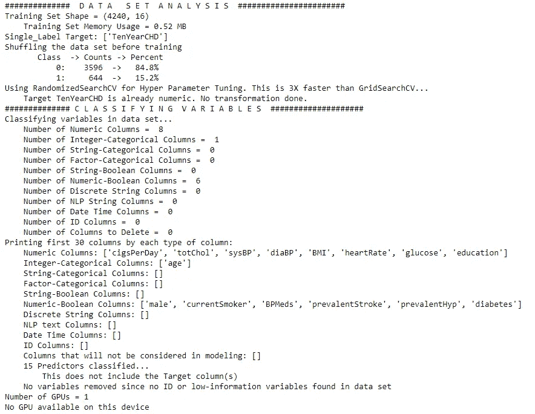
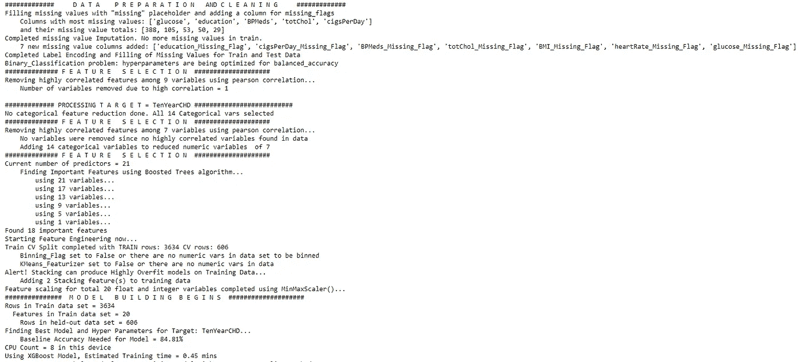
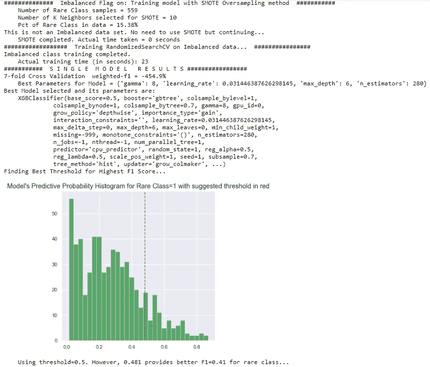
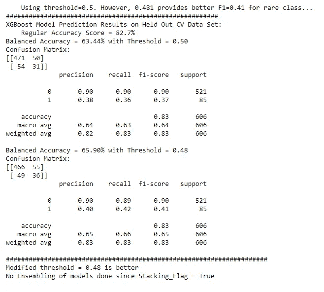
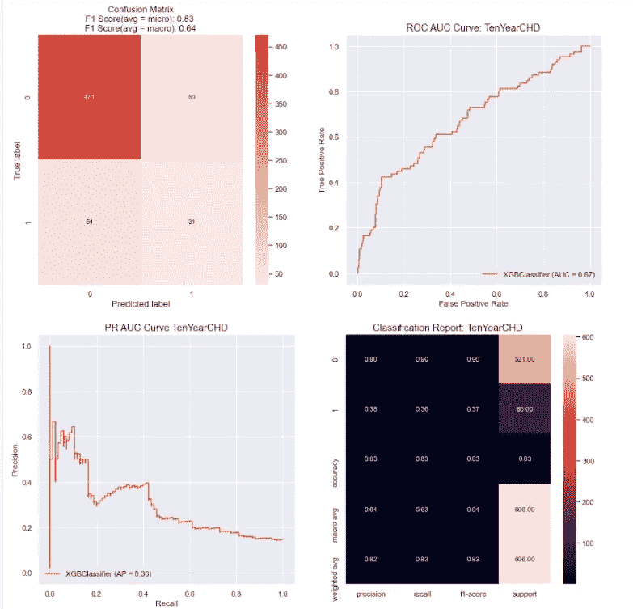
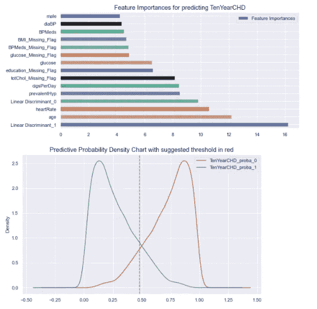

# AutoVIML:自动化机器学习

> 原文：<https://towardsdatascience.com/autoviml-automating-machine-learning-4792fee6ae1e?source=collection_archive---------39----------------------->

## 为任何给定的数据集自动选择最佳的机器学习模型


[法托斯 Bytyqi](https://unsplash.com/@fatosi?utm_source=medium&utm_medium=referral) 在 [Unsplash](https://unsplash.com?utm_source=medium&utm_medium=referral) 上的照片

机器学习提供了学习算法的优势，该算法随着经验自动改进。有“n”种机器学习算法和技术，通常，我们需要测试其中的大多数，以便为我们的数据集找到具有最高准确性的最佳预测模型。

大多数机器学习方法，如回归技术、分类技术和其他模型都是在 Sklearn 中定义的，但为了选择哪种技术最适合我们的问题陈述或数据集，我们需要尝试所有这些模型以及超参数调整，并找出性能最佳的模型。这需要花费大量的时间和精力，使用名为 AutoVIML 的 python 包可以减少这些时间和精力。

AutoVIML 是一个开源的 python 包，使机器学习变得容易。它所做的是，通过不同的机器学习模型呈现你的数据，并为给定的数据集找出精确度最高的最佳模型。无需对数据集进行预处理即可将其传递给 AutoVIML。它会自动清理您的数据，帮助您对变量进行分类，执行特征约简，可以在单个模型中处理不同类型变量的数据，如文本、数字、日期等。

在本文中，我们将了解如何使用 AutoVIML 来减少创建机器学习模型的时间和精力。我们将看到我们在 AutoVIML 中使用的不同参数，以及它们对我们的预测有什么变化。

# **安装 AutoVIML**

像任何其他 python 库一样，我们将使用 pip 来安装 autoviml。

```
pip install autoviml
```

# **导入 AutoVIML**

```
from autoviml.Auto_ViML import Auto_ViML
```

# **加载数据集**

为了探索 AutoVIML，您可以使用任何数据集，这里我将使用一个与心脏病相关的数据集，您可以从 Kaggle 下载。这个数据集包含不同的属性和目标变量。

```
import pandas as pd
df = pd.read_csv('heart_d.csv')
df
```



使用的数据集(来源:作者)

现在让我们了解一下如何使用 autoviml 来使用这个数据集制作预测模型，以及 AutoVIML 中有哪些参数。

```
#Basic Example with all parameters
model, features, trainm, testm = Auto_ViML(
    train,
    target,
    test,
    sample_submission,
    hyper_param="GS",
    feature_reduction=True,
    scoring_parameter="weighted-f1",
    KMeans_Featurizer=False,
    Boosting_Flag=False,
    Binning_Flag=False,
    Add_Poly=False,
    Stacking_Flag=False,
    Imbalanced_Flag=False,
    verbose=0,
)
```

在上面的代码中，我们可以清楚地看到如何使用 AutoVIML 创建模型，以及我们可以使用哪些参数。现在让我们详细讨论这些参数是什么。

1.  train:它应该包含数据集的位置，或者如果您已经将数据集加载到数据帧中，则应该包含数据帧的名称。在本文中，我们将它加载到名为“df”的数据帧中，因此我们将它设置为“df”。
2.  target:它包含目标变量的名称。在我们的例子中，目标变量名是“TenYearCHD”。
3.  test:它包含测试数据集。如果我们没有任何测试数据集，我们也可以像这样将其留空，以便将训练数据集拆分为训练和测试。
4.  sample_submission:我们将把它留空，这样它将在我们的本地目录中自动创建提交。
5.  hyper_param:我们将随机搜索 cv，因为它比网格搜索 CV 快 3 倍。我们需要将此设置为“RS”。
6.  feature_reduction:我们将把它设置为 true，这样它将考虑到模型创建中最重要的预测变量。
7.  scoring_parameter:您可以给出自己的评分参数，否则它将根据模型假设合适的参数。我们将在这里使用“加权 f1”。
8.  KMeans_featurizer:这对于线性分类器应该为真，对于 XGboost 或随机分类器应该为假，因为它会导致过度拟合。
9.  boosting_flag:用于升压。这里我们将保持它为假。
10.  宁滨 _ 标志:默认情况下，它是假的，当我们想把顶部的数字变量转换成装箱的变量时，它可以被设置为真。
11.  add_poly:我们将它设置为 false。
12.  stacking_flag:默认为 False。如果设置为 True，将添加从另一个模型的预测中派生的附加要素。我们将保持它为假。
13.  Imbalanced _ flag:如果设置为 TRUE，它将检查数据不平衡，并将使用 SMOTING 技术消除数据不平衡。
14.  Verbose:通常用于打印所执行的步骤。我们将它设置为 3。

现在让我们将所有这些参数用于我们的数据集，并使用 AutoVIML 创建具有最高精度的最佳性能模型。

```
model, features, trainm, testm = Auto_ViML(
    train=df,
    target="TenYearCHD",
    test="",
    sample_submission="",
    hyper_param="RS",
    feature_reduction=True,
    scoring_parameter="weighted-f1",
    KMeans_Featurizer=False,
    Boosting_Flag=True,
    Binning_Flag=False,
    Add_Poly=False,
    Stacking_Flag=True,
    Imbalanced_Flag=True,
    verbose=3
)
```

让我们分析一下我们得到的输出。

1.  数据分析部分



数据分析(来源:作者)

2.数据清理和特征选择



数据清理(来源:作者)

3.数据平衡和模型创建



数据平衡(来源:作者)

4.分类报告和混淆矩阵



困惑矩阵(来源:作者)

5.模型可视化



模型可视化(来源:作者)

6.特征重要性和预测概率



来源:作者

在上面的集合中，我们看到了 AutoVIML 如何处理数据，清理数据，平衡结果变量，以及创建最佳模型和可视化以获得更好的理解。

同样，您可以使用不同的数据集探索 AutoVIML，并在对本文的回复中分享您的经验。AutoVIML 是一种根据数据集创建最佳性能机器学习模型的简单方法。

# 在你走之前

***感谢*** *的阅读！如果你想与我取得联系，请随时通过 hmix13@gmail.com 联系我或我的* [***LinkedIn 个人资料***](http://www.linkedin.com/in/himanshusharmads) *。可以查看我的*[***Github***](https://github.com/hmix13)**简介针对不同的数据科学项目和包教程。还有，随意探索* [***我的简介***](https://medium.com/@hmix13) *，阅读我写过的与数据科学相关的不同文章。**