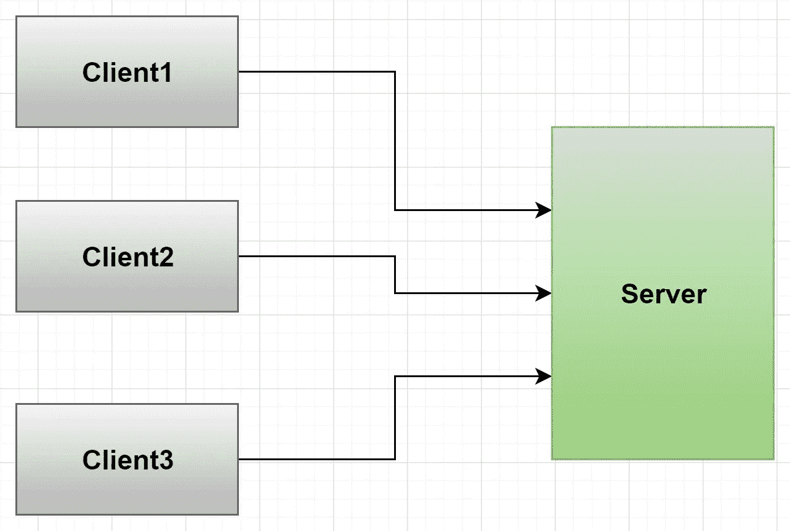
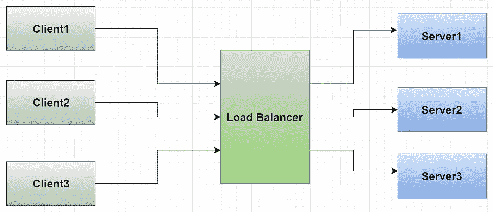
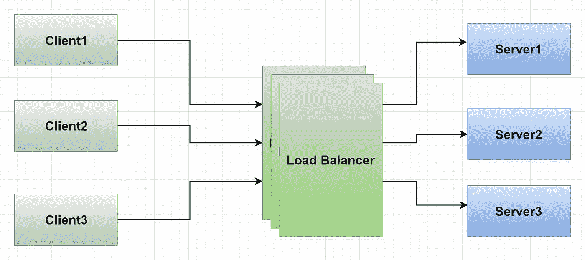

# 如何测量分布式系统中的可用性

> 原文：<https://towardsdatascience.com/availability-in-distributed-systems-adb43df78b9a?source=collection_archive---------24----------------------->

## 可用性是分布式系统的一个关键特征。

图片作者[作者](https://medium.com/@ashchk)

可用性是分布式系统的一个重要方面。在当今时代，大多数系统都需要保证可用性。我们可以说，可用性是一个系统在一个特定的时期内保持功能以执行其所需任务的时间。

> 根据维基百科，[可用性](https://en.wikipedia.org/wiki/Availability)通常被定义为正常运行时间除以总时间(正常运行时间加上停机时间)

我们有时会互换使用可靠性和可用性这两个术语，但它们并不相同。如果我们考虑可能发生的所有可能的真实世界情况，可靠性是随着时间推移的可用性。如果一个系统是可靠的，你可以说它是可用的。但是，如果有，也不一定可靠。

## ★为什么可用性至关重要？

假设我们正在推出一个教程网站。我们必须确保教程、编码和阅读材料的视频的可用性。每当客户访问教程或学习材料的网站时，他们都希望该系统能够完全运行和可用。该系统可能会失去客户，也很难获得新的客户。一个破碎的系统会给你带来不好的名声。

如果系统经常不可用，用户会不满意。他们甚至可能转向提供相同服务的其他竞争对手的系统。因此，对于系统设计师来说，确保可用性非常重要。

现在，这些 web 服务如果不可用，可能会对其宣传、财务安全等造成危害。但这不会是世界末日。没有这样的系统不会有时变得不可用。

让我们以支持一个飞机软件为例。帮助飞机在空中正常运行的软件。现在，这种系统变得不可用甚至几分钟都是不可接受的。因此，一架可以飞行许多小时的飞机可以说具有极高的可用性。如你所见，这可能会影响到生死存亡。

但是我们不需要在我们的想象中走那么远来寻找高可用性场景的生死状况。

即使是 youtube 这样的平台，试想一下，如果 youtube 一旦宕机，会对多少用户造成多大的影响。每天有数亿人使用 youtube，他们中的许多人也依靠 youtube 谋生。AWS 或谷歌云平台等云提供商也是如此。你能想象有多少服务会因此被封锁吗？你现在可能无法阅读这篇文章！！是..那种不好的效果。

此类云提供商的一次宕机可能会产生巨大而深远的影响。所有这些例子都告诉我们，可用性对于系统设计非常重要。

## ★如何衡量可用性？

好了，我们明白了，可用性是必不可少的，但是我们如何衡量可用性呢？它可以计算为系统或服务在正常条件下保持运行的时间百分比。

假设我们根据一年中系统正常运行时间的百分比来衡量系统的可用性。因此，如果一个系统一年中有六个月处于运行状态，它将有 50%的可用性。现在，想象一下，如果脸书或优步一年下跌 50%!！！那真的很糟糕；这是不可接受的。没人会用它们，对吧？

在可用性方面，我们需要处理非常高的百分比。老实说，即使 90%的可用性也不够好。按照这个速度，脸书每天会停机 2.5 小时。一年有 35 或 36 天。那你会用它吗？如果发生这种情况，我怀疑扎克伯格是否会使用它。只有 90%的可用性，任何产品都不可能在今天的市场上生存。

## ★可用性中的 9 是什么

如果一个系统的可用性为 99%,那么它就被称为“两个九”可用性，因为数字“九”会出现两次。即使是 99%可用的系统，一年也有将近四天的停机时间，这对于脸书、谷歌这样的服务来说是不可接受的。

> 可用性的百分比有时用数字中的“9”的数量“T1”或“9 的类别”来表示。

照片由[🇨🇭·克劳迪奥·施瓦茨| @purzlbaum](https://unsplash.com/@purzlbaum?utm_source=medium&utm_medium=referral) 在 [Unsplash](https://unsplash.com?utm_source=medium&utm_medium=referral) 上拍摄

对于 99.9%的可用性称为“三个九”，99.99%的可用性称为“四个九”。“五个九”的可用性(99.999%)给出了一年中 6 分钟的停机时间，可以说这是高可用性的黄金标准。

高可用性(HA)是系统的一个特征，旨在确保一个约定级别的操作性能，通常是正常运行时间，比正常时间长。

高可用性伴随着更高的延迟或更低的吞吐量等代价。当您是系统设计人员时，您的工作就是考虑这些权衡，并决定您需要多高的可用系统。也许您的系统的一部分需要高度可用，而不是整个系统。

比如说，我们以 Medium 为例；它有系统的许多部分。我们需要在配置文件中有 stat 页面的高可用性吗？不完全是。另一方面，文章写作、阅读、主页加载部分需要高可用。如果您在一段时间内看不到统计页面，比如说 5-10 分钟，这有关系吗？我不这么认为。因此，系统的这一部分可能不太可用(当然，不是 50%的可用性)。

## ★高可用性的解决方案是什么？

现在，我们需要知道如何提高系统的可用性。第一个简单的解决方案是**您的系统不应该有单点故障**。因此，如果系统中的某个组件出现故障，整个系统都会崩溃。

图:服务器的单点故障(图片由[作者](https://medium.com/@ashchk)提供)

**冗余是单点故障的解决方案。**冗余是复制或倍增系统组件的行为。

现在让我们假设一个系统有一个服务器来处理客户端的请求。这是一个单点故障。

因此，我们需要添加更多的服务器来处理请求。但是我们需要一个负载平衡器来平衡服务器之间的负载。现在，如果负载平衡器失效，系统将不可用。

图:添加更多的服务器以实现冗余，但是负载平衡器现在是单点故障(图片由[作者](https://medium.com/@ashchk)提供)

因此，我们需要多个负载平衡器来消除系统的单点故障。现在，如果其中一个服务器出现故障，其他服务器可以处理客户端请求。如果一个负载平衡器关闭，其他负载平衡器可以接收请求并将其发送到服务器。

图:负载平衡器和服务器消除单点故障的冗余(图片由[作者](https://medium.com/@ashchk)提供)

## 结论:

可用性是分布式系统的一个关键属性。如果您想使系统可用，您需要消除系统中的任何单点故障。你可以通过使系统的这一部分冗余来做到这一点。此外，您需要在系统中有一个处理系统故障的流程。在系统出现故障的情况下，可能需要人工干预来恢复系统；然后，您需要在系统中建立流程，确保人们在一定时间内收到系统故障的通知。