# 可用的超参数优化技术

> 原文：<https://towardsdatascience.com/available-hyperparameter-optimization-techniques-dc60fb836264?source=collection_archive---------14----------------------->

## 我们在分类模型集上应用三种不同的超参数优化技术来比较它们的准确性。


由 [Vania 拍摄的照片显示](https://unsplash.com/@vaniashows?utm_source=medium&utm_medium=referral)在 [Unsplash](https://unsplash.com?utm_source=medium&utm_medium=referral)

# 背景

我经常收到关于自动搜索超参数优化的文章。一旦我理解了这些技术的意图和范围，我就想知道通过这种优化一个模型可以改进多少。
本文的目的是调查不同的可用优化技术，并在一个简单的例子上测试它们，比较它们并查看所获得的改进的概述。

超参数是模型可调参数，必须对其进行调整以获得具有最佳性能的模型。然后，优化模型的超参数是提高所选算法性能的关键任务。

在某种程度上，我们需要知道每个超参数在每个算法中的含义及其可能的值。深入理解不同算法中每个超参数的含义是必要的，也是一项艰巨的任务，有时意味着了解算法内部的工作方式及其背后的数学原理。这篇文章的内容没有达到那个深度，虽然我们会在每一个里面选取一些超参数，用不同的算法来分析。

使用过任何算法的人可能已经对缺省值集进行了一些手动优化尝试。这种手动调整通常需要很长时间，并不总是严格地进行，并且很难将结果系统化

第二，我们可以应用可用的自动化和相当简单的技术，例如网格搜索和随机搜索，它们通常给出更好的结果，但是时间和机器计算的成本很高。我们将应用这两种技术来比较它们的结果

最后，我们将应用贝叶斯优化，这是一种找到函数最小值的方法，在测试的最佳算法上使用 Python 的 hyperopt 库。这种技术的实现可能不那么容易，但它可以在性能或时间上给我们比以前更好的结果。

# 数据集

我们将在练习中使用的数据集是 [Kaggle 的泰坦尼克号乘客数据集](https://www.kaggle.com/c/titanic/data)，这是一个二元分类练习，用于预测哪些乘客幸存，哪些乘客没有。

```
import os
import numpy as np  # linear algebra
import pandas as pd  #
from datetime import datetime
from sklearn.model_selection import train_test_split
from sklearn.linear_model import SGDClassifier
from sklearn.linear_model import RidgeClassifier
from sklearn.neighbors import KNeighborsClassifier
from sklearn.svm import SVC
from sklearn.ensemble import BaggingClassifier
from sklearn.ensemble import RandomForestClassifier
from sklearn.linear_model import LogisticRegression
import lightgbm as lgb
from sklearn.metrics import confusion_matrix
import scikitplot as skplt%matplotlib inlinenp.random.seed(7)
train = pd.read_csv('./data/train.csv', index_col=0)
y = train.Survived  #.reset_index(drop=True)
features = train.drop(['Survived'], axis=1)
features.head()
```

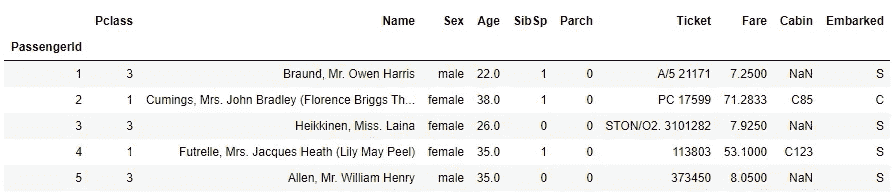

选择的指标是准确性:正确预测的乘客百分比。
准确率= (TP+TN) /(合计)

# 特征工程和结果数据框架

我们将应用数据工程的基本技术，这将使我们能够无误地使用算法(记住，本文的目的不是获得好的结果，而只是比较应用优化技术时的性能)。

我们选择了八种算法来完成这项工作；这个决定是基于重用杰森·布朗利和 T2·威尔·科尔森的部分工作，他们开发了这里使用的大部分代码。

这些模型中的每一个都将是我们结果表中的不同列:

1.  随机梯度推进

2.脊线分类器

3.k-最近邻(KNN)

4.支持向量机(SVM)

5.袋装决策树

6.随机森林

7.逻辑回归

8.LGBM

对于这些列中的每一列，我们将尝试应用以下优化技术:

*   默认超参数
*   Sklearn GridSearchCV
*   Sklearn 随机搜索 CV
*   Python 的远视

```
features = features.drop(['Cabin'], axis=1)
features = features.drop(['Name'], axis=1)
objects = [col for col in features.columns if features[col].dtype == "object"]features.update(features[objects].fillna('None'))
numeric_dtypes = ['int16', 'int32', 'int64', 'float16', 'float32', 'float64']
numerics = [col for col in features.columns if features[col].dtype in numeric_dtypes]
features.update(features[numerics].fillna(0))
features.info()
```

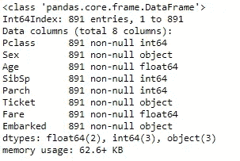

```
# dummies and split
X = pd.get_dummies(features)
X_train, X_valid, y_train, y_valid = train_test_split(X,y,train_size=0.70,test_size=0.30,random_state=0)#Results dataframe
cols = ['Case','SGD','Ridge','KNN','SVM','Bagging','RndForest','LogReg','LGB']resul = pd.DataFrame(columns=cols)
resul.set_index("Case",inplace=True)
resul.loc['Standard'] = [0,0,0,0,0,0,0,0]
resul.loc['GridSearch'] = [0,0,0,0,0,0,0,0]
resul.loc['RandomSearch'] = [0,0,0,0,0,0,0,0]
resul.loc['Hyperopt'] = [0,0,0,0,0,0,0,0]resul.head()
```

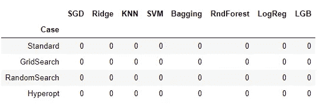

结果的空数据框架

# 第 1 行—每个算法的默认超参数

如上所述，我们的结果表的第一行是分析的起点，采用每个算法的超参数的默认值:

```
#Models creation
sgd   = SGDClassifier()
ridge = RidgeClassifier()
knn   = KNeighborsClassifier()
svc   = SVC(gamma='auto')
bag   = BaggingClassifier()
rf    = RandomForestClassifier(n_estimators=10)
lr    =  LogisticRegression(solver='liblinear')
lgg   = lgb.LGBMClassifier()models = [sgd,ridge,knn,svc,bag,rf,lr,lgg]col = 0
for model in models:
    model.fit(X_train,y_train.values.ravel())
    resul.iloc[0,col] = model.score(X_valid,y_valid)
    col += 1resul.head()
```

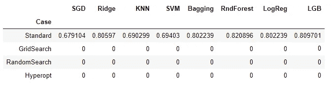

# 第 2 行—应用 GridSearchCV

> “网格搜索通过尝试您想要在模型中尝试的每个可能的参数组合来工作。这些参数中的每一个都在一系列交叉验证过程中被尝试。在过去的几年里，这种技术作为一种调整你的模型的方法已经流行起来了,“⁴.

现在，我们必须为每个算法定义一个包含不同参数及其值的字典

```
from sklearn.model_selection import GridSearchCV
from sklearn.model_selection import RepeatedStratifiedKFold#SGD
loss = ['hinge', 'modified_huber', 'log']
penalty = ['l1','l2']
alpha= [0.0001,0.001,0.01,0.1]
l1_ratio= [0.15,0.05,.025]
max_iter = [1,5,10,100,1000,10000]
sgd_grid = dict(loss=loss,penalty=penalty,max_iter=max_iter,alpha=alpha,l1_ratio=l1_ratio)#Ridge
alpha = [0.1, 0.2, 0.3, 0.4, 0.5, 0.6, 0.7, 0.8, 0.9, 1.0]
ridge_grid = dict(alpha=alpha)#K-Nearest - Neighborg
n_neighbors = range(1, 21, 2)
weights = ['uniform', 'distance']
metric = ['euclidean', 'manhattan', 'minkowski']
knn_grid = dict(n_neighbors=n_neighbors,weights=weights,metric=metric)#Support Vector Classifier
kernel = ['poly', 'rbf', 'sigmoid']
C = [50, 10, 1.0, 0.1, 0.01]
gamma = ['scale']
svc_grid = dict(kernel=kernel,C=C,gamma=gamma)#Bagging Classifier
n_estimators = [10, 100, 1000]
bag_grid = dict(n_estimators=n_estimators)#Random Forest
n_estimators = [10, 100, 1000,10000]
max_features = ['sqrt', 'log2']
rf_grid = dict(n_estimators=n_estimators,max_features=max_features)#Logistic Regrresion
solvers = ['newton-cg', 'lbfgs', 'liblinear']
penalty = ['l2']
c_values = [100, 10, 1.0, 0.1, 0.01]
lr_grid = dict(solver=solvers,penalty=penalty,C=c_values)#LGB
class_weight = [None,'balanced']
boosting_type = ['gbdt', 'goss', 'dart']
num_leaves = [30,50,100,150] #list(range(30, 150)),
learning_rate = list(np.logspace(np.log(0.005), np.log(0.2), base = np.exp(1), num = 10)) #1000
lgg_grid = dict(class_weight=class_weight, boosting_type=boosting_type, num_leaves=num_leaves, learning_rate =learning_rate)
```

然后，对每个应用 GridSearchCV:

```
models = [sgd,ridge,knn,svc,bag,rf,lr,lgg]
grids = [sgd_grid,ridge_grid,knn_grid,svc_grid,bag_grid,rf_grid,lr_grid,lgg_grid]col = 0
for ind in range(0,len(models)):
    cv = RepeatedStratifiedKFold(n_splits=10, n_repeats=3, 
                                 random_state=1) grid_search = GridSearchCV(estimator=models[col], 
                  param_grid=grids[col], n_jobs=-1, cv=cv,  
                  scoring='accuracy',error_score=0) grid_clf_acc = grid_search.fit(X_train, y_train)
    resul.iloc[1,col] = grid_clf_acc.score(X_valid,y_valid)
    col += 1resul.head()
```

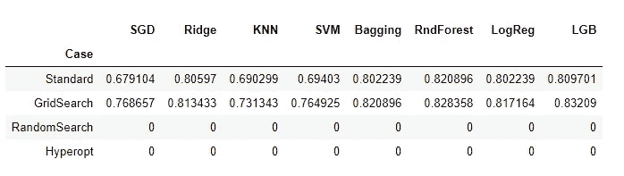

不同的算法有更多的参数，这里没有特意包括，您可以在每个超参数中强制搜索更多的值。
这个缩减是根据我们愿意投入的时间和计算能力来发展的。

# 第 3 行—应用 RandomSearchCV

> “进入随机搜索。考虑尝试每一种可能的组合需要大量的蛮力计算。数据科学家是一群没有耐心的人，所以他们采用了一种更快的技术:从一系列参数中随机取样。这个想法是，你会比网格搜索更快地覆盖接近最优的参数集。然而，这种技术是幼稚的。它不知道也不记得以前运行过的任何东西。”⁴

出于实用目的，代码与 GridSearchCV 相同，只是修改了:

```
random_search = RandomizedSearchCV(models[col], 
                param_distributions=grids[col],n_iter=n_iter_search, 
                cv=cv)
```

代替

```
grid_search = GridSearchCV(estimator=lr, param_grid=lr_grid, 
              n_jobs=-1, cv=cv, scoring='accuracy',error_score=0)
```

完整的代码如下:

```
from scipy.stats import randint as sp_randint
from sklearn.model_selection import RandomizedSearchCVcol = 0
for ind in range(0,len(models)):
    cv = RepeatedStratifiedKFold(n_splits=10, n_repeats=3, 
                                 random_state=1)
    n_iter_search = 3
    random_search = RandomizedSearchCV(models[col],
    param_distributions=grids[col],n_iter=n_iter_search, cv=cv) random_search.fit(X_train,y_train)
    resul.iloc[2,col] = random_search.score(X_valid,y_valid)
    col += 1resul.head()
```

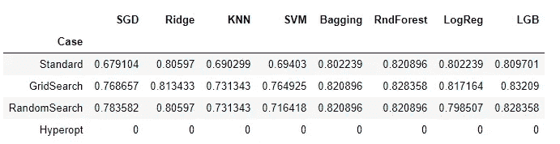

# 分析结果

到目前为止，如果我们检查结果网格，我们发现自动搜索技术的应用已经给出了良好的结果。
在某些情况下，像 SGD 或 SVM 算法已经有了很大的改进，从 67–69%的下限提高到 78–76%。
总的趋势是提高 1、2 或 3 个百分点，GridSearchCV 比 RandomSearchCV 获得更好的结果，随机应用时间比网格应用时间好。

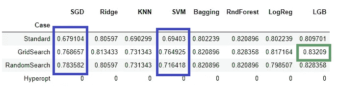

我们来分析一下他版本的 GridSearchCV 中的获胜算法(光照渐变提升):

```
cv = RepeatedStratifiedKFold(n_splits=10, n_repeats=3,  
                             random_state=1)
n_iter_search = 3
grid_search = GridSearchCV(estimator=lgg, param_grid=lgg_grid, 
              n_jobs=-1, cv=cv, scoring='accuracy',error_score=0)
grid_win = grid_search.fit(X_train, y_train)#Predict values based on new parameters
yv_pred = grid_win.predict(X_valid)print(confusion_matrix(y_valid, yv_pred))
skplt.metrics.plot_confusion_matrix(y_valid, yv_pred,figsize=(8,8))
```

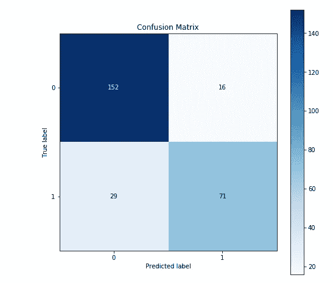

要了解我们使用的算法版本中的超参数:

```
print("Best: %f using %s" % (grid_win.best_score_, grid_win.best_params_))
```

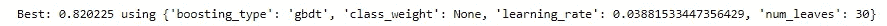

# 第 4 行——使用 hyperopt 库应用贝叶斯超优化

我必须承认，在我理解如何应用贝叶斯优化技术之前，我感到非常失落和困惑，几乎要放弃了。我可以参考的来自图书馆和其他文章的文档和例子都很模糊，或者太枯燥，或者非常过时。
所有这一切，直到我发现这个[优秀的图图利亚](/automated-machine-learning-hyperparameter-tuning-in-python-dfda59b72f8a) l⁵和它的[代号](https://github.com/WillKoehrsen/hyperparameter-optimization/blob/master/Bayesian%20Hyperparameter%20Optimization%20of%20Gradient%20Boosting%20Machine.ipynb) ⁶由[威尔·科尔森](https://towardsdatascience.com/@williamkoehrsen?source=post_page-----dfda59b72f8a----------------------)所作，我建议你一步一步地回顾和尝试，因为它是清晰和详尽的。跟着他，我们要做的第一件事是定义我们的目标函数，它必须返回一个至少带有标签‘loss’和‘status’的字典。

```
import csv
from hyperopt import STATUS_OK
from timeit import default_timer as timerMAX_EVALS = 500
N_FOLDS = 10def objective(params, n_folds = N_FOLDS): """Objective function for Gradient Boosting Machine Hyperparameter Optimization""" # Keep track of evals
   global ITERATION
   ITERATION += 1 # Retrieve the subsample if present otherwise set to 1.0
   subsample = params['boosting_type'].get('subsample', 1.0) # Extract the boosting type
   params['boosting_type'] = params['boosting_type']
         ['boosting_type']
   params['subsample'] = subsample # Make sure parameters that need to be integers are integers
   for parameter_name in ['num_leaves', 'subsample_for_bin', 
                          'min_child_samples']:
       params[parameter_name] = int(params[parameter_name]) start = timer()
   # Perform n_folds cross validation
   cv_results = lgb.cv(params, train_set, num_boost_round = 10000, 
                       nfold = n_folds, early_stopping_rounds = 100, 
                       metrics = 'auc', seed = 50)
   run_time = timer() - start # Extract the best score
   best_score = np.max(cv_results['auc-mean']) # Loss must be minimized
   loss = 1 - best_score # Boosting rounds that returned the highest cv score
   n_estimators = int(np.argmax(cv_results['auc-mean']) + 1) # Write to the csv file ('a' means append)
   of_connection = open(out_file, 'a')
   writer = csv.writer(of_connection)
   writer.writerow([loss, params, ITERATION, n_estimators, 
                   run_time]) # Dictionary with information for evaluation
   return {'loss': loss, 'params': params, 'iteration': ITERATION,
           'estimators': n_estimators, 'train_time': run_time, 
           'status': STATUS_OK}
```

> 域空间:域空间表示我们想要为每个超参数评估的值的范围。每次搜索迭代，贝叶斯优化算法将从域空间中为每个超参数选择一个值。当我们进行随机或网格搜索时，域空间是一个网格。在贝叶斯优化中，想法是相同的，除了这个空间对于每个超参数具有*概率分布*而不是离散值。

```
space = {
'class_weight': hp.choice('class_weight', [None, 'balanced']),
'boosting_type': hp.choice('boosting_type', [
{'boosting_type': 'gbdt', 'subsample': hp.uniform('gdbt_subsample', 0.5, 1)},
{'boosting_type': 'dart', 'subsample': hp.uniform('dart_subsample', 0.5, 1)},
{'boosting_type': 'goss', 'subsample': 1.0}]),'num_leaves': hp.quniform('num_leaves', 30, 150, 1),
'learning_rate': hp.loguniform('learning_rate', np.log(0.01), 
                                                np.log(0.2)),
'subsample_for_bin': hp.quniform('subsample_for_bin', 20000, 
                                                      300000),
'min_child_samples': hp.quniform('min_child_samples', 20, 500, 5),
'reg_alpha': hp.uniform('reg_alpha', 0.0, 1.0),
'reg_lambda': hp.uniform('reg_lambda', 0.0, 1.0),
'colsample_bytree': hp.uniform('colsample_by_tree', 0.6, 1.0)}
```

这里使用不同的域分发类型(在[hyperopt 文档](https://github.com/hyperopt/hyperopt/wiki/FMin)中寻找完整的分发列表):

*   `choice`:分类变量
*   `quniform`:离散均匀(间隔均匀的整数)
*   `uniform`:连续均匀(浮动间隔均匀)
*   `loguniform`:连续的均匀圆木(在圆木刻度上均匀分布的浮子)

```
from hyperopt import tpe
from hyperopt import Trials# optimization algorithm
tpe_algorithm = tpe.suggest# Keep track of results
**bayes_trials = Trials()**# File to save first results
out_file = './gbm_trials.csv'
of_connection = open(out_file, 'w')
writer = csv.writer(of_connection)# Write the headers to the file
writer.writerow(['loss', 'params', 'iteration', 'estimators', 'train_time'])
of_connection.close()
```

最后，准备好所有代码后，我们通过 fmin 函数寻找参数的最佳组合:

```
from hyperopt import fmin# Global variable
global  ITERATION
ITERATION = 0
MAX_EVALS = 100# Create a lgb dataset
train_set = lgb.Dataset(X_train, label = y_train)# Run optimization
best = fmin(fn = objective, space = space, algo = tpe.suggest,
            max_evals = MAX_EVALS, trials = bayes_trials, 
            rstate =np.random.RandomState(50))
```

它触发了寻找最佳组合的过程。在最初的例子中，变量 MAX_EVALS 被设置为 500；由于本练习的性能问题，它被减少到 100，这可能会影响最终结果。

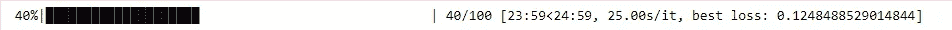

一旦流程结束，我们就可以获取 Trials 对象(在我们的例子中是 bayes_trials)并分析其结果:

```
# Sort the trials with lowest loss (highest AUC) first
bayes_trials_results = sorted(bayes_trials.results, key = lambda x: x['loss'])
bayes_trials_results[:2]
```

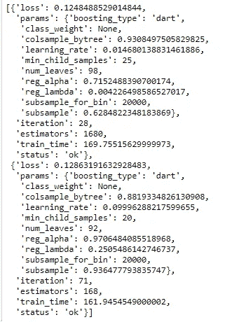

我们还可以从 CSV 加载数据帧，并使用“ast”库将文本转换为字典，并为我们的最终模型提供最佳结果。

```
results = pd.read_csv('./gbm_trials.csv')# Sort with best scores on top and reset index for slicing
results.sort_values('loss', ascending = True, inplace = True)
results.reset_index(inplace = True, drop = True)
results.head()
```

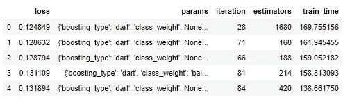

```
import ast# Convert from a string to a dictionary
ast.literal_eval(results.loc[0, 'params'])
```

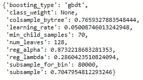

```
# Extract the ideal number of estimators and hyperparameters
best_bayes_estimators = int(results.loc[0, 'estimators'])
best_bayes_params = ast.literal_eval(results.loc[0, 'params']).copy()# Re-create the best model and train on the training data
best_bayes_model = lgb.LGBMClassifier(n_estimators=best_bayes_estimators, n_jobs = -1,
                   objective = 'binary', random_state = 7,
                   **best_bayes_params)
best_bayes_model.fit(X_train, y_train)# Evaluate on the testing data
preds = best_bayes_model.predict(X_valid)
print(confusion_matrix(y_valid, preds))
print (best_bayes_model.score(X_valid,y_valid))
skplt.metrics.plot_confusion_matrix(y_valid, preds,figsize=(8,8))resul.iloc[3,7] = best_bayes_model.score(X_valid,y_valid)
resul.head()
```

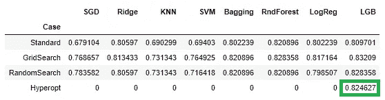

远视在 LGB 模型中的应用

# 摘要

我们开发了完整的代码来应用三种可用的优化技术，八种不同的分类算法。应用这些技术所需的时间和计算能力是一个需要考虑的问题；当所选模型的技术水平足够高时，似乎有必要执行这种优化。
参数优化并不一定意味着训练模型的结果相对于测试数据的持续改进，因为参数的选择可能会产生过度拟合。
最后，应该指出的是，在不同模型上观察到的改进通常具有相当大的幅度，这至少为通过这些技术中的任何一种来提高算法性能的可能性留下了余地。

# 来源和参考

[[1]https://en.wikipedia.org/w/index.php?title = Accuracy _ and _ precision&action =编辑& section=4](https://en.wikipedia.org/w/index.php?title=Accuracy_and_precision&action=edit&section=4)

*在二进制分类中，准确度也用作一种统计度量，用于衡量* [*二进制分类*](https://en.wikipedia.org/wiki/Binary_classification) *测试正确识别或排除某个条件的程度。即准确率是真实结果(既有* [*真阳性*](https://en.wikipedia.org/wiki/True_positive) *又有* [*真阴性*](https://en.wikipedia.org/wiki/True_negative) *)占检查病例总数的比例……量化二进制准确率的公式为:*

*准确度= (TP+TN)/(TP+TN+FP+FN)*

*其中:TP =真阳性；FP =假阳性；TN =真阴性；FN =假阴性*

[2][https://machine learning mastery . com/hyperparameters-for-class ification-machine-learning-algorithms/](https://machinelearningmastery.com/hyperparameters-for-classification-machine-learning-algorithms/)

[3][https://towards data science . com/automated-machine-learning-hyperparameter-tuning-in-python-dfda 59 b 72 f 8 a](/automated-machine-learning-hyperparameter-tuning-in-python-dfda59b72f8a)

[4][https://medium . com/apprentice-journal/hyper-parameter-optimization-c9b 78372447 b](https://medium.com/apprentice-journal/hyper-parameter-optimization-c9b78372447b)

[5][https://towards data science . com/automated-machine-learning-hyperparameter-tuning-in-python-dfda 59 b 72 f 8 a](/automated-machine-learning-hyperparameter-tuning-in-python-dfda59b72f8a)

[6][https://github . com/WillKoehrsen/hyperparameter-optimization/blob/master/Bayesian % 20 hyperparameter % 20 optimization % 20 of % 20 gradient % 20 boosting % 20 machine . ipynb](https://github.com/WillKoehrsen/hyperparameter-optimization/blob/master/Bayesian%20Hyperparameter%20Optimization%20of%20Gradient%20Boosting%20Machine.ipynb)