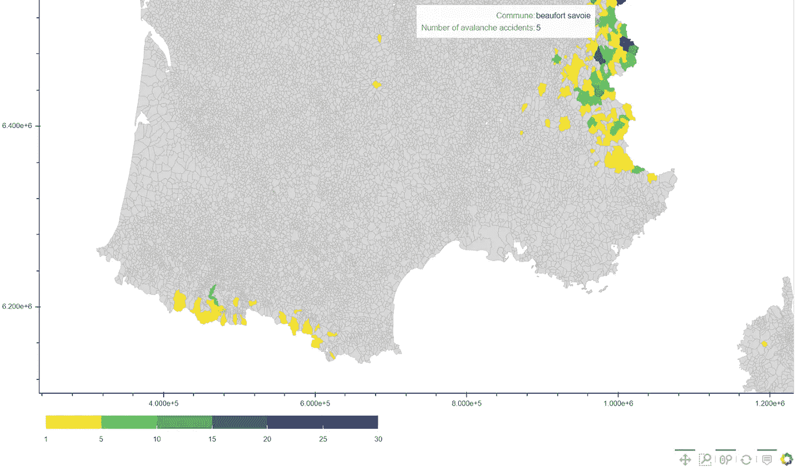
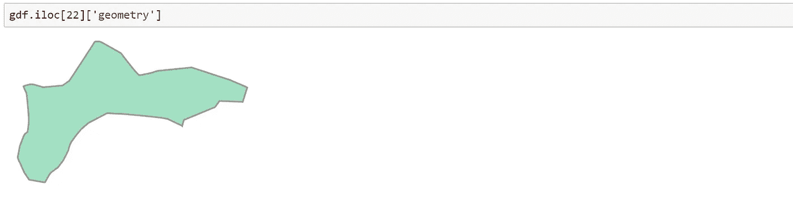
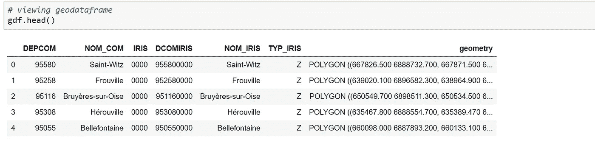
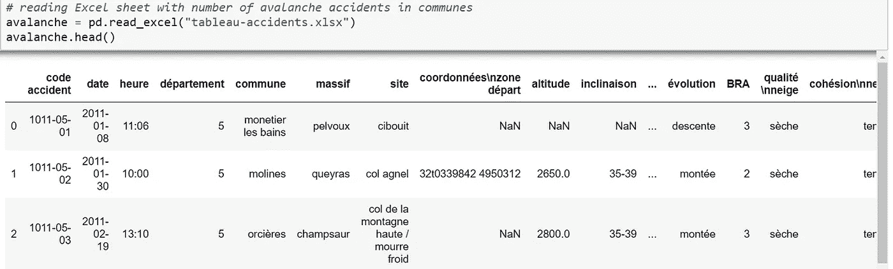
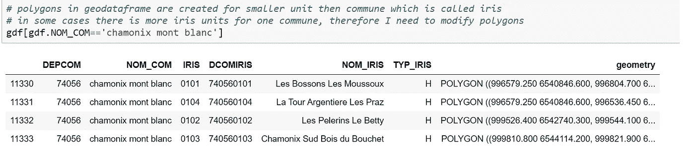
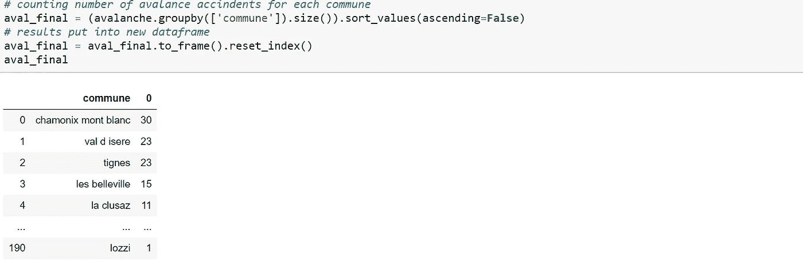
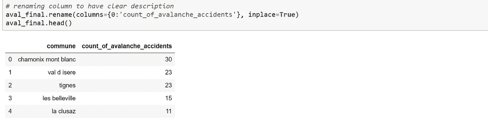
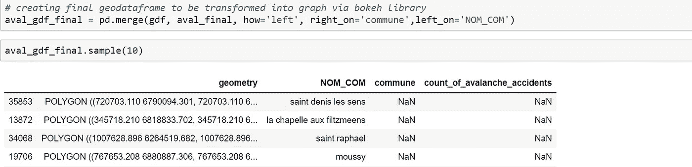
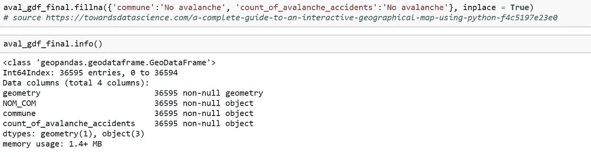
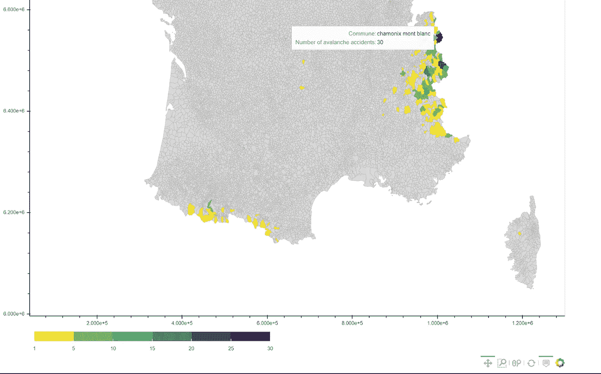

# 法国的雪崩危险

> 原文：<https://towardsdatascience.com/avalanche-danger-in-france-247b81b85e4e?source=collection_archive---------58----------------------->

## 使用 GeoPandas 和 Bokeh 库在 Python 中可视化地理空间数据

从布兰克湖看布兰克山，图片来源:卡米拉·哈马尔奇科瓦

对徒步旅行者和登山运动员来说，法国哪些山脉最危险？这是我的主要问题，因为我最近搬到了格勒诺布尔，那里基本上是法国徒步旅行的天堂。

不幸的是，我只从[***ANENA***](https://www.anena.org/5041-bilan-des-accidents.htm#par42276)(法国雪和雪崩研究组织)**按公社**(法国的小行政单位)划分的报道中找到了关于每年*********雪崩事故的地区性数据。这是除了按山脉分组的山区事故之外第二好的事情，因为我找不到，所以在扑克或俄罗斯方块中，我玩了我拿到的那手牌，并搜索了法国公社的**【shape file】(幸运的是，法国政府的官方消息来源没有让我失望)。这只是我的可视化“拼图”的两块，我需要在 Jupyter 笔记本上开始编码，以创建过去 10 年法国雪崩事故的互动地图。***********

## ****不说话，只管码****

**Jupyter 笔记本中所有带源码数据和代码的文件都可以在[我在法国的 GitHub repo 雪崩危险中找到。](https://github.com/Kamila-Hamalcikova/Avalanche_danger_in_France)**

## **1)安装**

**假设您已经安装了像 Pandas 和 Numpy 这样的标准 Python 库，为了处理地理空间数据和 shapefiles，我需要添加 GeoPandas 和 Bokeh。**

**在我的例子中(带有 Anaconda 的 Windows ),我的命令行的神奇单词是； *conda install geopandas* 和 *conda install bokeh，*如 [GeoPandas](https://geopandas.org/install.html) 和 [Bokeh](https://docs.bokeh.org/en/latest/docs/installation.html) 库文档中所述。**

****

**最终可视化预览，用彩色描绘了法国过去 10 年中发生 1 - 30 次雪崩的公社，用灰色描绘了没有雪崩的公社**

## **2)熟悉 Geopandas 数据框架**

**之前，我用了两次术语 **shapefile** 而没有进一步解释，这有点刻薄，我不想成为刻薄的女孩，所以…**

> **Shapefile 格式是指点、线或多边形形式的地理空间数据，通常用于 GIS(地理信息系统)。shapefile 的扩展名是。shp，但是**为了显示数据，你实际上需要一个文件夹中的 3 个文件。shp，。shx 和。dbf** 。**

**如果 polygon 听起来更像是 Jean-Luc Piccard 在修理他的企业时必须飞行的宇宙飞船的名字，你会从下面的例子中有更好的想法。这是法国阿斯奈尔斯-苏尔-瓦兹公社*的多边形(在几次随机试验后，我能找到的最接近宇宙飞船的多边形)*。**

****

**用 iloc()方法显示某个多边形**

**在这里，我们可以看到，使用 **iloc 方法**，地理数据框中的多边形或地理空间数据通常可以以与传统 Pandas 数据框中的行相同的方式显示。对于多边形的图像，我们需要寻找具有活动的 ***几何图形的*列，**** 数据以 GPS 坐标的形式存储在哪里。(具有活动几何图形的柱最有可能被命名为几何图形。)**

***带坐标系(几何)的列将 GeoPandas 中的地理数据框与 Pandas 中的其他数据框区分开来**。*

*读取和查看地理数据框与简单的数据框*非常相似(除了已经提到的需要。shp，。shx 和。一个文件夹中的 dbf 文件，以便加载 shapefile):**

**

*Jupyter 笔记本中带有活动几何图形的地理数据框架*

*我的两个可视化拼图(shape file with all communities and avalanche incidents report)都需要有一个连接列。就是公社( *gdf* 地理数据框架中的 *NOM_COM* 和*雪崩*数据框架中的*公社*)。*

**

*不幸的是，地理数据框架和数据框架中的社区名称是使用不同的大写/小写字母、特殊法语字符(é、à、等)编写的。)有时甚至混合使用连字符和空格。*

## *3)法语的数据清洗和陷阱*

*因此，我用 **str.lower( )** 方法将所有的公社名称改为小写，并替换特殊的法语字符，以避免相同公社名称的两个版本。*

*理想情况下，avalanche 数据框架中的所有社区名称也应包含在 gdf 地理数据框架中，但由于以下几个原因，情况并非如此:*

*   *雪崩报告中的社区名称是由人插入的，因此包括一些拼写错误，有时记录中提到的不是滑雪站的社区名称*
*   *随着时间的推移，一些公社合并成不同的公社或改变了名称，因此一些公社的名称今天已经过时*
*   *不同地区的公社很少有名字完全相同的*
*   *shapefile 中的多边形不是从公社派生出来的，而是从更小的单元派生出来的，这些单元在大多数情况下与公社相同，但不是所有的都是如此*

*我通过简单更改 gdf 地理数据框架或雪崩数据框架的名称解决了前三个问题。这很费时间，但是因为它只对我的情况非常具体，并且与地理空间数据没有特别的联系，所以我不会在这里详细讨论它(无论如何，更多的细节可以在我的 [GitHub repo](https://github.com/Kamila-Hamalcikova/Avalanche_danger_in_France) 中找到)。*

*多边形的最后一个问题并不总是来源于你需要的形状，这也是你在处理地理空间数据时可能遇到的问题。这里我们可以看到夏蒙尼勃朗峰社区由 4 个不同的多边形组成。*

**

*在这里，夏蒙尼勃朗峰公社由四个不同的多边形组成，我们可以在几何栏的四个不同条目中看到。*

*它可以通过使用**溶解函数来解决，该函数基于所选的列**创建新的多边形(例如:dissolve(by="column_x "))。社区边界被定义为仅保留我们想要保留的列的地理数据框架。**创建缓冲区**以避免新多边形相交。*

**

*徒步旅行者在法国格勒诺布尔附近的山脉没有探测到雪崩的危险。资料来源:Kamila Hamalcikova*

## *4)创建最终的地理数据框架，以便在散景中进一步使用*

*现在，我终于有了源自公社的完美多边形。但是我也需要每个公社雪崩事故的总数。简单的 groupby()函数和创建新的数据帧就可以达到这个目的:*

**

*当然，丑陋的列名 0 需要一点修饰。*

**

*最后，我可以将 *gdf* 地理数据框架中的数据与 *aval_final* 数据框架中的累积雪崩报告合并。*

**

***NaN 值是指在过去 10 年中没有发生雪崩**的社区。稍后，当使用散景时，我们需要将此地理数据框架转换为 GeoJSON 格式。这将触发错误，因为 **NaN 值不被识别为 JSON 对象**。因此，我将**用 fillna()函数**将所有 NaN 替换为字符串“No avalanche ”,并验证之后地理数据帧中没有出现 NaN。*

**

*如果你坚持这么长时间阅读这篇文章，我认为在攻击在散景图书馆创建可视化的最后一步之前，你应该得到一张更酷的法国阿尔卑斯山的照片。*

**

*右侧为勃朗峰的麂皮，来源:卡米拉·哈马尔契科娃*

## *Bokeh 雪崩事故互动地图*

*Bokeh 库使用 GeoJSON 格式进行数据可视化，因此我需要将最终的地理数据框架转换为 GeoJSON 格式。*

*与大多数 Python 库不同，散景库中的元素需要单独成组导入。在下面的代码中，我导入了我将使用的所有元素，但是还有更多选项。*

*接下来，我将选择颜色设置。在散景文档中有大量的调色板。在 color_mapper 中，选择 vis 值的最小值和最大值以及所选调色板外的**颜色(nan_color)** 来表示 nan 值，或者更准确地说是 GeoJSON 中的字符串“No avalanche”。*

*我还使用了 **major_label_overrides 来突出显示只有至少发生过一次雪崩事故的公社** **才会出现在调色板**中。如果不使用此功能，所有 0 到 4 次雪崩的社区将会以相同的颜色结束在一个组中，这在视觉上是非常不清楚和混乱的。*

*为了最终的可视化，我们需要创建**图形对象。***

***方法 patches()** 用于绘制图形中公社的形状。除了定义 x 和 y 坐标，我们还需要指定 **fill_color** 。我们的颜色必须在每个多边形上改变，因此我使用带有关键字*字段*和*变换的字典。*字段值是我们想要绘制的变量，转换值是该变量的颜色组。*

*在 hovertool 的**工具提示中，我们选择了在地图上移动光标时显示给用户的数据**(在我的例子中是社区名称和雪崩事故总数，所以列*社区*和*雪崩事故计数*)。*

*如果您仍然发现上面的代码中有不清楚的地方，我建议检查具有非常相似的可视化的[散景库。](https://docs.bokeh.org/en/latest/docs/gallery/texas.html)*

*最后，我将最终的可视化保存为单独的 html 文件，但是如果你想在 Jupyter 笔记本中直接显示图形，你可以使用 save()函数 show()。只是别忘了从 bokeh.io 导入之前的功能。*

*任何人都可能会猜测，大多数雪崩事故发生在法国的阿尔卑斯山，在勃朗峰和比利牛斯山脉附近，靠近西班牙边境。对我来说，很惊讶地发现雪崩也出现在阿尔萨斯地区或中央高原，甚至在科西嘉岛也有一例发生。*

**

*用户指出夏蒙尼勃朗峰公社是过去 10 年里雪崩事故发生最多的地方。ANENA 组织报告了从 2010/11 年冬季到 2019/20 年冬季的 30 起病例。*

*有这么多多边形的地图可视化的一个缺点是缩放非常慢，并且需要 GitHub 上的额外存储，以防你想把它发布在那里。另一方面，地图非常详细和精确。*

## ***参考文献:***

*   *ANENA:全国雪崩和雪崩研究协会，*事故报告* (2020)，[Anena.org](https://www.anena.org/5041-bilan-des-accidents.htm#par42276)*
*   *Data.gouv.fr (2020)，【Data.gouv.org *
*   *南 PATEL，*使用 Python 制作交互式地理地图的完整指南* (2019)，[TowardsDataScience.com](/questions-96667b06af5)*
*   *地球实验室，第六课。如何使用 Geopandas 融合多边形:python 空间数据开源 Python 工作坊中的 GIS(2019)[EarthDataScience.org](https://www.earthdatascience.org/workshops/gis-open-source-python/dissolve-polygons-in-python-geopandas-shapely/)*
*   *地理信息系统，*在 geopandas* (2018)，[gis.stackexchange.com](https://gis.stackexchange.com/questions/287064/dissolve-causes-no-shapely-geometry-can-be-created-from-null-value-in-geopanda/287065)中，溶解原因“不能从空值创建有形状的几何图形”*
*   *Stackoverflow，*在 geopandas* (2020) *，*[Stackoverflow.com](https://stackoverflow.com/questions/59797292/deleting-inner-lines-of-polygons-after-dissolving-in-geopandas)*