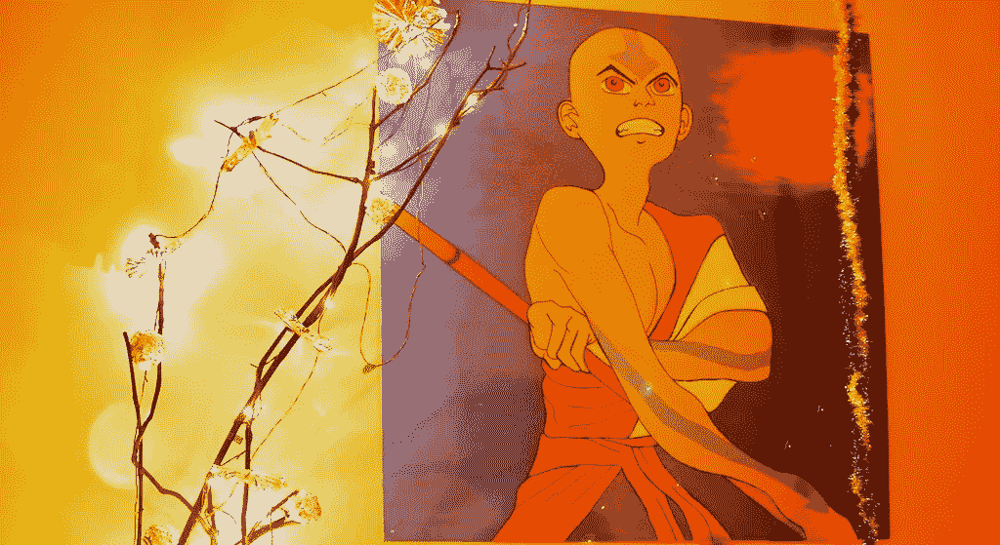
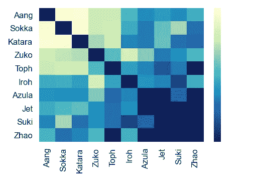
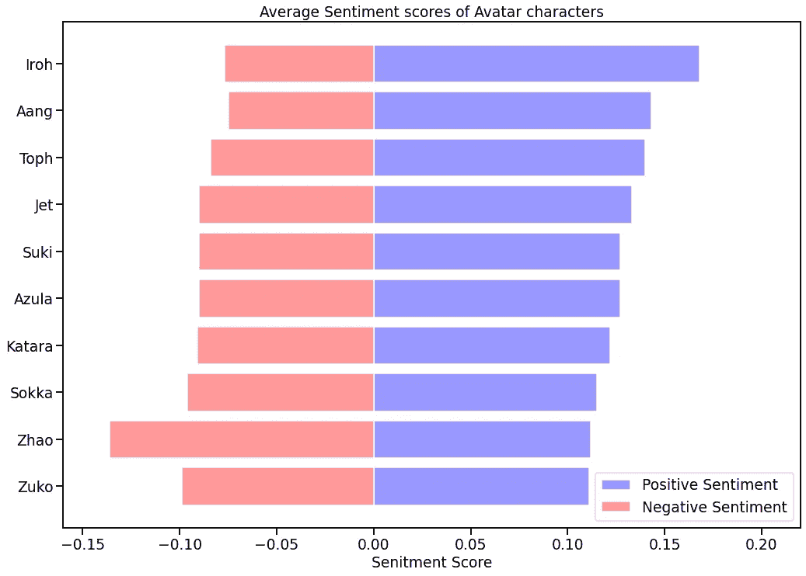
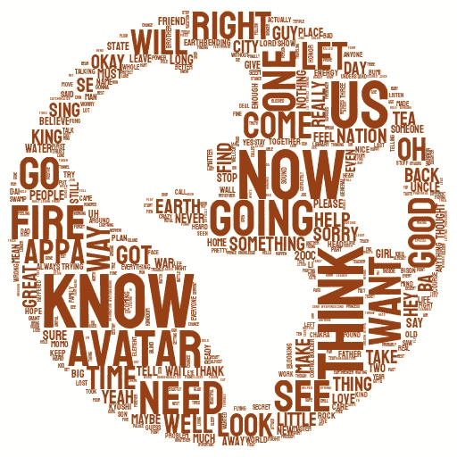
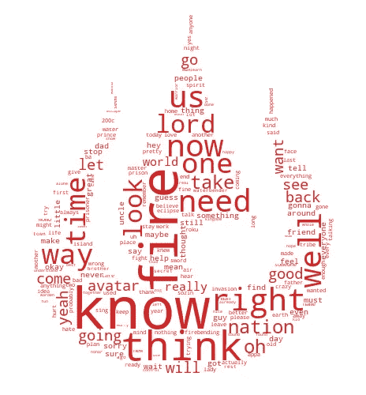

# 用最后的气宗化身实现 Python 中的数据可视化

> 原文：<https://towardsdatascience.com/avatar-meets-data-visualization-60631f86ba7d?source=collection_archive---------24----------------------->

## 学习使用 Plotly、Seaborn 和 Matplotlib 库制作令人惊叹的可视化效果。

在 [Flickr 上由](https://www.flickr.com/) [m shaff](https://www.flickr.com/photos/m3shaff/) 拍摄的照片

《最后的气宗》是那种你迫不及待想知道下一集会发生什么的剧集。它有一个伟大的故事情节，强大的人物和一些好的战斗。看了第二遍《阿凡达》后，我决定寻找比我们大多数人年轻时看的更多的关于这部电视剧的东西。为此，我将使用 Plotly、Seaborn 和 Matplotlib 来用很酷的图表支持我们的分析。

*注意:你可以在* [*Kaggle*](https://www.kaggle.com/ekrembayar/avatar-the-last-air-bender) *上找到我用于此分析的头像数据集(或者从我的*[*Github*](https://github.com/ifrankandrade/data-visualization.git)*下载，我也将此分析的完整代码留在那里)*

## 人物

阿凡达团队的成员(安昂、卡塔拉、索卡、托弗和祖寇)在所有角色中拥有最多的台词。然而，前 10 名中的一些角色可能会让你大吃一惊。例如，*指挥官赵*只在第一部(水)中出现，但他在那一季中有很多屏幕时间，这反映在他进入前 10 的大量台词中。

另一个没有出现在所有剧集中的角色是*杰特*，他只在第一部和第二部(地球)中出现过。此外，它引起了我对第三部(火)中 Iroh 叔叔的几句台词的注意。我记得他被抓了，只在几个场景里出现过，所以说得通。

作者图片

像上面这样的交互式可视化很容易用 Plotly 实现。一旦数据准备就绪，您只需要几行代码:

## 谁跟谁说话？

我们已经知道在 61 集阿凡达中谁说的话最多。然而，前 10 个角色之间有很多对话，所以我很好奇他们之间的互动频率。我们可以通过使用 Seaborn 库中的热图来发现角色之间的交互细节。

行与列对话。每个方块的颜色代表每行中的字符对每列中的字符说的行数。较亮的方块意味着说出了更多的台词——图片由作者提供

热图揭示了人物之间的一些关系。自然有很多团队头像成员之间的对话。然而，也有许多团队成员之间的对话头像和休息，例如，索卡-淑熙和艾罗-祖寇。最后，我不禁注意到前 10 个角色之间从未在屏幕上发生过的一些对话。意料之中的是*赵*从来没有和像*阿祖拉*这样后来在节目中介绍的角色说过话，但是当我发现 Jet 在节目中从来没有面对过阿祖拉或者的时候，我有点惊讶。

## 他们在说什么？

有很多方法可以窥见顶级人物在说什么。在这种情况下，我将使用其中的两个:情感分析和词云。

## 情感分析

我们可以使用自然语言处理技术(VADER 情感分析)来量化角色所说的每一行的情感。有了这个工具，获得情感分数非常简单。关于处理情感分析数据的细节在我的 [GitHub](https://github.com/ifrankandrade/avatar.git) 上。一旦我们获得分数，我们就可以使用 Matplolib 用柱状图展示它。

作者图片

上面的图表揭示了按照积极程度排序的前 10 位人物。显然，艾罗和安昂是剧中最积极的角色。一个是开茶叶店的快乐大叔，另一个是当事情出错时喜欢跳舞的和平主义僧侣，所以结果是合理的，对吗？

另一方面，赵是该剧中迄今为止最消极的角色。事实上，我期待阿祖拉在这个位置上，但它仍然有意义。还有，*祖寇*的前两个赛季足以让他们被认为是一个消极的家伙，数据也证明了这一点。

## 词汇云

让我们来看看水、土、火这三本书里所有角色说的话。我去掉了角色名以获得更有意义的单词。

水、土、火……—作者图片

为了创建这个单词云，我同时使用了`stylecloud`和`wordcloud`。第一个给出了时尚的文字云，包括惊人的颜色和图标，而第二个你可以使用自己的图片，就像我在右边使用的“火国符号”。这是我用`styleloud` *做文字云的代码。*其余的可以在 [GitHub](https://github.com/ifrankandrade/avatar.git) 上找到。

## 额外收获:我的卷心菜！

记得白菜商的大车被砸的时候笑了很多次。我发现这个短语他在 61 集里重复了 5 次。他第一次说这句话是在第一集*奥玛舒王*(第一集)*，*而最后一次是在第二集*大蛇的通行证*

## IMDb 评分与口语

我们可以用散点图找到两个变量之间的关系，并使之与 Plotly 交互。

有趣的是，口语数量最少的剧集(索金的短号第 3 和第 4 部分)获得了最高的 IMDb 评分，而口语数量最多的剧集之一(大分裂)获得了最低的 IMDb 评分。似乎粉丝们更喜欢有更多动作和精彩打斗的剧集，而不是冗长的对话。

作者图片

这是我用 Plotly 做上面散点图用的代码:

# 结论

在这篇文章中，我们发现了一些关于《最后的气宗阿凡达》的见解，这些见解可能是你和我从未想过的。我们已经知道谁用柱状图说话最多，谁用热图和谁说话，以及这些角色通过情感分析和文字云在说什么。

最重要的是，我们发现我们可以从学习数据科学工具中获得乐趣。请随意在 [Github](https://github.com/ifrankandrade/avatar.git) 上查看该分析背后的代码。