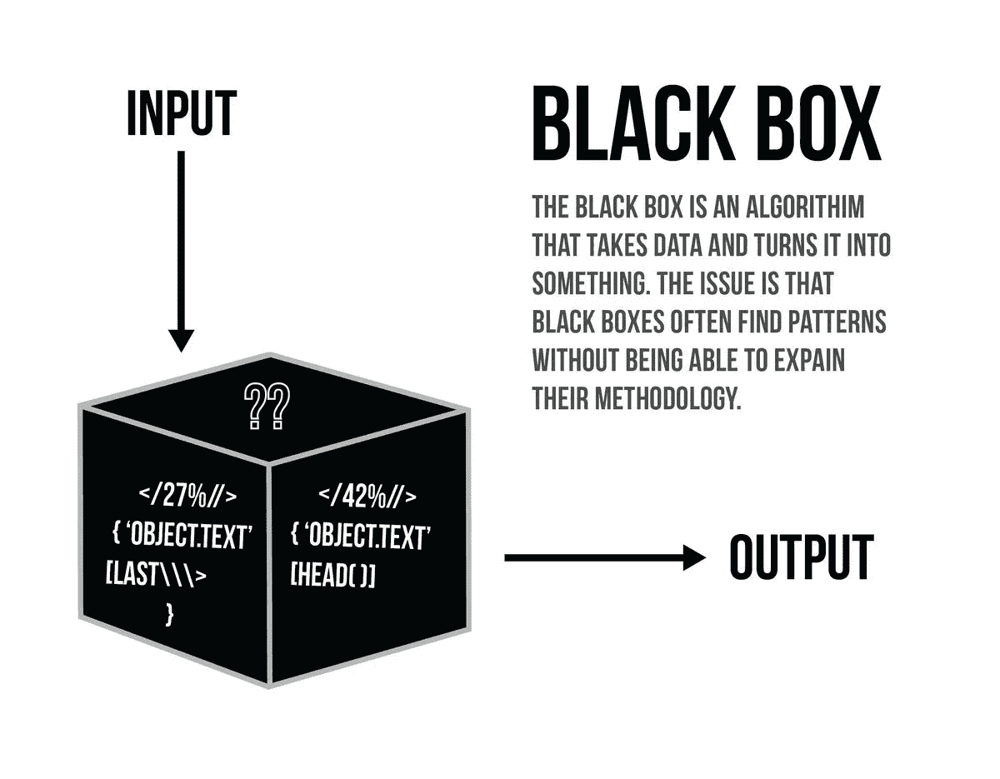
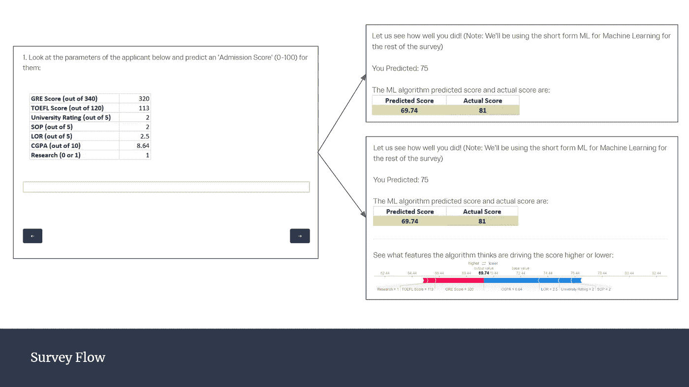
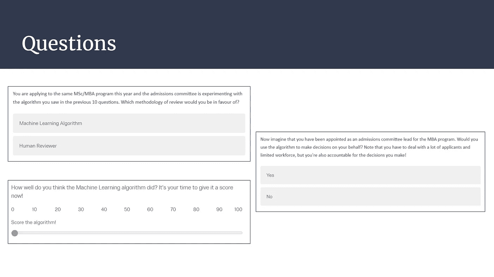
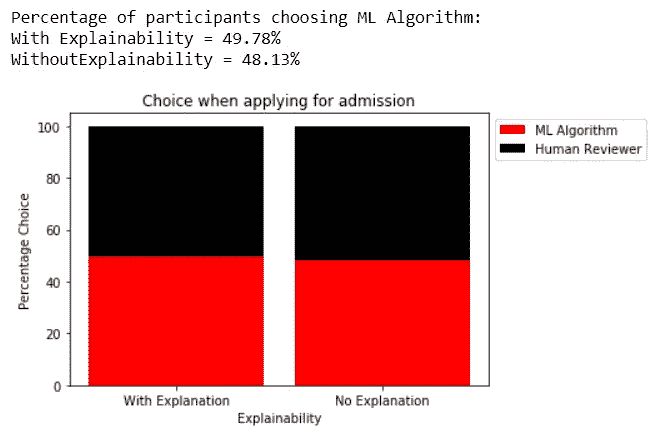
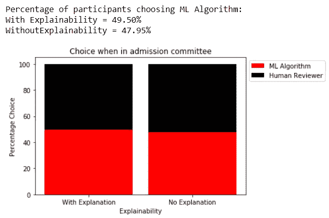
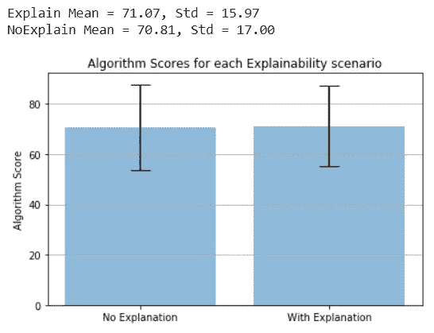
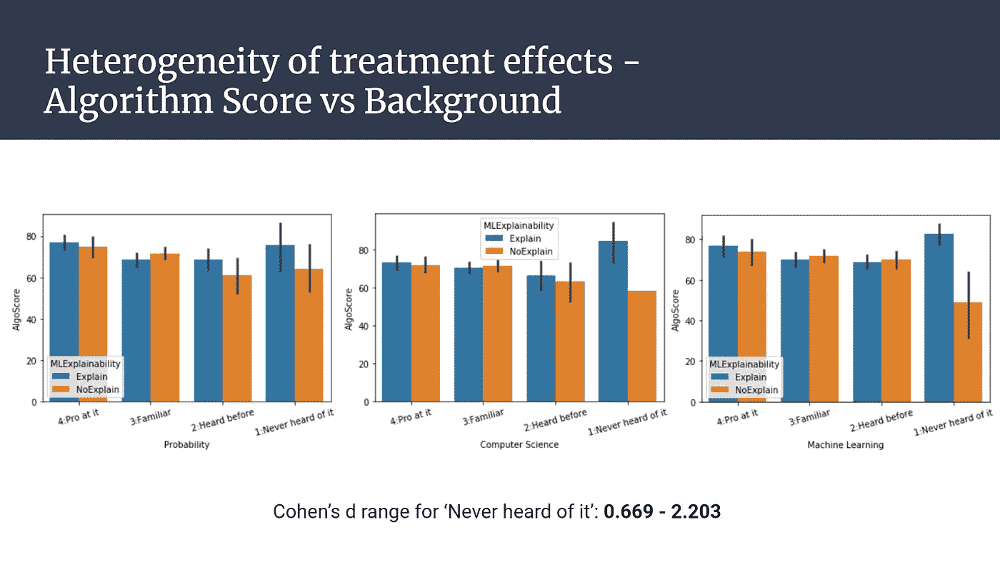

# 可解释性很重要——这就是证据

> 原文：<https://towardsdatascience.com/averting-algorithm-aversion-through-explainability-f186d8c787dc?source=collection_archive---------37----------------------->

## 通过可解释性避免算法厌恶

科尔·凯斯特在 [Unsplash](https://unsplash.com?utm_source=medium&utm_medium=referral) 上的照片

想象一下，你正在申请研究生院，而你梦想中的大学的招生委员会决定今年的录取决定将由机器学习(ML)算法而不是人类评审员做出。你会对 ML 算法评估你并做出决定感到舒服吗？我们中的一些人可能不希望这样。但是为什么呢？

研究表明，基于证据的算法(ML 算法)比人类预测者更准确地预测未来。在一系列应用中，算法预测被认为优于人类预测，无论是股市预测还是游戏预测(在 AlphaGo 中)。录取决定也可以被视为一项预测任务，因为它们只不过是对候选人是否适合某个特定项目的预测，或者对候选人将有多成功的预测。然而，为什么我们中的一些人想要一个人来评价我们呢？

> 如果算法是比人类更好的预测者，那么人们应该选择算法预测而不是人类预测。然而，他们往往不会。这种现象，我们称之为**算法厌恶**，是有代价的，了解其原因很重要(Dietvorst，Simmons，and Massey，2014)。

我们对人们何时以及为何表现出算法厌恶知之甚少。关于人们何时使用人类预测者而不是高级算法，或者为什么人们不能使用算法进行预测，没有一致同意的机制。由于我们每天产生的数据量现在已经达到了几乎所有预测任务都需要某种算法参与的程度，因此解决算法厌恶问题非常重要，这样我们大多数人就可以依靠性能更好的算法来预测我们的未来。

Dietvorst、Simmons 和 Massey ( [2014](https://dx.doi.org/10.2139/ssrn.2466040) 和 [2016](https://dx.doi.org/10.2139/ssrn.2616787) )进行了几项研究，寻找算法厌恶的原因。他们发现:

*   在看到算法预测者犯同样的错误后，人们往往会比人类预测者更快地对算法预测者失去信心。
*   如果人们可以(甚至轻微地)修改结果，他们就会使用不完美的算法。因此，给予控制权是克服算法厌恶的一种方式。

然而，我们知道在许多情况下提供控制是不可能的。因此，我们需要寻找其他方法来克服或避免算法厌恶。

什么是黑盒算法？([来源](/guide-to-interpretable-machine-learning-d40e8a64b6cf))

现代预测算法大多被大多数人视为黑盒，因为它涉及复杂的机器学习模型，很少有人理解。除此之外，算法的复杂性和性能与其可解释性成反比。例如，线性回归模型可能很容易解释，但性能可能很差。另一方面，神经网络可以有很好的性能，但同时也很难解释。那么，解释模型的预测或者理解模型学到了什么，有助于克服算法厌恶吗？让我们来了解一下！

我进行了一项在线实验，将模型可解释性和算法厌恶这两个领域结合起来，以回答算法厌恶的可能机制这一更广泛的问题。特别是，我想探索这个问题:模型可解释性在算法厌恶中扮演什么角色，解释能帮助克服对算法的厌恶吗？我通过观察如果有解释，人们是否会比人类预测者(他们自己)更频繁地选择相同的算法(或给予更高的评价),来操作这个问题。

## 资料组

在开始我的实验之前，我需要选择一个机器学习算法，作为我的预测器/预测器。为了训练任何机器学习算法，我们需要数据，在我们的情况下，需要标记数据。为此，我使用了一个来自 Kaggle 的开放数据集，它类似于上面讨论的招生场景。

为了确保参与者不会被数字淹没，我特别强调在数据集选择过程中将特征/预测器的数量保持在 10 个以下。[研究生招生](https://www.kaggle.com/mohansacharya/graduate-admissions)数据集为每个学生档案提供了一个从 0 到 1 的“录取机会”衡量标准，以及以下 7 个参数:

*   GRE 成绩(满分 340 分)
*   托福成绩(满分 120 分)
*   申请人完成本科学业的大学评级(满分 5 分)。1 是最低等级，5 是最高等级。
*   目标陈述优势(满分 5 分):1 分最低，5 分最高。
*   推荐信强度(满分 5 分):1 分最低，5 分最高。
*   本科 GPA(满分 10 分)
*   研究经验(0 或 1 ) : 0 表示以前没有研究经验，1 表示至少有一些研究经验。

我将“录取机会”指标乘以 100，转换为“**录取分数**”，以便参与者更容易处理，即他们可以输入整数作为预测值。“录取分数”可以被认为是对学生成功与否或个人实力的预测。分数范围从 0 到 100，分数越高表明录取/个人资料优势的机会越大。数据集总共有 500 个条目。数据集是干净的，不需要任何其他主要的数据预处理或数据争论步骤。

## 模型和解释者

我在数据集上训练了几个模型，XGBoost 是表现最好的模型之一。我决定坚持使用 XGBoost 作为研究生入学预测器，因为即使使用最小的参数调整和预处理，我也获得了足够好的结果。准备好机器学习模型后，我必须选择一个库来为算法的预测生成解释。令人欣慰的是，机器学习社区已经接受了模型可解释性的问题，并开发了几种新的方法来解释机器学习模型。

一个这样的解释者是 [SHAP](https://github.com/slundberg/shap) (沙普利附加解释)，一种解释任何机器学习模型输出的博弈论方法。SHAP 可以为单个行提供解释，说明每个要素都有助于将模型输出推离基准值。使用 SHAP 库也可以生成指示总体模型解释的摘要图和贡献依赖图。以下资源对使用 SHAP 理解模型可解释性非常有帮助，我推荐你去看看:

 [## 学习机器学习可解释教程

### 从任何机器学习模型中提取人类可以理解的见解。

www.kaggle.com](https://www.kaggle.com/learn/machine-learning-explainability)  [## 一种特征归属方法(假定)可以统治所有这些特征:Shapley 值

### 在 NIPS 上引起我注意的论文中，有一篇文章声称已经发现了一个框架…

towardsdatascience.com](/one-feature-attribution-method-to-supposedly-rule-them-all-shapley-values-f3e04534983d) 

## 试验设计

该实验是一个简单的随机控制实验，旨在检查添加解释是否对人们做出的选择或他们如何感知/评价该算法有任何影响。它建立在 [Qualtrics](https://www.qualtrics.com/) 调查平台上，参与者通过朋友和关系在[亚马逊 MTurk](https://www.mturk.com/) 和众包平台之外招募。参加者总数为 445 人，其中 350 人来自土耳其电信公司，其余 95 人来自不同来源。参与者的平均年龄为 30.76 岁，其中约 43%为女性，57%为男性。

[**调查**](http://rotman.az1.qualtrics.com/jfe/form/SV_eM710alg1gp99SB) (请看一看以更好地了解流程)从询问参与者的年龄、性别以及对概率、计算机科学和机器学习的熟悉程度(1-4)开始。这是为了在实验完成后探索治疗效果的异质性。然后，所有参与者都熟悉一所加拿大大学在其招生委员会中利用机器学习算法的想象场景。接下来，参与者会看到 10 名申请者的特征值，并被要求预测他们的录取分数。在参与者给每个申请人打分后，如果参与者属于对照组，参与者的预测会显示在算法预测的旁边。然而，对于治疗组，除了参与者和算法的预测之外，还显示了对影响模型的特征的解释。

向参与者提出问题(左侧),并给出申请人概况特征的值。控制组(右上):预测分数后，控制组中的参与者会看到他/她的预测以及实际分数和算法的预测分数。向治疗组(右下)参与者展示对申请人的算法预测分数的解释，以及对照组所看到的一切。

此外，处理组中的参与者具有解释在 10 个问题之前显示的 Shapley 值的页面，以及具有特征重要性和贡献依赖图的页面，即，在 10 个问题之后显示的整体模型解释。

对照组(无解释)和治疗组(有解释)分别有 227 和 218 名参与者，他们在调查开始时被随机分组。一旦这些问题完成，参与者会被问一系列关于他们所看到的后续问题。本节特别关注三个问题:

*   你今年申请了同一个理学硕士/工商管理硕士项目，招生委员会正在试验你在前面 10 个问题中看到的算法。你支持哪种复习方法？
*   现在想象一下，你被任命为 MBA 项目的招生委员会主任。你会用算法代表你做决定吗？请注意，你必须应对大量的申请人和有限的劳动力，但你也要对自己做出的决定负责！
*   你认为机器学习算法做得有多好？在 0-100 的范围内给算法打分。

调查结束时向所有参与者提出的问题

这些问题代表了算法的结果(I)对参与者有直接影响，(ii)参与者对算法的结果负责，以及(iii)分别与它们没有任何联系的一般评级。

## 结果

对于实验设计部分提到的三个后续问题，观察到以下结果:

1.当申请入院时，即当算法的预测对他们产生影响时，在没有解释的对照组中，参与者选择 ML 算法的百分比为 48.13%，在有解释的治疗组中，为 49.78%。

2.当出席招生委员会时，即当算法减轻了他们的工作但让他们负责时，在没有解释的对照组中，参与者选择 ML 算法的百分比为 47.95%，在有解释的治疗组中，为 49.50%。

3.当被要求对该算法进行总体评分时，对照组的参与者平均给它打了 70.81 分(满分为 100 分)，而治疗组的参与者平均给了 71.07 分。两组的 Cohen d 值为 0.016。

从上面的结果，我们可以看到两组之间有一个非常明显的差异。在问题 1 和 2 中，当算法与 SHAP 解释一起出现时，更高比例的参与者选择使用该算法。还有，在问题 3 中， **Cohen 的 d 值 0.016** 说明均值之间的差异是正的，有利于具有可解释性的群体，但效果大小很小。总的来说，更大的样本量会使结论和效果更清晰。

**治疗效果的异质性:**与任何其他实验一样，我从三个方面探索了参与者之间治疗效果的异质性:年龄、性别以及对概率、计算机科学和机器学习的熟悉程度。所有年龄组的治疗效果都一样。性别在决定算法分数时也没有发挥作用。

当我们看算法得分或参与者对算法的感知方式时，总体差异并不大。然而，当我们根据他们对概率、计算机科学和机器学习的熟悉程度来看分组时，结果如下。

一个重要的观察结果是，与没有解释的对照组相比，没有技术背景(即从未听说过概率、计算机科学和机器学习)的参与者给出的算法分数在有解释的治疗组中总是更高。Cohen 的 d 值在这个小组中也显著增加，这表明与呈现给他们的纯粹数字相比，人们如何评价带有解释的算法有很大的积极影响。

通过这个实验，我试图找到算法厌恶可以通过可解释性来克服的经验证据。它适用于参与者受到算法预测影响的情况，也适用于参与者对算法准确性负责的情况。在进一步的实验中，治疗效果的异质性应该是主要关注点。我们可以特别关注非 STEM(科学、技术、工程和数学)参与者，提出额外的问题来了解他们选择这种方式的原因。如果我们可以在一个更大的数据集上证明这个实验的外部有效性，像 SHAP 这样的简单方法可以被纳入我们日常的机器学习预测器中，以帮助人们避免算法厌恶！

## 结论

世界正在走向“可解释的人工智能”，许多人认为这是深度学习算法的必要条件。这个实验仅仅证明了这些步骤对于建立对算法的信任是必要的。

尽管算法厌恶不是一个大问题，但就目前而言，这是一个我们需要严肃对待的问题。虽然我们可能认为今天的预测任务只是一个简单的研究生入学问题或房价估算任务；这将是明天自动驾驶汽车上预测你前面卡车速度的任务。无论是医疗保健还是太空探索，在人类生命受到威胁的情况下，算法不可避免地要接管这些任务。无论在什么情况下，我们都需要找到一种方法来建立对这些算法的信任。因此，看到机器学习社区通过在我们的创新道路上像对待复杂性一样认真对待可解释性来解决这个问题，这是非常令人鼓舞的。

## 参考

[1] Dietvorst，Berkeley 和 Simmons，Joseph P .和 Massey，Cade，算法厌恶:人们在看到算法出错后错误地避免算法(2014 年 7 月 6 日)。即将在《实验心理学杂志:总论》上发表。在 http://dx.doi.org/10.2139/ssrn.2466040 的 SSRN 有售:

[2] Dietvorst，Berkeley 和 Simmons，Joseph P .和 Massey，Cade，克服算法厌恶:人们会使用不完美的算法，如果他们能够(即使是轻微地)修改它们(2016 年 4 月 5 日)。可在 http://dx.doi.org/10.2139/ssrn.2616787[SSRN](https://dx.doi.org/10.2139/ssrn.2616787)买到

[3] Lundberg，S.M .，Erion，g .，Chen，h .等从局部解释到全球理解用可解释的人工智能对树木进行研究。*自然机器智能* **2，**56–67(2020)。[https://doi.org/10.1038/s42256-019-0138-9](https://doi.org/10.1038/s42256-019-0138-9)。

请随时在帖子上发表您的反馈和建议，或者通过 [LinkedIn](https://www.linkedin.com/in/sanghamesh-vastrad/) 与我联系。