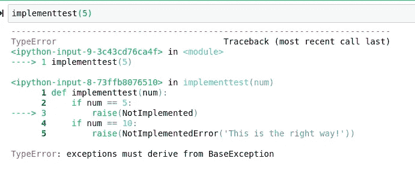
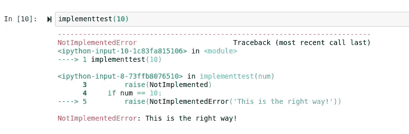

# 避免这些 Python 新手的错误

> 原文：<https://towardsdatascience.com/avoid-these-rookie-python-mistakes-9cc17cccd051?source=collection_archive---------5----------------------->

## 他们可能会工作，但他们可以工作得更好。


(python 徽标由 http://python.org/提供)

随着大量的实践，编程将逐渐变得容易，但底线是

> 编程很难。

假设和自己解决问题的不幸组合会使事情变得更加困难。尤其是在没有导师的情况下，甚至很难知道你做事的方式是否是错的。我们当然都为以后进入代码和重构而感到内疚，因为我们都在不断学习如何以更好的方式做事。幸运的是，如果有足够的意识，纠正这些错误可以让你成为一个更好的程序员。

成为伟大程序员的最好方法是克服错误和问题。做事情总有更好的方法，找到更好的方法才是有挑战性的。习惯做这样或那样的事情很容易，但有时需要一点改变，才能真正成为一名伟大的工程师。

# 未实施

虽然“未实现”错误可能是这个列表中最不常见的错误之一，但我认为发布一个提醒是很重要的。在 Python 中引发 NotImplemented 不会引发 NotImplemented 错误，但会引发类型错误。我写了一个函数来说明这一点:

```
def implementtest(num):
    if num == 5:
        raise(NotImplemented)
```

每当我们试图运行“num”等于 5 的函数时，看看会发生什么:



引发正确异常的解决方案是引发 NotImplementedError，而不是引发 NotImplemented。为此，我修改了我们的函数:

```
def implementtest(num):
    if num == 5:
        raise(NotImplemented)
    if num == 10:
        raise(NotImplementedError('This is the right way!'))
```

运行这个会给我们正确的输出:



# 可变默认值

> (这是我犯的错)

Python 中的默认参数被求值一次*，*，求值发生在执行函数定义的时。假设这些参数只计算一次，那么每个 inbound 元素都会在每个调用中使用，这意味着每次在函数中访问变量时，变量中包含的数据都是可变的。

```
**def** **add**(item, items**=**[]):
    items**.**append(item)
```

我们应该做的是将参数的值设置为 nothing，并添加一个条件来修改列表，如果它不存在的话

```
**def** **add**(item, items**=**None):
    **if** items **is** None:
        items **=** []
    items**.**append(item)
```

尽管这主要适用于 Python 用户的统计/DS/ML 方面，但根据具体情况，拥有不可变的数据是普遍重要的。

# 全局变量


在面向对象的编程语言中，全局变量应该保持在最低限度。然而，我认为，通过解释全局变量当然是必要的，并且在某些情况下很好，给这种说法加上副标题是很重要的。这方面的一个很好的例子是数据科学，这是实际上正在进行的有限数量的面向对象编程，Python 的功能性比通常情况下更强。

当多个函数调用并依赖同一个值时，全局变量会导致命名和隐私问题。我认为全局变量的一个很好的例子是类似于文件路径的东西，特别是要和 Python 文件打包在一起的。即使在编写 Gtk 类和移动图形用户界面构建器时，也应该私下进行，而不是全局进行。

# 收到。


使用 copy 在客观上可以比使用 normal 赋值更好。正常的赋值操作只是将新变量指向现有对象，而不是创建一个新对象。

```
d = 5
h = d
```

使用 Python 的复制模块可以执行两种主要类型的复制，

> 浅层复制和深层复制。

这两种类型的副本之间的区别在于您希望通过函数传递的变量的类型。当对包含在单字节数据中的变量(如整数、浮点、布尔**或**字符串)使用深度复制时，浅复制和深复制之间的差异是感觉不到的。然而，当处理列表、元组和字典时，我建议总是进行深度复制。

浅层拷贝构造一个新的复合对象，然后(尽可能地)向其中插入对原始对象的引用。深度拷贝构造一个新的复合对象，然后递归地将原始对象的拷贝插入其中。有了这些定义，就很容易理解为什么要对给定的数据类型使用其中的一种。

```
import copy
l = [10,15,20]
h = 5
hcopy = copy.copy(h)
z = copy.deepcopy(l)
```

为了测试我们的结果，我们可以简单地检查它们的变量 id 是否与条件语句相同:

```
print id(h) == id(hcopy) 
False
```

# 最后

成为一名伟大的程序员需要不断提高，希望随着时间的推移，一些错误的观念能够被消除。这是一个渐进而痛苦的过程，但是通过大量的练习和更多的信息，遵循这样简单的指导和建议肯定会有所收获。像这样分享“不要做的事情”通常会成为很好的话题，让每个人都成为伟大的程序员，所以我认为讨论这个肯定是有益的，不管你在你的**无尽的**编程之旅中走了多远。