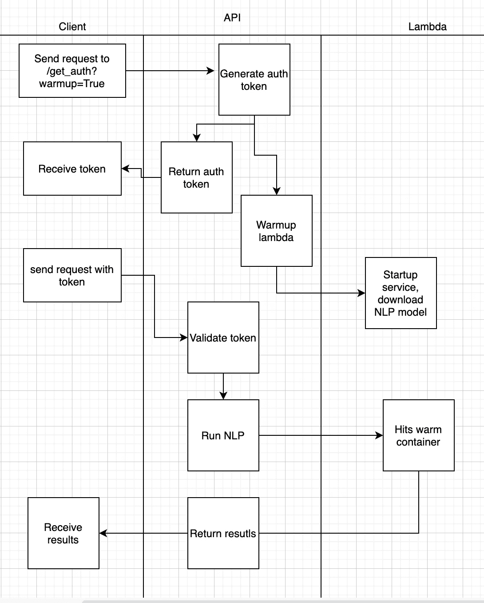

# 对于长时间运行的 API 请求，避免在 AWS Lambda 上冷启动

> 原文：<https://towardsdatascience.com/avoiding-cold-starts-on-aws-lambda-for-a-long-running-api-request-15b8194f2e01?source=collection_archive---------15----------------------->

布拉登·科拉姆在 [Unsplash](https://unsplash.com/s/photos/sprinter?utm_source=unsplash&utm_medium=referral&utm_content=creditCopyText) 拍摄的照片

如果你和我一样，你会认为无服务器很棒。可忽略不计的运行成本，无需占用您时间的服务器配置，默认自动扩展等。等等。当然，根据“没有免费的午餐”的说法，这种便利和成本节约是有代价的，虽然无服务器有许多实际成本(内存限制、包大小、运行时间限制、开发人员学习曲线)，但本文将假设您已经解决了这些问题(或者不关心它们)，而是专注于特定的性能成本—冷启动。

## 冷启动为什么会伤害数据科学应用？

冷启动很慢。这就是问题所在，到底有多慢取决于各种因素，比如你的运行时(python 实际上是启动更快的 lambda 容器之一)，以及你在 Lambda 的设置阶段做了什么([源](https://aws.amazon.com/blogs/compute/new-for-aws-lambda-predictable-start-up-times-with-provisioned-concurrency/))。

作为数据科学家和开发人员，我们习惯了缓慢的节奏。开始下载 200 GBs 的文本数据(放上水壶)，加载模型(可怜的茶)，运行聚类算法(去散步)……听起来熟悉吗？虽然这种缓慢的速度对于实验(以及运行在持久服务器上的生产系统)来说是好的，但是对于无服务器模式来说却是致命的。AWS Lambda 只允许在函数超时和容器死亡之前最多运行 15 分钟，将所有未持久化的工作(和运行的计算)限制在死亡容器的墓地中，永远不会重新启动。

当您的 lambda 函数实际上是一个 API 端点，客户端可以临时调用它来触发一些实时数据科学/分析过程(在我们的示例中，NLP 基于任意长度的单个短语)时，这个问题就变得复杂了，因为 15 分钟的 Lambda 运行时间窗口突然缩减为 30 秒的窗口，以向客户端返回 HTTP 响应。

本文并不是试图让您停止在 lambda 中运行特定的 NLP 管道，相反，它希望帮助您了解这些约束以及克服它们的一些方法(或者，从理解的角度选择忽略，帮助您生活在边缘)。

## 什么是冷启动？

冷启动发生在容器关闭时，然后在调用 lambda 函数时必须重新启动，通常这发生在大约 5 分钟的不活动之后。

已经有很多关于冷启动的文章，所以这篇文章不会提供详细的指导(我建议你查看这篇文章)。但是简单来说…

当容器从冷态启动时，该功能需要:

1.  从外部永久存储器(例如 S3)获取并加载包含 lambda 代码的包；
2.  旋转容器；
3.  将包代码加载到内存中；
4.  运行函数的处理程序方法/函数。

([https://dash bird . io/blog/can-we-solve-server less-cold-starts/](https://dashbird.io/blog/can-we-solve-serverless-cold-starts/))

注意:每当你调用一个 lambda 函数(这是你的代码)时，第 4 步总是发生。)，但步骤 1-3 仅适用于冷启动。由于设置阶段完全发生在 AWS 中，它们不在我们的控制范围内。我们可以在步骤 4 中优化我们内心的内容，但是步骤 1-3 仍然会随意地给我们带来大约 10 秒以上的延迟。这显然是同步 API 的问题。

## **我们的具体问题**

现在开始讨论我们的具体问题。我们有一个*同步* API，它:

1.  从 HTTP 请求中获取任意文本输入
2.  从 S3 下载了一个 NLP 模型(大约 220mb)
3.  使用模型对输入执行 NLP
4.  将序列化的结果返回给调用者。

这里的问题是第二步。每次调用时从 s3 下载模型可能需要 15-20 秒。这在大多数情况下对我们的用例来说是好的，因为尽管我们提供了一个*长时间运行的同步*端点，但我们并不期望它很快(我们讨论的是动态 NLP，而不是简单的 GET 请求)。

然而，在冷启动期间，我们经常看到请求超时。这完全说得通，就好像 lambda 需要 10 秒启动，而下载模型需要 20 秒，我们没有太多时间来运行 NLP 并在 30 秒的 HTTP 窗口中返回结果！

图 1(作者截图):3 个月窗口中各种 API 调用的平均延迟。当线路在 29k 毫秒处中断时，将会发生超时，并引发 504 错误。

## 可能的解决方案:

有各种方法可以解决这个问题，例如:

a.供应的并发

b.无服务器插件预热

c.EC2

d.定制的解决方案

下面将逐一讨论:

## A.供应的并发

如果您知道一个确切的窗口，知道您的 lambda 流量的预期时间，那么供应并发是一个很好的解决方案。它基本上预先分配了一定数量的容器来运行您的 lambda，这些容器将在指定窗口的持续时间内保持运行。

这种解决方案的主要优势之一是，它可以改善上述 lambda 流程的设置(1–3)和运行时(4)阶段的延迟。显而易见，由于容器已经在运行(即没有冷启动)，设置阶段在提供的时隙中被消除了，但这种方法如何加快运行时间可能不太明显。答案在于，通过保持容器温暖，避免了后续调用中不必要的初始化(例如，建立数据库连接、初始化对象、下载参考数据或加载沉重的框架等任务)([源](https://aws.amazon.com/blogs/compute/new-for-aws-lambda-predictable-start-up-times-with-provisioned-concurrency/))。

对于我们的用例，供应并发的问题是，由于我们的 API 必须支持全球不同时区的集成器，供应窗口将变得非常大，这对我们来说将成为无效的解决方案。此外，我们不知道这些窗口的确切时间。

## B.无服务器插件预热

我们使用(强烈推荐的)无服务器框架，采用该框架的最大好处之一是可用的开源插件的社区和范围。一个解决这个问题的插件是[无服务器插件预热](https://github.com/FidelLimited/serverless-plugin-warmup)。

这个插件采取了一种类似的方法来提供并发性，因为它试图防止 lambda 容器变冷，但它是通过在指定的时间窗口内用虚拟请求撞击它们来实现的。该插件有很好的文档记录，高度可配置，但最终我们认为它不是我们的最佳途径，原因与提供并发选项相同——我们不一定能准确预测何时需要并发，将其配置为宽窗口将是浪费/过度。

让我们简单关注最后一点——浪费。Lambdas 像芯片一样便宜，但对我们来说，真正的成本是下载 NLP 模型。一个烟盒计算表明，如果我们试图在整个月的正常英国办公时间内保持 10 个集装箱运行，我们一个月就会下载 1.89TB 的数据。虽然这在 S3 还不是一笔大开销，但比我们目前的支出高出了几个数量级。在扩展您的 lambda 时，请记住真正的成本——通常不仅仅是 lambda 本身的运行时间！

## C.EC2

每次都从 S3 下载模型听起来效率很低——难道我们就不能启动几个自动缩放的网络服务器，然后在上面加载模型，这样就可以开始了吗？问题解决了，不是吗？

是的，但是 A)这需要大量投资来重构我们当前完全无服务器的 API 后端，B)另一个烟盒成本计算显示，这将比实现 A 或 B 的成本高几个数量级，而 A 或 B 本身比我们当前所做的要贵几个数量级。

## D.定制的解决方案

排除上述解决方案后，我们决定采用定制解决方案。

现在，这里的警告是，当选择推出自己的解决方案时，不要忘记开发的成本。我喜欢 Yevgeniy Brikman 的规则，即如果你是一家初创公司，除非你正在构建的是你的核心价值主张，否则不要构建它——使用开源库，否则使用专有解决方案。

然而，在这种情况下，我决定打破这条规则，因为替代方案的持续成本会使该特性的一次性开发成本相形见绌。

## 那么解决方案是什么呢？

我们的解决方案基于这样一个认识:虽然我们无法准确预测何时需要预热服务，但我们知道，为了使用服务，客户端必须首先使用 OAuth 验证自己。如果发送了一个获取 OAuth 令牌的身份验证请求，很可能会接着发送一个对该令牌执行某些操作的请求。

因此，模式如下:

1.  当生成 OAuth 令牌时，也异步预热 lambda 容器。
2.  当发出后续客户端请求时，会命中 warmed lambda。

这是一个序列图:

图 2(图片由作者提供):在认证请求期间处理 NLP 模型 lambda 预热的序列图。

注意:这个解决方案有一个小问题，如果客户端在 lambda 完全预热之前发送后续请求，它会引入一个竞争条件。在我们的例子中，只要我们向我们的 API 集成者明确表示，在认证后发送第一个请求之前，给 lambda 留出预热时间，这就可以了。

## 结论

无服务器很酷。在无服务器上做 NLP 很酷。API 请求超时并不酷(讽刺的是，冷启动并不酷)。如果你想变得冷静，通过考虑上面强调的方法之一来解决如何避免冷启动的问题。

根据您的具体使用情况，像*提供的并发*这样的现成解决方案可能是您的正确选择，或者，如果这些解决方案都不理想，那么就像我们一样考虑简单的定制方法。始终考虑运行和扩展服务的全部成本(不仅仅是 lambda 调用运行时)。最后，在避免过早优化的同时，如果您的 API 开始遇到超时问题，那么您知道现在是优化的时候了！

## 脚注

关于这一点:“每次都从 S3 下载模型听起来非常低效”。的确如此。这里的解决方案是利用 AWS lambdas 附带的“/tmp”存储，并且只有在模型还没有保存在那里的情况下才重新下载模型(即冷启动)。