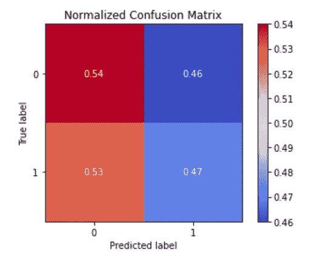
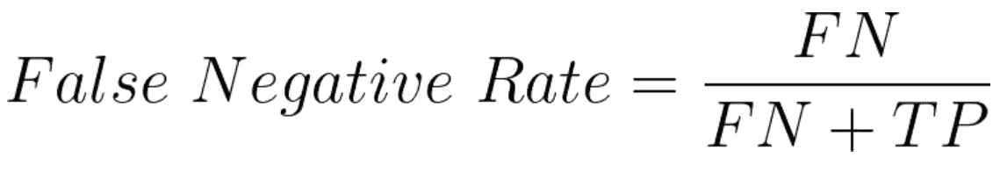

# 使用混淆矩阵度量避免混淆

> 原文：<https://towardsdatascience.com/avoiding-confusion-with-confusion-matrix-metrics-a8a3d0ead144?source=collection_archive---------20----------------------->

由[马库斯·斯皮斯克](https://unsplash.com/@markusspiske?utm_source=medium&utm_medium=referral)在 [Unsplash](https://unsplash.com?utm_source=medium&utm_medium=referral) 上拍摄的照片

## 从混淆矩阵中理解 17 个指标

一个[混淆矩阵](https://en.wikipedia.org/wiki/Confusion_matrix)是一个度量工具，用于评估分类机器学习模型的结果。它是一个正方形矩阵，其大小取决于模型中的类的数量。尽管我经常对可以推导出的度量标准感到困惑，因为它们代表了什么以及它们是如何计算的。

在这篇文章中，我将在混淆矩阵上为我们所有人创建一个参考，它的 17 个相应的度量及其公式(根据上面链接的维基百科文章)，一些帮助我们最终不再需要这个参考的解释，以及如何从头开始编码它们。让我们加载我们需要的库并开始吧！

*注意:所有配方都是稍加修改或取自上述维基百科文章，并使用此* [*在线乳胶生成器*](https://latex.codecogs.com/legacy/eqneditor/editor.php) *创建。*

由于本文的重点是度量，我将使用 NumPy 的均匀分布生成器创建一些假数据，为`y_actual`和`y_pred`获得 500 个 0 和 1 的随机值。

# 混淆矩阵结构和提供的信息

首先，我们需要讨论混淆矩阵的组成部分。为此，让我们创建一个带有二进制分类情况的样本混淆矩阵。

用 Python 代码自制的混淆矩阵

如标签所示，矩阵有两面。“真实标签”在左侧垂直方向，“预测标签”在底部。这决定了 4 个小方框中的数字所代表的预测类型。这些值是以下各项的数量:

1.  **真底片**(左上)缩写 **TN**
2.  **真阳性**(右下)缩写 **TP**
3.  **假阴性**(左下角)缩写 **FN**
4.  **误报**(右上)缩写 **FP**

你怎么记得哪条对角线有正确的匹配？沿着从上到下的对角线走。你也可以用短语“自上而下”作为记忆工具，因为你是沿着对角线从上往下走的。

快速提示，如果你设置了参数`normalize=True`，你会水平归一化结果。回想一下，规范化值意味着将所有值相加，然后将每个值除以该总和。混淆矩阵的每一行中的所有值都会再次发生这种情况。

上述混淆矩阵的标准化版本。

在这种情况下，真 0 标签行的总和是 239。用 128 和 111 除以 239 得到的百分比分别是小数 0.54 和 0.46。在继续下一步之前，现在尝试使用 true 1 标签行。

# 从混淆矩阵计算出的度量

在我们开始之前，让我们通过`scikit-learn`创建混淆矩阵。

你可以像对任何其他数组一样对矩阵的每个部分进行切片，从而得到它们的值。这是因为该函数的输出是一个 2x2 数组。为了获得每个值，我们使用以下公式:

1.  **真底片**(左上)= `cm[0, 0]`
2.  **真阳性**(右下角)= `cm[1, 1]`
3.  **假阴性**(左下)= `cm[1,0]`
4.  **误报**(右上)= `cm[0,1]`

在我们开始之前还有一件事。我将在解释和代码之前给出度量的公式。我鼓励你先尝试自己编写公式。然后你可以对照你自己的版本检查我的版本。这将让你练习自己编写公式。现在来看指标(这次是真的)！

# 准确(性)

准确性是最简单的，也可能是你最熟悉的。这是告诉我们有多少数据被正确分类的量度。该值越接近 1，精确度越高。

# 回忆=真实阳性率

你可以认为这是积极的准确性。这个指标告诉我们“1”值被归类为“1”值的准确程度。

# 特异性=真阴性率

你可以认为这是负面的准确性。这个指标告诉我们“0”值被归类为“0”值的准确程度。

# 精确度=阳性预测值

这就是事情开始变得棘手的地方。你可能会问这和召回有什么不同。该指标的目的是确定**预测值**“1】实际为真实“1”值的百分比。再次回忆只是告诉我们在所有真“1”值中，有百分之多少的**真**“1”值被正确预测为“1”值。

# 阴性预测值

这是上面精度的否定版本。同样，这和特异性之间的主要区别是分母。分母包含所有预测为“0”的值。特异性将所有真正的“0”值作为其分母。因此，这告诉我们**预测的**“0”值实际上是**真实的**“0”值的百分比。

# 假阳性率

也被称为[落幕](https://en.wikipedia.org/wiki/False_positive_rate)。除了错误分类的值之外，您可以将此视为要回忆的对应物。该指标越接近 1，您将“0”值错误分类为“1”值的百分比就越大。该指标越接近零，被错误分类为“1”值的“0”值的百分比就越低。

# 假阴性率

也被称为失败率。除了错误分类的值之外，您可以将此视为特异性的对应项。该指标越接近 1，您将“1”值错误分类为“0”值的百分比就越大。该指标越接近零，被错误分类为“0”值的“1”值的百分比就越低。

# 错误发现率

这又是事情变得棘手的地方。但是这个度量也是精度的对应物。这里的分母是被归类为“1”值的值。由于分子是 FP 而不是 TP，我们使用这个度量来确定实际上是**假** "1 "值的**预测** "1 "值的百分比。

# 错误遗漏率

该指标也是阴性预测值的对应指标。这里的分母是被归类为“0”值的值。由于分子是 FN 而不是 TN，我们使用这个度量来确定实际上是**假**“0】值的**预测**“0”值的百分比。

# 关键成功指数

这也被称为威胁率。关键成功指数显然用于[预测](https://www.swpc.noaa.gov/sites/default/files/images/u30/Forecast%20Verification%20Glossary.pdf)，它提供了一种衡量“1”值相对于错误分类值(FN 和 FP)的准确性的方法。一些文章将该指数描述为命中与未命中。如果你对一个用例更感兴趣，这里有[这篇论文](https://iopscience.iop.org/article/10.3847/1538-4357/aaed40/pdf)是关于深度 CNN 的一个应用，它使用索引作为结果的度量。

# 马修斯相关系数

[Matthews 相关系数](https://en.wikipedia.org/wiki/Matthews_correlation_coefficient)是实际值和预测值之间的相关性，例如我们的二进制情况。像相关性一样，它的范围可以从-1 到 1。这个度量提供的好处是，不管两个类之间的数量差异如何，模型都有一个“平衡的度量”来解释它的质量。除了这里提到的内容之外，请查看本段中链接的文章以了解更多细节。

# 关于上述指标，您注意到了什么？

照片由[劳伦茨·克莱因海德](https://unsplash.com/@laurenzpicture?utm_source=medium&utm_medium=referral)在 [Unsplash](https://unsplash.com?utm_source=medium&utm_medium=referral) 上拍摄

关于这些指标的组成部分，您注意到了什么？

如果你注意到所有的指标都是由混淆矩阵本身的各个部分构成的，那你就对了！从这一点开始，剩下的 6 个指标(是的，我们已经完成了 11 个)将由上面的指标组成。所以如果你准备好了，我们走吧！

阿曼德·库利在 [Unsplash](https://unsplash.com?utm_source=medium&utm_medium=referral) 上拍摄的照片

# 平衡精度

平衡精度是一种精度度量，用作原始精度度量的替代。只有当您的目标达到平衡时，原始的精度指标才是最佳的。这是当你有几乎相等数量的“0”值和“1”值来训练模型的时候。当您的数据严重不平衡时(比如说 97%的数据是“0”值，其余的是“1”值)，最初的准确性指标就失效了。平衡准确度对真阳性率和真阴性率(也称为召回率和特异性)进行平均，以获得更能代表不平衡数据的模型结果的准确度度量。看看这个例子的对比。

# F1 分数

F1 得分是精确度和召回率的[调和平均值](https://en.wikipedia.org/wiki/Harmonic_mean)(又名阳性预测值和阳性准确率)。这是原始准确性的另一个衡量标准。根据本文中的[，当您的数据有大量负值(在本例中为“0”值)时，您可能希望使用这一指标来衡量原始精度。](/accuracy-precision-recall-or-f1-331fb37c5cb9)

# 信息

根据 Venkatesh-Prasad Ranganath 的文章,知情是回忆的另一种选择。Venkatesh-Prasad 解释说，回忆的缺点是，当情况需要时，它不考虑模型的负类值(“0”值)的任何变化。包括特异性的真实阴性率有助于解决这个问题。我建议阅读本段中链接的文章，了解对这一指标的详细解释。

# 显著

Venkatesh-Prasad Ranganath 在[的同一篇文章](https://medium.com/@rvprasad/informedness-and-markedness-20e3f54d63bc)中也提到了标记性。他解释说，标记性是精确性的一种替代。预测值的精度与 recall 有类似的问题，它不考虑负的真“0”值。精确地包括负预测值有助于处理这个问题。我再次建议阅读本段中链接的文章，以进一步了解这一指标。

# 流行阈值

正如你所看到的，流行阈值仅仅基于回忆和特异性(也就是真正的阳性率和真正的阴性率)。这是一个衡量标准，为模型的良好表现设置了一个标准。请注意，流行阈值的分母是上面的信息度量。

# 福尔克斯-马洛指数

[Fowlkes-Mallows 指数](https://en.wikipedia.org/wiki/Fowlkes%E2%80%93Mallows_index)用于确定两组数据之间的相似性。在我们使用二元分类的情况下，它可以是一组实际值和一组预测值。它的范围从 0 到 1，越接近 1 表示相似性越强。

# 最后的想法

令人惊讶的是，存在如此多的评估机器学习模型的指标。更别说这些只和分类有关！为了帮助您进一步理解这些指标，请尝试将它们相互比较。例如，回忆和特异性关心负值(“0”值)和正值(“1”值)的预测率。然后你也有他们的假阳性率和假阴性率。还要记住，前几个指标的意义取决于分子和分母的选择。

感谢阅读！这封推荐信对你有多大帮助？你会如何修改它？

欢迎您在 [Linkedin](https://www.linkedin.com/in/jdejesus22/) 和 [Twitter](https://twitter.com/johnnydata22?lang=en) 上关注或联系我。对 Twitter 上的 DM 开放。

直到下一次，

约翰·德杰苏斯