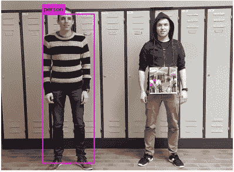
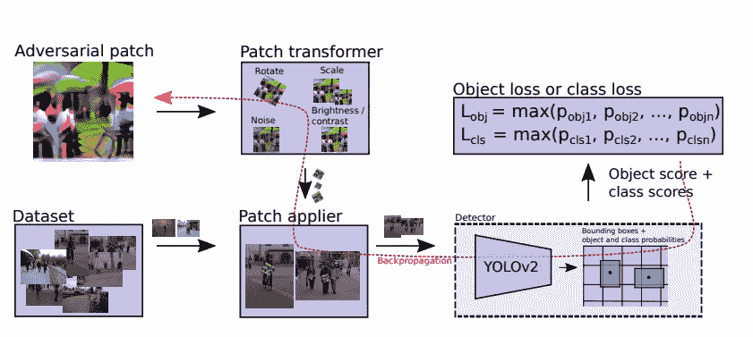
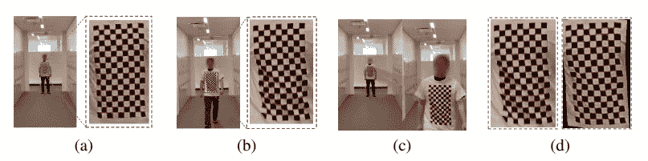
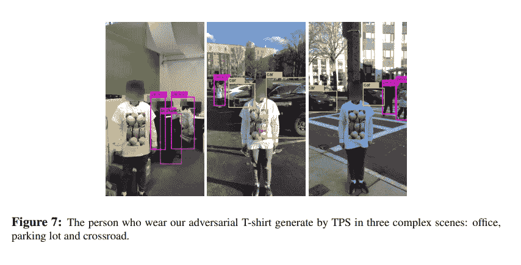
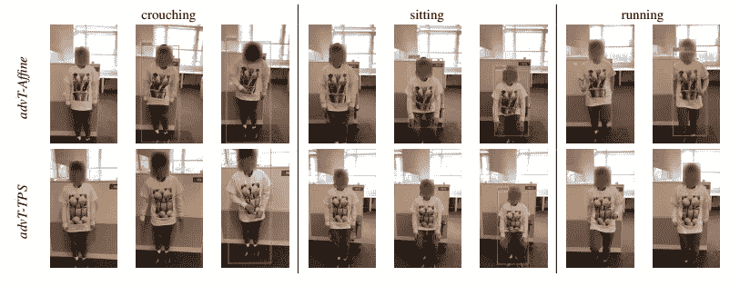

# 用敌对的 t 恤避免被发现

> 原文：<https://towardsdatascience.com/avoiding-detection-with-adversarial-t-shirts-bb620df2f7e6?source=collection_archive---------8----------------------->

## 了解新 t 恤图案背后的新研究，它愚弄了最先进的人体检测系统

[连浩曲](https://unsplash.com/@lianhao?utm_source=medium&utm_medium=referral)在 [Unsplash](https://unsplash.com?utm_source=medium&utm_medium=referral) 上拍照

仅仅穿一件特定类型的 t 恤怎么能让你不被人发现和监视系统发现呢？好吧，研究人员已经发现并利用了深度神经网络的致命弱点——一些最佳物体探测器背后的框架(YOLOv2，fast R-CNN，HRNetv2，仅举几例)。

# 早期方法:

在[1]中，作者设法在真实世界的用例中得到欺骗的基准准确度 **57%** 。然而，这并不是第一次试图欺骗物体探测器。在[2]中，作者为他们的模型设计了一种方法来学习和生成可以欺骗检测器的补丁。这种贴片戴在纸板(或任何平面)上时，可以躲过人体探测器，尽管准确率只有 18%

出自[2]。左图:成功检测到没有贴片的人。右图:拿着补丁的人被忽略。

像这样“迷惑”或“愚弄”神经网络被称为做出 ***物理对抗性攻击*** 或*现实世界对抗性攻击。*这些攻击最初基于错综复杂的像素值，使网络(基于其训练数据)混淆，将对象标记为“未知”或简单地忽略它。

作者在[2]中转换其训练数据中的图像，应用初始补丁，并将结果图像馈入检测器。获得的对象损失用于改变补片中的像素值，旨在最小化*对象性*分数。

出自[2]。生成补丁并获取对象丢失。

然而，除了 18%的低准确性之外，这种方法仅限于像纸板这样的刚性载体，并且当捕获的帧具有扭曲或歪斜的补丁时，性能不佳。而且印在 t 恤上肯定效果不好。

“一个人的运动可以导致他们衣服上明显和不断变化的褶皱(也称为变形)”[1]。从而使得开发通用对抗性补丁的任务更加困难。

# 新方法:

[1]中的新方法采用**薄板样条**映射来模拟布料变形。这些变形模拟了以前尝试使用对抗模式所面临的现实问题。考虑不同的变形将极大地提高系统的性能，因为它将能够在更多数量的帧中 ***不检测*** 图案。

理解样条本身就足以大致了解他们试图用这种方法做什么。

## 样条:

对于一个更正式的数学定义，你可以看看这篇文章，对于一个更简单的理解，我认为这篇文章做得最好。

从直觉上来说，样条有助于平滑地绘制任意函数——尤其是那些需要插值的函数。样条有助于对这些缺失的数据进行建模:在对布料变形进行建模时，可以在连续的帧中看到面片形状的变形，我们可以使用一种高级形式的多项式样条，称为 [**薄板样条**](https://profs.etsmtl.ca/hlombaert/thinplates/) (TPS)。

查看哥伦比亚的这篇文章，这篇文章很好地解释了 TPS 回归。

这些变化，或位移，在补丁帧随时间的推移，然后简单地建模为一个回归问题(因为我们只需要预测未来帧的 TPS 参数)。

# 生成 t 恤图案:

上述模式只是一个对立的例子——一个违背对象检测器目的的补丁。作者使用 [**对转换的期望(EOT)算法**](https://arxiv.org/pdf/1707.07397.pdf) ，该算法有助于在给定的转换分布上生成这种对立的例子。

这里，变换分布由 TPS 变换组成，因为我们想要复制实时起皱、轻微扭曲和织物轮廓的变化。

来自[1]:模拟布料变形的效果。

除了 TPS 变换，他们还在人的边界框内使用物理颜色变换和传统的物理变换。因此，这产生了对扰动图像的像素值进行建模的方程。

基于所有这些复杂公式的 EOT 公式可以最终计算出*攻击损失*，并欺骗目标探测器。

到目前为止，以其最简化的形式对该过程的解释是针对单个物体检测器的。作者还提出了一种针对多目标探测器的策略，该策略涉及将**最小-最大优化**应用于单目标探测器方程。

# 最后:

在他们自己的数据集上训练和测试后的结果令人印象深刻。

来自[1]。在作者的数据集上生成自定义对抗性补丁后的结果

TPS 的使用也显示出巨大的进步:

来自[1]。比较使用 TPS(第二行)和不使用 TPS(第一行)的不同姿势的结果

# 未来会怎样:

*   在东北大学的一篇[文章](https://news.northeastern.edu/2019/11/13/this-t-shirt-could-make-you-invisible-to-deep-neural-networks/)中,【1】的作者之一林雪澄清说，他们的目标不是为了偷偷摸摸地不被探测器发现而创造一件 t 恤。

> “我们研究的最终目标是设计安全的深度学习系统，……但第一步是对它们的漏洞进行基准测试。”—林雪

*   当然，作者们意识到他们的结果有很大的改进余地，并提到将做进一步的研究来实现它。

由[塞巴斯蒂安·莫利纳·福托格拉夫](https://unsplash.com/@sebamolinafotografia?utm_source=medium&utm_medium=referral)在 [Unsplash](https://unsplash.com?utm_source=medium&utm_medium=referral) 拍摄的照片

> 感谢您从头到尾的阅读！您可以通过 LinkedIn[联系我，获取任何信息、想法或建议。](https://www.linkedin.com/in/param-raval/)

# 参考资料:

[1]:徐，，等.对抗性 t 恤！在物理世界中躲避人探测器(2019)， *arXiv 预印本。* arXiv-1910.11099

> https://arxiv.org/pdf/1910.11099.pdf

[2]: Thys，Simen，Wiebe Van Ranst 和 Toon Goedemé，愚弄自动监控摄像机:攻击人员检测的对抗性补丁(2019)，*IEEE 计算机视觉和模式识别研讨会会议录*。

> PDF:[https://arxiv.org/pdf/1904.08653.pdf](https://arxiv.org/pdf/1904.08653.pdf)

[3]: Athalye，Anish，和 Ilya Sutskever，综合稳健的对抗性例子(2017)， *arXiv 预印本 arXiv:1707.07397。*

> PDF:[https://arxiv.org/pdf/1707.07397.pdf](https://arxiv.org/pdf/1707.07397.pdf)