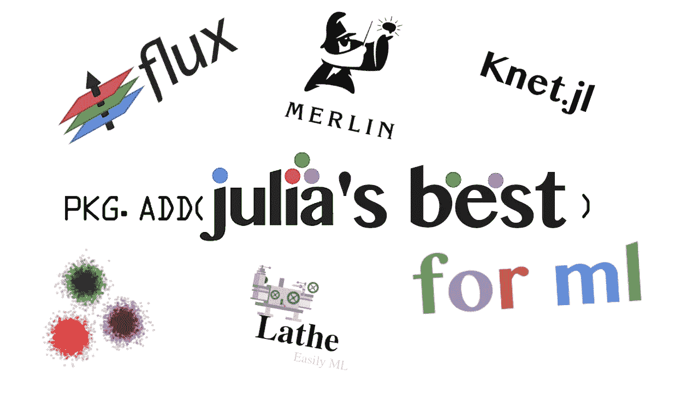

# 真棒朱莉娅机器学习包每个人都应该尝试！

> 原文：<https://towardsdatascience.com/awesome-julia-machine-learning-packages-everyone-should-try-e36a84b8c361?source=collection_archive---------41----------------------->

## 一些我最喜欢的 Julia ML 包，我想其他开发者也会喜欢！

尽管 Julia 仍然是一门相对年轻和温顺的编程语言，但有时生态系统变得如此成熟会令人非常惊讶。我认为在机器学习领域更是如此。虽然 Python 等其他语言当然有更多的机器学习包，但 Julia 的机器学习包绝对值得一试。它们不仅具有用像 Julia 这样的快速高级语言编写的额外好处，而且它们是很棒的软件，无论使用何种语言，都易于使用。

这些包中的许多都利用了 Julia 富于表现力的语法。此外，它们都使用 Julia 库中可用的函数，使用 Julia 的多态分派在不同类型上完成类似的任务。这使得包跳转比在另一种语言中更容易。关于许多 Julia ML 包的另一个很酷的事情是，它们不会很庞大，因为通常你不需要为了做统计而写过多的 Julia 代码。

# 流量

开始列表是朱利安机器学习的主要内容，

> Flux.jl。

在 Julia 中，Flux.jl 通常用作创建神经网络的抽象层。Flux.jl 是我在 Julia 语言中最喜欢使用的包之一，也是我开始使用 Julia 时最先使用的包之一。Flux 的一大优势是它非常小。它在 Julia 已经很棒的 AD 和 GPU 计算代码基础上提供了轻量级的抽象。哦，我有没有提到，Flux 有很棒的 CUDA 支持？并行计算始终是一个巨大的优势，但除了已经投入 JuliaGPU 的出色工作，Nvidea 显卡和 Flux 的结合使机器学习工程师的梦想成为现实。

Flux 的重量也使它非常适合在服务器上使用，因为它不会占用太多空间，并且可以非常容易地放入带有 Pkg 的微型虚拟环境中。总而言之，Flux 是可移植的。Flux 也是用百分之百纯 Julia 代码编写的，这是一个额外的好处，因为你不必处理外来的语法，也不需要使用 CSyntax 这样的包来完成 Flux 的工作。如果您想更熟悉 Flux.jl，我在本文中为您写了一个简短的介绍:

 [## Julia 对 Flux 的快速介绍(使用 CUDA)

### 用 Flux 在 Julia 中建立你的第一个渐变模型

towardsdatascience.com](/a-swift-introduction-to-flux-for-julia-with-cuda-9d87c535312c) 

# 梅林. jl

Merlin 是另一个在 Julia 中创建神经网络的深度学习框架。Merlin.jl 是许多开发人员可能会忽略的一个包。然而，这将是一个错误，因为 Merlin 是一个不可思议的工具，在许多不同的场合下节省了我很多时间。像 Flux.jl 一样，Merlin 是相对轻量级的，并且是用百分之百纯 Julia 代码编写的。Merlin 在许多操作中往往超过 Flux，尽管这并不一定意味着它总是更快。

同样类似于 Flux，Merlin 内置了对 CUDA 的 GPU 支持。不仅如此，Merlin 模型通常比 Flux 模型更易于部署。虽然这并不是说部署 Flux 特别困难，但也不是特别容易。所以我会说，如果你计划部署一个 API，使用一个带有 Genie 和 Julia 的神经网络，我可能会选择 Merlin。除了所有这些很酷的特性，Merlin 还包括一个小的发行库。

# KNet.jl

Knet 是 Julia 的另一个深度学习框架，有一点扭曲。Knet 实际上是为 kou 大学开发的。因此，这个包似乎比这个列表中的大多数其他包维护得更好，这些包通常只由少数出于热情而工作的人来管理。与 Flux 和 Merlin 不同，Knet 是一个更重的包。Knet 也不是用纯 Julia 编写的，而是用各种语言编写的，比如运行在 Julia 代码下的 C 和 MATLAB。

但是，需要注意的是，Knet 中有很小一部分是用 C 和 MATLAB 编写的，总共只有大约 1.8%。我想说 Knet 是这个列表中初学者的最佳选择之一，因为它非常简单。

我犹豫要不要把车床加入这个列表，因为我对它有点偏见，因为

> 我是创造者。

然而，我觉得不在这里添加它是没有意义的，因为车床提供了大量的特性。首先，Lathe 附带了一个相当大的统计库，其中包括 chi 测试、贝叶斯统计、t-测试、f 检验，甚至还有一些不太为人所知的统计，如 signs 测试。最重要的是，stats 模块中还包含了验证，它具有连续和分类预测的准确性指标。作为本模块中统计数据的精华，Lathe.jl 还包含了一个不错的发行版库。

为了增加 DS/ML 的乐趣，Lathe 还提供了大量的预处理工具，这些工具可能是你从这个不成熟的包中没有想到的。这方面的好例子是特征定标器、训练测试分割和分类编码。最重要的是，车床有一个短而甜的模块加载数据到朱莉娅。如果您想将任何类型的图像或类似数据加载到 Julia 中，这些工具非常有用。

最后，车床有一个不断扩大的机器学习模块库，甚至支持构建卷积神经网络。车床也有一个管道框架，使得部署一个具有 JLD2 序列化的车床模型变得非常容易。Lathe 也是用纯 Julia 编写的，并且在文档方面相对稳定(尽管在 0.1.2 中有一个很大的文档更新，文档字符串被修改。)我会说，如果说 Flux 是 Julia 的 Tenserflow，那么 Lathe 就是 Julia 的 Sklearn。这意味着车床是包容的，提供了你需要的所有工具，并且它对初学者来说也是非常友好和容易的。

如果你想通过检查车床来支持我，你可以在这里这样做:

 [## 车床

### 车床使用更快的方法和简单的方法。使得包装快速、简单且轻便。许多工具和模型…

车床. ai](http://lathe.ai) 

# MLBase.jl

MLBase.jl 是另一个 Julia 模块，它遵循与 Python 中的 Sklearn 类似的方法。MLBase.jl 包括用于通用数据处理的工具，如特征缩放器和编码器，以及基于分数的分类和验证。这个包还有一个非常独特和有用的特性，

> 模型调整。

MLBase 的模型调整将使你的超参数优化变得非常容易。MLBase，你可能已经猜到了，MLBase.jl 完全是用 Julia 写的。它也是这个列表中最轻的包。它也非常容易使用，所以对初学者来说是另一个很好的选择。

你有它；这些是 Julia 开发人员拥有的一些最好的机器学习模块。虽然它们中的一些肯定服务于不同的目的，但是从所有的特性中挑选特性往往是最佳的行动计划。至于开始的最佳方案，我会说它介于

*   MLBase.jl
*   车床. jl
*   Knet.jl

从那里，我会问“你想做什么？”因为这些模块中的每一个都有自己独特的才能，根据您的情况，这些才能可能有用，也可能没用。总的来说，尽管 Julia 的生态系统不像 Python 的怪物生态系统那样成熟，但这也是 Julia 有趣的一部分。很多人对这门语言做出了巨大的贡献，更重要的是，对整个数据科学做出了巨大的贡献。总之，虽然 Julia 可能没有你在其他语言中看到的那么多令人惊叹的模块，但它所拥有的包通常都是开发良好的，并且只是刚刚开始它们的旅程。