# 可怕的 JupyterLab 扩展

> 原文：<https://towardsdatascience.com/awesome-jupyterlab-extensions-90c2d64d244?source=collection_archive---------7----------------------->

## 一些有用的 JupyterLab 扩展之旅


作者图片

[**Jupyter Lab**](https://jupyterlab.readthedocs.io/en/stable/getting_started/starting.html) 是数据科学界使用最广泛的 ide 之一。当涉及到快速原型和探索性分析时，它们是许多数据科学家的工具选择。JupyterLab 巧妙地将许多功能捆绑在一起，实现了协作、可扩展和可伸缩的数据科学。然而，这篇文章不是关于 Jupyter 实验室的各种优势。我相信有很多关于这个主题的资源。相反，这里的重点是 JupyterLab 的一个有用的组件，叫做**扩展。这些扩展非常有用，可以提高一个人在单独工作或团队工作时的效率。让我们从理解什么是扩展开始，然后我们将快速浏览 Github 上目前可用的一些有用的 JupyterLab 扩展。**

# 扩展ˌ扩张

JupyterLab 被设计成一个可扩展的模块化环境。因此，人们可以轻松地在现有环境中添加和集成新组件。扩展正是基于这一核心思想。JupyterLab 可以很容易地通过第三方扩展进行扩展。这些扩展由 Jupyter 社区的开发人员编写，本质上是 [npm](https://www.npmjs.com/) 包(Javascript 开发中的标准包格式)。那么是什么让这些扩展如此有用呢？这里有一段摘自[官方文档](https://jupyterlab.readthedocs.io/en/stable/user/extensions.html)的摘录，回答了这个问题:

> "扩展可以向菜单或命令调色板、键盘快捷键或设置系统中的设置添加项目。扩展可以提供 API 供其他扩展使用，并且可以依赖于其他扩展。事实上，整个 JupyterLab 本身只是一个扩展的集合，并不比任何自定义扩展更强大或更有特权。”

## 装置

在本文中，我们将看看一些有用的扩展，以及它们如何增强我们使用 jupyter 实验室的体验。但是在我们开始之前，让我们快速地看一下如何安装这些扩展。要安装 JupyterLab 扩展，您需要安装 [Node.js](https://nodejs.org/) ，要么直接从 [Node.js 网站](https://nodejs.org/)安装，要么如下所示。

```
conda install -c conda-forge nodejs
or# For Mac OSX users
brew install node
```

安装后，它会作为一个新图标出现在 JupyterLab 侧边栏中。

## 扩展经理

为了管理各种扩展，我们可以使用扩展管理器。默认情况下，管理器是禁用的，但可以通过单击“enable”按钮来启用。

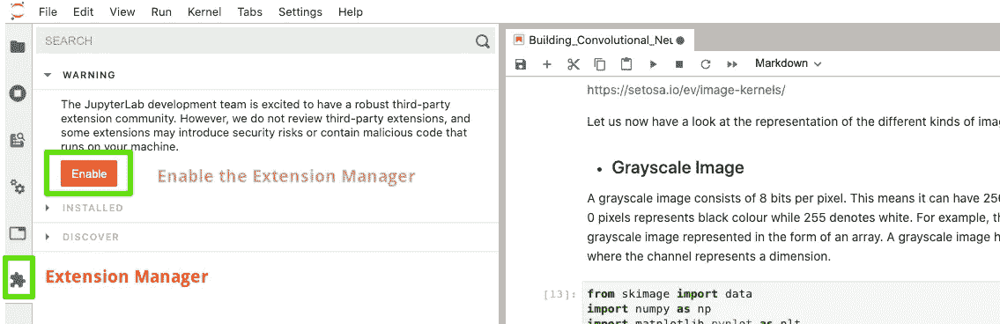

*启用扩展管理器|作者图片*

或者，您可以在命令面板中搜索**扩展管理器**，并在那里启用它。

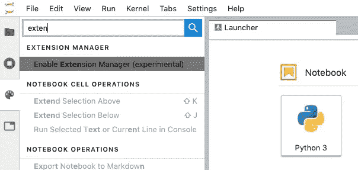

*通过在命令面板|作者图片中搜索来启用扩展管理器*

# 有用的 JupyterLab 扩展

现在让我们浏览一下 JupyterLab 中目前可用的一些有用的扩展。请**记住**这些是第三方扩展，未经审核。一些扩展可能会带来安全风险或包含在您的机器上运行的恶意代码。

您可以在扩展管理器中搜索所需的扩展。搜索时，您会注意到其中一些扩展的名称旁边有一个 Jupyter 图标。这些扩展由 Jupyter 组织发布，并且总是放在最前面。

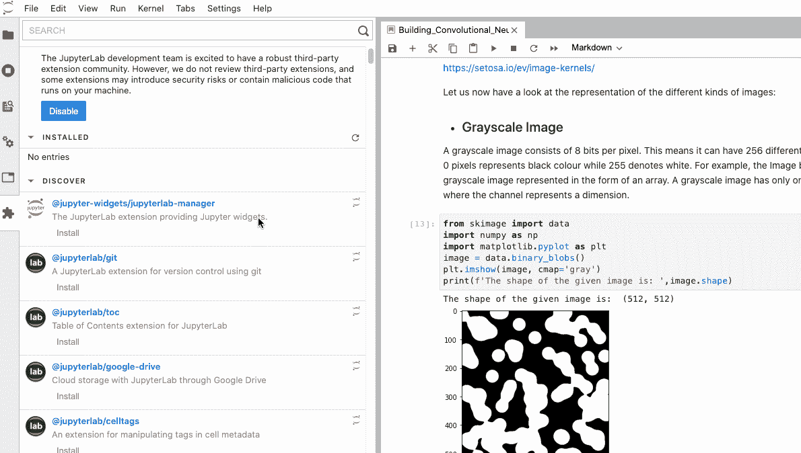

*可用的 Jupyter 实验室扩展|作者图片*

# 1️⃣ .Jupyterlab Google Drive

顾名思义，[**jupyterlab-Google-drive 扩展**](https://github.com/jupyterlab/jupyterlab-google-drive) 通过 google drive 为 JupyterLab 提供云存储。安装完成后，这个扩展会在 JupyterLab 的左侧面板添加一个 Google Drive 文件浏览器。您需要登录您的 google 帐户，才能通过 JupyterLab 访问存储在 google drive 中的文件。

## 安装:通过扩展管理器

您可以通过扩展管理器安装扩展。在搜索栏中搜索扩展的名称并安装它。

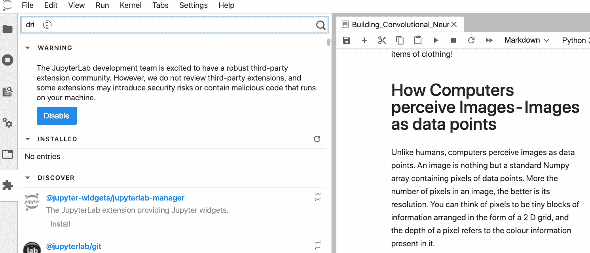

安装 jupyterlab-google-drive 扩展|作者图片

然后，您需要重新启动环境。一旦您这样做了，您将看到以下提示:

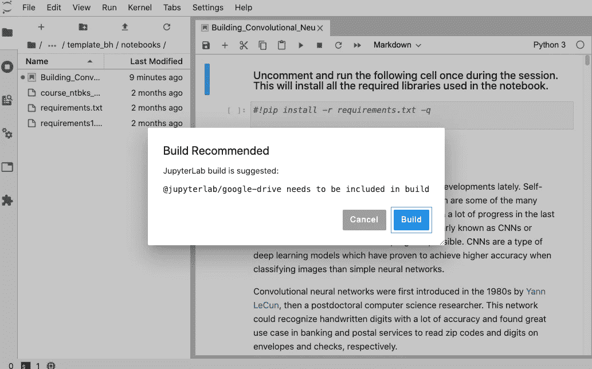

安装扩展时提示 JupyterLab 构建|作者图片

点击`**Build**` 来合并任何更改，你会立即在侧边栏看到一个 google drive 图标。除了安装扩展之外，您还需要**通过 Google** 验证您的 JupyterLab 部署。通过 [**设置**](https://github.com/jupyterlab/jupyterlab-google-drive/blob/master/docs/setup.md) 文件或此处 链接 [**进行处理。填写凭据后，您就可以从 jupyter 实验室访问您的驱动器。**](https://developers.google.com/identity/sign-in/web/sign-in)

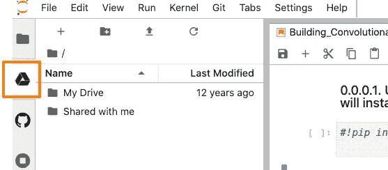

Jupyterlab Google Drive 扩展|作者图片

## 安装:通过命令行接口

或者，您可以通过 CLI 安装该扩展，如下所示:

```
#Install the jupyterlab-google-drive extension
jupyter labextension install @jupyterlab/google-drive#Set up your credentials using [this](https://github.com/jupyterlab/jupyterlab-google-drive/blob/master/docs/setup.md) guide.# Start JupyterLab
jupyter lab
```

现在，如果有人与你共享一个笔记本或 markdown 文件，它将反映在 Jupyter 实验室的`shared with me`文件夹中。您可以在 Jupyter 环境中无缝地打开并编辑它。

# 2️⃣.JupyterLab GitHub

[**JupyterLab Github**](https://github.com/jupyterlab/jupyterlab-github) 是用于访问 Github 库的 JupyterLab 扩展。使用这个扩展，您可以选择 GitHub 组织，浏览它们的存储库，并打开这些存储库中的文件。如果存储库包含一个 jupyter 笔记本，您将能够在您的 JupyterLab 环境中直接访问它们。

## 装置

同样，您可以通过扩展管理器或 CLI 安装这个扩展。请注意，这个软件包已经表明它需要一个相应的服务器扩展，在使用该扩展之前，系统会提示您安装该扩展。

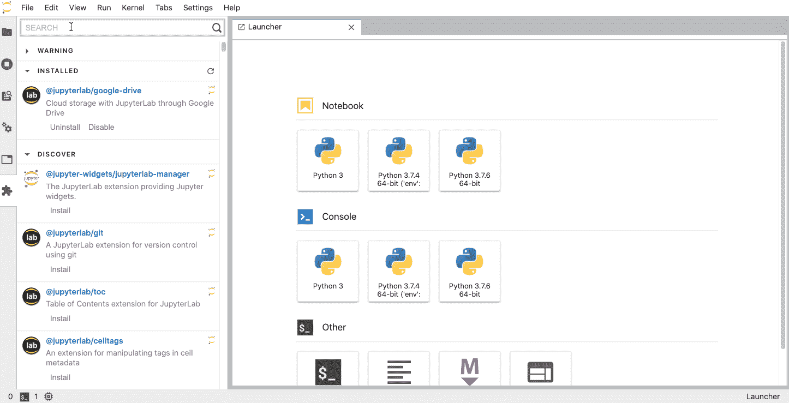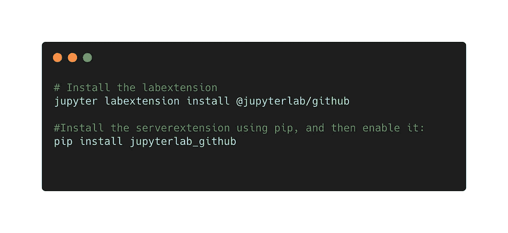

l:通过扩展管理器安装|| R:通过命令行界面安装|作者图片

安装后需要从 GitHub 获取 [**凭证。**](https://github.com/jupyterlab/jupyterlab-github#2-getting-your-credentials-from-github)

## 使用

一旦输入了凭证和权限，您就可以访问 JupyterLab 环境中的所有存储库，而无需在不同的界面之间切换。

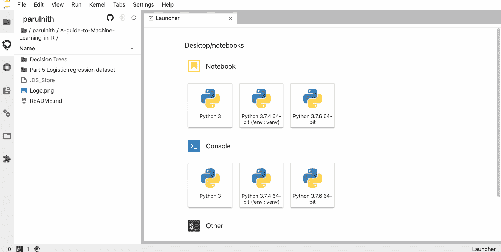

JupyterLab Github 扩展|作者图片

# 3️⃣.Jupyterlab Git

Jupyterlab-git 是另一个有用的 Jupyterlab 扩展，用于使用 git 进行版本控制。

## **安装**

要安装扩展，您可以执行以下步骤:

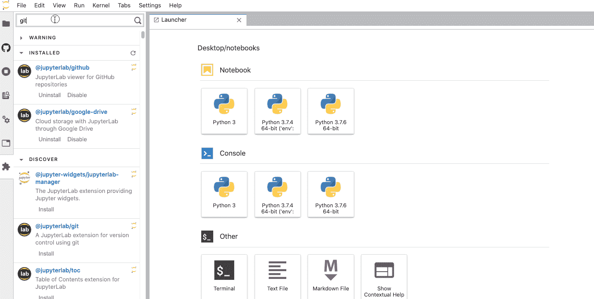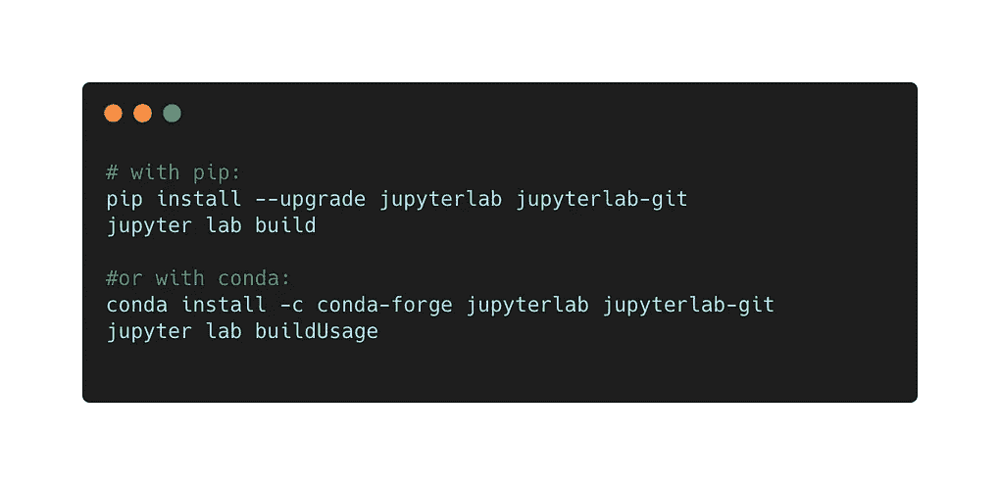

l:通过扩展管理器安装|| R:通过命令行界面安装|作者图片

安装后，可以从左侧面板的 ***Git*** 选项卡访问 Git 扩展

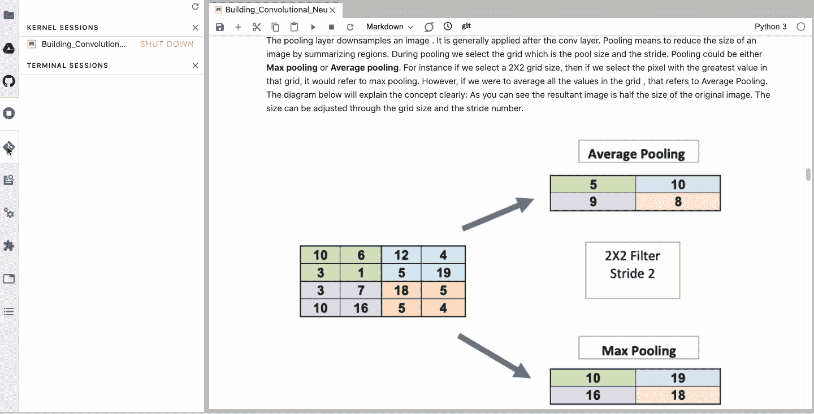

Jupyterlab-git 扩展|作者图片

# 4️⃣.Jupyterlab-TOC

**[**Jupyterlab-TOC**](https://github.com/jupyterlab/jupyterlab-toc)扩展填充 Jupyterlab 界面左侧的目录。如果有一个笔记本或 markdown 文件打开，其相应的目录将在侧边栏上生成。这些条目可以滚动和点击。**

## **装置**

**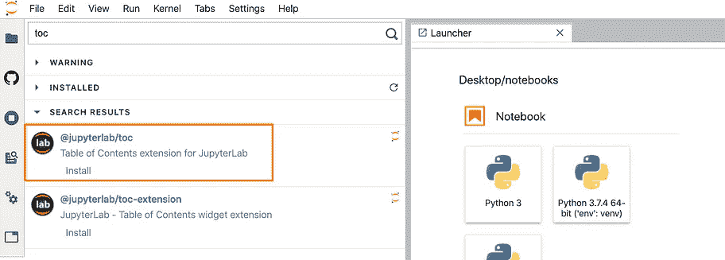****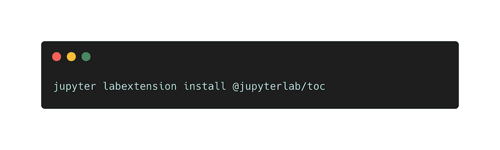**

**l:通过扩展管理器安装|| R:通过命令行界面安装|作者图片**

## **使用**

**一旦安装了扩展，您可以通过 JupyterLab 的高级设置编辑器修改它的一些属性。例如，您可以通过将`*collapsibleNotebooks*` *参数设置为* `*True*` *来从目录中折叠笔记本的各个部分。***

**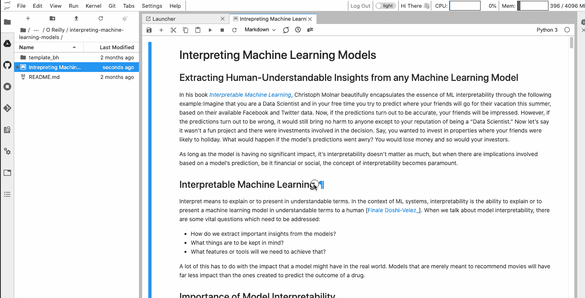**

**Jupyterlab-TOC 扩展|作者图片**

# **5️⃣.Jupyterlab-drawio**

**[**Drawio 插件**](https://github.com/QuantStack/jupyterlab-drawio) 是一个 Jupyterlab 扩展，用于将 drawio/ mxgraph 独立集成到 JupyterLab 中。[画**画**。 **io**](https://app.diagrams.net/) 是一款免费的在线图表软件，用于制作流程图、过程图、组织图、UML、ER、网络图。**

## **装置**

**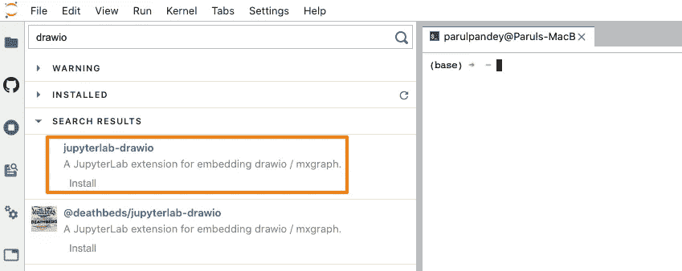****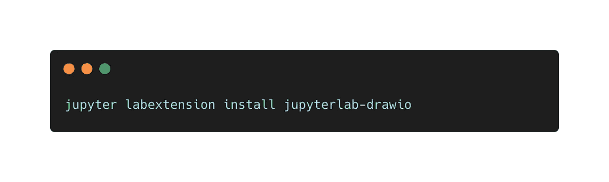**

**l:通过扩展管理器安装|| R:通过命令行界面安装|作者图片**

## **使用**

**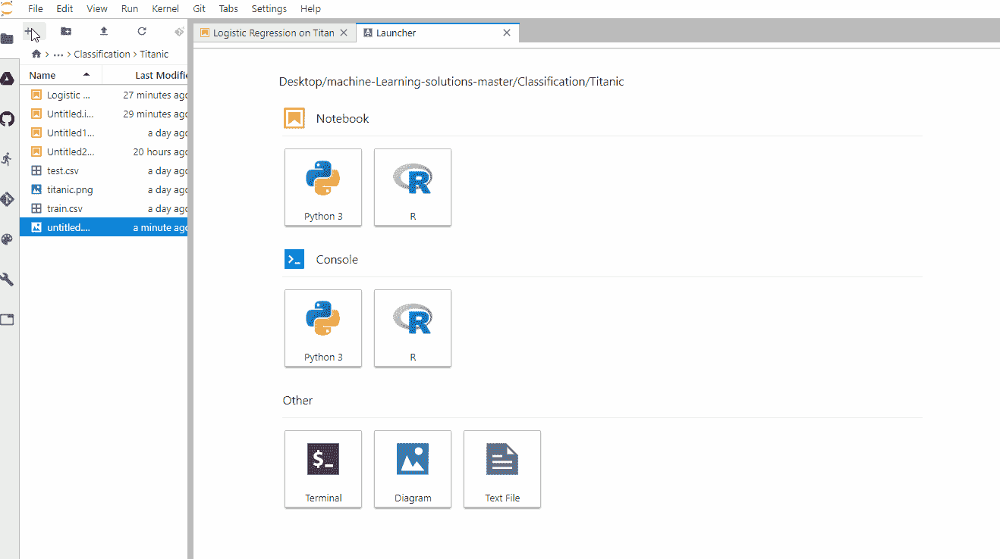**

**Jupyterlab-drawio 扩展|作者图片**

# **6️⃣.jupyterlab-顶部栏**

****J** 顶部栏可用于放置一些有用的指示器，如:**

**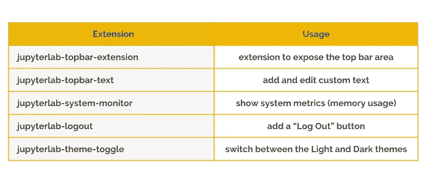**

**Jupyter 实验室环境中顶部栏上的指示器|图片由作者提供**

## **装置**

**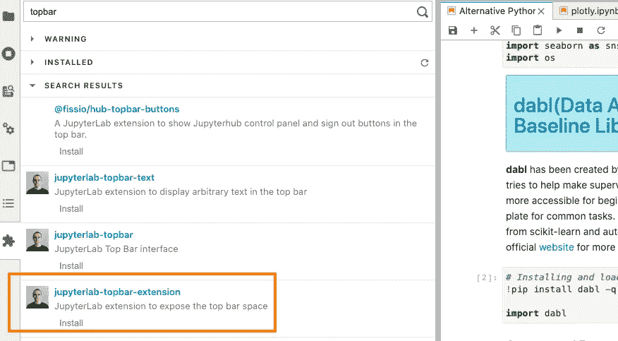****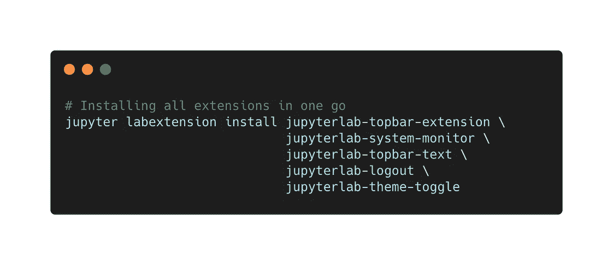**

**l:通过扩展管理器安装|| R:通过命令行界面安装|作者图片**

## **使用**

**一旦安装并启用了扩展，您将在顶部栏上看到一些指示器。将有一个注销按钮，黑暗和光明的主题开关，自定义消息，和内存指示器。**

**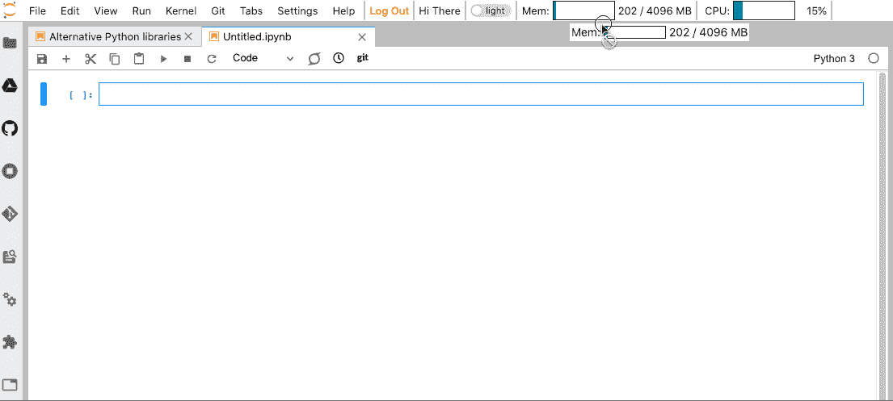**

**Jupyterlab-Topbar 扩展|作者图片**

# **7️⃣.Jupyterlab 代码格式化程序**

**[**Jupyterlab 代码格式化程序**](https://github.com/ryantam626/jupyterlab_code_formatter) 是一个小插件，支持 Jupyterlab 中的各种代码格式化程序。这是我最喜欢的扩展之一，因为它消除了代码格式化的许多痛苦。**

## **装置**

**第一步是安装插件。**

**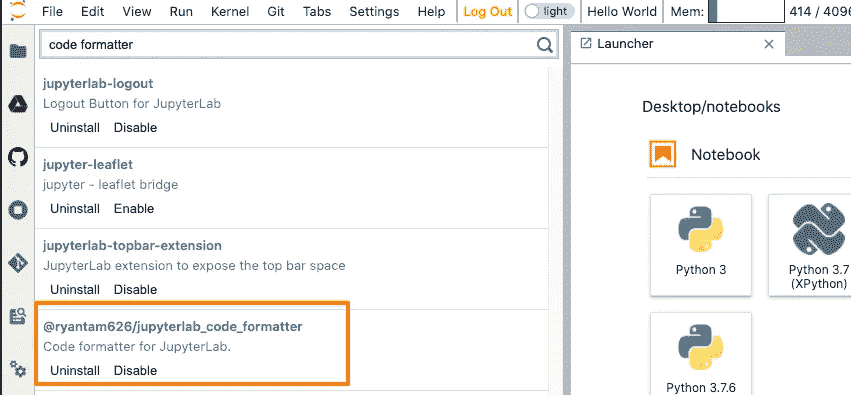****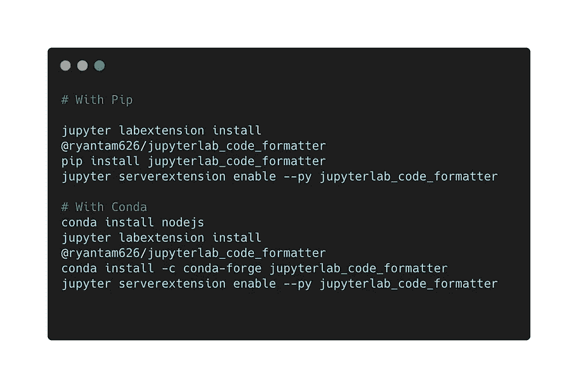**

**l:通过扩展管理器安装|| R:通过命令行界面安装|作者图片**

**下一步是安装代码格式化程序。Jupyterlab 代码格式化程序目前支持 Python 和 r 中的以下格式化程序。**

****

**在 Python 和 R. | Image by Author 中， [Jupyterlab 代码格式化程序](https://github.com/ryantam626/jupyterlab_code_formatter)目前支持以下格式化程序**

```
# Install your favourite code formatters from the list abovepip install black isort#orconda install black isort
```

**然后你可以重启 JupyterLab 并配置插件，正如这里提到的[和](https://jupyterlab-code-formatter.readthedocs.io/en/latest/how-to-use.html#changing-default-formatter)。下面显示了一个快速演示，但详细用法请遵循 [**文档**](https://jupyterlab-code-formatter.readthedocs.io/en/latest/how-to-use.html#how-to-use-this-plugin) 。下面演示的代码取自扩展的 [Github 库](https://github.com/ryantam626/jupyterlab_code_formatter/blob/master/test_snippets/test_notebook.ipynb)。**

**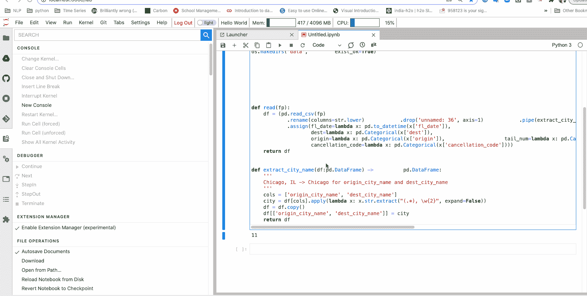**

**Jupyterlab 代码格式化程序扩展|作者图片**

# **8️⃣.jupyterlab-图表编辑器**

**[**jupyterlab-chart-editor**](https://github.com/plotly/jupyterlab-chart-editor)扩展用于编辑 Plotly 图表，基于[https://github.com/plotly/react-chart-editor](https://github.com/plotly/react-chart-editor)。该扩展支持通过用户友好的点击式界面编辑 Plotly 图表。**

## **装置**

**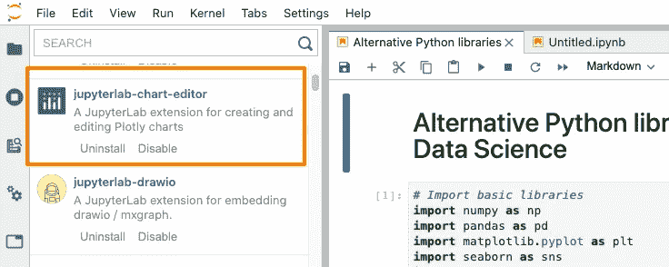****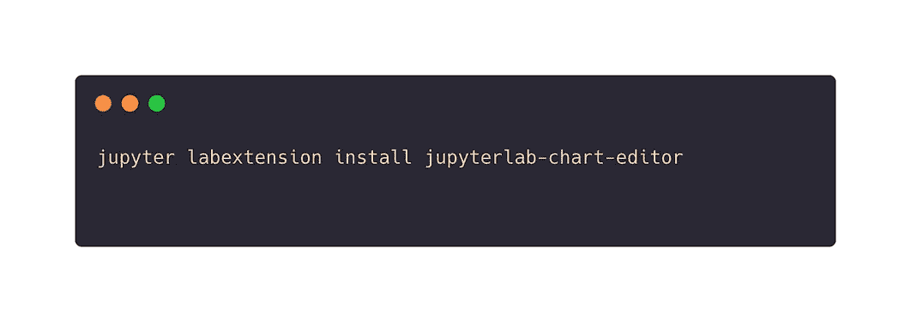**

**l:通过扩展管理器安装|| R:通过命令行界面安装|作者图片**

## **使用**

**以下示例摘自[官方文档](https://github.com/plotly/jupyterlab-chart-editor#usage)。首先使用 plotly 创建图形，然后将其写入 JSON 文件。然后使用新安装的 plotly 编辑器打开保存的文件，并在 jupyterLab 环境中对其进行一些更改。**

**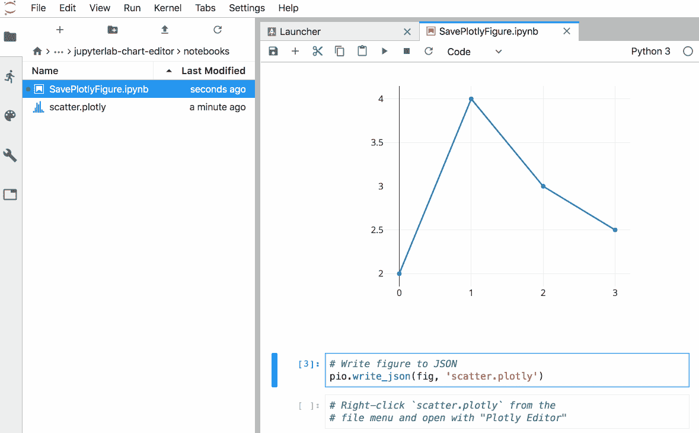**

**Jupyterlab-chart-editor 演示:Source — [官方文档](https://github.com/plotly/jupyterlab-chart-editor/blob/master/notebooks/ChartEditorExample.gif)**

# **结论**

**在本文中，我们研究了一些有用的 JupyterLab 扩展，这些扩展使 JupyterLab 脱颖而出。在一个工作场所中拥有不同的工具非常有用，因为人们不必在不同的环境之间切换来完成工作。这些插件肯定会让你的数据分析过程更加顺畅和高效。**