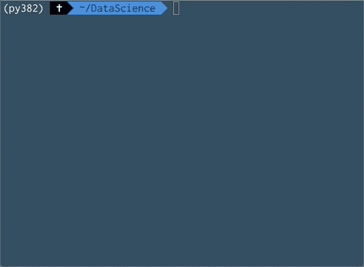
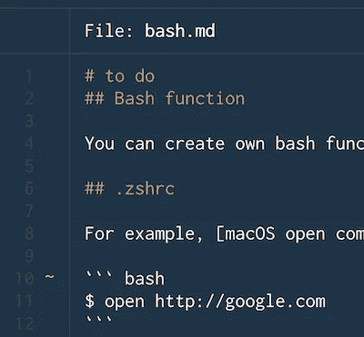
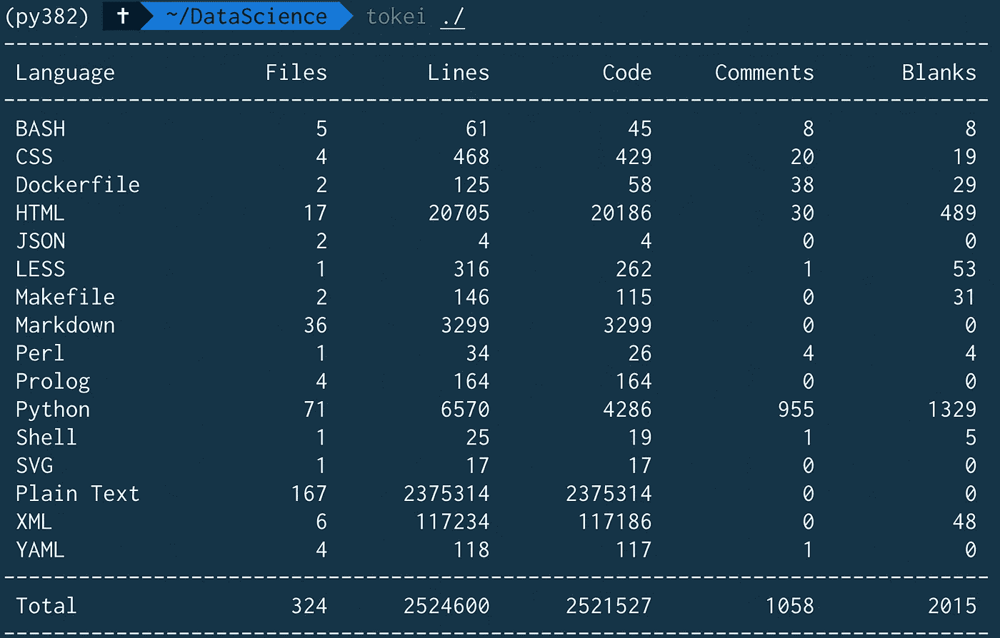
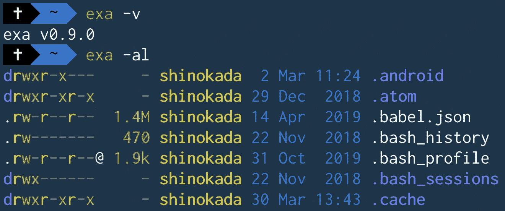
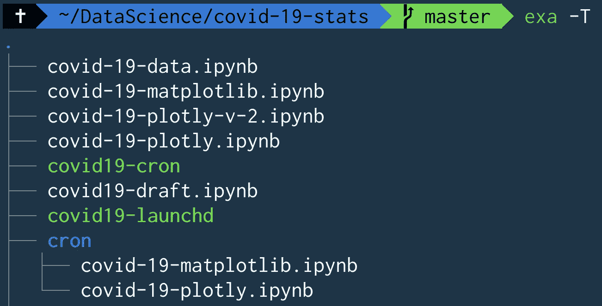
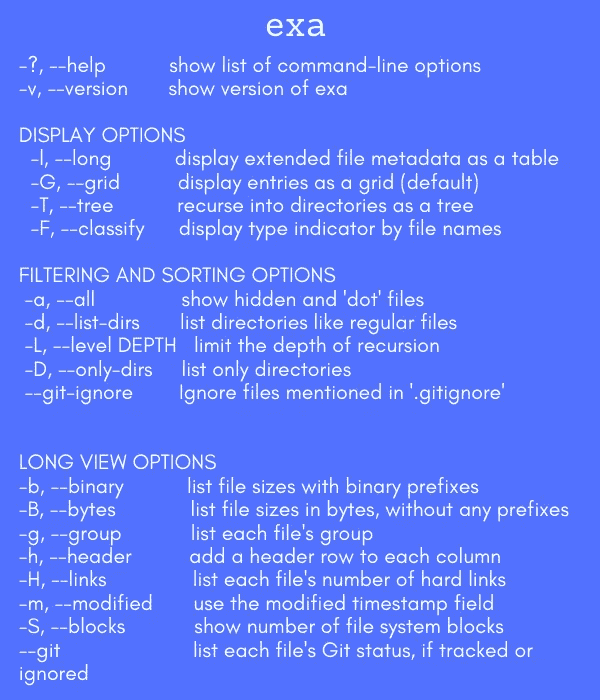
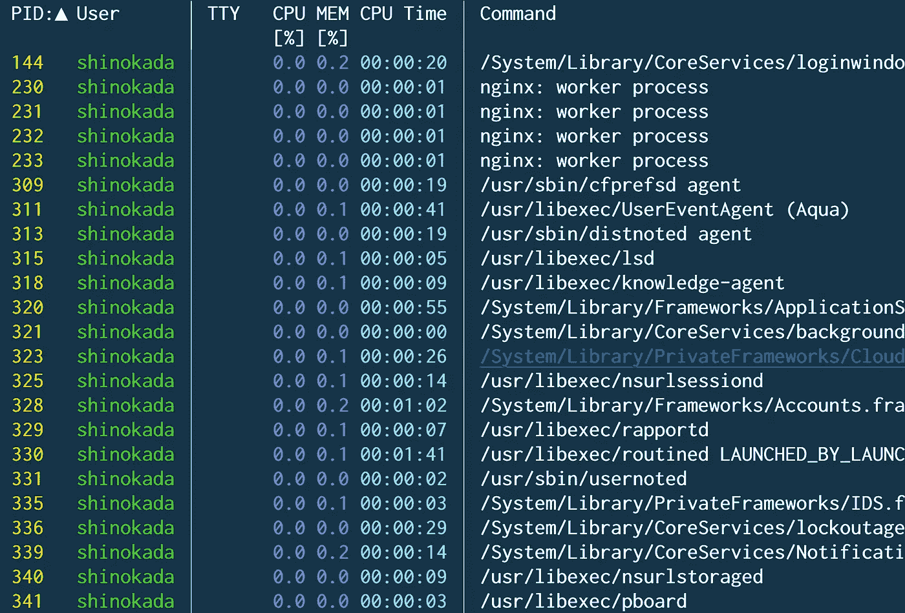
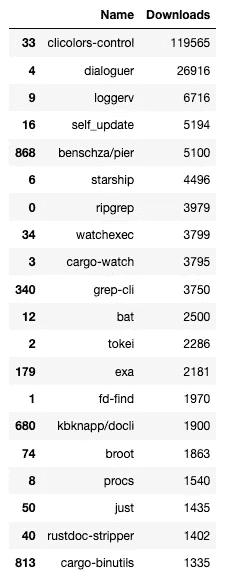

# 7 个强大的 Rust 驱动的命令行工具

> 原文：<https://towardsdatascience.com/awesome-rust-powered-command-line-utilities-b5359c38692?source=collection_archive---------4----------------------->

## 适合每个开发人员的现代 Linux 命令


照片由[蒂姆·德·格鲁特](https://unsplash.com/@timdegroot?utm_source=medium&utm_medium=referral)在 [Unsplash](https://unsplash.com?utm_source=medium&utm_medium=referral) 拍摄

```
**Table of Contents**[**Introduction**](#072d)🦀 [Starship](#461e)
🦀 [ripgrep](#a547)
🦀 [bat](#1a8c)
🦀 [tokei](#5e9b)
🦀 [exa](#0ac4)
🦀 [fd](#ed5f)
🦀 [procs](#d4f9)
🦀 [How I found them](#0776)[**Conclusion**](#ee40)
```

# 介绍

[Rust 编程语言](https://www.rust-lang.org/)已经连续四年成为 [Stack Overflow 最受欢迎的语言。](https://stackoverflow.blog/2020/01/20/what-is-rust-and-why-is-it-so-popular/)

Rust 在很大程度上被视为 C 或 C++等其他系统编程语言的替代品。

这就是为什么包括 Benjamin Sago 和 Andrew Gallant 在内的许多天才开发人员创造了优秀的 Rust 驱动的命令行工具。

在本文中，您将找到现在可以开始使用的七大命令行实用程序。

# 星际飞船

对于任何 shell 来说，Starship 是最小的、极快的、可无限定制的提示符。

要安装 homebrew run:

```
brew install starship
```

关于如何安装星舰的更多细节，请阅读 [**这篇文章**](/the-ultimate-guide-to-your-terminal-makeover-e11f9b87ac99#7c2d) 中关于星舰的内容。

并将 init 脚本添加到 shell 的配置文件中:

```
# ~/.zshrc
eval "$(starship init zsh)"
```

你可以在这里找到来自[的其他装置。](https://starship.rs/#quick-install)


图片来自[星际飞船](https://starship.rs/)

# 里格雷普

一个[超快的](https://github.com/BurntSushi/ripgrep#quick-examples-comparing-tools)搜索工具，递归地在目录中搜索正则表达式模式。`ripgrep`支持 [Windows、macOS 和 Linux](https://github.com/BurntSushi/ripgrep/releases) ，是`grep`的现代替代品。

可以安装`ripgrep`:

```
# macOS Homebrew/Linuxbrew
$ brew install ripgrep
# MacPorts
$ sudo port install ripgrep
# Windows Chocolatey
$ choco install ripgrep
# Windows Scoop
$ scoop install ripgrep
```

你可以在这里找到其他装置[。](https://github.com/BurntSushi/ripgrep#installation)

MS 的 VS 代码使用一个由 ripgre 驱动的搜索。默认情况下，它还会忽略隐藏的二进制文件。



行动中的超快速 ripgrep

# 蝙蝠

`[bat](https://github.com/sharkdp/bat)`是一个`cat`克隆，具有语法高亮和 Git 集成。`bat`是用 Rust 和 woks 在 Windows/macOS/Linux 上写的。

```
# for macOS
brew install bat
```

`bat`支持大量编程和标记语言的语法高亮显示:



带 md 文件的 bat

`bat`集成了`git`，并显示了对索引的修改(见上图左侧栏)。

# 时惠

是一个显示代码统计数据的程序。是`cloc`的超快速替代。

`tokei`显示文件数量、这些文件中的总行数以及按语言分组的代码、注释和空白。

`tokei`可在 Mac、Linux 和 Windows 上使用。参见[安装](https://github.com/xampprocky/tokei#installation)说明。



时惠。/输出

# 穰（等于 10 的 18 次方）

`[exa](https://github.com/ogham/exa)`是 Unix 和 Linux 操作系统附带的命令行程序`ls`的现代替代品。

要安装 homebrew run:

```
brew install exa
```

你可以在[这个链接](https://the.exa.website/#installation)中找到其他装置。



示例输出



exa -T 输出



作者的 exa 快速参考

# 软驱

`[fd](https://github.com/sharkdp/fd)`是`find`的简单、[快速](https://github.com/sharkdp/fd#benchmark)且用户友好的替代品。`[fd](https://github.com/sharkdp/fd)`在 Windows/macOS/Linux 上工作。

要安装 homebrew run:

```
brew install fd 
```

对于其他安装，请参见此[链接](https://github.com/sharkdp/fd#installation)。


图片来自[https://github.com/sharkdp/fd](https://github.com/sharkdp/fd)

# procs

`[procs](https://github.com/dalance/procs)`是用 Rust 写的`ps`的替代。它创建树形视图，其输出是人类可读的格式。

你可以对多栏进行关键字搜索。`procs`在 Windows(实验)/macOS/Linux 上工作。

请在此找到您的系统[的其他安装。](https://github.com/dalance/procs#installation)

按`n`可以循环浏览标题，按`a`可以升序排序，按`d`可以降序排序。

```
# for macOS
brew install procs
```



procs 输出


procs -w 然后使用 n 代表下一个，d 代表降序

# 如何保持最新的最热门的 rust 命令行实用程序

[网站](https://lib.rs/command-line-utilities)不允许你按下载次数排序，所以你可以运行这段代码来保持更新。

我用 [BeautifulSoup](https://www.crummy.com/software/BeautifulSoup/bs4/doc/) 抓取了[网站](https://lib.rs/command-line-utilities)，用[熊猫](https://pandas.pydata.org/)在 [Jupyter 笔记本](/beginners-guide-to-jupyter-notebook-8bb85b85085)上创建了一个[数据框](https://pandas.pydata.org/pandas-docs/stable/getting_started/10min.html)。

即使 [lib.rs](https://lib.rs/) 有自己的[排名算法](https://lib.rs/about)，我还是按下载号排序的。

```
import requests
from bs4 import BeautifulSoup
import pandas as pd

URL = 'https://lib.rs/command-line-utilities'

page = requests.get(URL)
soup = BeautifulSoup(page.content, 'html.parser')

# find all package names
divs = soup.select('.h > h4')
names=[]
for div in divs:
    names.append(div.text.strip())

# find all package downloads

metas = soup.select('.meta')
downloads=[]
for meta in metas:
    if(mytitle:=meta.find(class_='downloads')):
        parts = str(mytitle).split()[2].split('="')[1]
        downloads.append(int(parts))
    else:
        # some libraries do not have downloads class
        downloads.append(0)

# create a dataframe using pandas
data_tuples = list(zip(names,downloads))
df=pd.DataFrame(data_tuples, columns=['Name','Downloads'])
# sort by number of downloads
df = df.sort_values(by='Downloads', ascending=False)

df.head(20)
```

结果(截至 2020 年 5 月 5 日)



作者图片

有些包是针对 Rust 环境的，所以我选择了每个人都可以用于终端的包。

# 结论

还有更多 Rust 驱动的命令行实用程序不在这个列表中。我希望这些实用程序对您有用。

你最喜欢的是什么？或者你很受启发，想在 Rust 中开始构建自己的命令行应用程序。

**通过** [**成为**](https://blog.codewithshin.com/membership) **会员，可以完全访问媒体上的每一个故事。**


[请订阅。](https://blog.codewithshin.com/subscribe)

[](/learning-rust-by-converting-python-to-rust-259e735591c6) [## 通过将 Python 转换成 Rust 来学习 Rust

### Rust 基础入门教程

towardsdatascience.com](/learning-rust-by-converting-python-to-rust-259e735591c6) [](/you-want-to-learn-rust-but-you-dont-know-where-to-start-fc826402d5ba) [## 你想学 Rust 但是不知道从哪里开始

### Rust 初学者的完整资源

towardsdatascience.com](/you-want-to-learn-rust-but-you-dont-know-where-to-start-fc826402d5ba) [](/rust-powered-command-line-utilities-to-increase-your-productivity-eea03a4cf83a) [## Rust-Powered 命令行实用程序可提高您的工作效率

### 您腰带下的现代快速工具

towardsdatascience.com](/rust-powered-command-line-utilities-to-increase-your-productivity-eea03a4cf83a) [](/the-ultimate-guide-to-your-terminal-makeover-e11f9b87ac99) [## 终端改造的终极指南

### 今天你将度过的最好的 11 分钟:程序员的终端提示

towardsdatascience.com](/the-ultimate-guide-to-your-terminal-makeover-e11f9b87ac99) [](/a-step-by-step-guide-to-scheduling-tasks-for-your-data-science-project-d7df4531fc41) [## 为您的数据科学项目安排任务的分步指南

### macOS/Linux 中 cron 和 launchd 的完整指南

towardsdatascience.com](/a-step-by-step-guide-to-scheduling-tasks-for-your-data-science-project-d7df4531fc41)