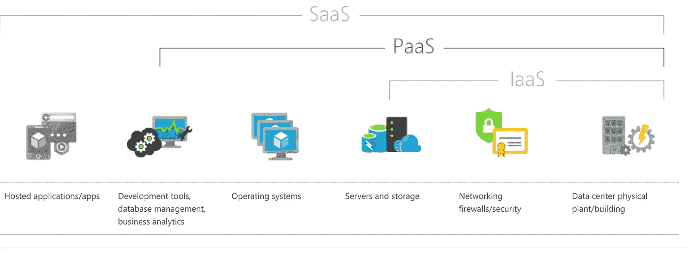
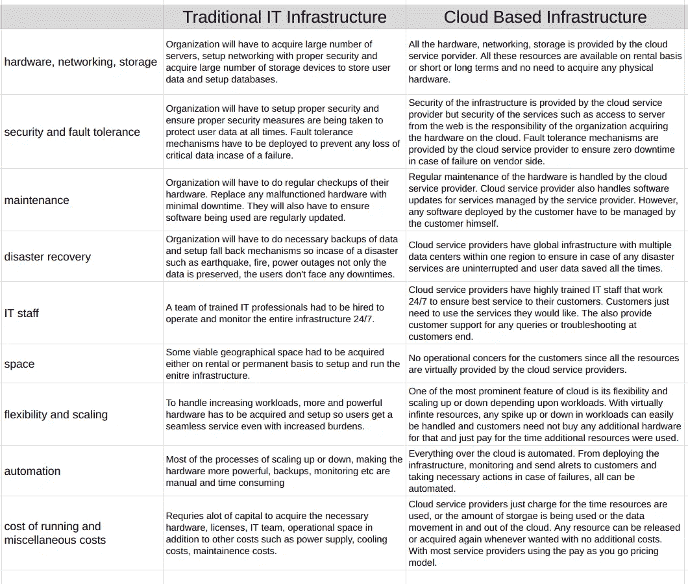
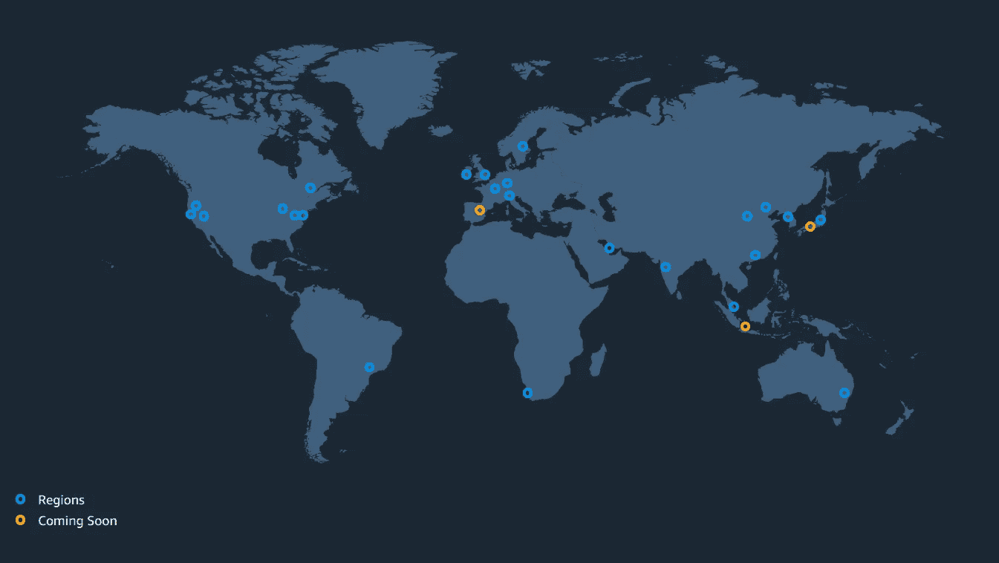
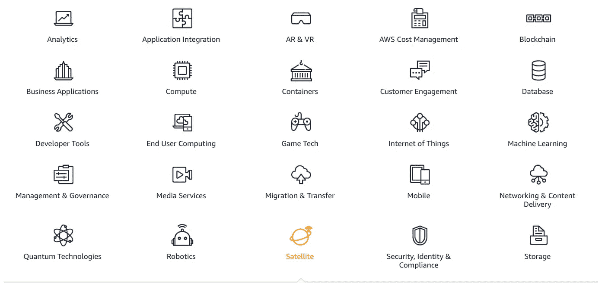
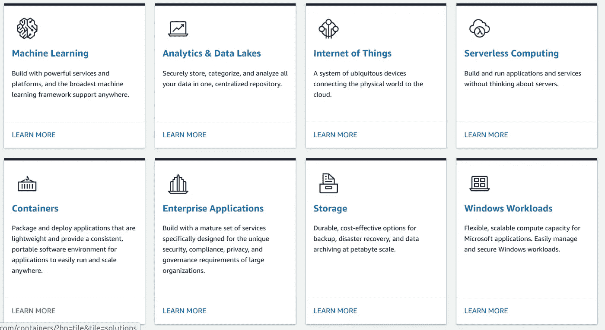

# AWS 和虚拟云计算

> 原文：<https://towardsdatascience.com/aws-and-cloud-computing-for-dummies-84525fbabd1e?source=collection_archive---------28----------------------->

## 什么是云计算和 AWS 的初学者指南。

图片由 Unsplash.com 的伊恩·巴塔格利亚拍摄

这将是我关于 AWS 服务系列文章的第一篇。这将是一篇介绍性的文章，适合没有任何 AWS 或云服务知识的初学者。这篇文章旨在帮助那些刚接触云计算领域的人加深理解。本文将涵盖以下内容:

*   传统 IT 基础设施。
*   什么是云计算？
*   传统 IT 与云基础架构。
*   亚马逊网络服务介绍。

# 传统 IT 基础设施

当我们登录电脑，通过谷歌 Chrome 等网络浏览器浏览互联网，访问我们最喜欢的网站，如 YouTube.com 或 Facebook.com 时，很多事情都在幕后发生。许多不同的物理和虚拟、人类和非人类组件协同工作，使用户能够访问他们喜爱的网站或服务。

对于任何组织来说，无论规模大小，当他们必须通过 internet 向用户提供对任何服务的访问时，他们需要不同的组件来完成这项工作。基于 web 的服务的传统 IT 基础架构包括以下核心组件:

*   服务器。
*   存储和数据库。
*   网络和路由。
*   操作和监控整个基础架构所需的人力和空间。
*   维护、安全和灾难恢复。

如果某个特定服务的用户数量不是很大，这种安排非常有效。但是，随着这项服务越来越受欢迎，组织不断壮大，扩展物理基础设施并始终为用户提供即时、不间断的访问成为一项艰巨的任务。以脸书为例。大约有 26 亿用户在使用这个平台。他们拥有非常大的定制数据中心，2019 年全球有 15 个，超过 180，000 台服务器，使这 26 亿用户能够稳定、不间断地访问 Facebook.com。这些数据中心的核心是上述组件，即服务器、存储、网络和劳动力。

因此，我们可以看到，并不是所有的组织都能够负担得起这么多的物理硬件、人力和运营空间来开展日常活动。

# 什么是云计算

简而言之，云计算就像任何其他数据中心一样，拥有服务器、存储、网络、劳动力和空间，以及数据中心的所有其他必需品，只是不由您管理。一个受信任的独立方通过互联网将其整个基础架构借给客户，这些客户是那些负担不起内部基础架构或认为没有必要拥有内部基础架构的其他组织。

> 云计算是计算能力、数据库存储、应用程序和其他 IT 资源的按需交付，价格随用随付。根据您的需要访问任意多的资源，并几乎即时地调配正确类型和大小的计算资源。

云服务提供商为其客户提供传统内部 IT 基础架构中涉及的所有核心服务，以及在定价、服务可用性、扩展或缩减、安全性、维护等方面的附加服务和优势。客户通常以非常合理的成本支付他们所使用的东西，并且只需担心他们想要的基础架构类型及其虚拟部署。一切都可以通过云服务提供商提供的一些接口在互联网上访问，用户登录后只需部署他们想要的基础设施。

**云服务提供商**

这些年来，随着越来越多的组织放弃物理数据中心，转向云计算，云计算经历了巨大的增长。到 2020 年，前三大云服务提供商将是:

*   亚马逊(Amazon)将在 2020 年占据 60%的市场份额
*   微软(Azure)在 2020 年拥有 31%的市场份额
*   谷歌(GCP)在 2020 年占 9%

**云平台的客户**

在这些云服务上运行的一些受欢迎的服务是网飞、Airbnb、麦当劳、Activision、NASA、沃尔玛、福特、T-Mobile、迪士尼、高露洁、易贝、Spotify 等等。

云服务在组织中越来越受欢迎，新的创业公司围绕云服务构建他们的产品，而旧的组织迁移到云。云计算已经成为一个 10 亿美元的产业，仅 AWS 在 2019 年就赚了大约**350 亿美元**，并拥有超过**100 万活跃用户**。

## 云服务的类型

让我们来看看不同的提供商正在提供什么样的云服务:

*   **基础设施即服务(IaaS):** 它是云计算 It 的构建模块。允许您选择所需的网络、服务器、数据库和存储空间的类型。这是构建基于云的服务的最灵活的选择，并且可以很容易地与本地 It 并行。底层基础设施仍然必须由您来管理(尽管是虚拟的)。
*   **平台即服务(PaaS):** 允许用户构建、管理和部署应用程序，而无需管理网络、服务器、数据库等底层基础设施。例如 AWS 弹性豆茎，Windows Azure，Heroku。
*   **软件即服务(SaaS):** 它是完全由所提供的服务提供和管理的完整服务。用户只需创建账户，配置和使用服务。例子包括谷歌应用程序(Gmail)，Dropbox，Zoom。

下图有助于理解每种云服务向用户提供的抽象级别。

图片来自 azure.microsoft.com

# 传统 IT 与云基础架构

现在我们知道了传统 IT 和云的组成，我们可以很容易地对两者进行比较。与建立内部数据中心相比，云平台有几个额外的好处。下表可以帮助我们理解为什么云成为大多数人的首选:

传统 IT 与云基础架构

## 云基础架构的优势

拥有基于云的基础架构有以下优势:

*   **按需付费:**无需筹集大量资金购买基础设施。仅在需要时为您使用的内容付费。降低总体拥有成本和运营开支。
*   **调配合适类型的资源:**云让客户有机会在电力、存储、速度、网络等方面选择合适类型的资源，以满足其业务需求。
*   **计量和自助服务:**所有的资源使用都是计量的，只对用户使用的资源付费。此外，用户可以在任何时候自己使用服务提供商提供的任何服务，而无需依赖任何第三方。
*   **灵活性和可扩展性:**云环境非常灵活和有弹性。用户可以轻松地在不同种类的资源之间切换，以获得更高的处理能力，并根据他们面临的工作负载类型增加或减少节点数量。
*   **高可用性和容错:**由于云是基于全球基础设施的，因此资源会在多个数据中心之间自动调配，以便在发生灾难时提供高可用性和容错能力。
*   **全球部署:**客户可以在几分钟内轻松地在全球范围内部署其整个基础架构，并拥有全球业务。
*   **无运营或维护成本:**客户不必担心与员工、维护、租金、电力、冷却、硬件、许可等相关的任何成本。就这些费用而言，云对客户来说是经济高效的。

# 亚马逊网络服务简介

当我们谈论云计算时，**亚马逊网络服务(AWS)** 是第一个想到的名字。AWS 是云行业云计算的开创者。在 2004 年推出只有一项服务(SQS)的时候，他们已经走过了漫长的道路。毫无疑问，AWS 是最成熟的云服务提供商，也是目前云行业的市场领导者。

拥有超过 **212 项服务**，包括计算、存储、网络、数据库、分析、应用服务、部署、管理、移动、开发人员工具和物联网工具。AWS 在全球运营，在 42 个国家的 84 个城市拥有 [**216 个存在点**](https://infrastructure.aws/) (205 个边缘位置& 11 个区域缓存)。

AWS 存在点。

AWS 允许客户以非常低的成本为各种各样的行业构建高度可伸缩、健壮和复杂的应用程序。他们的按需付费定价模式大幅降低了成本，随着用户群越来越大，AWS 通过其巨大的规模经济定价策略进一步降低了成本。

AWS 允许通过构建良好的基于 web 的控制台访问所有资源。其他方法包括通过 CLI、SDK 和 API 进行访问。

## AWS 使用案例

AWS 提供所有三种类型的云服务，即 IaaS、PaaS 和 SaaS。AWS 的常见使用案例包括:

*   企业 IT、备份和存储。
*   大数据分析。
*   网站托管。
*   移动和社交应用。
*   游戏。

## AWS 产品

AWS 拥有 200 多种服务，至少有一种产品符合您的需求

[AWS 产品。](https://aws.amazon.com/#lb-section-indicator-0)

## AWS 解决方案

AWS 还提供特定于领域的解决方案，您可以利用已经实现的解决方案，构建您的架构良好的应用程序

[AWS 解决方案。](https://aws.amazon.com/solutions/?hp=tile&tile=solutions)

## AWS 自由层:

如果你是一个初学者，刚刚开始使用云计算，AWS 提供一年的免费层(访问以下链接)。

[](https://aws.amazon.com/free/?trk=ps_a134p000003yHuHAAU&trkCampaign=acq_paid_search_brand&sc_channel=PS&sc_campaign=acquisition_PK&sc_publisher=Google&sc_category=Core&sc_country=PK&sc_geo=APAC&sc_outcome=acq&sc_detail=%2Baws%20%2Bfree&sc_content=Cost_bmm&sc_matchtype=b&sc_segment=444990381791&sc_medium=ACQ-P|PS-GO|Brand|Desktop|SU|AWS|Core|PK|EN|Text&s_kwcid=AL!4422!3!444990381791!b!!g!!%2Baws%20%2Bfree&ef_id=CjwKCAjw0_T4BRBlEiwAwoEiAX1iJA1meZYK6AjkcrAMD4VjvxAgliNJVdyEM7_ILiJuGyvw1rkEgxoCq60QAvD_BwE:G:s&s_kwcid=AL!4422!3!444990381791!b!!g!!%2Baws%20%2Bfree&all-free-tier.sort-by=item.additionalFields.SortRank&all-free-tier.sort-order=asc) [## AWS 自由层

### 获得免费的 AWS 平台、产品和服务实践经验探索 60 多种产品并开始…

aws.amazon.com](https://aws.amazon.com/free/?trk=ps_a134p000003yHuHAAU&trkCampaign=acq_paid_search_brand&sc_channel=PS&sc_campaign=acquisition_PK&sc_publisher=Google&sc_category=Core&sc_country=PK&sc_geo=APAC&sc_outcome=acq&sc_detail=%2Baws%20%2Bfree&sc_content=Cost_bmm&sc_matchtype=b&sc_segment=444990381791&sc_medium=ACQ-P|PS-GO|Brand|Desktop|SU|AWS|Core|PK|EN|Text&s_kwcid=AL!4422!3!444990381791!b!!g!!%2Baws%20%2Bfree&ef_id=CjwKCAjw0_T4BRBlEiwAwoEiAX1iJA1meZYK6AjkcrAMD4VjvxAgliNJVdyEM7_ILiJuGyvw1rkEgxoCq60QAvD_BwE:G:s&s_kwcid=AL!4422!3!444990381791!b!!g!!%2Baws%20%2Bfree&all-free-tier.sort-by=item.additionalFields.SortRank&all-free-tier.sort-order=asc) 

# 总结:

在本文中，我们了解了传统 IT 基础架构和云服务之间的区别。什么是云计算，它相对于传统 IT 的优势和附加好处，什么是 AWS？

如有任何疑问，请随时联系我。如果你喜欢这篇文章，请关注我，获取更多令人惊叹的内容(帮助我达到我的目标 **500 名追随者**)。链接到我的个人资料。

 [## Furqan 黄油—中等

### 在介质上阅读 Furqan Butt 的文字。大数据工程师，Python 开发者。让我们连接…

medium.com](https://medium.com/@furqan.butt) 

谢谢，继续看:)