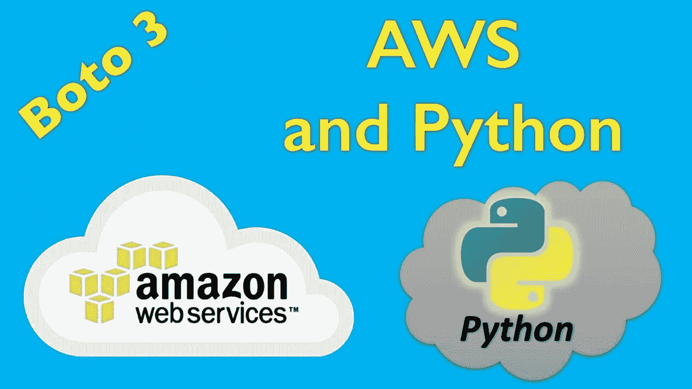
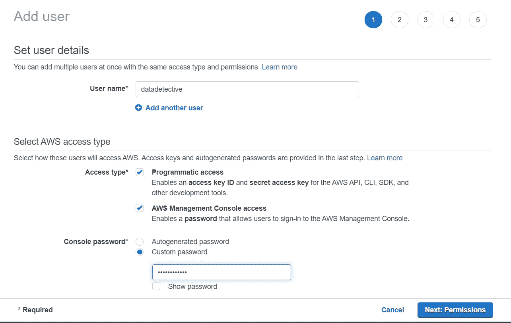
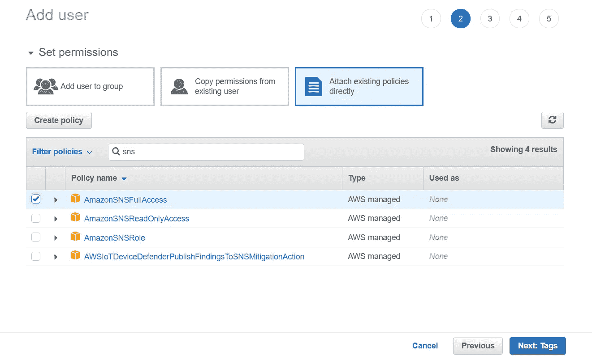
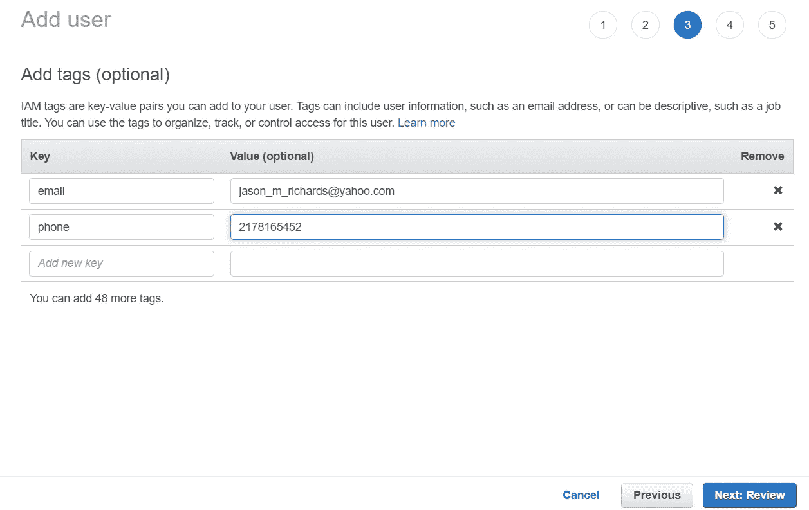

# AWS 和 Python:boto 3 包

> 原文：<https://towardsdatascience.com/aws-and-python-the-boto3-package-df495bb29cb3?source=collection_archive---------20----------------------->



## Domo Arigato，AWS Boto

现在是 2020 年，云存储和计算世界很可能是未来几十年大多数企业的发展方向。拥有可扩展的存储和计算能力而无需购买物理设备的前景非常诱人。云的三大巨头是亚马逊网络服务(AWS)、微软 Azure 和谷歌云服务。

由于 Python 是最受欢迎的语言之一(在撰写本文时)，所以无论您选择哪种服务，查看允许使用 Python 的工作数据工程师、数据科学家和机器学习科学家利用云的能力的包都是有意义的。微软 azure 有 Azure 包，谷歌有谷歌云包，AWS 有 boto3。本文将重点介绍 boto3。

**设置它**

首先，我们需要设置一些东西。AWS 确实提供免费服务，你可以免费注册。你需要一个用户名和令牌来通过后台登录 boto3，所以去 https://aws.amazon.com 注册一个免费账户吧。您还需要在您的 IDE、笔记本电脑等中安装 boto3。只需使用 pip 或 conda 安装 boto3 即可。

接下来，您需要通过 Amazon 的身份和访问管理控制台( [IAM](https://console.aws.amazon.com/iam) )创建一个用户。在这里，您可以添加用户、组和任何与访问相关的内容。您需要为自己创建一个角色，这样您就可以拥有一个用于凭证目的的永久授权令牌。



步骤 1:设置用户名和访问类型



第二步:设置权限(对于这篇文章，你只需要 SNS，S3，理解和 Rekognition)。确保为每个选项选择完全访问权限。如果这是一个个人帐户，你可以给自己所有亚马逊服务的完全访问权限，只需在搜索中输入 FullAccess 并选中 all。



步骤 3:添加标记(可选)—这些是键:值对，它们是用于更好控制的附加标识符

完成上述步骤后，只需确认设置，用户就会收到访问密钥 id 和秘密访问密钥。在您的本地计算机上启动 AWS 会话将需要这些。

**开始会话**

这是你节省时间的地方。启动会话就像打开您的 IDE 或笔记本一样简单，只需使用以下命令:

```
import boto3

s3 = boto3.client(‘service_name’, region_name=’region_name’,
                   aws_access_key_id=key,
                   aws_secret_access_key=password)
```

对于上下文:“服务名称”是您正在连接的 AWS 服务(S3、SNS、理解、Rekognition 等)，区域是您正在连接的计算服务的区域。该地区很重要，因为这将决定成本。请访问 AWS 网站获取服务列表，并访问[https://how to . lintel . in/list-of-AWS-regions-and-avail ability-zones/](https://howto.lintel.in/list-of-aws-regions-and-availability-zones/)获取地区列表。只有用户拥有权限的服务才可以访问。抱歉，到目前为止，它不需要服务列表，所以你需要一次加载一个。

**服务和功能示例**。

*S3* 。AWS 的简单存储解决方案。这是创建和存储文件夹和文件的地方。这是一个非关系型的存储空间，所以它需要许多不同类型的文件。AWS 对文件夹的术语是“桶”,文件被称为“对象”。以下是 S3 的几个函数:

```
import boto3, login into ‘s3’ via boto.client#### create bucketbucket = s3.create_bucket(Bucket=’bucket_name’)

#### list bucketbucket_response=s3.list_buckets() #requests a list of buckets
buckets = bucket_response[‘Buckets’] #sets bucket list from Buckets key
print(buckets) 

#### delete bucketresponse = s3.delete_bucket(Bucket=‘bucket_to_be_deleted’)

#### upload objects3.upload_file(Filename=’local_file_path’,
               Bucket = ‘bucket_name’,
               Key = ‘object_name’,
               ExtraArgs={‘ACL’:’acl_type’, #sets access control limit type
               ‘ContentType’:’content_type’} #to specify type of content (html, jpg, etc.)

#### list objects#obtain many files
response =s3.list_objects(Bucket=’bucket_name’,
                          MaxKeys=2 #maximum number of files to list
                          Prefix=’prefix_of_file_for_search’)
print(response)
#obtain single file
response =s3.head_object(Bucket=’bucket_name’, Key=’file_name’)
        print(response)#### download filess3.download_file(Filename=’local_path_to_save_file’,Bucket=’bucket_name’,Key=’file_name’)

#### delete file

s3.delete_object(Bucket=’bucket_name’,Key=’file_name’)
```

SNS。AWS 的简单通知系统。该服务将根据管理员设置的条件向组和用户发送通知。以下是社交网络的一些功能:

```
import boto3, login into ‘sns’ via boto.client#### create topicresponse=sns.create_topic(Name=’topic_name’)[‘TopicArn’] #sets topic and grabs response

#### list topicsresponse=sns.list_topics()

#### delete topicssns.delete_topic(TopicArn=’full_topic_arn_value’)

#### create subscriptionresp_sms = sns.subscribe(TopicArn = topic_name,  
                         Protocol='delivery_method,
                         Endpoint=’phone_email_etc’)

#### list subscriptionsresponse = sns.list_subscriptions_by_topic(TopicArn = topic_name)
    subs = pd.DataFrame(response['Subscriptions']) #converts list to a df#### delete subscriptionsns.unsubscribe(SubscriptionArn=’full_sub_arn’)

#### send messages##### publish to a topicresponse = sns.publish(TopicArn = topic_arn, 
                        Message = ‘body of message’ #can use string formatting,
                        Subject = ‘Subject line’)

##### sending single smsresponse = sns.publish(PhoneNumber = ‘phone_number’,Message = ‘body of message’) #can use string formatting
```

*领悟*。理解是 AWS 的自然语言处理服务。它可以确定文件是用什么语言编写、翻译和执行情感分析。这些功能如下:

```
 #### text translatetranslate = ‘translate’ via boto.client
response=translate.translate_text(Text=variable,’string’,etc.,
                                  SourceLanguageCode = ‘auto’,
                                  TargetLanguageCode = ’language_to_translate_to’)

#### detecting languagecomprehend = ‘comprehend’ via boto.client
  response=comprehend.detect_dominant_language(Text=variable,’string’,etc.,)

#### sentiment analysiscomprehend = ‘comprehend’ via boto.client    
    response=comprehend.detect_sentiment(Text=variable,’string’,etc.,LanguageCode=’language’)
```

重新认识。这是 AWS 的图像识别服务。它实际上在检测物体和从图像中提取文本方面做得非常好。以下是一些函数:

```
#### object detectionimport boto3, login into ‘s3’ via boto.client
#upload file where images are located
rekog = ‘rekognition’ via boto.client
  response=rekog.detect_labels(Image=’image_name’:
                              {‘Bucket: ’bucket_name’, ’Name’: ’file_name’},
                              MaxLabels = maximum # of objects to detect
                              MinConfidence = set confidence level of classification)

#### text detectionimport boto3, login into ‘s3’ via boto.client
#upload file where images are locatedrekog = ‘rekognition’ via boto.clientresponse = rekog.detect_text(Image=’image_name’:
                           {‘Bucket: ’bucket_name’, ’Name’: ’file_name’},
                            MinConfidence = set confidence level of classification)
```

显然，有许多服务和更多的功能需要花相当长的时间来总结。这将给您一个良好的开端，并让您有机会通过 Python 探索 AWS 服务。像往常一样，这些项目的回购可以通过我的 Github 在[https://github.com/Jason-M-Richards/Data-Science-Toolkit](https://github.com/Jason-M-Richards/Data-Science-Toolkit)获得。