# AWS Athena 和 Glue:查询 S3 数据

> 原文：<https://towardsdatascience.com/aws-athena-and-glue-querying-s3-data-ce83f1ba9f9f?source=collection_archive---------24----------------------->

## AWS Glue 是一个 ETL 服务，允许数据操作和数据管道管理。

在这个特定的例子中，让我们看看如何使用 AWS Glue 将 csv 文件从 S3 存储桶加载到 Glue 中，然后在 Athena 中对这些数据运行 SQL 查询。

下面是 S3 存储桶中的 CSV 文件，如下图所示——数据集本身可以从本文末尾引用的 GitHub 存储库中获得。

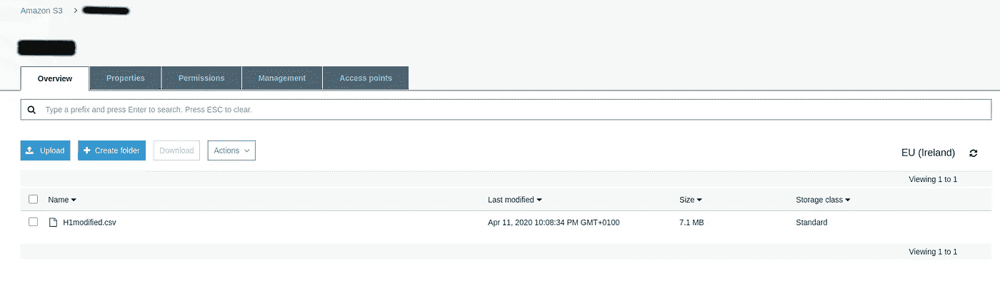

来源:亚马逊网络服务

# 在 AWS Glue 中设置爬虫

爬行器用于从源中提取数据，分析数据，然后确保数据符合特定的模式——或定义表中每个变量的数据类型的结构。

定义了 crawler，并设置了数据存储、IAM 角色和调度。

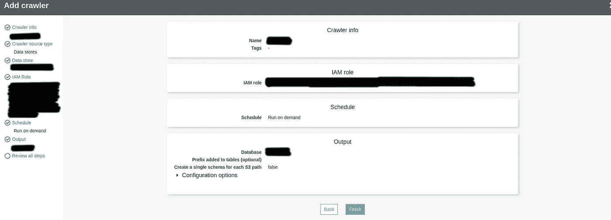

来源:亚马逊网络服务

crawler 将需要一点时间来提取表，这取决于数据的大小。在这里，爬虫被安排按需运行。

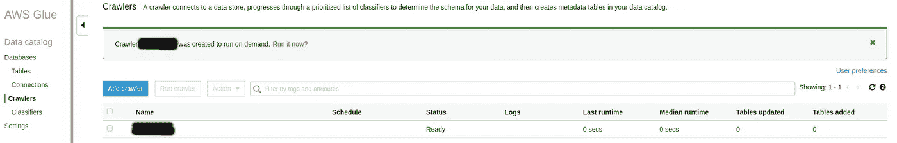

来源:亚马逊网络服务

但是，也可以将 crawler 设置为按特定的时间表运行。

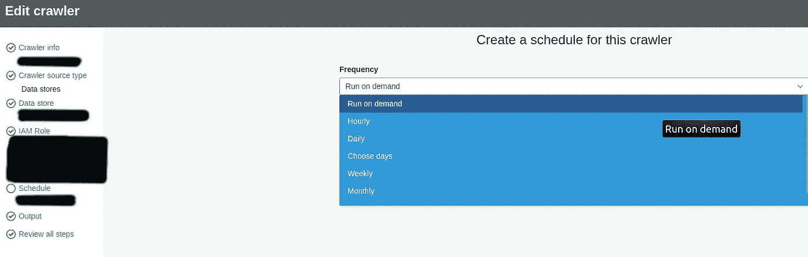

来源:亚马逊网络服务

当 S3 存储桶中的数据定期更新或更改时，这一点尤其重要——必须确保 Glue 中的数据保持最新。

该表现在显示在 AWS 胶中。这里，模式被自动检测。

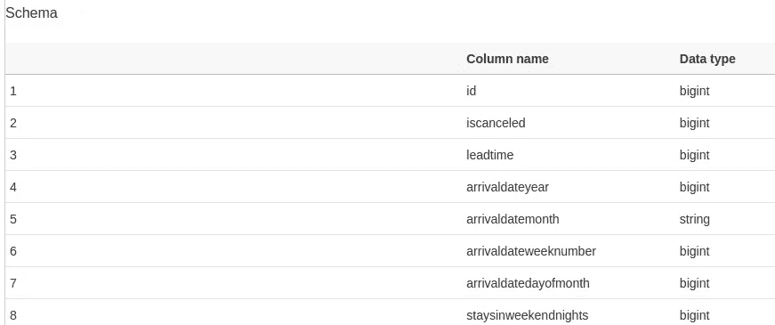

来源:亚马逊网络服务。

但是，也可以通过选择编辑模式，然后手动定义每个变量的数据类型来编辑模式:

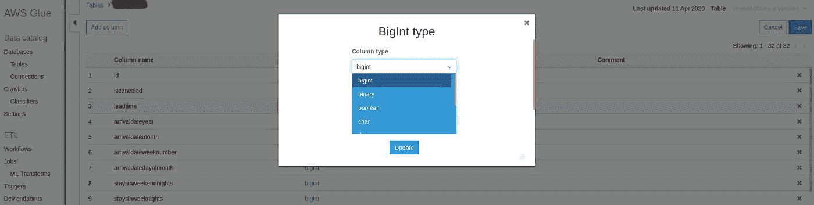

来源:亚马逊网络服务。

# 雅典娜中的查询

现在这个表是用 AWS Glue 表示的，让我们试着运行一些查询！

Athena 是一项 AWS 服务，允许在 S3 对数据运行标准 SQL 查询。因为已经在 Glue 中建立了模式，并且表已经加载到数据库中，所以我们现在只需要查询我们的数据。

正在分析的特定数据集是酒店预订数据集。

让我们使用一些 SQL 查询来执行以下操作:

1.  从表中选择所有列，其中 Country 列下的所有条目都以字母 p 开头。
2.  计算平均提前期，其中国家= 'PRT '(葡萄牙)。
3.  计算平均 ADR 值，其中 Country = 'GBR '(英国)，且细分市场属于直接类别。
4.  最后，让我们根据国家、预订的房间类型和客户类型来订购桌子。

## 查询 1

`select * from table where country like ‘P%’;`

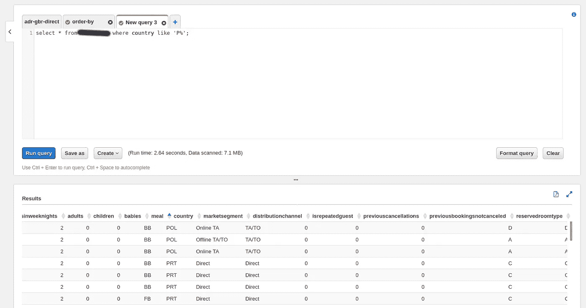

来源:亚马逊网络服务

## 查询 2

`select avg(leadtime) from table where country=’PRT’;`

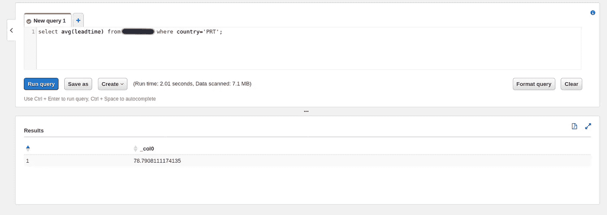

来源:亚马逊网络服务

## 查询 3

`select avg(adr) from table where country=’GBR’ and marketsegment=’Direct’;`

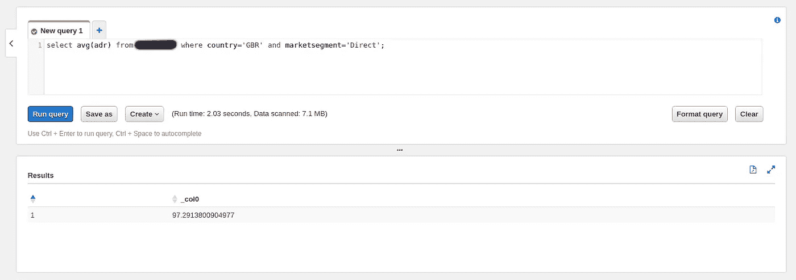

来源:亚马逊网络服务

## 查询 4

`select * from table order by country, reservedroomtype, customertype;`

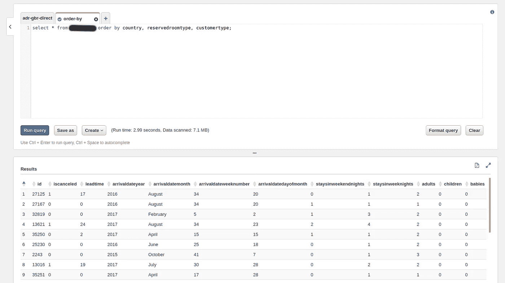

来源:亚马逊网络服务

这些查询也可以保存起来供以后使用。让我们保存查询 3 作为一个例子。

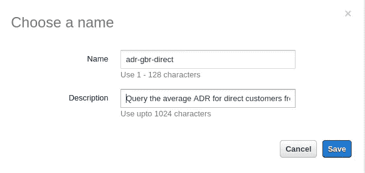

来源:亚马逊网络服务。

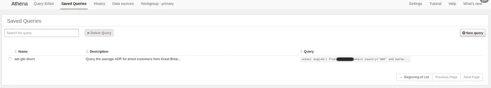

来源:亚马逊网络服务

# 结论

在本例中，您看到了:

*   如何用胶水在 S3 桶中抓取数据
*   在 Glue 中编辑表模式
*   使用 Athena 运行 SQL 查询

非常感谢您的参与，相关的数据集可以在 [MGCodesandStats GitHub 存储库](https://github.com/MGCodesandStats/aws-glue-athena-hotels)中找到。

您还可以在 michael-grogan.com 的[找到我的数据科学内容。](https://www.michael-grogan.com/)

*免责声明:本文是在“原样”的基础上编写的，没有担保。本文旨在提供数据科学概念的概述，不应以任何方式解释为专业建议。*