# AWS DataBrew —一款全新、经济的数据准备工具

> 原文：<https://towardsdatascience.com/aws-databrew-a-new-affordable-data-prep-tool-c90841750ef9?source=collection_archive---------20----------------------->

## [入门](https://towardsdatascience.com/tagged/getting-started)

## 数据分析和转换工具的演练

图片由[负空间](https://pixabay.com/users/negative-space-2379030/?utm_source=link-attribution&utm_medium=referral&utm_campaign=image&utm_content=1324126)来自 [Pixabay](https://pixabay.com/?utm_source=link-attribution&utm_medium=referral&utm_campaign=image&utm_content=1324126)

2020 年 11 月 11 日，AWS 宣布发布 Glue DataBrew。专注于数据准备，它提供了 250 多个函数来帮助。我喜欢所有的数据，所以我检查了一下。有两种主要类型的功能，数据配置文件和转换。我将介绍设置和使用这两个特性的步骤。

 [## 介绍 AWS Glue DataBrew:可视化数据准备工具，用于清理和标准化高达 80%的数据…

### AWS Glue DataBrew 提供了 250 多种预构建的转换来自动化数据准备任务(例如，过滤…

aws.amazon.com](https://aws.amazon.com/about-aws/whats-new/2020/11/introducing-aws-glue-databrew-visual-data-preparation-tool-to-clean-and-normalize-data-up-to-80-percent-faster/) 

# 定价

总要考虑成本。每节互动课 1 美元。转换作业每节点小时 0.48 美元。最好的部分是，它完全是随用随付。这使得该工具对每个人来说都非常容易使用和负担得起，甚至是休闲爱好者。

# 加载您的数据

从 AWS 控制台，假设您已经设置了一个帐户，您可以直接进入 AWS DataBrew。有一个很好的界面来分析和转换数据。第一步是创建数据集。为了这个演示，我从纽约加载了一个[开放的崩溃数据集到 S3。](https://data.world/data-ny-gov/e8ky-4vqe)

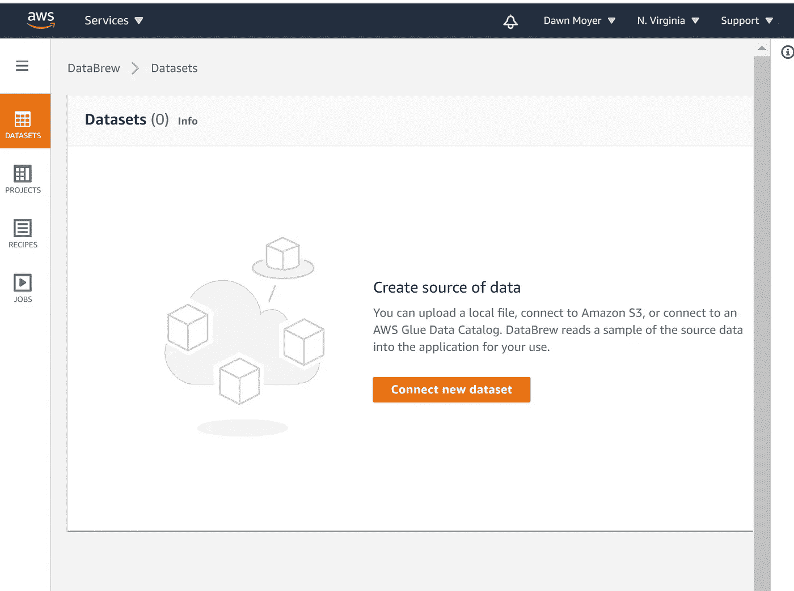

从这里开始—作者截图

当我把我的数据加载到 S3 时，我很高兴看到了红移和 RDS 的直接联系。我希望很快看到更多的连接。

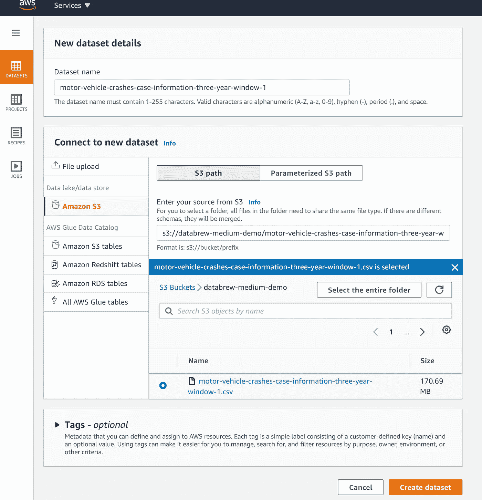

连接到您的数据—作者截图

# 运行数据配置文件作业

创建数据集后，您可以选择运行分析作业。它有一个简单的设置。您需要确定输出的位置。

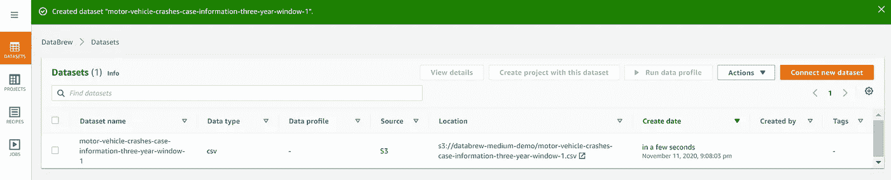

数据集已创建—作者截图。

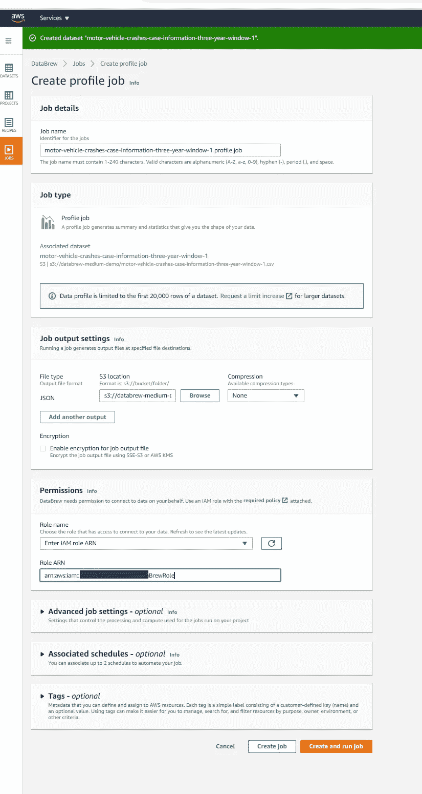

概要职务参数—作者截图

我必须创建一个新的数据 Brew IAM 策略和角色。你得到了完成这个过程所需的信息，所以还不算太糟。如果能够在同一个屏幕中创建策略和角色，那就太好了。

输入信息后，点击创建并运行作业。

# 数据配置文件结果

数据配置文件在数据集中的前 20，000 行上运行。这花了 2 分 2 秒的时间。如果您的数据恰好在第 20k 行之后变得疯狂，它不会显示在此报告中。这是一个**基本只看一眼**，不能全面分析。

对于您的数字数据，将为您提供相关性。我有大部分的字符串，所以这不是那么令人印象深刻。

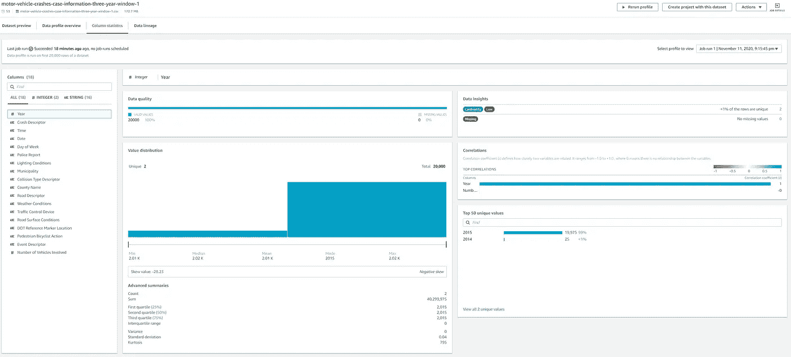

点击放大—作者截图。

对于每一列，都提供了基本的数据分析。这是其他工具集的典型，可能有点偏轻。

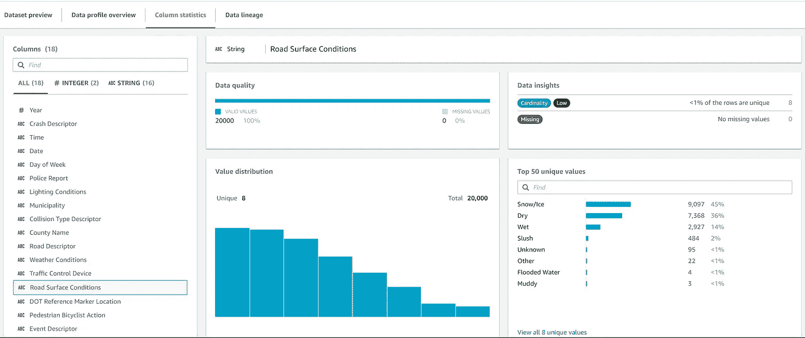

点击放大—作者截图

提供了数据沿袭视觉，其被理解为:

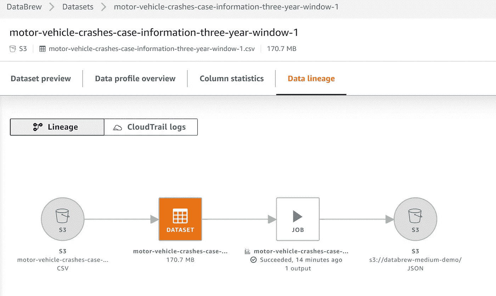

作者截图

# 现在我们可以创建一个数据转换项目。

数据集屏幕中的一个选项是从数据集创建一个项目。一个项目由一个“配方”组成，它是数据转换工作中的一系列步骤。这确保了更新多个数据集时的一致性。权限与您的数据集相同。

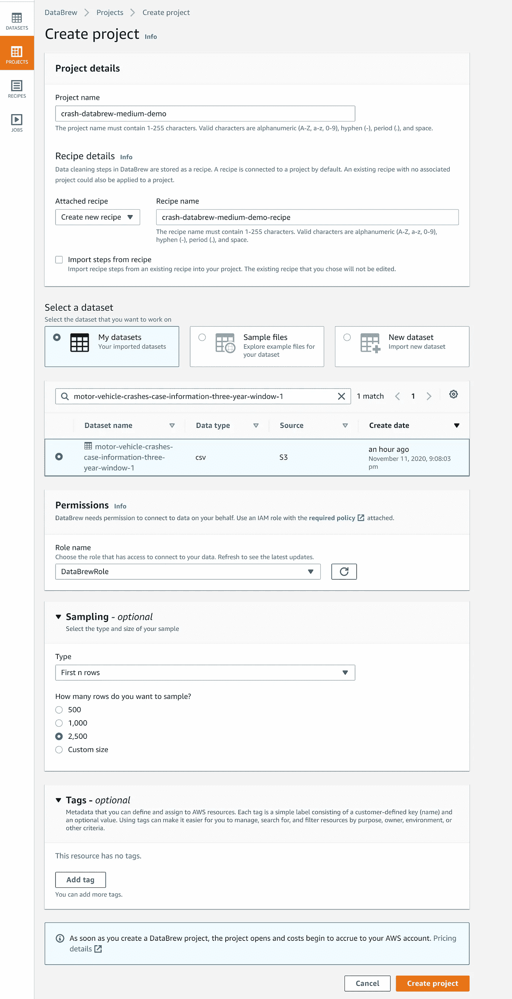

该界面允许您以网格或模式格式查看数据。我更喜欢模式显示。

## 格子

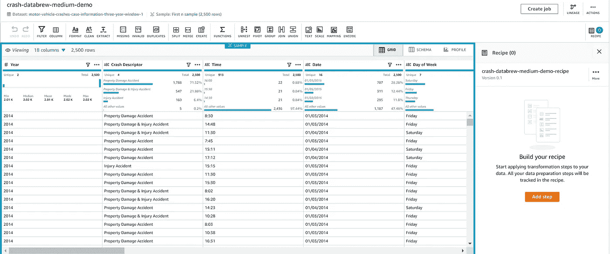

网格布局—作者截图

## (计划或理论的)纲要

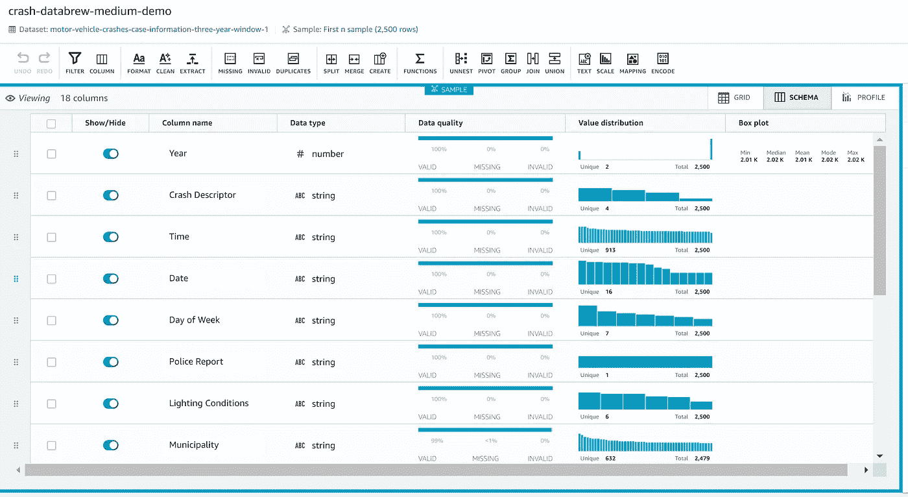

模式布局—作者截图

# 向配方添加步骤

你可以给你的“食谱”添加不同的步骤我在下面的列表中注意到一些有趣的。能够一键处理、区分大小写、删除特殊字符和输入缺失值非常有用。这比在 python 中设置相同的逻辑要快得多。

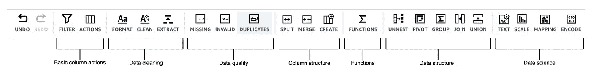

[配方动作参考](https://docs.aws.amazon.com/databrew/latest/dg/recipe-actions-reference.html)

[大写 _ 大小写](https://docs.aws.amazon.com/databrew/latest/dg/recipe-actions.CAPITAL_CASE.html)，[格式 _ 日期](https://docs.aws.amazon.com/databrew/latest/dg/recipe-actions.FORMAT_DATE.html)，[小写 _ 大写](https://docs.aws.amazon.com/databrew/latest/dg/recipe-actions.LOWER_CASE.html)，[大写 _ 大小写](https://docs.aws.amazon.com/databrew/latest/dg/recipe-actions.UPPER_CASE.html)，[句子 _ 大小写](https://docs.aws.amazon.com/databrew/latest/dg/recipe-actions.SENTENCE_CASE.html)，[ADD _ 双引号](https://docs.aws.amazon.com/databrew/latest/dg/recipe-actions.ADD_DOUBLE_QUOTES.html)，[ADD _ 前缀](https://docs.aws.amazon.com/databrew/latest/dg/recipe-actions.ADD_PREFIX.html)[ADD _ 单引号](https://docs.aws.amazon.com/databrew/latest/dg/recipe-actions.ADD_SINGLE_QUOTES.html)[ADD _ 后缀](https://docs.aws.amazon.com/databrew/latest/dg/recipe-actions.ADD_SUFFIX.html)，[EXTRACT _ BETWEEN _ 分隔符](https://docs.aws.amazon.com/databrew/latest/dg/recipe-actions.EXTRACT_BETWEEN_DELIMITERS.html)，[EXTRACT _ BETWEEN _ 位置](https://docs.aws.amazon.com/databrew/latest/dg/recipe-actions.EXTRACT_BETWEEN_POSITIONS.html) [REPLACE_WITH_EMPTY](https://docs.aws.amazon.com/databrew/latest/dg/recipe-actions.REPLACE_WITH_EMPTY.html) ，[REPLACE _ WITH _ LAST _ VALID](https://docs.aws.amazon.com/databrew/latest/dg/recipe-actions.REPLACE_WITH_LAST_VALID.html)， [REPLACE_WITH_MEDIAN](https://docs.aws.amazon.com/databrew/latest/dg/recipe-actions.REPLACE_WITH_MEDIAN.html) ， [FLAG_COLUMN_FROM_NULL](https://docs.aws.amazon.com/databrew/latest/dg/recipe-actions.FLAG_COLUMN_FROM_NULL.html) ，[REPLACE _ WITH _ MOST _ frequency](https://docs.aws.amazon.com/databrew/latest/dg/recipe-actions.REPLACE_WITH_MOST_FREQUENT.html)，[数学函数](https://docs.aws.amazon.com/databrew/latest/dg/recipe-actions.functions.aggregate.html)，，[文本函数](https://docs.aws.amazon.com/databrew/latest/dg/recipe-actions.functions.text.html)，[日期和时间函数](https://docs.aws.amazon.com/databrew/latest/dg/recipe-actions.functions.date.html)，

# 提供建议

一个很好的特性是推荐标签。对于突出显示的列，详细介绍了建议的转换。

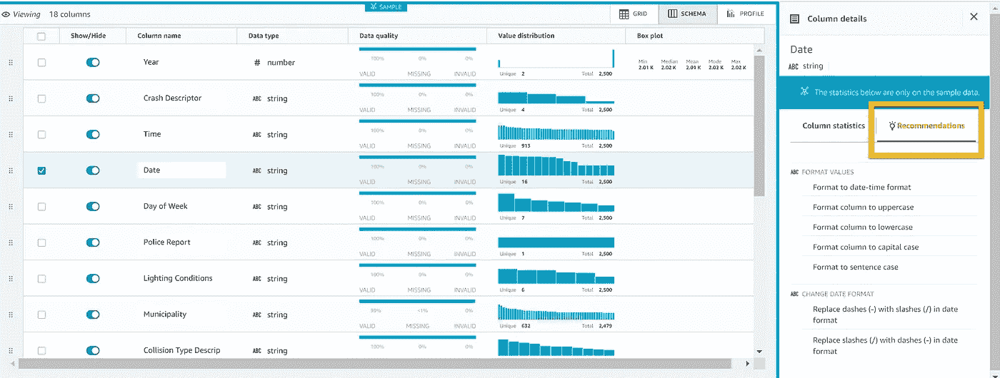

“推荐”选项卡—作者截图

# 示例—一个热门分类列

为多类别列设置一次性列是为机器学习准备数据时的一项常见任务。有几个 Python 库可以用来完成这项任务。使用这个界面更加容易。这个工具似乎有一些不适用的限制。(样本数据集超过 10 个类别)。

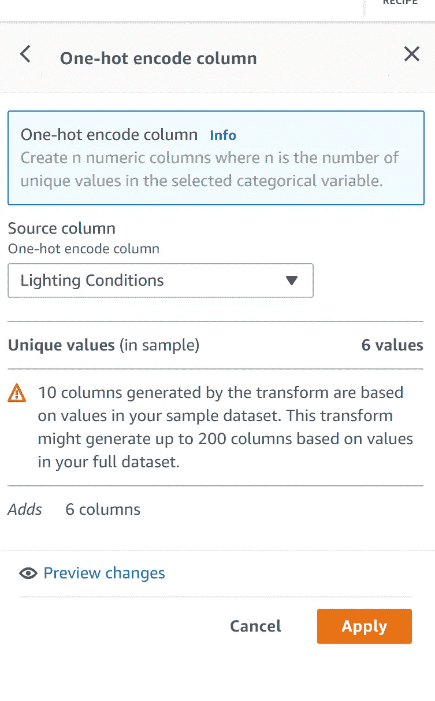

一键编码—作者截图

点击应用。Boom —新列。就这么简单。

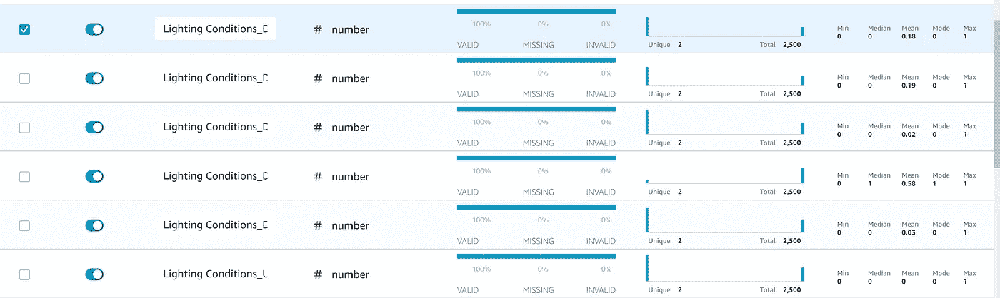

点击放大—作者截图。

# 公布你的食谱

发布你的食谱供再次使用。好东西。

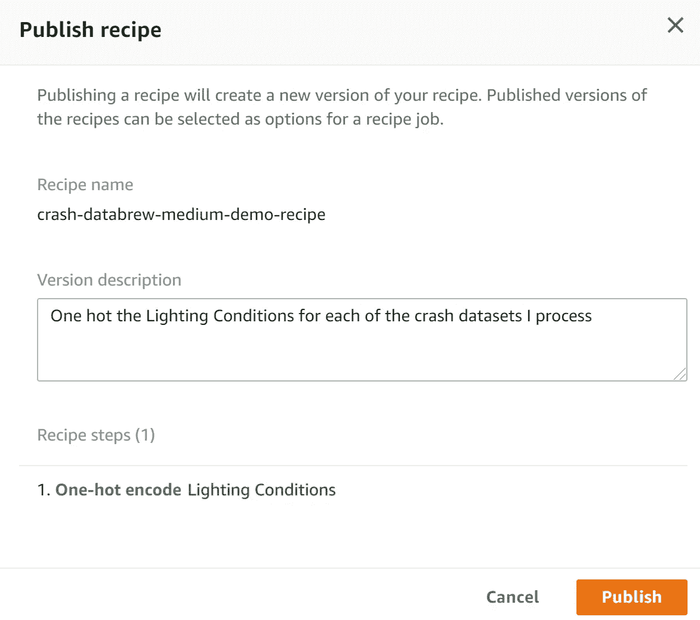

作者截图

# 结论

虽然我怀疑我是否需要数据分析功能，但我肯定会使用转换“配方”作业。“随用随付”选项真正将 AWS 与市场上一些常见的大型企业数据准备工具区分开来。该工具中提供了一些样本数据集，请立即试用！

